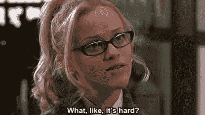
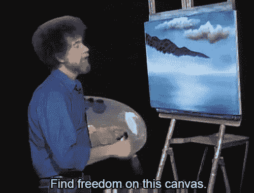
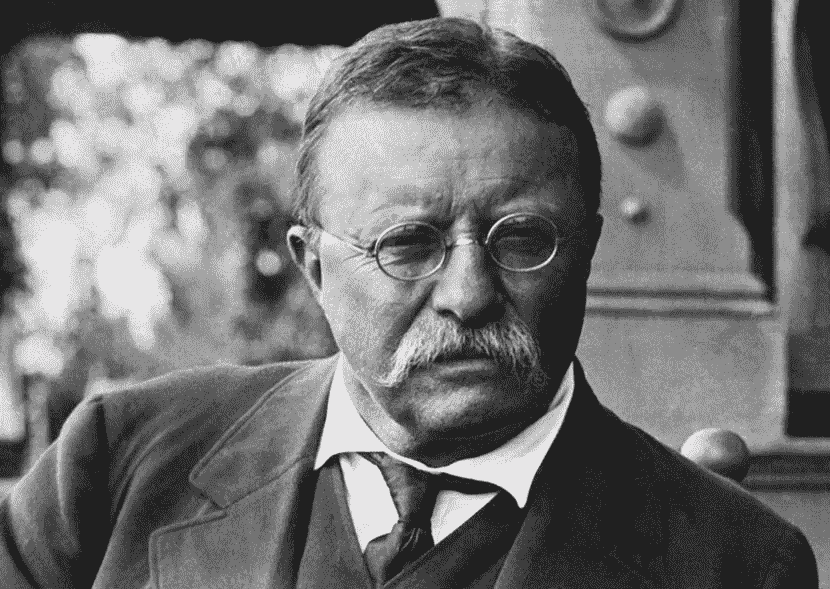

# “尽你所能，用你所拥有的，在你所在的地方。”

> 原文：<https://medium.datadriveninvestor.com/do-what-you-can-with-what-you-have-where-you-are-1f10b4071d94?source=collection_archive---------66----------------------->

创业是一种非理性的努力。毕竟，谁会放弃有保障的薪水来追求如此不确定的东西呢？10 个创业公司中有 9 个会失败，通往成功的路上充满了巨大的障碍。

创始人既疯狂又有远见。他们被迫无中生有，在空白的画布上作画。正如《财富》杂志所说，企业家“更接近艺术家，而不是工程师或商人。”创始人需要韧性、韧性和毅力来带领他们克服通常不可能的障碍。理性地说，所有的风险都不值得你付出宝贵的时间。

Entrepreneurship is an art

最好的想法是疯狂的，如果人们不这么想，它通常不值得去做。创业公司听到的“不”比“是”多。

最好的想法开始于[的车库](https://www.inc.com/drew-hendricks/6-25-billion-companies-that-started-in-a-garage.html)，最好的创始人[睡在他们的办公室](https://medium.com/boost-vc/be-the-nuclear-cockroach-version-0-1-2-45f8b8a38acc)。

创业公司是一种非理性的冒险，但 10 个创业公司中有 1 个会成功。你可以成为那 10%的一部分。正如西奥多·罗斯福所说，“尽你所能，用你所拥有的，在你所在的地方。”

Theodore Roosevelt