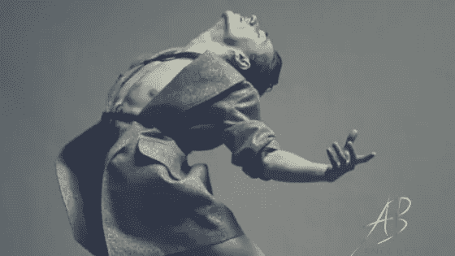

# 你还记得茁壮成长是什么感觉吗？

> 原文：<https://medium.datadriveninvestor.com/do-you-even-remember-what-thrive-feels-like-828f6e18e811?source=collection_archive---------66----------------------->

天哪——我着火了！！

字面上和比喻上。

给你写信的时候，我汗流浃背。

内心的激情像一个失控的火炉，

这一次，

我不怕火。

操，

***我是火。***

发生了什么事？

*十年的思维工作已经踢了我的屁股，下一级。*

剥开从我出生那天起就植入我潜意识里的一层层屁话。

为了让我适应*并快乐*，我应该如何在这个世界上出现的程序。

编程*我应该如何在这个世界上行动*以使我适应— *并快乐*。

编程*我应该如何在这个世界上说*以便让我适应— *并快乐。*

另一位声称，我应该服从谁的*编程，我们被告知世界上的工作方式是为了让我适应— *并快乐。**

只不过这些程序属于另一个时代。

又一代人。

一个相信奋斗的人，

稀缺性，

滴答作响的盒子，

待办事项列表。

认为成功是由头衔和金钱决定的一代人。

这一代人相信，为了让我们变得有价值，我们必须服务于以创造性的人类灵魂为食的机器，通过恐惧来控制大众。

我尊重、同情并欣赏这一代人。

但是我不是它的一部分。

事实上，

我选择不属于任何一代。

我选择成为任何教条思想路线的一部分。

**我选择自己思考**，非常感谢。

我在剥回来的过程中发现，我不擅长打半旗。

要么全力以赴，要么什么都不做。

在我生活的所有领域。

我不希望*只*专注于商业，或者*只*专注于健身，或者*只*专注于精神自我，或者*只*专注于人际关系。

绝对没有。

对我来说，这是关于 ***创造那个巨大的他妈的远景，在那里所有的领域都是我最好的*** 。

我可以定义我的最佳状态，以及我选择如何体验每一个领域。

当我站在讲台上*和*创造奇迹*和*被他的笑话逗笑的时候，我的帝国是什么样子的？

当建立我的遗产*和*磨练我称之为身体的机器*和*连接到我的高我*和*爱抚他的手时，我在想什么？

当制作新节目*和*吃我的午餐*和*写我的日志*和*收到他的信息时，我相信什么？

我明白了，只要我在生活中的一个领域安顿下来，实际上我们就别废话了，

*当我在生活的某个领域踌躇不前，因为我选择和普通人在一起*

*我在生活的各个方面都有所保留。*

*我会带着一些权威和真相出现在一个地方，*

*同时在另一个地方擦我嘴上的屎。*

*臭死了！*

*而且不值得。*

*回顾我的日记，有一行字反复出现*

****真正幸福是什么感觉？****

*作为一个天生的成功者，想要真正快乐是不可能的，*

*要真正繁荣，*

*只要你克制住自己。*

*诚实——你这么做的唯一原因是你希望他们喜欢你。*

*你希望他们认为你很好。*

*哦，拜托，亲爱的(眼睛瞪得很大)，*

****我们不好听！****

*我们没有。*

*大多数人看着我们，认为我们是冷血，自私的婊子和混蛋。*

*不体贴。*

*不太好。*

*我知道我不是个好人。*

*我甚至不喜欢好人。*

*我觉得它们太甜了。*

*就像有人在我的咖啡里放了八勺糖——我喝的是又黑又苦的。*

*当我们坐在好人的圈子里，*

*我们对自己头脑中的想法感到内疚吗？*

*想要更加努力。*

*渴望胜利。*

*喜欢热闹。*

*痛苦。*

*OMG 超越你先入为主的限制所带来的痛苦。还有更好的吗？*

*我们感到内疚，因为我们不能容忍谈论无关紧要的狗屎！*

*取而代之的是，我们开始喝酒，这样我们就可以在无聊到流泪的时候关掉，假装适应。*

*我以前也是这么做的。*

*我们看电视只是为了知道当每个人都在为最新的节目而愤怒时，他们到底在说些什么。*

*即使当我们不得不把嘴里塞满巧克力、爆米花、冰淇淋，或者任何我们在橱柜里找到的东西，只是为了抑制我们身体里的不安。*

*我们的身体谁想动。*

***快。***

*谁想推。*

*到筋疲力尽。*

*哦，间歇的刺激让你喘不过气来。*

*肌肉尖叫。*

*肺部燃烧。*

*是啊！是啊！是啊！*

*这是我成长的地方。*

*你知道如果你对自己诚实，*

*你不得不承认，你口中增加的唾液表明你也会在这里茁壮成长。*

*亲爱的，怎样才能把项圈和皮带从你的喉咙上取下？*

****把插科打诨的东西拿出来，说出你的道理？****

*站起来，逃离令人窒息的人群？*

****找回你狂野、美丽、饥渴、有创造力、牛逼、全速前进的自己？****

# *啊哦哦哦哦哦！*

*或者你打算只是耐心地等待生活为你按下重置按钮？*

*你会坐在那里，希望有人来救你吗？*

*你打算就这么放弃，低下头，看着你松弛的肚子在裤子上鼓起来，闭上眼睛听天由命吗？*

***是吗？***

*你要爬进你妈妈的怀里，让她赶走那个讨厌的女人吗？*

*因为我们都知道你可以继续淹没我的声音，但你的不存在的潜力是溃烂的癌症侵蚀你的内心。*

*当一个天生的成功者选择合群时，就会发生这种事。*

*但是，嘿，这是你的旅程。*

*我只是在分享，我花了十年时间来突破这个狗屎，它不需要花你这么长时间。*

*我今天能和你们分享的最有影响力的一课是，*

*就是 ***你要决定你够不够。****

*就是这样。*

*只是他妈的决定你值得快乐，没有其他原因比你的存在。*

*只有死亡是不可避免的，我的朋友。*

*当你选择做自己的时候，生活是如此神奇。*

*你会选择茁壮成长吗？*

*带着对你真实狂野的自我的热爱和欣赏，*

# *阿内尔*

*PS:我保证我永远不会成为一个好教练，但是，如果你准备好被一个真实的，有动力的，对扯淡零容忍的教练支持，让我们[连接](https://anelbester.as.me/consultation)。*