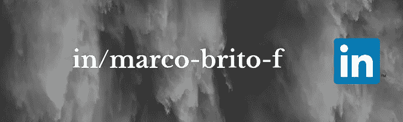

# 为什么阅读是我最有价值的技能？

> 原文：<https://medium.datadriveninvestor.com/do-you-feel-wild-put-that-into-reading-3ed5dbca7e51?source=collection_archive---------31----------------------->

Photo by [Clem Onojeghuo](https://unsplash.com/@clemono2?utm_source=medium&utm_medium=referral) on [Unsplash](https://unsplash.com?utm_source=medium&utm_medium=referral)

读书？真的吗？读书怎么会是一种技能？基本到高学历的人都知道如何用母语和第二语言来做(如果是这样的话)，那么为什么阅读要被认为是一种技能呢？原因如下。

在我成长的地方，阅读文化并不像其他发达国家那样普遍，但出于某种原因，我从小就养成了这种习惯。我开始阅读我父亲设法创造的那个小书架上的所有东西。有一些物理、代数、生物和天文学的书籍，在我这个年龄(8 岁)对人类学家来说就像是一种古老的失传语言。当然，也有小说、漫画和其他一些文学性别我当时并没有被吸引去读。

我家里没有人有这种阅读习惯，这使我被视为家里的“怪人”，但那里的任何人都把太多的注意力放在这一点上，因为像其他孩子一样，我喜欢踢足球，骑自行车，和邻居的朋友一起玩。所有人都认为一切正常。

当我终于到了十几岁的时候，我考虑阅读大多数人在那个时候做的事情，所以我第一次读了一本 900 页的书:《哈利·波特与混血王子》。这种经历超越了魔术师的故事；它在我身上建立了一个新的阅读门槛，从那一刻起，以及后来，打破了阅读长篇小说或长篇科学书籍的墙壁，这些墙壁不知不觉地就在我面前。

一旦上了大学，我就开始收获我每天在脑海中播种的东西，当时我并没有意识到这一点。事实、日期、理论和故事是我与人沟通的方式的一部分，我很快发现了文字的力量，就像任何其他力量一样，它可以被储存，唯一的区别是这个储存在纸张、数字设备(现在)中，当然还有人。这种力量一旦释放出来，你就不会想把它收起来。

随着大学时光的流逝，我发展了一种特殊的技能，我完全相信你至少在过去的 20 年里听说过这种技能，那就是领导力。领导力还没有像今天这样被广泛使用。这种特殊的技能(我把它看作是一种技能的组合)是每个雇主都在寻找的，也是我们都想尽可能使之自然的东西。作为一名本科生的那些年，从一开始，我就参与了学生分会、教师会员等等。最后，我发现自己成为了多个学术活动的组织者，在公司和大学之间建立了联系，这是我从未计划过的。那么，所有这些说话和关系的方式是从哪里来的呢？我可以认为，如果没有那些年我喜欢的阅读内容，我永远不会做到或拥有它们，永远不会害怕一本书的大小。

2013 年，我完成了我的石油工程项目，该项目与([石油工程师学会](https://www.spe.org/en/) ) SPE 一起极大地丰富了我的技术。社会提供给我的技术含量是如此重要。通过阅读他们的书籍、论文、文章和专业杂志，我满足了自己对这个行业的新知识和创新知识的渴望，我从一开始就爱上了这个行业。

三年后，我承诺要有一个书架，放上我读过的所有书籍，所以我去了一家商店，买了一个宜家版本的书架，在我的卧室里组装起来，开始把我的书放在那里。这件小事是我迈出的一小步，但却意义重大，因为我决定不仅在我的房间里，而且在我的心里给那些我在日常生活中花了很多时间的书一个重要的空间。

从宇宙如何被创造，到早期生命理论、政治史、人类进化史、社会进化史、战争、语言(目前是法语和德语)、欧洲史、犯罪史、罗马帝国史、技术创新、爱情故事、阴谋故事、金融、市场营销、数据科学、商业、管理等等，只有通过阅读才能进入我的脑海。

所有这些文字的力量已经转化为另一种能量来源，那就是影响力。当你设法影响他人时，你可以在团队合作的环境中达成目标、解决问题、开发解决方案。

最后，我无意被视为自命不凡，我于 2018 年 6 月开始在媒体上写作，因为今年我读了太多的书，我学到了关于生活、商业、科学的新话题，我不能只为自己保留这些知识。所以现在，我正在寻求向其他人传播“分享”运动，因为当我们一起工作时，我们可以在更短的时间内取得更多的成就。

总之，认为阅读(如果经常阅读)会增强你的思维，增加你的视角，放下你的骄傲去倾听别人。它将向你展示一个新世界，这个世界充满了发现新事物的机会，我们许多人都可以探索并采纳某人的想法，正如乔治 wrote 马丁所写的:

> “一个读者在死前经历了一千次生命,”Jojen 说。从不读书的人只能活一次。

我只是对我未来将学到的东西感到兴奋，我可以储存这些东西来帮助别人、我的社会或我自己。当然，有那么多其他人，如教授、大学伙伴和同事，打开了他们的思维，以提高甚至更多根植于阅读的技能。对我来说，阅读是迈出的第一大步。

我是土生土长的厄瓜多尔人，但我认为自己是世界公民。我热衷于通过合作和知识来改善他人的生活。< <用文字的力量冲击周围的环境。> >

