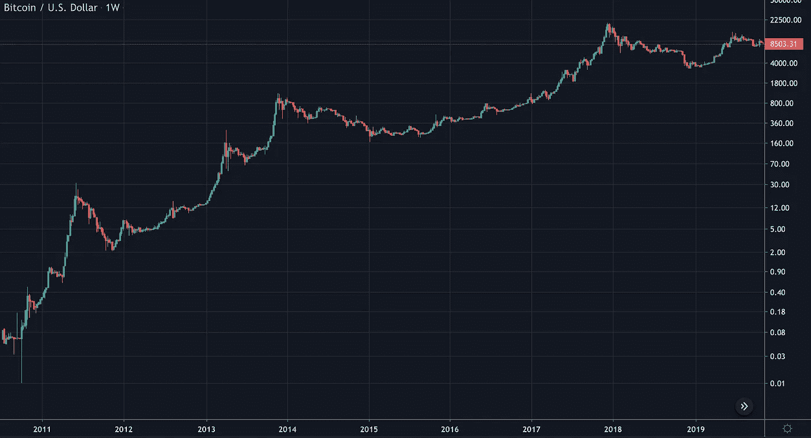
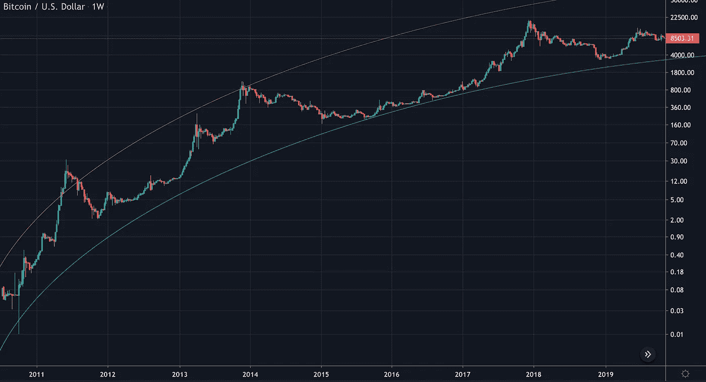
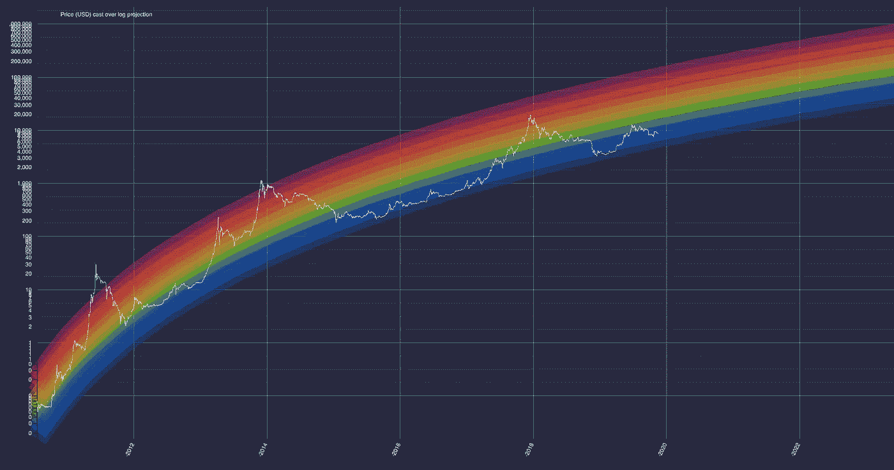
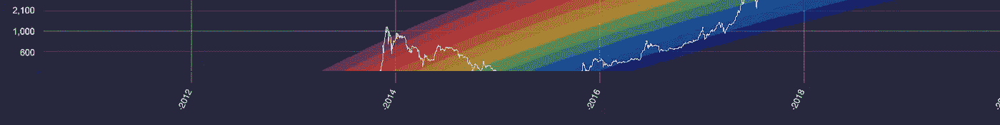
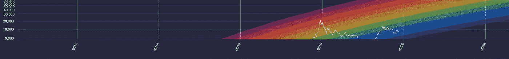
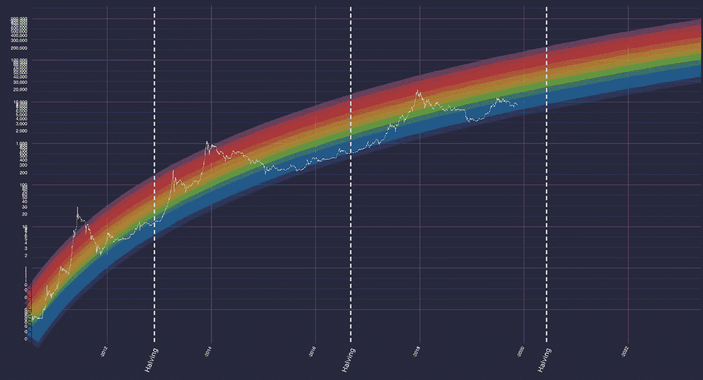

# 你知道比特币的彩虹吗？

> 原文：<https://medium.datadriveninvestor.com/do-you-know-about-the-bitcoins-rainbow-c43e2b5b7ce7?source=collection_archive---------1----------------------->

免责声明:这不是财务建议。我不是财务顾问。以下是我个人的，主观的，有偏见的看法。

如果你过去几年没有住在月球上，我相信你听说过比特币，但不是每个人都听说过 [**比特币的彩虹**](https://www.moonmath.win/) 。

比特币的价值每天都在修正，很容易被它快速的涨跌吓到。但是如果我们看看所谓的**对数图**，我们可以看到自 2009 年以来加密货币对美元的演变以及多年来的高估值趋势。

 [## 总部位于瑞士的 ETP 进入加密交易市场|数据驱动的投资者

### 虽然金融市场几乎没有沉闷的时刻，特别是在引入…

www.datadriveninvestor.com](https://www.datadriveninvestor.com/2019/03/10/swiss-based-etp-enters-the-crypto-trading-market/) 

此外，如果这种预测继续下去，通过长期持有比特币，其价值有更大的机会继续增加。

Logarithmic Chart

但是这张图表隐藏了一些秘密，我们可以通过从 2009 年到现在的上升曲线来揭开它们。

Logarithmic Growth Curve

现在我们有了一条对数增长曲线。当图表的上升曲线被划分为一些颜色级别时，会出现某种彩虹形状。

The Bitcoin's Rainbow

彩虹有颜色区分，显示硬币何时超卖——蓝色和绿色区域——或超买——橙色、红色和紫色区域。

通过这张图表，我们可以找到买卖比特币的正确时机。当比特币处于蓝/绿色区时，可能是买入的合适时机。当比特币处于橙色、红色，尤其是紫色区时，可能是卖出的时候了。

不止如此:从图表中我们可以看到，过去几年对某些人来说很贵的东西，今天变得很便宜。2019 年昂贵的东西在 2025 年及以后可能会变得便宜。

看图表。2013 年 11 月，用 1000 美元购买 1 个比特币曾经非常昂贵——红区——但在 2017 年 1 月，同样的价值非常便宜——蓝区。

Close rainbow chart — what was expensive yesterday is very cheap today

2017 年 11 月，1 比特币是 19.900 美元，许多人认为价格非常昂贵——红区——但在 2022 年 1 月左右，同样的价值可能非常便宜——蓝区。

此外，比特币回到 1，000 美元或 2，000 美元是不可想象的，因为现在这个价值已经超出了彩虹。不可能？非常难以置信的是，市场上一定发生了非常错误的事情。

**重要的是要知道:**自从中本聪在 2009 年创造出比特币以来，它已经减半了两次。一个**比特币减半**是每 210，000 个区块被矿工开采并确认后发生的固定事件。而比特币**的产量减少一半。**

> **比特币减半后变得更加稀有**

第一次减半发生在 2012 年 11 月 28 日，大约 12 个月后，比特币价格达到了 1000 美元的历史高点。

第二次减半发生在 2016 年 7 月 9 日。大约 12 个月后，比特币价格达到了 2 万美元的历史最高水平。

下一个比特币减半是什么时候？**2020 年左右的 Q1。**

Bitcoin's rainbow and halving

是否意味着下一轮牛市即将来临？没人知道，但比特币减半的彩虹告诉我们，几率很大。

*感谢您的阅读，如果您有任何补充请发送回复或添加备注！*

## **伊德夫·巴蒂斯塔**

**交互设计师，UX/UI，Semantix**

[**我的网站**](http://www.idevabatista.com)**|**[**Linkedin**](https://www.linkedin.com/in/idevabatista/)

Semantix 的互动设计师。在这一领域有近 20 年的经验，曾在永诚律师事务所、DDB 巴西律师事务所、外国佬律师事务所、VML 律师事务所等机构工作，也曾在 Semantix 等初创公司工作。白天是设计师，晚上是父亲。