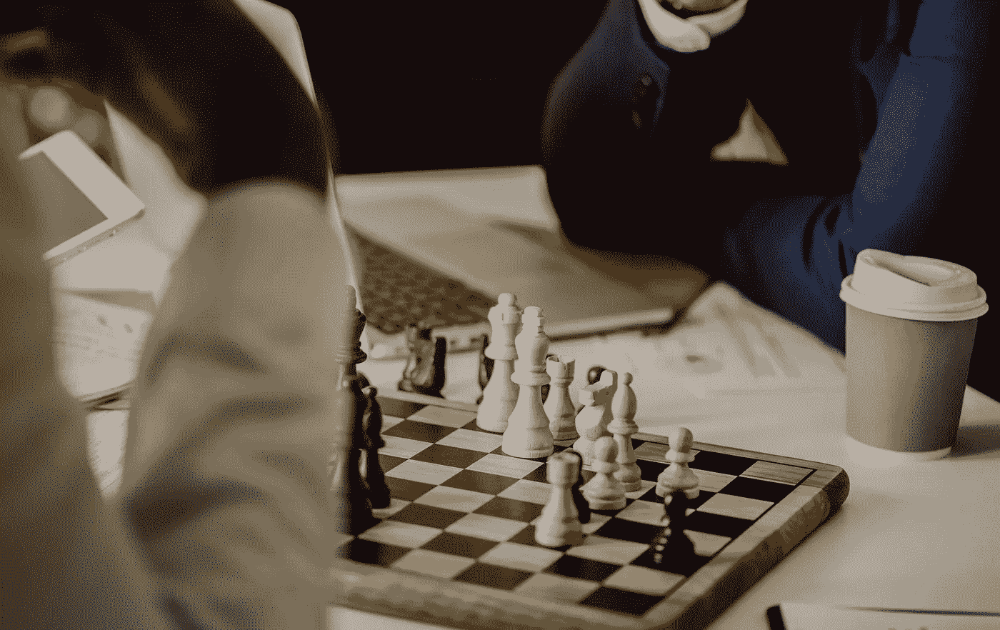

# 你知道最常见的折旧类型吗？

> 原文：<https://medium.datadriveninvestor.com/do-you-know-the-most-common-types-of-depreciation-7ec31b59b855?source=collection_archive---------32----------------------->

折旧费用在会计中用于在有形资产的使用寿命内分配其成本。换句话说，它是由于使用、磨损或过时而导致的资产价值的减少。通过对资产进行折旧，投资者可以用他们每年对资产进行折旧的金额来抵消他们的收入，从而增加他们的“口袋”现金流。

**直线**

直线折旧法是一种非常常见和简单的费用计算方法。在直线折旧法中，在资产的使用寿命期间，每年的费用金额是相同的。根据美国国税局的新规定，投资者现在可以在 25 年内对资产进行折旧。

折旧费=(成本—残值)/使用年限

**双倍余额递减法**

与其他折旧方法相比，双倍余额递减法在资产使用寿命的前几年比后几年花费更多。该方法反映了这样一个事实，即资产在早期比在后期更有生产力。双倍余额递减法的折旧系数是直线费用法的两倍。

定期折旧费用=期初账面价值 x 折旧率

**生产单位**

这种方法通过每单位产量的固定比率来提供折旧。在这种方法下，人们必须首先确定每一生产单位的成本，然后用单位成本乘以公司在一个会计期间生产的单位总数来确定折旧费用。

折旧费用=总购置成本-残值/预计总单位数

**年数总和**

年数总和折旧法产生可变折旧费用。在资产使用寿命结束时，其累计折旧等于直线折旧法下的累计折旧。

折旧费用=(总购置成本-残值)

**双倍余额递减法**

DDB 法只是将第一年的直线折旧额翻倍，然后将相同的百分比应用于随后几年的未折旧额。这种方法会产生一个非常激进的折旧计划。资产折旧不能超过其残值。

折旧费用=(总购置成本-累计折旧)n =年数

许多税收制度对建筑物和土地改良规定了更长的折旧年限。这种寿命可能因使用类型而异。包括美国和加拿大在内的许多此类制度允许仅使用直线法或固定成本百分比对不动产进行折旧。另一种增加不动产资产折旧的方法叫做成本分离，通过这种方法，一家专业公司出来分离不动产建筑所有组成部分的成本和使用寿命，通常会导致加速折旧计划。

请记住，一般来说，裸地不允许折旧税收减免。无论你决定采用哪种折旧方法，请咨询你的注册会计师或其他税务专家，以确定最适合你的目标的方法。