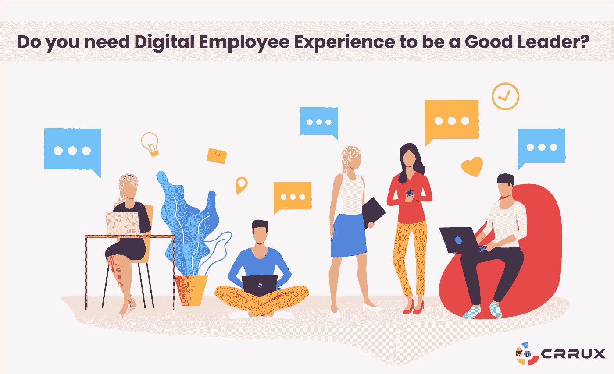
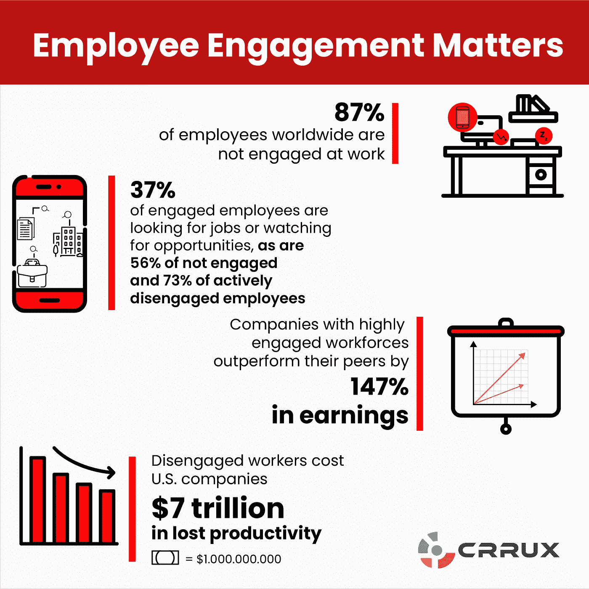

# 做好领导需要数字化员工体验吗？

> 原文：<https://medium.datadriveninvestor.com/do-you-need-digital-employee-experience-to-be-a-good-leader-dfa676a107d5?source=collection_archive---------4----------------------->

IT 术语中的员工体验是人、流程和技术的组合。就人力资源而言，员工技术、工作方式和文化以及整体员工体验的结合会影响数字化员工体验，同时也会受到数字化员工体验的影响。

# 为什么人们关注员工体验？

如今，越来越多的人开始关注员工体验，原因有很多。例如，公司希望解决人才短缺问题，留住人才。另一个需要考虑的要点是社交媒体在招聘和留住人才方面的作用。

员工在你公司的经历不太可能成为秘密。这可能是件好事，也可能是件坏事，取决于你为员工付出的努力。您的员工可能会在网上分享他们对贵公司的印象。Glassdoor 上激烈的雇主评论很快吸引了潜在员工的注意，而热情的推荐可以吸引优秀员工上门。

 [## 2019 年即将改变世界的技术|数据驱动的投资者

### 很难想象一项技术会像去年的区块链一样受到如此多的关注，但是……

www.datadriveninvestor.com](https://www.datadriveninvestor.com/2019/01/17/the-technologies-poised-to-change-the-world-in-2019/) 

公司不应该低估公开的糟糕员工体验所造成的损害。亚马逊、Sports Direct 甚至“最佳工作场所”谷歌都已经从广泛报道的事件中看到了对其雇主品牌的损害。

此外，如今员工有很多选择，因此更有选择性。他们正在积极寻找关心员工的公司。根据盖洛普的调查，员工希望公司在给他们提供发展机会的同时，给他们提供意义和目标。

从内部来说，在生命周期的任何一点上，糟糕的员工体验都会导致脱离。其他随之而来的已证实的问题包括缺勤率上升、生产率下降、事故增加和员工流动率上升。

# 你的员工在寻找什么？

想要轻松找到并安装工作所需的合适应用程序。(88%)

可以轻松地在办公室外远程工作。(83%)

拥有在个人设备上工作的自由。(70%)

在手机/平板电脑上安装应用程序(包括电子邮件),完成一周中最重要的三项任务。(86%)

新员工第一天就可以访问所有需要的应用程序/数据。(86%)

工作中可以选择 Android/iOS/Mac 或者 PC。(63%)

# 关于数字化员工体验的调查结果:

数字化员工体验与公司成长、竞争地位和员工情绪挂钩。根据综合员工体验得分，受访者对其组织的评价越有竞争力，员工体验就越好。

中/高增长公司有更高的综合员工比率，这表明他们有更好的数字化员工体验手段。

在竞争激烈的人才市场中，员工经验扮演着重要的角色。如果员工拥有丰富的员工经验，他们可能会向外部人才推介自己的公司。

例如，德勤(Deloitte)2019 年全球人力资本趋势调查发现，不到一半(49%)的受访人力资源和商业领袖认为，他们组织的员工对他们的工作设计感到满意或非常满意。只有 42%的人认为员工对日常工作感到满意或非常满意，38%的人认为他们对与工作相关的工具和技术感到满意或非常满意，38%的人认为员工有足够的自主权来做出好的决定。

员工在日常工作中必须访问的系统的平均数量最近从 8 个增加到 11 个，27%的受访员工估计他们每周会在不相关的电子邮件和信息上浪费一整天的时间。

越来越多的组织正从传统的单块记录系统转向更灵活、基于微服务的架构。

就其本质而言，在整个企业中整合数字化工作人员体验的努力不能局限于单一职能部门。

**员工敬业度概述:**

员工敬业度是为了让员工工作出色而需要满足的基本心理需求。这包括了解对你的期望和拥有你需要的材料。

但也包括情感和社交需求，比如做自己擅长的工作，把工作和更高的目的联系起来。

那么，员工敬业度和员工体验的真正区别是什么？简而言之，员工体验是输入，而员工参与是你的目标输出。

通过改善员工对组织的体验，你将获得更多敬业的员工。提高员工敬业度可以被视为最终目标，而提高员工敬业度则是实现这一目标的手段。

《福布斯》对员工体验和员工敬业度的区别有另一种解读。他们声称员工参与是一种自上而下的哲学。希望员工会选择融入职场文化、目的和工作。相反，员工体验是一个自下而上的概念，因为工作环境和流程是围绕员工专门设计的。

**Sources: dynamicsignal.com & gallup.com**

# 领导者改善数字化员工体验的责任:

高管和人力资源专业人士需要考虑他们对员工体验概念的应用，因为他们希望实施尽可能最好的流程和平台，以保持员工与组织的联系。作为一种衡量标准，参与度可能非常有价值——只要被衡量的是实际工作中的参与度，而不是让他们与同事聊天的工具。

也许盖洛普在其“美国工作场所状况”报告中说得好，它指出:

“员工可能觉得与团队成员有联系，但如果在其他挑战中，他们不知道对他们的期望(基本需求)，没有合适的材料和设备(基本需求)，或者不能做他们最擅长的事情(个人需求)，他们与团队成员的联系不太可能对他们的绩效产生积极影响。相反，与同事相处的时间可能更像是一场牢骚会，而不是富有成效的团队合作。

敬业的员工对任何组织都有好处。当他们参与并与组织的目标和愿景同步时，他们可以推动收入的大幅增长。

施里斯蒂·维尔马是 Crrux 公司的一名通信设计师，这是一个协作式数字工作场所解决方案，为您的企业管理营销、销售和支持。