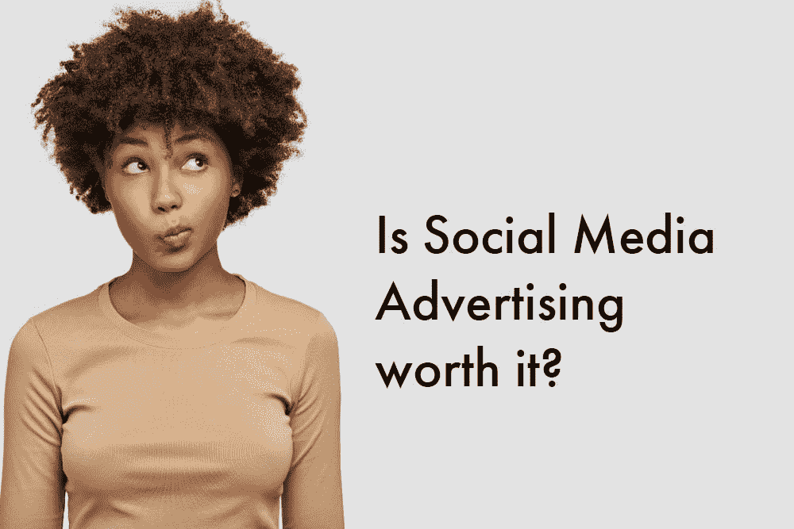
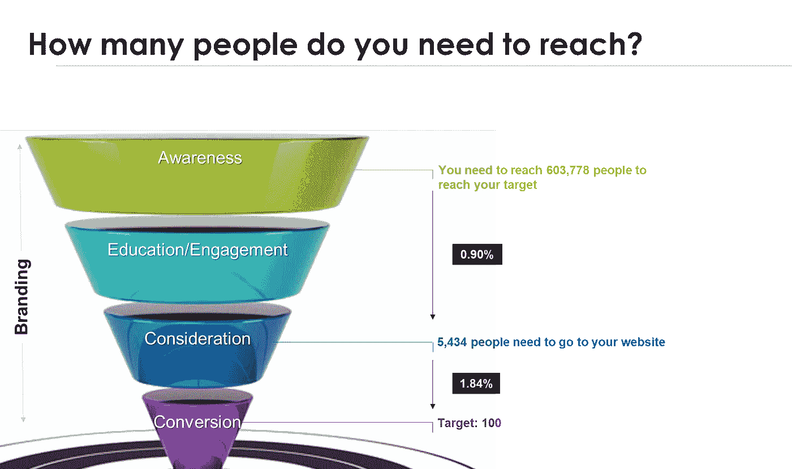

# 你真的需要投资社交媒体广告吗？

> 原文：<https://medium.datadriveninvestor.com/do-you-really-need-to-invest-in-social-media-advertising-164d053f2d76?source=collection_archive---------8----------------------->

如果你是一个正在寻找机会发展自己公司的企业主，你应该听说过通过脸书、LinkedIn 和 co .上的广告来推广你的企业的所有好方法，但是这适合你吗？更重要的是，真的有必要吗？社交媒体不应该是免费的吗？

事情是这样的… ***社交媒体从来都不是免费的！***

 [## 计划者让社交媒体保持正轨|数据驱动的投资者

### 如果想达到并保持最高效率，忙碌的人会坚持使用系统。这是 Tweepsmap 和…背后的前提

www.datadriveninvestor.com](https://www.datadriveninvestor.com/2019/03/11/schedulers-keep-social-media-on-track/) 

想一想……无论你是在管理自己的社交媒体，还是有人在为你做这件事，你都是在花钱雇人管理 Instagram 账户和更新脸书页面。它可能存在于你自己的血液、汗水和泪水中。

另一个事实是: ***你在社交媒体上投入的所有时间都是毫无价值的，除非你的内容能到达你的目标受众手中！***

随着[有机接触](https://blog.hubspot.com/marketing/facebook-organic-reach-declining)(有多少人在不付费的情况下观看你的内容)在各种渠道间不断减少，所有用于规划和开发精彩内容以建立你的品牌并吸引你的目标受众的时间完全是浪费时间，因为没有人会看到它！

好吧，也许关注你页面的忠实朋友和你妈妈会看到并喜欢你的帖子。不幸的是，他们可能无法维持你的业务。

这实质上是问题的关键:

为了生存，你需要销售。要获得销售，你需要接触你的目标受众，向他们介绍你的产品或服务，让他们访问你的网站，并最终购买。

但是我不能不付钱吗？当然，但是你可能需要调整你的期望。

为什么？

# 让我们看一个例子:

为了说明这一点，我们将使用营销漏斗和基准指标来计算我们需要接触多少人来实现我们的收入目标:

目标收入:1 万美元

平均订单价值:100 美元

要求的销售数量:100

***你需要接触多少人？***

为了解决这个问题，我们可以使用您网站上的当前转换率(某人将成为潜在客户或进行购买的可能性)和您当前的点击率或 CTR(某人将点击您的内容并转到您的网站的可能性)反向工作。

对于这个例子，我们将使用脸书和一个电子商务网站的基准指标:

基于[基准](https://www.geckoboard.com/learn/kpi-examples/marketing-kpis/website-conversion-rate/)，我们可以估计平均 1.84%来到你的网站的人会转化，这意味着你需要 5434 个人来你的网站“考虑”购买。脸书广告的[平均点击率(CTR)](https://www.wordstream.com/blog/ws/2017/02/28/facebook-advertising-benchmarks) 为 0.90%，这意味着乐观来看，你需要达到 60 万人以上才能实现 100 笔销售！

现在想象一下，试图有机地接触到这么多人！

# 也就是说，如果出现以下情况，付费促销可能不适合你:

*   你没有资源投资优质内容。没有捷径可走。即使你付钱去接触你的目标受众，内容仍然是看到结果的王道！企业认为广告投资回报率低的主要原因之一是他们的内容不符合标准。在你为你的内容投资之前，确保它是真正高质量的，与你的品牌一致，并为你的目标而优化。
*   你没有任何预算投资广告。如果你没有资金，你的生意没有产生足够的收入，你可能根本就没有能力做广告。如果是这种情况，考虑留出一部分收入用于未来的活动或筹集资金。
*   你没有成功开展广告活动的知识。不要被你的脸书帖子下面的蓝色推广按钮所欺骗！数字营销是一项训练有素的技能。虽然开始投放广告已经变得非常容易，但如果你不知道自己在做什么，你最终会把大量的钱白白浪费掉。投资于自我教育和/或聘请专家。

如果你属于这些类别中的任何一种，你选择不做广告或者你只有很少的预算，你可能需要重新调整你的期望，制定一个现实的时间表和销售量，和/或用其他策略来创造。

# 现在，如果你有一些资源，有一些很好的理由开始投资广告:

*   你可以迅速扩大你的影响范围。
*   你可以开展有针对性的活动，接触最有可能改变信仰的人。
*   您可以选择特定的目标来调整您的策略。
*   您可以测试和改进您的策略，以匹配正确的信息、视觉效果、行动号召和目标受众。
*   你可以获得详细的见解，为你的营销策略提供信息。

# 你应该预算多少？

回到我们开始时用来计算你的目标覆盖范围的漏斗，把这个数字代入你选择的广告平台，看看你需要花多少钱来覆盖这么多人。

无论你的预算是否在可及范围内，你仍然可以通过慢慢开始，迭代，逐渐增加你的支出来提升你的业务，因为你已经了解了什么是有效的。

测试和改进。这是最有效的方法——你可以从每天 5-10 美元开始。

想了解更多关于广告如何帮助您的企业实现目标的信息吗？ [**联系**](https://www.the-emms.com/contact-us) **me，了解更多关于如何开展有效的** [**营销活动的信息。**](https://www.the-emms.com/marketing-campaigns)

*原载于 2019 年 9 月 27 日*[*https://www.the-emms.com*](https://www.the-emms.com/blog/do-you-really-need-to-invest-in-social-media-advertising)*。*