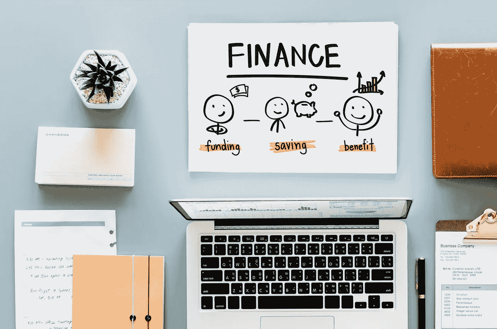

# 你存够了吗？养成储蓄习惯。

> 原文：<https://medium.datadriveninvestor.com/do-you-save-enough-developing-a-saving-habit-69bc4f7bcfd7?source=collection_archive---------11----------------------->

存钱是成功人士的基本特征。如今，大多数人脑海中浮现的问题是:我该如何储蓄？我挣的钱几乎不够过日子。然而，储蓄就像生活中的许多其他事情一样，仅仅是一种习惯。习惯造就个性。史蒂芬·柯维在他的书《成功人士的 7 个习惯》中描述了对于那些想要成功的人来说，养成某些习惯是多么的重要。一旦被灌输给我们，习惯就会占据我们的生活，我们不必去想它。入门是最重要的。

储蓄的习惯会减轻我们对贫穷的恐惧。随着我们的储备开始增加，我们将对我们的未来更有信心。无论是眼前还是未来。然而，我们不能储蓄的原因之一是因为我们是债务的奴隶。只要参考一下美国学生债务、信用卡债务甚至政府债务的最新数据，就会令人难以置信。吓人。解药是拯救。因为债务是无情的主人。债务是我们实现目标的一个负担。正如储蓄是一种习惯一样，债务的积累也是一种习惯。

我们必须努力摆脱债务，养成储蓄的习惯。我们可以同时做吗？这要看情况。盘点一下你欠了多少钱，赚了多少钱，能付多少钱，同时省下哪怕是最少量的美钞，或者你的货币是什么颜色。哪怕只是一点点。只是为了养成节约的习惯。也制定一个偿还债务的计划。试着先摆脱小额债务。这将实现两件事。首先，它会给你成就感，减少你欠下的债务(账户)数量。其次，它将释放资金，使你能够处理更大的债务。

还要做预算，你要有一个每月的支出计划。并坚持下去。不管怎样。尽量不要入不敷出。我知道，我知道，今天许多大师谈论增加你的收入，而不是节俭。但是说起来容易做起来难。你能直接控制的是你花了多少钱。这一点你可以从现在开始做。

看看任何好的个人理财指南，有好几个。试试看复利那一节。对这个原则的力量感到惊讶。要是有更多的父母把这个教给他们的孩子就好了。对我们许多人来说，这种生活将会是一个多么不同的故事。

沃伦巴菲特能够收购这么多公司的原因之一是他投资明智，但是如果你没有现金，你就不能投资。一切从储蓄开始。赌注越大，投入资金的机会就越大。机会属于那些存钱的人。

我将引用伟大的莎士比亚的一首诗来结束我的发言，他有一种非常独特的方式来描述古老的真理。

既不是借方，也不是贷方:

因为贷款常常失去自己和朋友，

借贷会削弱畜牧业的优势。

最重要的是:忠于你自己。

它必须遵循，就像白天的夜晚，你不能欺骗任何人。