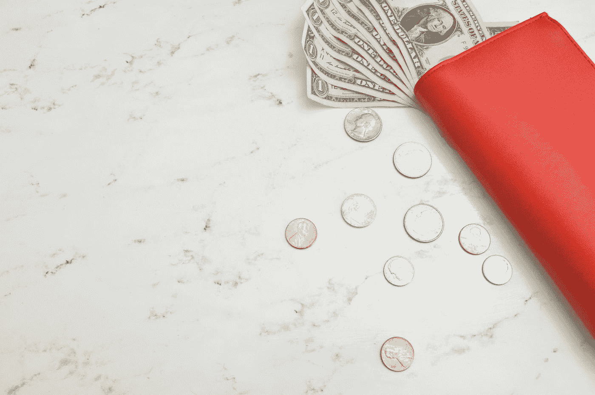

# 你的财务状况需要排毒吗？

> 原文：<https://medium.datadriveninvestor.com/do-your-finances-need-a-financial-detox-d5bababa965b?source=collection_archive---------9----------------------->

数码排毒很受欢迎。关掉你的设备，享受你最好的生活。但是你不能就这样关掉你的财务…

Photo by [Katie Harp - Pinterest Manager](https://unsplash.com/@kharp?utm_source=medium&utm_medium=referral) on [Unsplash](https://unsplash.com?utm_source=medium&utm_medium=referral)

我的上一篇文章是为数字排毒做辩护，尽管是一个非常改良的版本。在今天的文章中，我将仔细研究一个更新的现象:金融排毒。

你可能会想:“我不能关掉我的网上银行，然后期待最好的结果。”我同意你的观点，这(谢天谢地)不是金融戒毒的目的。财务排毒是指批判性地审视你自己的财务决策，决定你能接受什么，不能接受什么！

 [## 更好的预算，打造更大的|数据驱动型投资者

### 即使是专家也承认它们并不完美。从 1 到 10 的范围内，安东尼·科普曼和德尔…

www.datadriveninvestor.com](https://www.datadriveninvestor.com/2018/11/08/budget-better-to-build-bigger/) 

## 检查你自己

在你毁掉自己之前检查一下自己。没有比这更适合这篇文章这一部分的陈述了。你消费什么，在哪里消费，消费多少？是时候了解一下你的银行对账单了。如果你愿意，许多应用程序可以为你做到这一点，只要你拿到照片，而不是把它留在你的手机上积灰。

一旦你知道你在哪里花了多少钱，你就可以自己决定你是否觉得这是一笔合适的金额，或者是一笔合适的支出。如果你突然意识到你在茶拿铁上的花费比你想象的要多得多，也许是时候限制自己，做一个预算或某种形式的津贴了。同样，如果你认为你不能适当地限制自己，一个应用程序可以帮助你做到这一点。

## 按惯例办事的人

很容易看出，也许我们不需要一个月买 16 杯柴拿铁。但是我们看到的每个月重复出现的支出又是怎么回事呢？它们有用吗？它们有必要吗？对许多人来说，他们在一月份开始的健身房会员资格在几个月后仍然被扣除。

除了不必要的支出，有没有你需要的东西，但也许可以得到更好的交易？像保险这样的事情总是值得关注的。如果你决定转用他们的服务，很多公司都会提供很多优惠。通常，你会得到更好的待遇。也为你的能源供应商、电话供应商，甚至你的银行这样做(想想贷款和抵押)。这些公司指望你的惰性，这意味着他们会用一个只持续有限时间的好交易来吸引你，然后指望你坚持和他们在一起，即使这个交易在你和他们在一起的剩余时间里不再有效。这可能会花费一些时间，需要你采取一些行动，但这是值得的！

## 购物疗法

一个更难搞清楚的习惯:你根本不消费的时候是什么心情？而你全力以赴的时候又是什么心情？某些事件引发的情绪和心情会让我们陷入其中一种状态。突然间，我们以面条为生，以确保我们不会花一分钱，或者在几分钟内就花掉数百磅。你需要弄清楚是什么让你这么做的。如果你能感觉到自己正在成为一个挥霍者，那就给这张卡封顶。给它加上某种限制。或者只是把自己关在屋子里，没有网络，因为网购也算。分散注意力。去跑步，穿过树林，不要去商场。

同样重要的是要控制你的吝啬。因为通常，你会发现经过一段时间的限制后，你更有可能会挥霍无度。当你的(财务)情绪稳定时，你是最好的。Moodswings 不太理想。财务状况也不健康。

保持稳定。不稳定？不消费！

## 背叛

金融不仅仅是关于我们拥有的(或有一天希望拥有的)钱，也是关于我们已经花掉的钱。看看你周围。你对你所拥有的一切满意吗？

玛丽·近藤如此受欢迎是有原因的。她(重新)引入了从你的财产中获得快乐的概念。如果它不能给你带来快乐，那是时候离开了。

为什么我在金融排毒中推荐这个？因为我们浪费了很多钱去买我们已经有的东西，或者至少已经有了一个版本的。你拥有的东西越多，就需要越多的空间来存放。我们有更大的房子来放所有的东西。但是现在我们有更多的空间，因此我们可以得到更多的东西。只有当我们没钱的时候才会停止。不如我们把这个过程反过来，拥有更少的东西，目标是拥有更少的东西。

我不是建议你在这里对我进行全面的极简主义。但是仔细检查所有的东西，选择你想要的和需要保留的东西，会让事情看得更清楚。首先，它会显示你已经有多少。第二，它会让你更加意识到你所拥有的东西，如果你决定保留它们，你会继续拥有它们。两者都保证你买的少，减少买双倍的可能性。

你决定扔掉的东西可以捐赠或出售。你卖出去的东西会给你带来额外的收入，这很不错。一定要给你想卖掉这些东西的时间设定一个期限。如果到时候没有卖出去，也需要捐赠。否则，你仍然拥有很多东西，只是把它们搬来搬去。这不是重点。捐东西超级容易做，周围有很多慈善商店，谷歌一下就行了。

## 花钱的钱

另一件绝对要调查的事情是:你有任何未偿还的债务吗？信用卡债务要花很多钱。这可以通过转换信用卡提供商来避免(并且把债务带在身边，因为许多人提供“免费”的第一年)。但是更好的办法是少负债或者不负债。如果你有存款，还清债务。因为持有债务只是要花钱，而储蓄账户几乎不会产生任何钱，因为它的利息非常低。相比之下，许多信用卡公司对任何未偿债务收取超过 20%的费用。在英国，储蓄账户的收益不到 1%。这是每月的。这种差异不会对你有利。

你真的要问问自己，你愿意为了什么而欠下(信用卡)债务。我们是在谈论教育等投资吗？教育有一个很好的理由:它(可能)会有回报。为了满足消费需求，你应该负债吗？嗯，你买的商品/服务一旦被消费，就没了。不太可能自我回报。然而，你仍然被债务和债务利息所困。不太好。这种消费正在让你付出越来越多的代价。不聪明。

其他需要花钱的事情:透支。透支是否被授权似乎并不重要，银行会想办法向你收费。这可能很快成为一个非常昂贵的习惯。所以，如果这适用于你，是时候弄清楚这里发生了什么。什么时候打透支？是忘记直接扣款让你陷入困境吗？或者这似乎是一个更经常发生的事情？如果它相当有规律，你似乎在保持平衡方面有问题。也许是你换成现金的时候了，即使只是几个月的试用期，这样你就可以正确地欣赏金钱所提供的物理限制，即使它只是手机屏幕上的数字。

很多人似乎觉得现金作为预算工具更容易。所以这可能有点道理。幸运的是，一旦它消失了，它就消失了。你不能用现金透支，所以有现金不会让你有任何损失。一个警告:不要用信用卡预支现金。那些也要额外收费。意思是你刚刚付了钱。放聪明点。

我想这就是我在金融排毒方面的所有建议。有点预算，有点玛丽·近藤，有点不花你没有的钱。当你的房子空荡荡的，你的易贝嗡嗡作响，你的银行账户满满的时候，请想起我。

**快乐排毒！**

*更多类似的文章可以在* [*金钱上的头脑*](https://www.moneyonthemind.org/blog) 上找到