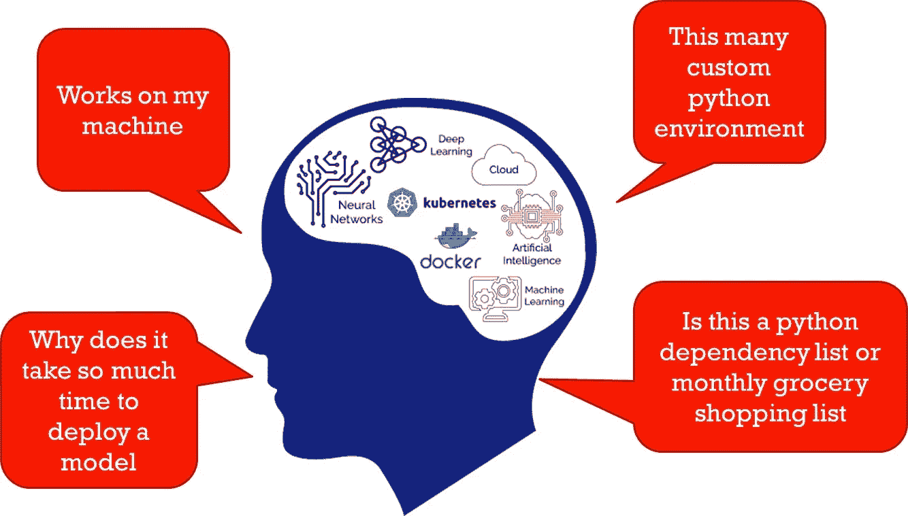

# 数据科学的 Docker 和 Kubernetes

> 原文：<https://medium.datadriveninvestor.com/docker-and-kubernetes-for-data-science-db7b2dd4dee5?source=collection_archive---------2----------------------->

Center image Source: Google Images

Tensorflow、pytorch、pandas、numpy、protobuf、dask、sklearn、keras、xgboost、lightGBM、scipy 等等，不胜枚举。在 R 和其他语言中也有一组等价的包。

每个包都有多个保持活动的版本，在它的上面，有一个每夜构建来处理最新和最好的版本。Tensorflow Nightly、Pytorch Nightly 等。

 [## 数据科学和软件工程哪个更有前途？数据驱动的投资者

### 大约一个月前，当我坐在咖啡馆里为一个客户开发网站时，我发现了这个女人…

www.datadriveninvestor.com](https://www.datadriveninvestor.com/2019/01/23/which-is-more-promising-data-science-or-software-engineering/) 

除了包和版本，每个包和版本之间都有依赖关系。Pytorch 可能使用 X 版本的 numpy，而 tensorflow 可能使用 y。

它不止于此，还有对包的设备加速器依赖性。Tensorflow CUDA，Intel 优化的 Tensorflow 还有可能明天的 OpenCL，AMD GPU 等等。

如果一个人在本地笔记本电脑上进行有限规模的实验，上述依赖性是没有问题的。想象一下，在企业中，数百个机器学习和人工智能项目使用由一个集中的 IT 团队管理的工具和基础设施运行。每个项目都有自己的依赖项、包和相关版本。IT 团队最终不断维护多个定制环境，同时确保旧代码不会中断。

即使假设环境由拥有自己的自定义环境的数据科学团队维护，软件工程师在生产中复制这些自定义环境也会变得非常困难和耗时。

如果你认为这就是全部，不，它不是。区别在于桌面、培训服务器、部署服务器以及云之间的操作系统。

就这些吗，没有吗..但是，我将在这里停下来，重点介绍克服这种定制环境挑战的解决方案，以及在数据科学家、IT 团队、软件工程师和其他主要利益相关方之间引入更多协作的解决方案。

你猜对了。它是容器…虽然有许多容器环境，但我将更多地谈论 Docker，对于编排容器，我们将重点关注 Kubernetes。

# Docker 是什么？

Docker 允许将应用程序打包到独立的环境中，有助于更快的部署，并与培训或开发环境更加接近。

# 什么是 Kubernetes？

Kubernetes 实现了容器供应、联网、负载平衡、安全和扩展的自动化。

Kubernetes 使机器学习模型开发和部署变得简单，一致和可扩展。

使用容器和 kubernetes 有很多好处，它们在从培训到部署的整个数据科学生命周期中都很有用。

# [我在 YouTube 上 Docker 和 Kubernetes 上的数据科学视频](https://youtu.be/fNv48vW94kM)

你也可以订阅我的 YouTube 频道[ai engineering](https://www.youtube.com/channel/UCwBs8TLOogwyGd0GxHCp-Dw?sub_confirmation=1)([ai engineering](https://www.youtube.com/channel/UCwBs8TLOogwyGd0GxHCp-Dw?sub_confirmation=1))，在我发布新视频时获得提醒

现在进入正题...容器在以下方面发挥着重要作用

📍基础设施

📌启用多租户

📌混合云

📍工具和再现性

📍部署

# 基础设施

基础设施是数据科学计划的关键投资之一。企业必须投资高性能系统/GPU 来加速数据科学计划。

如果您看一下模型培训，通常会有一段短暂的时间大量使用基础架构，并发布群集几乎处于空闲状态。Kubernetes 允许高效共享资源并支持多租户。这样，企业内的多个机器学习项目可以更有效地共享和利用基础设施资源。

kubernetes 带来的另一个好处是支持云原生和云就绪架构。构建混合云策略很容易，它允许使用内部资源，并根据需要突然转向云。通过这种方式，内部投资可以保持在最低水平，云可以用作扩展的基础架构，从而控制成本。

# 工具和再现性

对于多租户，每个项目可能都有自己的工具和工具的特定版本。容器可以帮助您创建那些捆绑了所有依赖关系的虚拟化环境。

此外，现在所有的依赖关系都捆绑在一起了，一旦开发了一个模型，就很容易将容器传递给软件工程师来部署，而不是发送冗长的安装说明和依赖关系矩阵。

# 部署

一旦一个模型被训练，只需在容器中添加一个快速服务函数，该函数加载模型并捆绑预处理管道依赖。这里的服务功能可以是 flask app 或 Java Spring application 或 TF serving 或其他功能，具体取决于模型算法或用于开发模型的工具。

kubernetes 在部署过程中的真正优势来自于按需扩展资源以满足业务需求。在峰值容量扩展期间，服务实例 pod 和正常峰值容量运行 pod。

您还可以定义部署策略，如 A/B 部署、蓝绿色和金丝雀。这有助于执行零停机部署，并支持 champion challenger 部署策略。