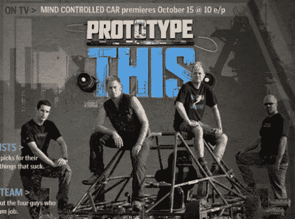
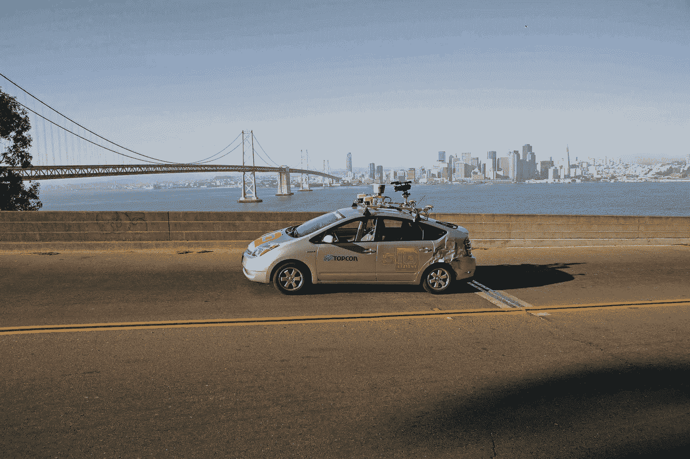
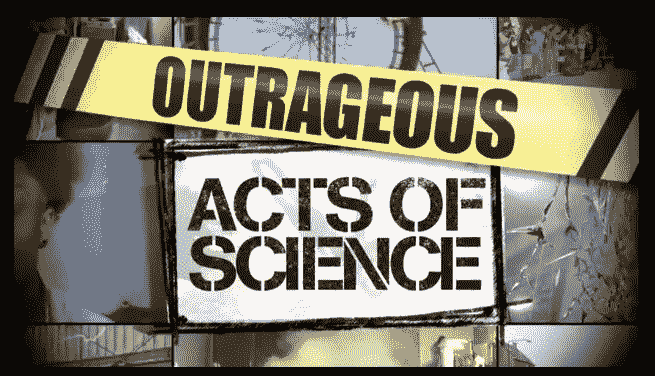
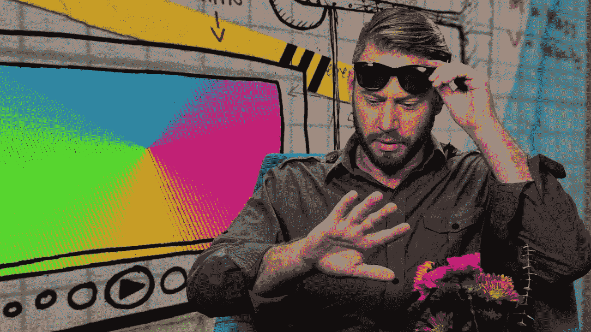
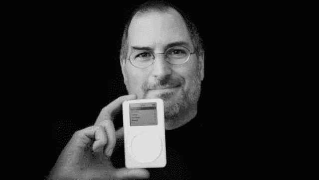
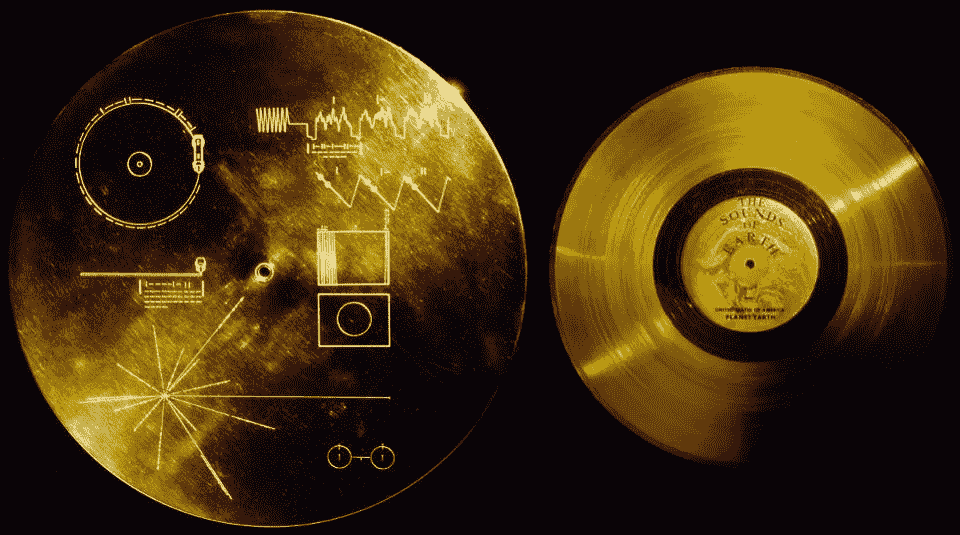
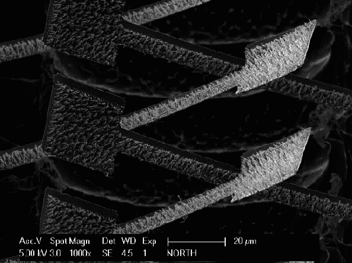
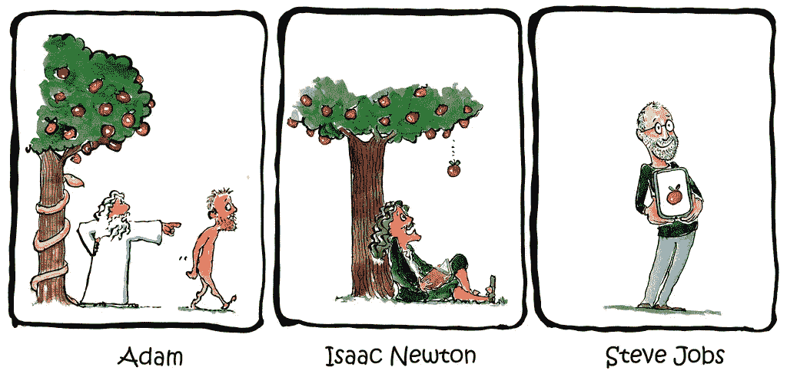

# 博士讲科技故事的 8 条规则

> 原文：<https://medium.datadriveninvestor.com/docs-8-rules-for-science-technology-storytelling-3f9d96fb1847?source=collection_archive---------3----------------------->

# 让我们面对现实吧，科学和技术是塑造未来世界的主要驱动力。从历史上看，我们塑造世界的方式是通过故事。我们创造叙事，无论是书籍、电影还是设计，然后我们每个人都在这些叙事中扮演自己的角色。

在过去的十年里，我主持了几个黄金时段的探索/科学频道系列 *(* [*)原型就是这个！*](https://en.wikipedia.org/wiki/Prototype_This!)**)和我自己在网上发现的系列*。这让我磨练了我讲科学故事的技巧。我喜欢帮助公司、科学实验室和企业家讲述他们的故事。通过我的生产公司[RNA producted](http://rnaproduced.com)我已经与各种各样的公司和实验室合作过，从初创公司到特斯拉，再到劳伦斯伯克利国家实验室。不管是为了谁，有几条规则似乎是适用的。***

******

***我的科学和媒体的结合始于我获得博士学位后，当时我被探索频道雇佣来创作和共同主持一个关于发明未来的节目，名为*原型这个！*我们最终完成了一些令人难以置信的项目(特别是考虑到那是 2007/2008 年)，包括无人机送货系统、精神控制汽车、吊在高跷上并驶过其他汽车的汽车、爬楼用的壁虎桨、自动赛格威、[水滑道模拟器](https://www.youtube.com/watch?v=sM-UnSAlrV4)(见上图)，以及自动驾驶汽车。***

****

**这辆自动驾驶汽车实际上是谷歌的自动驾驶汽车——它在没有任何人的情况下，在 2008 年沿着 Embarcadero 行驶，越过海湾大桥！**

**虽然技术挑战是巨大的，但最大的挑战是用每个人都能理解的简单术语解释这些令人难以置信的技术内容，并且要有娱乐性。制片人禁止使用晶体管这个词，因为它太专业了。试着用从你的字典里删掉的像晶体管这样的词来解释任何与计算机相关的东西是如何工作的。结果是这个展览成为了一个令人难以置信的高科技讲故事的训练场。**

# **1.了解你的受众**

**我问任何想讲故事或制作视频的客户的第一件事是:你在和谁说话？你想向他们传达什么信息？十有八九，他们并不确定。我实际上已经开发了一个 3 小时的研讨会，帮助公司找出谁是他们的受众，以及公司对他们的承诺。**

****

**一个伟大的现代科学说书人是我在*令人发指的科学行为*节目中的搭档主持人(或者也许我是他的搭档主持人！)[哈肯奥卢塞伊](https://en.wikipedia.org/wiki/Hakeem_M._Oluseyi)。他解释复杂概念的方式是如此随意和轻松。学习它们感觉很自然。这才是节目真正的挑战。如果你没有看过《T4》十季中的任何一季，全球观众接近 2 亿，基本概念是我们在网上找到人们做令人发指的事情的视频剪辑，无论是自制的喷气背包还是没有降落伞跳出飞机。在这一集的 20 个片段中，我们解释了其中的科学原理。诀窍是如何用简单的术语解释复杂的科学概念，让任何人都能容易理解，就好像他们已经知道了一样。**

# **2.乐高自我**

**解释一些事情并不是让你看起来很聪明。我经常看到拥有领域专业知识的人把解释一个概念作为展示他们有多聪明的机会。事实上，能够讲述一个简单而有说服力的故事，真正抓住一个概念，是掌握的标志。**

****

**更进一步，我学会了脆弱的重要性，学会了勇于分享优点和缺点。事实上，我是色盲，除了和我最亲近的人之外，我这辈子都没有告诉任何人。我认为这是软弱的表现。在*令人发指的行为*中，我们的一个剪辑是关于帮助色盲的眼镜。他们问所有的主持人，我们中是否有人是色盲。我想，如果有机会分享我的秘密，那应该是在一个全球电视节目上。在我们拍摄的一百多集里，这个特别的场景是我最出彩的一集。我吃的未熟香蕉也少了很多！**

# **3.少即是多**

**你的核心要点是什么，以此为基础。我知道你的项目有很多细微差别和方面。试图在一个故事中一次传达所有这些信息超出了任何观众的承受能力。找到你想要传达的核心本质，然后围绕它来构建故事，这是至关重要的。**

****

**为什么做一个科技好说书人这么厉害？似乎成为一名科学家或技术专家和一个好的讲故事者是例外而不是规则。当它是例外时，人民才是真正的例外。史蒂夫·乔布斯是一个讲故事的大师。可以说，他讲故事是苹果成功的最大因素。在 iPod 出现之前，有各种各样的 MP3 播放器，但是你口袋里的一千首歌这个简单的故事真的让它回家了。苹果的故事就像他们的设计；简单、集中、直观。**

# **4.媒介就是信息**

**马歇尔·麦克卢汉说得有道理，有时候你传达某种东西的方式和你想要传达的东西一样重要。在今天的数字和回归模拟的世界里，一个完整的故事可以用多种媒介来讲述。在我自己的博客 [*实验先生*](http://experimentalgentleman.com/) 上，我通过嵌入视频的文字帖子讲故事。这种结合，加上一些社交媒体，利用每种媒体创造了一个 360 度的故事。**

****

**在我看来，科学传播史上最重量级的冠军是[卡尔·萨根](https://en.wikipedia.org/wiki/Carl_Sagan)。他被人类选中，以外星生命为听众，创造了一张表达关于我们和我们的星球的最重要概念的黄金唱片。一张金唱片被送上太空，这是一种独特的媒介！**

# **5.一个好故事会流传下来**

**很多故事都可以吸引人和娱乐人，但是一个伟大的故事是令人难忘的。是什么让一个故事令人难忘？如果你抓住了你的观众，那么你就能让他们对这个故事产生共鸣。此外，为了创造记忆，你必须在这些神经通路上创造一条常走的轨迹——这意味着重复。**

****

**我的博士学位是纳米科学和生物信息学。我在模仿壁虎脚垫上发现的粘合剂，这种粘合剂使壁虎能够攀爬并悬挂在几乎任何表面上。我的发明从壁虎身上获得灵感，制造出一种可以电子开关的粘合剂。听起来简单的权利，以及在现实中它是疯狂的复杂，但这个故事很容易理解，因此将坚持(双关语)。**

# **6.让它有用**

**你最近为我做了什么？好的故事是给观众提供他们可以使用的东西。也许他们会在工作中使用，或者在那天晚上的约会中使用。为了使它有用，它需要与受众相关，令人难忘，并提供一种效用。也许这只是帮助他们记住一个关键事实，或者也许这给他们提供了一点有教养的幽默。**

**2009 年，我想改变人们对电动汽车的看法。当时所有人都认为电动汽车是丰田普锐斯。我想讲一个不同的故事。我想讲的故事是，电动汽车既快又性感。在我的脑海中，没有哪辆车比电影《美国风情画》中的 32 款双门轿跑更加快速和性感。这也有助于我在电影拍摄地的一个城镇长大。**

****

**2009 年，AMP=D 电动汽车可以在 3.5 秒内完成 0-60 英里的时速。这一点加上外观让我们在 SEMA，世界上最大的车展，福特和通用之间的地板上。我们赢得了年度绿色汽车奖，但更重要的是，我们让乔有了谈论的话题。**

# **7.说明了问题**

**一个故事的最高分是当它被再次讲述的时候。当一个故事被再次讲述时，它就变成了一个故事。为了让你的观众再次讲述一个故事，它需要简单、令人难忘并且有用。我正在写这些规则，但我并不总是记得它们。但我记得的是要确定并了解我的观众是谁，并构思一个他们能够并愿意复述的故事。如果你那样做了，你就成功了。**

****

# **0.幽默**

**如果你的观众笑了，这意味着你已经触及了他们的思想和心灵。或者换句话说，你已经让他们完全投入了。然而，这是有风险的。我们都知道，当幽默出错时，它就真的出错了。所以，如果你想增加一点幽默，我强烈建议在你的目标群体中的一些人身上测试一下，然后再向全世界发布。**

**所有主持人*都擅长的一件事就是幽默。当我们被依赖于解释我们领域的“科学”时，我们也被要求对我们没有领域专业知识的视频剪辑开玩笑或说双关语。制片人称之为“爵士乐”，而我以“爵士乐”闻名。尽管如此，虽然我实际上对摄像机说了近一千个双关语，但可能只有一打能进入系列。让这成为对幽默的警告。***

**我希望这篇文章能对讲故事的一些基础知识提供一些见解。当谈到视频制作时，很容易迷失在动态图形、动画、无人机拍摄等中..我利用所有这些，但只有在我找到核心故事之后。然后技术就变成了讲述故事的工具。就这样，我将留给你们一些我的作品。**