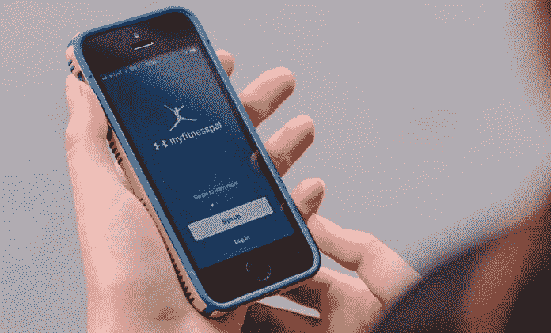

# 医生为患者联系开出应用程序

> 原文：<https://medium.datadriveninvestor.com/doctors-prescribe-apps-for-patient-connections-fdb8cd90c166?source=collection_archive---------13----------------------->

## 即时连接也可能导致即时隐私问题

移动应用以用户越来越多地使用和理解的方式将医疗服务提供者和患者联系起来。应用程序的广泛使用也为普遍的隐私侵犯打开了大门。医生必须格外小心。

[纳西索·塔皮亚博士](https://twitter.com/cebumd)敏锐地意识到应用程序的好处和陷阱。他是菲律宾宿务市文森特·索托纪念医学中心研究室的负责人。这位医生也是宿务大学医学院的研究协调员和菲律宾大学马尼拉国家卫生专业教师培训中心的兼职教师。

“我们生活在一个移动世界，智能手机的使用越来越多，”塔皮亚说。[移动医疗被认为是更广泛的‘电子医疗’运动](https://www.athenahealth.com/knowledge-hub/mobile-health-technology/apps)的一部分，该运动利用手机和电脑等技术提供医疗服务和信息

他将移动应用程序称为可以上传到智能手机或平板电脑的程序。在他的案例中，这些移动应用程序被用于各种目的，以帮助临床实践。

 [## 大笔资金和尖端技术:人工智能/人工智能投资将如何革新医疗保健…

### 在过去几年人工智能(AI)和机器学习(ML)的显著发展中…

www.datadriveninvestor.com](https://www.datadriveninvestor.com/2018/03/22/big-money-and-cutting-edge-technology-how-investment-in-ai-ml-will-revolutionize-the-healthcare-industry/) 

Tapia 说:“快如闪电的处理器、内存和电池的改进，以及执行复杂功能的高效开源操作系统的增加，[引领了许多医疗移动设备应用程序的开发，供临床使用](https://www.ncbi.nlm.nih.gov/pmc/articles/PMC4029126/#b7-ptj3905356)。

# 知情人士的帮助

他解释说，随着许多新移动应用程序的兴起，医疗保健专业人员希望有经验的用户提供更多关于可能对临床实践有用的应用程序的指导。

“我的农村实践依赖于应用程序，”菲律宾国家首都地区公共卫生学院成员兼卫生政策顾问 Jaifred F. "Jim" Lopez 博士说。“八年前，我用黑莓手机访问应用程序。这些应用程序为远程临床医生提供了正确开处方的必要信息。他们“救了我的命”很多次。

“我最喜欢的应用程序让我计算肾功能、月经期，甚至体重指数，”他说。"不忘记是值得的，但有时你会忘记，尤其是在忙碌的练习中."

 [## 远程医疗为远程连接开出了药方

### 从远处看很有帮助，应用程序也有自己的隐私问题

medium.datadriveninvestor.com](/telemedicine-prescribes-cure-for-distant-connections-a4d87383c808) 

洛佩兹也支持期刊应用。

“它们太棒了，”他说。“他们帮助我获得更新，比如当我还在这个领域时，新版本的《核心脏病学杂志》就出来了。了解最新情况并让我的同事和队友知道很重要。”

妇产科医生兼传染病专家海伦·马丹巴博士感谢手机的力量。

“他们让我们跟踪我们的健康，我们的病人，我们的预约，我们的手术，我们的课程，”她说。“我们的同事只需点击一下鼠标。也有一些应用程序用病人能理解的语言提供更多的疾病信息。手机也有助于小费。

“我使用的应用程序之一是 [MyFitnessPal](https://twitter.com/MyFitnessPal) ，”她说。“它帮助我计算卡路里摄入量，查看我的个人趋势，了解我所吃食物的质量，并监控我的锻炼活动。这也有助于激励，因为朋友也在应用程序上。”

马丹巴警告说，不要依赖应用程序作为最终的医患关系解决方案。

“我偶然发现了 [drawMD](https://twitter.com/drawmdapp) ，它允许我在 iPad 上绘制解剖照片，”她说。"但是病人更喜欢纸，这样他们可以把它带回家，还有笔记和涂鸦."

# 应用带来的好处

为了说明应用程序如何帮助管理慢性疾病，内分泌学家 Iris Thiele Isip Tan 博士几年前在澳大利亚的一次心脏病学会议上做了一次演讲。

塔皮亚说:“信息管理、交流、研究和病人监测是应用程序带来的几大好处之一。”。"这么多信息唾手可得。"

 [## 完全公开:当医生们有矛盾时

### 医疗过失会影响病人的生活

medium.datadriveninvestor.com](/full-disclosure-when-doctors-are-conflicted-7b2b6d347fae) 

要评估一个医疗 app 的可信度，看看有哪些机构为该 app 背书，理由是什么。作为可靠性历史的一部分，您还需要检查它们的安全性。在认可某个特定的应用程序时要谨慎，以免陷入利益冲突，就像医生从制药公司免费分发药品样本一样。

洛佩兹给出了医疗应用的基本要求:

*   它必须易于使用，易于理解。
*   它的目的不是取代健康专家的建议，而是引导患者在出现特定症状时寻求建议。
*   它必须能够提出预防措施。

“来自医疗机构和专业协会的应用程序通常更可靠，”睡眠专家帕特里克·莫勒尔德说。“如果公式和引用在信息部分有参考，我倾向于更相信这些。最后，我会权衡成本因素和功能性。”

# 对交付至关重要

自然地，Madamba 偏爱与她自己的实践相关的移动设备。

“我喜欢怀孕跟踪器上的应用程序，”她说。“很容易计算出怀孕的年龄和分娩的日期。它还有一个时间机器，告诉你完成每个三个月的日期，或者什么时候分娩是安全的。

“它应该经得起时间的考验，因为它的实用性和你从应用程序中获得的信息，”马丹巴说。

 [## 孩子快出生了，你能接生吗？

### 财务准备几乎和新生儿的婴儿床一样必要

medium.com](https://medium.com/financial-strategy/with-your-baby-on-the-way-can-you-deliver-fcd3231212c7) 

应用不仅仅是医生的，也不仅仅是病人自己的。

“你会惊讶地发现，对于想要怀孕的夫妇来说，拥有月经周期移动应用追踪器的是丈夫，”马丹巴说。"他们虔诚地记录妻子的月经，以确定生育期。"

医疗保健提供商有其他移动应用程序，他们在实践中使用这些应用程序来实现特定的目的或利益。

谭使用的医学软件 T3 计算肾功能，使用的医学专业月度指数 T5 计算药物相互作用。

“在黑莓时代，我用的是 Skyscape，”洛佩兹说。“现在，作为一名 iPhone 用户，我使用 [Medscape](https://twitter.com/Medscape) 、 [MDCalc](https://twitter.com/mdcalc) 和 [Read](https://read.qxmd.com/) 。我还使用我的健康应用程序来跟踪个人健身情况。”

Madamba 很感激谷歌教室可以在手机上使用。她觉得这让她的住院医生能够通过手机在任何地方回答他们的测验和参加考试。

Tapia 希望更多的医疗保健专业人士将与应用程序开发者合作，创建医疗应用程序或医疗创业公司，这是一个动作。

“与拖着又厚又重的教科书相比，移动应用程序可以让临床实践变得容易得多，”她说。“不利的一面是，如果受训者不再读书，因为谷歌博士提供了他们力所能及的一切。手机应用应该补充*而不是*取代。

“在我们的‘大师级’课堂上，我和我的组员将被迫*学习*如何成为技术人员，”马丹巴说。“这将让我们最大限度地利用技术来改善我们教授医学教育的方式。”

**关于作者**

吉姆·卡扎曼是拉戈金融服务公司的经理，曾在空军和联邦政府的公共事务部门工作。你可以在[推特](https://twitter.com/JKatzaman)、[脸书](https://www.facebook.com/jim.katzaman)和 [LinkedIn](https://www.linkedin.com/in/jim-katzaman-33641b21/) 上和他联系。

*原载于 2019 年 4 月 15 日*[*https://www.datadriveninvestor.com*](https://www.datadriveninvestor.com/2019/04/15/doctors-prescribe-apps-for-patient-connections/)*。*