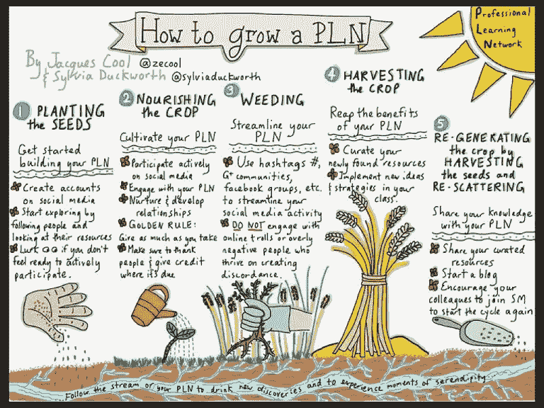
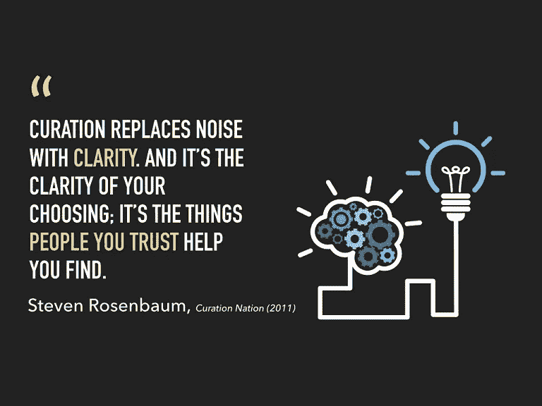
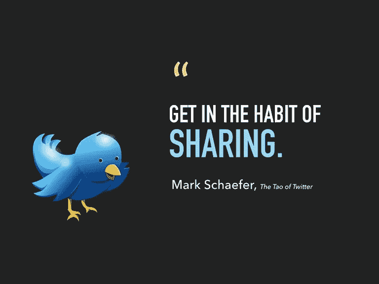

# 医生为社会弊病开药方

> 原文：<https://medium.datadriveninvestor.com/doctors-prescribe-cure-for-social-malaise-a46f8d5ec9be?source=collection_archive---------6----------------------->

## 个人学习网络将全世界的医疗提供者联系在一起

当 T2 的 Iris Thiele Isip Tan 博士于 2010 年加入 Twitter 时，她并没有打算创建一个个人学习网络。它只是自然发生的。

“我以前不知道 PLNs，”她说。

谭，内科内分泌学家，菲律宾大学医学院临床副教授，菲律宾大学医学院医学信息中心主任。

当她参加会议时，她会问其他医生是否有更多的医生在 Twitter 上。好消息是，是的。

 [## 充分利用会议连接

### 提前准备，一定要跟进

medium.com](https://medium.com/datadriveninvestor/make-the-most-of-conference-connections-b0b17cd08037) 

坏消息是，他们通常关注的是[大马尼拉发展局](https://twitter.com/MMDA)和[菲律宾大气、地球物理和天文服务管理局](https://twitter.com/dost_pagasa)。

“第一条是关于交通状况，第二条是关于天气，”谭说。

其他医疗保健提供者告诉谭“他们没有意识到 Twitter 可以用来跟上医生需要做的终身学习。”

医生需要制定自己的计划，谭想尽自己的一份力量。

她说:“个人学习网络是你与之交流信息的所有人的集合。”

“你个人学习网络中的人是你信任的人，”谭说。"随着对你所关注的人的监管，Twitter feed 成为了一个值得信赖的信息来源."

建立一个 PLN，跟随你感兴趣的人。仔细观察他们的推文和回复，看看谁参与了对话——不要只是脱口而出智慧，除了谢谢没有任何回复。如果他们不和别人说话，他们可能也不会和你说话。

为你的个人学习网络创建一个 Twitter 列表。当你看到可能性时——你不必遵循它们——把它们添加到你的列表中。然后你可以跟上新的东西，而不会在你的时间线上绝望地寻找它们。

“查看同事在 Twitter 上关注的人的资料。扫描他们的微博。如果他们发布的内容让你感兴趣，点击关注，”风湿病学家 Sids Manahan 博士说。

“Twitter 的应用程序还会根据你的兴趣建议你关注谁，”他说。“不时浏览它们。你找到的人可能会帮助你成长。”

# 感觉很好

马纳汉说，当感觉正确时，Twitter 上的 PLNs 会满足需求。

“我过去曾创建过清单——同事、新闻、娱乐、演示，”他说。“我根据自己的心情阅读列表中的推文，就像音乐播放列表一样。

“每当我参加会议或网络研讨会时，我都会搜索发言者是否在 Twitter 上，特别是我是否喜欢他们的讲话，”Manahan 说。

 [## 强大的网络不仅仅是一个梦想

### 对话会带来更多的联系

medium.com](https://medium.com/datadriveninvestor/powerful-networks-are-more-than-a-dream-61c666b9a1fe) 

药剂师 Jarvin Tan 是个人学习网络的新人。

“就在几个月前，我偶然发现了这个概念，”他说。“我找到的第一个账户是[精神精灵](https://twitter.com/Mental_Elf/)，它在推特上发布了关于[ebmental health _ BMJ](https://twitter.com/EBMentalHealth/)Google hangouts 在 [Andrea Cipriani](https://twitter.com/And_Cipriani/) 网络上的会话。

“剩下的就是历史了，”谭说。“只需要关注一个活跃的博客。我会通过转发发现有趣的人。”

# 几乎在那里

他还通过虚拟出席建立了联系。

谭说:“当我看到斯蒂芬妮·米亚科博士参加澳大利亚和新西兰皇家精神病学院 2018 年大会时，我发现了新的关注对象。”。“其他与会者也在#RANZCP2018 标签上，这太好了。”

就像一般的社交媒体一样，个人学习网络增强了互惠。

“使用清单，保持真实，”医疗保健战略家雪莉·梅纳德说。“列表可以让你建立一个与行业相关、与兴趣相关的真实人物的部落。付出你所得到的，真实。

“试试列表，然后看看你的分析，”她说。“你的关注者会越来越多，你的内容会被更多人分享。”

尽管个人学习网络有助于人们拓展视野，但过滤泡沫可能会把他们限制在自己的小世界里。

在他的 [TED 演讲](https://www.ted.com/talks/eli_pariser_beware_online_filter_bubbles#t-516943)中，在线组织者和《过滤泡沫》的作者 [Eli Pariser](https://twitter.com/elipariser) 谈到了互联网意想不到的后果:

> 随着网络公司努力根据我们的个人品味定制他们的服务——包括新闻和搜索结果，出现了一个危险的意想不到的后果:我们被困在“过滤泡沫”中，无法接触到可能挑战或拓宽我们世界观的信息。这最终将证明对我们和民主都是不利的。

“这就是为什么我建立了个人学习网络来过滤 Twitter 上的泡沫和假新闻，”Iris Tan 说。“这是关于建立信任。”

# 惊人的偏见

当社交媒体算法和搜索引擎提供个性化定制的世界图片时，信任就受到了考验。两个人可能认为他们对世界的观点没有偏见——但他们可能都错了。

“有时我从栅栏的另一边跟踪人们，这样我就可以从他们的角度看问题，”马纳汉说。"我只是希望有些人不要这么急躁。"

 [## 从合适的追随者身上获利

### 决定是否跟随应该是你策略的一部分

blog.markgrowth.com](https://blog.markgrowth.com/profit-from-the-right-kind-of-followers-950236154bd0) 

Jarvan Tan 说，最好在没有气泡过滤器的情况下额外努力查阅原始来源。

“最基本的教训是，永远要参考原文，”他说。"这很有道理，但是在同时处理其他任务的背景下就很困难了."

[在会议上实时发微博](https://medium.com/@JKatzaman/make-the-most-of-conference-connections-b0b17cd08037)是发展个人学习网络的另一种方式。

梅纳德说:“还有什么比这更好的方式来分享对共同利益的不同观点呢？”“实时推特会议在医疗保健社区中撒下了一张大网。读者不一定要在那里才能从思想引领中受益。”

与会者可能会减少，而不是参加会议，因为人们会关注社交媒体。

“我想这是一种理性的恐惧，但我相信社交媒体实际上已经将会议流行带到了一个新的地方，”梅纳德说。"人们——以前不知道有很多会议——通过社交网站了解并参加会议."

# 多样性滞后

她自己的会议出席率有所下降，但不是因为网络问题。梅纳德遇到了文化上的轻视和社交媒体的无能。

“由于缺乏多样性，我不再参加会议，”她说。“但是，随着许多妇女、病人和少数民族要求被包括在内，社会已经使这个问题暴露出来。社交媒体做到了这一点。

“我发现有些会议组织者仍然没有采用[官方标签](https://medium.com/@JKatzaman/theres-a-hashtag-for-that-if-you-do-it-right-79b9d167c86a)，这让我很恼火，”梅纳德说。“它有助于聚焦会议:在正确的时间，向正确的观众提供正确的内容。”

 [## 通过保持真实来赢得观众

### 通过了解、喜欢和信任建立融洽关系

blog.markgrowth.com](https://blog.markgrowth.com/build-an-audience-by-keeping-it-real-47e13eb8102d) 

无论是在会议上还是其他地方，个人学习网络都需要培养才能成长。

“像所有技能一样，花时间在推特上，”马纳汉说。“阅读、参与、分享和学习。如果你很少互动，你的 PLN 就不会增长。

“在会议期间实时发推特，”他说。“别忘了回复那些喜欢和评论的人。”

# 打招呼

当你得到回复时，不要吃惊。

“我记得在一次会议上，学员和研究员被分配到推特上，”Iris Tan 说。“我提问的时候没有人愿意回答。我猜当有人在推特上回复他们时，他们被吓到了。”

她还打消了对在会议上发推特的担忧。

“我曾经和一个会议组织者交谈过，他担心没有人会来参加会议，只是跟着反馈走，”谭说。“我说，相反，如果有人因为推文而觉得会议内容有趣，他们可能会考虑下次去。”

 [## 激情爆发时，沟通会受到影响

### 论坛帮助人们聚集和解决冲突

medium.com](https://medium.com/datadriveninvestor/communication-suffers-when-passions-erupt-affa2e520268) 

负责会议的人也需要了解社交媒体的细微之处。

谭说:“曾经有一段时间，会议有‘流行’的标签，但并没有真正在 Twitter 上使用它们。”。"因此，有一些很长的标签."

她敦促每个人主动创建自己的个人学习网络。拥有最适合自己的。如果你等待别人为你行动，你可能要等很久。

**关于作者**

吉姆·卡扎曼是[拉戈金融服务公司](http://largofinancialservices.com)的经理，曾在空军和联邦政府的公共事务部门工作。你可以在[推特](https://twitter.com/JKatzaman)、[脸书](https://www.facebook.com/jim.katzaman)和 [LinkedIn](https://www.linkedin.com/in/jim-katzaman-33641b21/) 上和他联系。