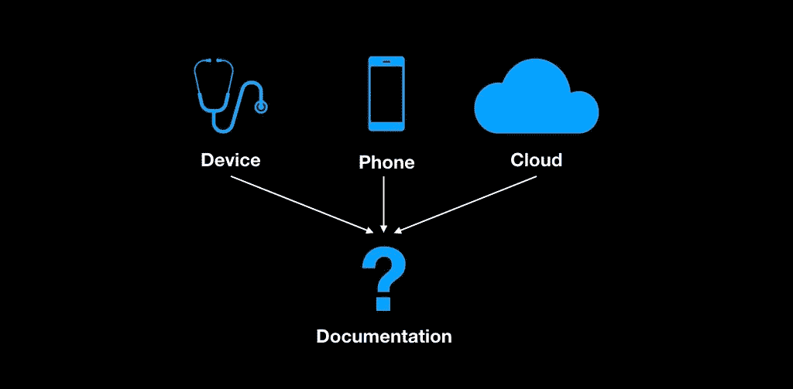
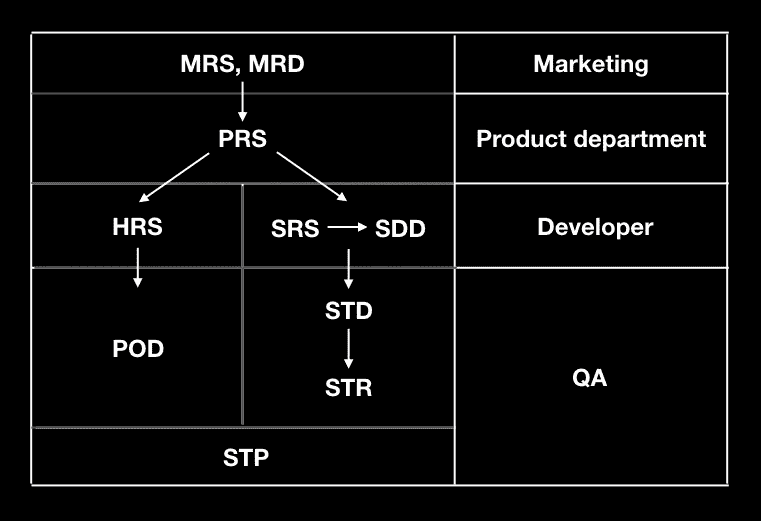

# 软件开发文档

> 原文：<https://medium.datadriveninvestor.com/documentation-at-software-development-9dbec5428eae?source=collection_archive---------2----------------------->

当你听到项目文档时，你会想到什么？有真正投入的人吗？理想吗？程序是否完全完成，有多重要？你是怎么管理的？真的很有趣的问题！我将带您了解这些问题，记住什么是文档以及谁应该对它负责？

首先我们要有一个**夫人** *(营销需求说明书)*或者 **MRD** *(营销需求设计)。*根据他们的兴趣和市场需求，我们希望在市场上看到的产品亮点。这个产品应该由 A、B、C 三部分组成…

产品部门处理 **MRS，**应产生 **PRS** ( *产品需求规格*)。它管理产品的所有步骤，直到最后，只有在清晰和确定之后，它才开始生产和开发。基本问题:颜色、印刷、尺寸或形状是什么？它还包括高亮级别的功能。该部门并不决定发展如何进行；而是只突出写项目的主要目标。也可以注意到机械标准。这意味着如果产品要在北极工作，它应该能承受特别低的温度、压力等等。

# 软件

在 **PRS** 之后，软件工程师现在可以处理它并将其转换为 **SRS** *(软件设计需求)*。例如，如果我们注意到一个绿色 led 比正常情况下多闪烁了 5 次，软件工程师会将这些特征翻译到 **SRS** 中，作为应该立即研究的特征。不管是固件还是软件。

 [## 数据科学和软件工程哪个更有前途？数据驱动的投资者

### 大约一个月前，当我坐在咖啡馆里为一个客户开发网站时，我发现了这个女人…

www.datadriveninvestor.com](https://www.datadriveninvestor.com/2019/01/23/which-is-more-promising-data-science-or-software-engineering/) 

之后 **SRS** 工程师编写**SDD**(软件详细设计)。这与功能的细节设计有关。主要目的是程序之间的联系，并详细解释一些原理和算法。

上面提供的信息解释了软件流程，但是当我们处理机械或硬件时，我们该怎么做呢？

# 五金器具

有时我们可以将文档和软件问题组合成 **SRS** ( *系统需求规格)*，看看是否存在其他组织硬件规格的方式——**HRS***(硬件需求规格)*，之后 QA 提供 **POD** ( *设计证明*)。

# 测试

QA 使用 **SRS** 来编写 **STD** *(软件测试设计)*。没有 **SRS** ，QA 不知道如何开始测试或如何做某事。 **SRS** 的编译允许有 **STD** 和不同的测试流程。这些流程是我们应该在软件中逐步关注的特性(某些动作的延迟、某些 led 的闪烁、任何其他计算)。之后，QA 知道测试什么以及如何测试。结果 QA 生成**STR**(系统测试报告)。

**STR** 是软件发布的证据。例如，当开发人员发布一个版本时，产品所有者等待测试人员的批准，并提供系统的详细状态。如果发现一些错误，QA 会通知 JIRA。开发人员需要更新文档并解决问题，然后提供一个带有备注的版本。此外，如果是新功能，我们需要更新链:

集成软硬件测试的主要文档是 **STP** *(系统测试计划)*。它包括验证和确认测试。验证意味着分别检查组件、设备和服务。当你进行验证时，你是在用整个系统进行验证:产品、软件、云，以展示它是一个完整的系统。有时候验证也包括一个主要任务，比如可用性测试等等…

# 摘要

根据上面解释的信息，我准备了一个表格，其中包含工作流程，说明它如何照常移动:

**感谢阅读！**