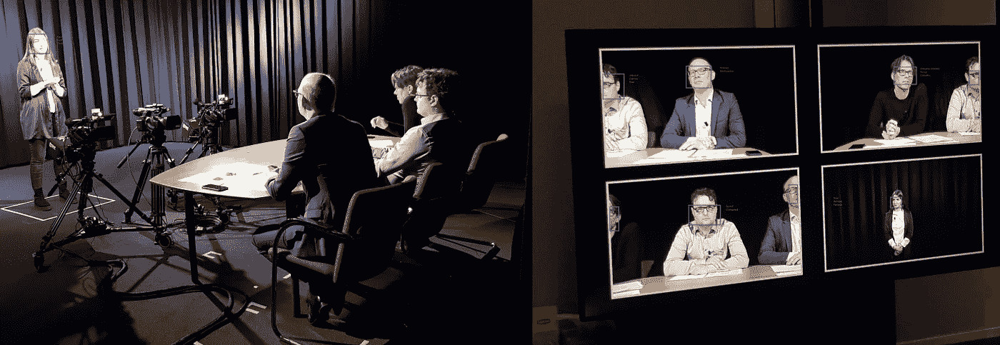
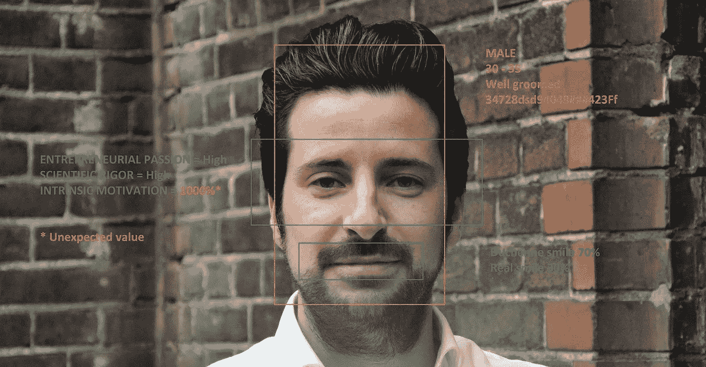

# 完美的音高能预测独角兽吗？

> 原文：<https://medium.datadriveninvestor.com/does-a-perfect-pitch-predict-unicorns-743e0ea97403?source=collection_archive---------7----------------------->

Experiment Lab Setup of the Perfect Pitch. [Werner Liebregts](https://twitter.com/wjliebregts), JADS

## 新企业家研究使用最新的人工智能技术分析广告

数据科学不仅影响行业，还影响研究方法，甚至改变投资技巧。Jheronimus 数据科学院的新研究将无法量化的创业激情量化为创业成功的主要预测因素。

在这篇文章中，我将论证:

1.  应用数据科学方法和技术——例如，机器学习和文本挖掘——将更好地解决传统的创业研究问题
2.  投资者应该接受数据科学将如何让他们变得(甚至更)成功的新方式

## 人工智能带来了更好的研究方法

社会信号处理的新兴数据科学领域(也被称为[计算意义决策](https://hackernoon.com/the-rise-of-computational-sensemaking-bad0d0ff7bea))可以推进对创业背景下决策的研究。为此，你可以考虑企业家做出的决定，以及其他人做出的影响企业家的决定。

我们知道，在人际交往中，某些决定会受到非语言行为的强烈影响。源于手势、姿势、面部和声音表情的行为线索现在可以通过利用人工智能的现代技术来检测和分析。

我们认为，计算意义构建技术比传统的研究方法更有效、更准确，并且可能揭示迄今为止在解释对企业生存和发展至关重要的决策时被忽略的重要因素。

作为概念的证明，我的同事沃纳·利布雷茨(Werner Liebregts)一直在录制创业推介，在这些推介中，初出茅庐的创业者试图向许多投资者传达他们的商业理念。融资决策在一定程度上取决于在推介期间所说的话(例如，关于团队和产品/服务)和所做的事(例如，交付风格)。

在现存的文献中，协同能力、准备程度和创业热情是公认的概念，但通常只是使用主观测量来反映他人的看法。根据这项研究，沃纳目前正在编辑一本实用的教科书，暂定名为*【创业的数据科学】*【即将出版的斯普林格科学+商业媒体】。

Research setup Perfect Pitch: cameras facing entrepreneur and investors.

## 数据驱动的投资者需要拥抱人工智能

除了影响研究本身，任何自尊的数据驱动型投资者都明白新人工智能技术的影响。投资直觉的时代已经过去了。随着人工智能领域的快速发展，投资者很可能也会开始在他们的技术堆栈上竞争。

像沃纳这样有创造力的交叉研究人员将引领企业家精神和投资的发展。这是一个人工智能投资的勇敢新世界。投资者甚至比以前更需要回到学校，熟悉解决同样老问题的新技术。

主观的专业知识在投资中总会有一席之地，但客观的衡量将是预测企业家成功的关键。挑战将是平衡人工智能的超人技能和投资者的超级计算机技能。

预测独角兽的能力令人难以置信。投资领域的任何人都知道，这也将永远是一场运气游戏。但是，通过量化什么是运气，什么不是运气，数据科学研究人员正在挑战当权派，要求他们重新考虑长期以来的假设。

Rising star and JADS Researcher: [Werner Liebregts](http://wernerliebregts.nl/)

在这篇博文中，我的目的是要证明:

1.  应用数据科学方法和技术——例如，机器学习和文本挖掘——将更好地解决传统的创业研究问题
2.  投资者应该接受数据科学将如何让他们变得(甚至更)成功的新方式

你还记得上一次一位才华横溢的企业家向你推销她的想法吗？充满房间的兴奋、期待和纯粹的能量？她是一个有远见的人，还是有点疯狂？(或简单的布谷鸟)你她有毅力坚持到底吗？

下一次推销，考虑带上相机，(别忘了拿一个对准你自己)，让我们看看我们的人工智能能发现什么微妙的线索。让我们的人工智能帮助您确定投资回报，并击败过时的竞争对手。让我们更有效地找到那些塑造明天的企业家。

## 来自 DDI 的相关故事:

 [## 为什么数据会改变投资管理

### 有人称之为“新石油”虽然它与黑金没有什么相似之处，但它的不断商品化…

medium.com](https://medium.com/datadriveninvestor/why-data-will-transform-investment-management-4a60966c1c81)