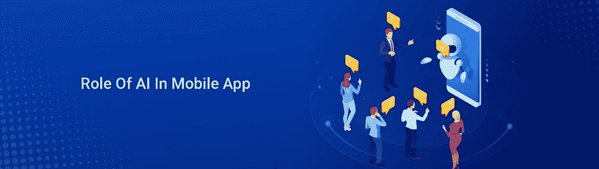

# AI 是否催生了移动应用的新技术时代？

> 原文：<https://medium.datadriveninvestor.com/does-ai-give-birth-to-new-technological-era-in-mobile-application-ecf52034bc61?source=collection_archive---------6----------------------->

Artificial Intelligence(AI)

人工智能的出现为[移动应用开发](https://www.2basetechnologies.com/services/mobile-application-development-company)开辟了一个新时代。很长一段时间以来，移动应用程序开发者通过人工智能在创新方面取得了大量进展。

以苹果的 SIRI 为例。它已经被使用了相当长的一段时间，但它仍然具有改变未来技术革命的巨大潜力。甚至机器学习也在以更快的速度发展，用户需要一种灵活的算法来增强体验。现在，人工智能和机器学习的进步和可用性正在形成一个巨大的进步，特别是在企业、用户和开发者欣赏与移动应用程序交互的方式上。

# **AI 在移动开发和应用中的重要性**

不管你在移动应用程序开发过程中处于什么位置，毫无疑问，人工智能将发挥重要作用。只要想想人工智能的出现，以及它如何影响设备之间的交互和它所释放的可能性。

当用作商业策略时，人工智能有很大的优势。公司很容易理解它的价值，其中大约 [70%的商业领袖](https://emerj.com/partner-content/the-impact-of-ai-on-business-leadership-and-the-modern-workforce/)非常清楚人工智能的优势。它不仅影响深远，而且在机器学习和强大的算法方面也在取得进展。坦率地说，这是使应用程序和用户交互更加有趣的关键因素之一。

# **人工智能如何让移动应用开发变得更好？**

**●带来自动化**

关于人工智能总是有一个主要的误解，那就是它取代了人类分析或设计的要求。坦率地说，它帮助人们做出更好的决定。它所取代的都是可以自动化的东西。

自动推理可以用来解决各种问题。例如，拼车或拼车应用程序使用自动推理。嗯，它会根据该区域的当前数据找出最佳路线。在这里，它不开你的车(嗯，还没有)。

**●提升用户体验&参与度**

与其他[新兴技术趋势](https://www.2basetechnologies.com/best-5-latest-information-technology-trends-in-2020)不同，人工智能已经成为最值得信赖的助手之一，可以根据用户的反应模式和行为让他们参与进来。所以，当它投入行动时，注入人工智能的移动应用程序将能够提取大量用户信息。

一旦信息被提取出来，它将被分析以理解行为模式。这对于改进应用程序非常有价值。此外，AI 甚至可以记录位置并传输数据，从而让你更好地了解用户体验，甚至改进用户体验。

现在，通过人工智能机器人与用户互动的能力，尤其是在出现问题时，用户体验甚至在很大程度上得到了改善。与标准客户服务相比，机器人在这方面做得更好。甚至有人预测，到 2022 年，大约 90%的客户交互将由人工智能驱动。

**●允许应用开发者创造性地编写代码**

人工智能正在创造变化，这是基于应用程序的基础。此外，它在编码时带来了更多的创造力。能够理解利用人工智能的方法的应用程序开发人员将能够很容易地使用独特的代码，这也是在一个可适应的设置中。此外，它甚至会增加开发时间，从而消除手动和耗时的做法。

**●启用个性化**

您知道个性化是移动应用程序开发的一个重要趋势吗？对于用户来说，拥有完全基于他们需求的独特体验是非常重要的。由于人工智能，这是可能的，它提高了用户的参与度。最重要的是，AI 将个人用户体验提升到了一个全新的水平。

任何使用人工智能应用的人都将获得个性化的体验，其推荐基于过去的行为和各种其他因素。现在，如果你正在考虑智能应用的例子，一些主要的例子是 Amazon Go 或 Starbucks Barista。这些类型的应用程序非常关注用户的行为，并预测他们需要做什么，比如询问他们是否愿意下与最近相同的订单。

**●使业务相关**

在人工智能上运行的应用将成为商业的新规范。因此，这意味着你的应用程序需要在业务中汇集数据。在这里，数据是任何想要了解应用程序使用方式的品牌的金矿。现在，这超出了标准算法的范围，因为它们不会提供任何与用户体验相关的洞察。

此外，在 AI 结构上创建的应用程序可以让企业扩展到新产品和新市场。所以，如果你有技术做到这一点，很明显这是一个伟大的投资，将提供大量的回报。

**●促进自然语言**

没有多少人知道移动应用程序和计算机可以交流思想。这是移动应用程序开发的一部分，也是客户服务报告的基本领域。整个过程将导致 AI 从获得的数据中制作文本。所以，如果你的应用想说话，就允许他们分享他们真正知道的东西。

最后，人工智能是移动应用开发的新时代吗？

[人工智能在 app 开发](https://yourstory.com/mystory/42f77c2da4-role-of-ai-artificial-intelligence-in-mobile-app-development-in-2017)中的意义确实是巨大的。它不仅为移动应用提供了强大的功能，还提供了个性化的体验。这里的基本事实是，使用人工智能运行的应用程序，你可以轻松地超越竞争对手。因此，有了这样的应用，你可以通过个性化的内容来提高用户对应用的参与度。