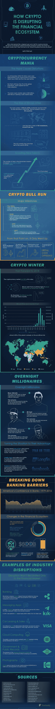

# 加密有能力破坏金融生态系统吗？

> 原文：<https://medium.datadriveninvestor.com/does-crypto-have-the-power-to-disrupt-the-financial-ecosystem-1cb68cf7c331?source=collection_archive---------10----------------------->

Photo by [Micah Williams](https://unsplash.com/@mr_williams_photography?utm_source=medium&utm_medium=referral) on [Unsplash](https://unsplash.com?utm_source=medium&utm_medium=referral)

当[比特币](https://www.datadriveninvestor.com/glossary/bitcoin/)于 2009 年由[中本聪](https://www.datadriveninvestor.com/glossary/satoshi-nakamoto/)创造时，没有多少人知道它是什么或者它对金融界意味着什么。然而，随着比特币相关技术的改进，投资开始增加，这种[加密货币](https://www.datadriveninvestor.com/glossary/cryptocurrency/)在现实世界中的影响力也开始增加。

在短短十年间，BTC 在全世界引起了不小的轰动。这种数字货币改变了各行各业，许多行业仍在努力适应最新的发展。

 [## 科罗拉多州正在成为亲加密法规|数据驱动投资者的领导者

### 科罗拉多州已经成为区块链公司的滋生地和避风港。新任命的…

www.datadriveninvestor.com](https://www.datadriveninvestor.com/2019/03/22/colorado-is-emerging-as-a-leader-in-pro-crypto-regulations/) 

我们今天的问题是加密货币是否有能力扰乱金融生态系统并导致其改变。要回答这个问题，让我们看看下面的 [Fotunly 的](https://fortunly.com/)足智多谋的信息图。

# 真实世界中的加密破坏

谈到加密货币，没有规则可言。整个概念仍然是新的，它正在快速发展，所以很难预测接下来会发生什么。

因此，许多不同的行业都经历了加密带来的破坏。其中一些是积极的，其他的，不太积极。

*   著名的[区块链](https://www.datadriveninvestor.com/glossary/blockchain/)公司在全球跨境交易的改善中发挥了重要作用。这一提升占 2017 年全球交易收入的 27%。
*   **消息应用。首次公开募股(ico)已经成为有前途的初创公司的重要收入来源。2018 年， *Telegram* 在从私人渠道筹集了 17 亿美元后，取消了他们的公开出售代币(上限为 12 亿美元)。**
*   **汽车租赁&销售。**众所周知，汽车租赁是一个极其复杂的过程。[区块链](https://www.datadriveninvestor.com/glossary/blockchain/)可以改变这种情况，将这个过程变成“点击、签名、驾驶”的体验。
*   ****。** [以太坊](https://www.datadriveninvestor.com/glossary/ethereum/)因其执行[智能合约](https://www.datadriveninvestor.com/glossary/smart-contracts/)和 [ASIC](https://www.datadriveninvestor.com/glossary/asic/) 抗[矿](https://www.datadriveninvestor.com/glossary/mining/)的能力，获得了“世界超级计算机”的绰号。**
*   ****政府&公共记录。**这方面的一个例子是特拉华州区块链计划，其目的是减少文书工作和欺诈。**
*   **最后，更普通的领域也不能幸免于加密货币。例如，业内最著名的公司之一，*柯达，*想要推出自己的加密货币 KODAKCoin。他们希望确保摄影师得到公平合理的报酬。**

********

**拥有全球经济、统计和商业管理学位的研究员和作家莉娅·阿西莫维奇说。数据就在我们身边，数据就是知识，知识就是力量。我的道路引导我通过各种不同的话题和主题，从全球金融一直到 IT 和技术。我目前在 fortunly.com，担任内容专员。作为一个喜欢挑战和追求卓越的人，我的最终目标是尽我所能创造一个更好的世界。**

***原载于 2019 年 10 月 8 日 https://www.datadriveninvestor.com**T21*[。](https://www.datadriveninvestor.com/2019/10/08/does-crypto-have-the-power-to-disrupt-the-financial-ecosystem/)**