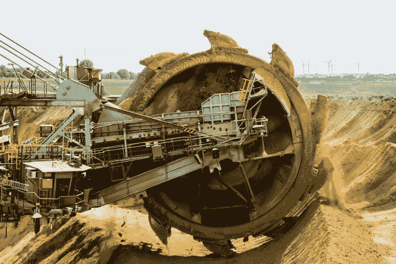

# 纽蒙特黄金公司的金矿开采有报酬吗？—市场疯人院

> 原文：<https://medium.datadriveninvestor.com/does-gold-mining-pay-at-newmont-goldcorp-market-mad-house-c7df1c0a11e4?source=collection_archive---------14----------------------->

我问采金业是否有利可图，因为两家最大的金矿公司纽蒙特矿业公司和黄金公司在一月份合并了。然而，由此产生的公司收入和股价都很低。

事实上，**纽蒙特黄金公司(纽约证券交易所代码:NEM)** 在 2019 年 3 月 30 日录得 18.03 亿美元的季度收入。与此同时，Newmont Goldcorp 的股票在同一天的交易价格为每股 33.61 美元。

 [## 算法交易的机器学习-数据驱动的投资者

### 当你的一个朋友在脸书上传你的新海滩照，平台建议给你的脸加上标签，这是…

www.datadriveninvestor.com](https://www.datadriveninvestor.com/2019/01/30/machine-learning-for-stock-market-investing/) 

因此，投资者会问纽蒙特黄金公司是垃圾还是价值投资？在价值方面，Newmont 在 2019 年 3 月 30 日以 5.71 亿美元的运营现金流和 3.46 亿美元的自由现金流的形式产生了大量现金。

# 纽蒙特黄金公司是价值投资还是垃圾？

在垃圾方面，截至 2019 年 5 月 30 日，Goldcorp 的市值为 261.79 亿美元。然而，由于价格低廉，一些人会将纽蒙特视为便宜货。相应地，2019 年 3 月 30 日，Newmont Goldcorp 报告的毛利为 8.25 亿美元，营业收入为 2.88 亿美元，净收入为 8700 万美元。

除收入外，Newmont Goldcorp 在 2019 年 3 月 31 日拥有 35.45 亿美元的现金和等价物以及 5600 万美元的短期投资。因此，截至上季度末，Newmont 拥有 36.01 亿美元的流动资产。

这些现金使得 Newmont 成为一项潜在的价值投资，因为它的价格很低，而且银行存款很多。一些价值投资者会喜欢 Newmont，因为它是一家廉价且现金充裕的公司。此外，纽蒙特黄金公司提供了一些令人印象深刻的股息。

# 纽蒙特黄金公司可观的股息

最后，Newmont Goldcorp 将于 2019 年 6 月 20 日支付 14₵ a 股的股息。值得注意的是，纽蒙特于 2019 年 5 月 1 日支付了更高的 88₵ a 股红利，并于 2019 年 3 月 21 日支付了 14₵的定期股息。

因此，纽蒙特可以在四个月内支付 1.16 美元的股息。然而，Dividend.com 估计，截至 2019 年 5 月 30 日，纽蒙特的股息率为 1.88%，年化支付率为 56₵，支付率为 45.5%。另外，纽蒙特三年来只支付了股息。

注意:Dividend.com 的数据可能不包括 Goldcorp，因为合并发生在不到六个月前。尽管 Dividend.com 做出了评估，但我认为 NEM 是一只优秀的股息股。

# 金矿公司的价值案例

我对金矿公司的价值主张很简单。这些公司通过通常简单的流程提炼并出售一种基本商品。

然而，人们会为这种商品支付荒谬的价格。例如，Kitco 估计，2019 年 6 月 3 日，黄金交易价格为每盎司 1，324.50 美元和每公斤 42，583.66 美元。

因此，即使金价很低，Newmont Goldcorp 也能赚钱。澄清一下，纽蒙特黄金公司通过出售黄金赚钱。然而，开采黄金是一个相当简单、有时甚至是廉价的过程。现代重型机械允许少数人挖掘大量的黄金，以支付工资、设备租赁和柴油燃料的费用。

此外，纽蒙特矿业公司的产品；白银和黄金可以迅速变现。因此，它通常能产生稳定的现金流。

# 金矿工人的垃圾箱子

金矿公司的垃圾股案例是，这些公司的利润依赖于一种交易量很大的大宗商品:黄金。

那个商品；此外，美国有着非理性价格波动、繁荣、泡沫和崩溃的悠久历史。据 Macrotrends 估计，经通胀调整后，1980 年 1 月，黄金价格创下了 104 年来的最高纪录，为每盎司 2227.13 美元。与此同时，我能找到的最低金价是 1970 年 1 月的每盎司 239.58 美元。

从积极的一面来看，像纽蒙特这样的矿商在金价较低时仍能赚钱。消极的是，底部可能会脱离黄金，减少纽蒙特的利润。

# 黄金预示市场不稳定吗？

此外，许多外部因素会影响黄金价格，包括石油成本、政治局势、通货膨胀以及市场对整体经济的情绪。由于许多人错误地将黄金视为“安全”资产，其价格在经济不景气时上涨，在经济景气时下跌。

有趣的是，黄金价格可以作为市场情绪的指标。值得注意的是，黄金在 1934 年大萧条期间飙升至 657.65 美元，在 20 世纪 60 年代的繁荣时期跌至 274.25 美元。

因此，今天的黄金价格下跌；2019 年 2 月，该金属的交易价格为 1，340 美元，表明市场稳定。低金价通常表明低通胀和对股票、债券、房地产和法定货币等替代品的强烈信心。我的理论是，人们出售黄金来购买回报更高的替代品，其价格很低。

此外，非理性的态度扭曲了黄金价格，因为有少数人对黄金有强烈的信心。所谓的黄金投资者会购买黄金并持有，不管它的价格如何。因此，当黄金价格便宜时，黄金爱好者会通过购买和囤积黄金来抬高价格。

# 远离金矿股票

因此，聪明的价值投资者会远离黄金本身，而是考虑黄金矿商。如果你将黄金矿业公司视为廉价但风险价值高或有股息收入的股票，你可以从中赚钱。

然而，任何与黄金相关的投资都可能失去其全部价值。因此，只有现金充裕、风险容忍度高的人才应该持有黄金矿业股票。如果你输不起钱，就远离金矿。

*原载于 2019 年 6 月 3 日*[*【https://marketmadhouse.com】*](https://marketmadhouse.com/does-gold-mining-pay-at-newmont-goldcorp/)*。*