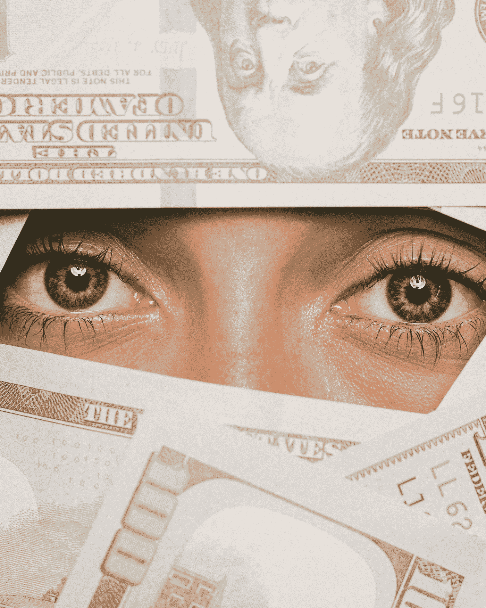

# 迷恋金钱有好处吗？

> 原文：<https://medium.datadriveninvestor.com/does-it-pay-to-be-obsessed-with-money-4d50954055cb?source=collection_archive---------10----------------------->

Photo by [Wei Ding](https://unsplash.com/@weiding22?utm_source=medium&utm_medium=referral) on [Unsplash](https://unsplash.com?utm_source=medium&utm_medium=referral)

*钱，钱，钱，永远阳光灿烂，在有钱人的世界里。如果是 ABBA 唱的，有可能是不真实的吗？*

在我的[上一篇文章](https://www.moneyonthemind.org/post/mental-health-and-money)中，我重点关注了金钱的负面影响，主要是缺乏金钱对心理健康的影响。正如荷兰谚语所说:你的钱可能还剩下太多的月份。一点也不奇怪，剩下太多的月份会带来压力。压力对心理健康的长期影响是众所周知的，而且并不乐观。

然而，还有其他方式可以让你受金钱的束缚，而且不需要缺钱。不，相反，他们要求你一开始就有钱。但是，伙计，这些强迫性的行为剥夺了有钱和花钱的所有乐趣。

 [## 更好的预算，打造更大的|数据驱动型投资者

### 即使是专家也承认它们并不完美。从 1 到 10 的范围内，安东尼·科普曼和德尔…

www.datadriveninvestor.com](https://www.datadriveninvestor.com/2018/11/08/budget-better-to-build-bigger/) 

## 搜罗便宜货的人

就像一只嗅着气味的狗。我可以想象 Kommissar Rex 在廉价商店里追捕罪犯。

我一个好朋友的爸爸也有这方面的诀窍，尽管他坚持去普通商店。当去杂货店购物时，他确切地知道哪里有什么打折，以及什么是最便宜的。但它来了:杂货店往往有不同的交易，使不同的东西突然比其他地方已经最便宜的选项更便宜。现在你做什么？你有没有计算出一个总的总数，然后选择一个得分最高，价格最低的商店？当然不是。他只是去所有的商店。从商店 1 开始，他根据他的特价商品清单挑选他需要的东西，然后移动到下一个商店，继续下去，直到清单完成，所有的特价商品都有了。这是最合理的推理。

请记住，我们也应该重视时间。加上往返不同商店的所有额外时间，他真的得到了最好的交易吗？据他所说，也许是。据我说？我会跳过这一个。

## 被钱包勒死

即使这需要很多(或者只是他妈的一吨)时间，大多数讨价还价的猎人最终还是对他们的购买和他们自己感到满意。没有造成真正的伤害，我们继续前进。它甚至可能成为一些有趣的故事。他们是金融痴迷的怪胎。我接下来要描述的这群人并不古怪，关于他们也不会有什么有趣的故事。他们更像是受虐狂。

为什么他们是受虐狂？因为他们没完没了地追踪自己的支出。很可能他们不使用现金，而是专门用卡来跟踪每一分钱。我不骗你。现在你可能在想，那又怎样？如果有人在周末检查他们的财务状况，那是他们的事。见鬼，即使他们每天都这样做只是为了确定，那也不算古怪，不是吗？但我说的是痴迷。我不是说一周一次，也不是一天一次。我说的是每次购买后。好像有人一直密切关注这个问题，却不能正确地更新他们的心理平衡。

如果你的预算有限，我可以想象这可能会有所帮助，也是必要的。这与付出的痛苦有关。当你买东西的时候，你会有负面的感觉(因为“失去”了你用来交换的钱)。现在，这种情况发生在购物过程中，但是谁说在通过你的网上银行账户重新体验后就不会发生呢？再看看它，再看看你所花的钱，这些钱并没有因为你所买的任何东西所带来的即时快乐而减轻，我可以想象你所感受到的痛苦。人们或许可以利用这一工具来抑制未来的支出，因为没有人喜欢反复感受痛苦。

正因为有了这种方法，人们往往会比不跟踪自己的支出并感受到痛苦时少花很多钱。但如果没必要，为什么要做呢？即使是略有必要，为什么还要不断地做？！你需要在每次购买后造成痛苦吗？每买一块口香糖之后？

我是说考虑一下。想想你自己的银行对账单。这些东西充斥着小额支出(以及一些大额支出)。想象一下 ALLL 的痛苦。就你的财务状况而言，你应该给自己施加多少痛苦是有限度的……有人能把这变成法律吗？！

为什么这种行为一点帮助都没有，即使是在预算之内，是因为过了一段时间后，你对(这种类型的)疼痛完全麻木了。它只会带来伤害，而不是改变你的行为，如果它还没有发生的话。我怎么知道这个？简单调理。还有，我也这样对自己。我仍然是一个挥霍者。紧身衣当心！

## 饥饿的毛毛虫

大家的第一(也是最爱！)小时候的书:饥饿的毛毛虫。或者在荷兰语中，Rupsje nooit genoeg *(小毛毛虫永远不够)。*而上帝也同样适用于人。

他们不会因为需要钱而积累钱。因为他们缺乏。不，他们渴望它。他们希望看到他们(许多)银行账户上的数字上升。向上。穿过屋顶。这永远不够。正是这些类型的人放弃了任何其他不赚钱的活动。这些是你在电视剧中看到的人:成功但太忙的妈妈，不能和儿子说话的爸爸，因为工作的原因，他已经几十年没有和儿子真正交谈过了。因为从来没有真正在你身边。

这种痴迷有一个问题，因为这种痴迷通常有一个实际的基础:许多人最初是因为需要钱而开始这种行为的。来自贫困背景、现在不得不供养他人的人很容易落入这个陷阱。他们知道没有钱的生活，他们知道钱能买到多少东西。但它买不到爱，也买不到时间。当你又发了一笔财，却没有看到你的孩子长大，或者失去了与你的配偶、朋友和家人的联系时，这是值得考虑的事情。

即使除了他们自己没有人可以养活，永远不再贫穷的愿望也可以成为工作到死的巨大动力。但是也许另一件事要记住:当你死的时候，你不能带走它…

## 两只眼睛都盯着股票

可以说，我将要描述的这类人只是一种不同类型的毛毛虫。

如果你已经在股票上投入了(大量)资金，并且有一个跟踪股票的可爱应用程序，我希望你不会轻易上瘾。因为收益的高潮和损失的低谷可以比作一针海洛因。买家当心。

我认为这种行为是过度交易的主要影响因素之一。我们想摆脱输家，买更多的赢家。光是交易成本就超过了收益，无法弥补损失。你确定你在淘汰失败者吗？这种类型的行为也导致了现在著名的性格效应。表明我们抓住输家不放，希望挽回损失，卖出赢家以确保获利。我们过于关注短期发展，因此看不到更大的趋势。所以，记住这一点。删除 app，不要日常查看。否则会让你付出代价。

尽管我有一个名为“头脑中的金钱”的博客，但我并不具备痴迷的资格。我不会计算每一笔支出，也不会为了讨价还价而花费大量的旅行时间，而且我的工资太低，不可能积累很多。关于股票，我主要相信我的顾问(嗨爸爸)，所以我不会发疯。

所以是的，我并不总是想着钱。虽然我很欣赏你，亲爱的读者，你也不应该。请去想别的事情吧！

【moneyonthemind.org】本文原载于