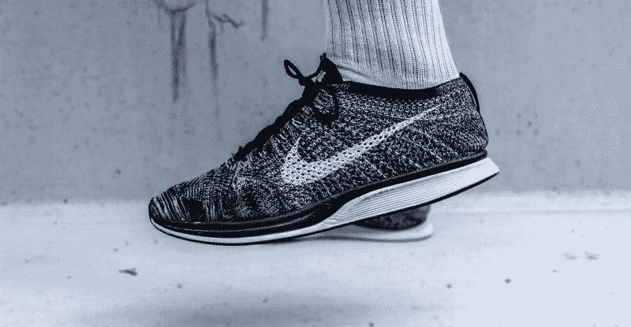
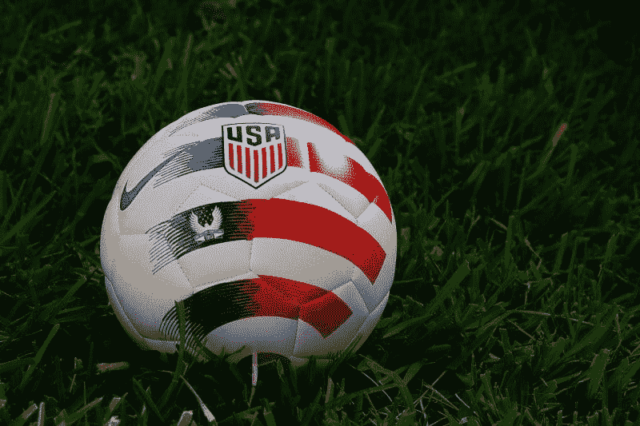
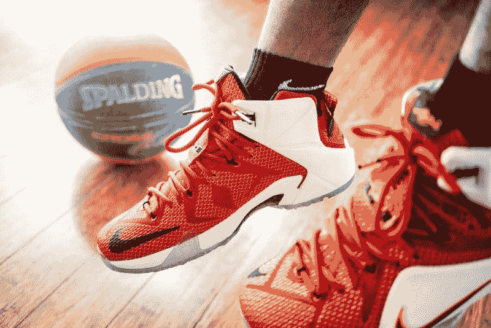

# 耐克赚钱吗？—市场疯人院

> 原文：<https://medium.datadriveninvestor.com/does-nike-make-money-market-mad-house-1ebb2585d77?source=collection_archive---------20----------------------->

是时候问问耐克公司是否因为与有争议的四分卫科林·卡佩尼克的关系而获得免费宣传而赚钱了。

奇怪的是，耐克(纽约证券交易所股票代码:NKE) 因为凯珀尼克的投诉，推出了带有美国独立战争旗帜的鞋子。美联社[报道](https://www.pbs.org/newshour/nation/why-nike-pulled-betsy-ross-flag-shoes-after-kaepernick-criticism)，确切地说，Kaepernick 认为这些鞋子是种族主义的，因为许多美国开国元勋都是奴隶主。

 [## 值得购买的 4 大人工智能股票及其原因|数据驱动型投资者

### 人工智能(AI)在 2019 年继续进入大众意识。通过应用程序…

www.datadriveninvestor.com](https://www.datadriveninvestor.com/2019/03/06/top-4-artificial-intelligence-stocks-to-buy-and-why/) 

# 耐克与科林·卡佩尼克的奇怪关系

旗帜飘扬只是围绕耐克和凯珀尼克的最新争议。这家制鞋商去年开始使用 Kaepernick 作为广告活动的代言人。这一行动令人惊讶，因为 Kaepernick 自 2016 年以来就没有参加过美国国家橄榄球联盟(NFL)的比赛。

[Kaepernick](https://www.nytimes.com/2019/02/15/sports/nfl-colin-kaepernick-protests-timeline.html) 声称没有 NFL 球队会雇佣他，因为他跪下了；或者在 2016 年播放美国国歌以示抗议时拒绝起立。澄清一下，Kaepernick 和其他人抗议警察枪杀非洲裔美国人。然而，包括唐纳德·j·特朗普总统(纽约州共和党)在内的许多美国人认为凯珀尼克的行为不爱国。

2017 年，Kaepernick 对 NFL 提出申诉，他声称球队老板密谋不让他参加比赛。有趣的是，*纽约时报*报道称，NFL 在 2019 年 2 月与 Kaepernick 和队友 Eric Reid 秘密和解。该协议的细节不得而知。

# 凯珀尼克之争是一个高明的营销策略吗？

耐克使用 Kaepernick 作为品牌大使是一个辉煌的营销策略。数百家新闻媒体提到了耐克的新系列运动鞋，并展示了因革命战争旗帜争议而引起争议的鞋子的照片。

此外，愤世嫉俗的人会注意到，这场争议发生在美国国庆节前夕；七月四日。例如，许多关于争议的新闻报道出现在 2019 年 7 月 3 日。因此，凯珀尼克的行动似乎是为了利用新闻周期。

此外，耐克正在利用科林·卡佩尼克品牌吸引年轻人，尤其是年轻的有色人种。值得注意的是，年轻的有色人种可能会积极参加体育活动，并成为凯珀尼克的粉丝。

# 凯珀尼克评论家如何给耐克免费广告

此外，像唐纳德·j·特朗普总统(R-New York)这样的 Kaepernick 批评者通过攻击四分卫给耐克提供了大量免费宣传。Twitter 计算出，真实的唐纳德·j·特朗普在 2019 年 7 月 8 日拥有 6180 万 Twitter 粉丝。

因此，特朗普关于耐克和凯珀尼克的推文可能会影响到近 6200 万人。此外，凯珀尼克本人拥有 235 万推特粉丝。

其他名人 Kaepernick 评论家，如乡村音乐明星约翰里奇产生更多的宣传与他们的行动。有钱；例如，在推特上向他的 212，000 名推特粉丝发布了耐克袜子被毁的照片。

因此，特朗普和里奇等凯珀尼克的憎恨者正在给耐克做免费广告。此外，这个广告可能价值数百万美元。例如，里奇向 212，000 名粉丝介绍了耐克袜子，甚至展示了它们的照片。

# 雇佣 Kaepernick 是一个绝妙的营销策略

与此同时，特朗普对凯珀尼克的攻击可能会提高耐克在 54%不赞成总统的美国人中的地位。详细来说，盖洛普[估计](https://news.gallup.com/poll/259871/trump-approval-remains-low-40s.aspx) 54%的美国人不赞成特朗普的表现，44%的美国人强烈反对特朗普。另外，只有 41%的美国人支持总统。

因此，大多数美国人会同情凯珀尼克。在这种情况下，雇佣 Kaepernick 对耐克来说是一个绝妙的营销策略。

奇怪的是，我认为特朗普知道这一点，但并不在乎，因为他得到了所有免费的宣传。特别是，总统可以在不显得明显种族主义的情况下吸引反黑人选民。

因此，雇佣 Kaepernick 对耐克来说是一个绝妙的营销策略。特别是，耐克可以利用特朗普产生的所有宣传和争议，而不必与总统交往。相反，耐克可以将自己描绘成一个捍卫自由、反对种族主义恶霸特朗普的英雄。

另一方面，耐克承担的风险很小，因为大多数人不想帮助特朗普。此外，即使是凯珀尼克的批评者也不愿意攻击耐克，因为他们不想被贴上种族主义者、言论自由的敌人和非美国人的标签。

# 耐克是一个伟大的品牌

凯珀尼克的争议证明，耐克是一个伟大的品牌，拥有出色的管理，了解现代营销的动态。

Statista [估计](https://www.statista.com/statistics/632210/nike-brand-value/)耐克的品牌价值从 2018 年的 280.3 亿美元增长到 2019 年的 324.21 亿美元。因此，凯珀尼克可以为耐克品牌增加 43.91 亿美元的价值。

鉴于这段历史，**耐克(纽约证券交易所:NKE)** 是一只成长型股票，因为管理层知道如何创造品牌价值。然而，愤世嫉俗的人会注意到，迟早 Kaepernick 的争议会消退。例如，如果特朗普输掉明年的总统大选并离开白宫，耐克可能会失去价值。

相反，从现在到 2020 年 11 月，耐克可以获得价值数千万美元的免费宣传。具体来说，特朗普可以用几十条推文和原声片段宣传凯珀尼克和耐克，而耐克不会为此付出任何代价。媒体会通过重复几十次或几百次来放大这些推文和声音片段。

并非巧合的是，最新的 Kaepernick 争议开始于 Trump 于 2019 年 6 月 18 日发起连任竞选不到两周之后。愤世嫉俗者会怀疑耐克是否试图在总统竞选中获利。此外，国旗争议在第一轮民主党总统候选人辩论后不到一周就开始了。

# 耐克赚钱了吗？

耐克是一个伟大的品牌，拥有出色的营销组织，但价值投资者会问，它赚钱了吗？

目前，答案是肯定的。2019 年 2 月 28 日，耐克报告的毛利为 43.39 亿美元，收入为 96.61 亿美元。而且耐克当天公布的营业收入为 12.48 亿美元，净收入为 11.01 亿美元。

重要的是，耐克的收入正在增长。例如，耐克报告截至 2019 年 2 月 28 日的季度收入增长率为 6.98%。因此，耐克奇怪的营销策略正在发挥作用，并促进公司业务的发展。

此外，耐克正从其奇异的营销努力中获得现金。截至 2019 年 2 月 28 日，耐克报告的自由现金流为 8.53 亿美元，投资现金流为 1.24 亿美元，运营现金流为 10.68 亿美元。

因此，耐克在同一天拥有 36.95 亿美元的现金和等价物，以及 3.51 亿美元的短期投资。因此，耐克在 2019 年 2 月 28 日拥有 40.46 亿美元的流动资产。对于一个消费品牌来说，这是一大笔钱。

# 耐克是价值投资吗？

在这种情况下，我认为耐克是一项价值投资。具体来说，我认为市场先生在 2019 年 7 月 8 日低估了耐克每股 88.48 美元的价格。

我认为，耐克的增长潜力可能会让该股再值 20 或 30 美元，因为过去一年品牌价值不断上升。特别是，耐克是在后电视社会媒体世界中找到营销和品牌的消费品牌之一。

特别是，耐克正通过社交媒体成功而廉价地营销其产品。此外，耐克出色地利用了社会和政治变化来增加销售额，赚更多的钱。

因此，耐克是一个价值投资，因为它目前的营销才华。特别是，耐克已经想出了如何迫使像亚马逊这样的零售巨头销售其产品。

我认为亚马逊会销售耐克产品，因为它希望该品牌的出现能为其网站带来额外的流量。其他零售商如**沃尔玛(纽约证券交易所:WMT)** 将会跟进以引起关注。

# 耐克是一只很好的分红股票

因此，耐克既是一种增长，也是一种价值投资。然而**耐克(纽约证券交易所代码:NKE)** 也是一只令人印象深刻的分红股票。

耐克股东在 2019 年 7 月 1 日享受了 22₵股息，因为他们读到了最新的 Kaepernick 宣传噱头。此外，2019 年 2₵的股息增长了 10%，从 2018 年 10 月 1 日的 20₵上升到 2019 年 4 月 1 日的 22₵。

据 Dividend.com 报道，总体而言，截至 2019 年 7 月 8 日，耐克股东的股息率为 0.99%，年化支付率为 88₵，支付率为 33.5%。然而，股息仅增长了短短一年。

因此，在不断变化的零售环境和社交媒体革命中，耐克是一只非常值得投资的股票。科林·卡佩尼克事件表明耐克知道如何在 21 世纪营销其产品。我认为光是营销能力就给耐克增加了几十亿美元的价值。

*原载于 2019 年 7 月 8 日*[*https://marketmadhouse.com*](https://marketmadhouse.com/does-nike-make-money/)*。*