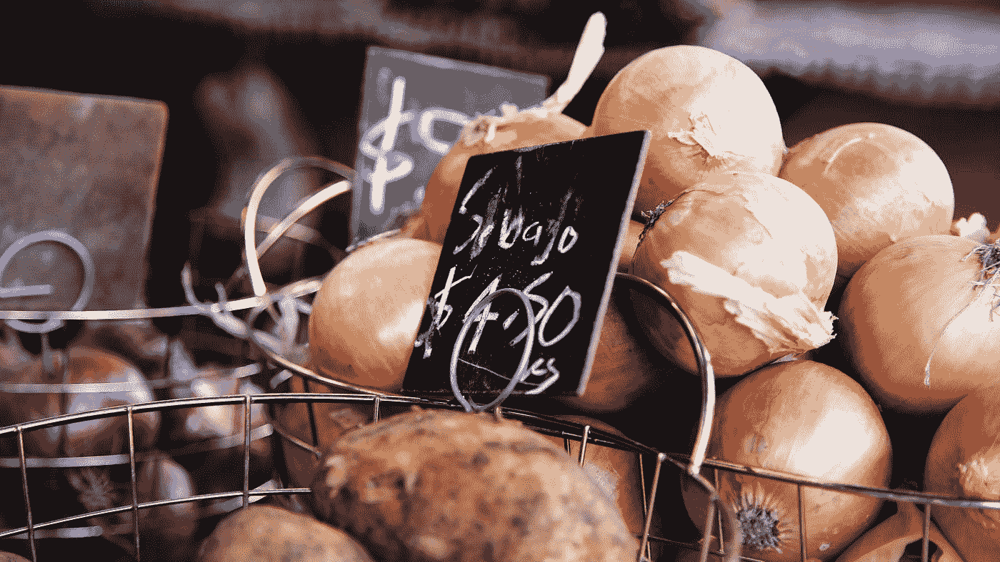

# 价格代表质量吗？

> 原文：<https://medium.datadriveninvestor.com/does-price-signal-quality-cbfd1bc483c6?source=collection_archive---------8----------------------->

Photo by [Caroline Attwood](https://unsplash.com/@carolineattwood?utm_source=medium&utm_medium=referral) on [Unsplash](https://unsplash.com?utm_source=medium&utm_medium=referral)

价格越高，你得到的东西质量越好。对大多数人来说，这似乎是一个完全的事实。当然，我刚刚花了 900 美元买的手机会比我只花了 600 美元买的手机好。现在我心中有两款特定的手机:iPhone 9 和 OnePlus 6。我并不想在这里挑起战争，但这 300 美元的差异绝不仅仅是质量上的。我也不得不承认，这些价格充其量只是猜测，但你明白我的意思。

我们意识到，这里起作用的不仅仅是质量。当你购买任何一种苹果产品时，你主要购买的是它的名字，而不是它的许多质量上很好的产品(？)特点。你正在购买一代人的形象。好吧。如果那是你的事，那就去做吧。但是许多苹果脑袋用来证明他们购买的理由与品牌无关，完全与质量有关。他们买苹果是因为:“这是最好的。”亲爱的主啊，它不是。但除此之外，你如何证明自己花了那么多钱是合理的呢？

 [## 为什么包容性财富指数比 GDP 更能衡量社会进步？|数据驱动…

### 你不需要成为一个经济奇才或金融大师就能知道 GDP 的定义。即使你从未拿过 ECON 奖…

www.datadriveninvestor.com](https://www.datadriveninvestor.com/2019/03/08/why-inclusive-wealth-index-is-a-better-measure-of-societal-progress-than-gdp/) 

人们普遍认为，供应商或生产商索要高价是有道理的。这个理由是，该产品是罕见的优秀。它比所有其他“据称”与之竞争的产品质量都高。我们经常听到这个借口。我们听到一个故事，说这个产品比其他任何产品都好。它来自世界上一个充满异国情调的地方，那里只有同类中最好的才来自那里。它是由最好的 ______ 制成的，你可以填充任何材料。

我确信质量和价格之间的关系曾经是恰当的。因此，我们开发了启发式规则:价格=质量。把低价和低质量联系起来，把高价和高质量联系起来。甚至可能从来没有这样的实际关系，这只是一个营销策略。结果，那些落入陷阱的人告诉自己，也可能告诉其他人，他们拥有的更好，质量更高，支付的更高价格是合理的。无论是什么故事，正如我刚才所说，无缝假设价格质量关系是一种启发。这些并不总是正确的。

我所知道的关于价格和质量联系的最大的例子是在我的行为经济学课上我被多次告知的一个例子。硕士学位。这是一个关于收费 0 美元与收费约 2000 美元，请记住，这是在澳大利亚元，如果这关系到你。参加政府组织的商业或创业课程收取两种不同的费用。澳大利亚政府见证了企业家的迅速崛起和衰落，其中大多数很快就倒闭了。由于创业活动对一个国家的经济非常重要，政府确定了主要问题，并围绕这些问题设计了一门课程，教导个人如何成为更成功的企业家。我个人认为澳大利亚政府非常好，这是一个双赢的局面，尤其是这个课程是免费提供的。但有一个问题，没人想要它。

澳大利亚政府对此感到困惑。他们发现了一个问题，现在提出了一个解决方案，但是没有人接受？但是怎么做呢？！团队中的某个人一定是行为科学家，或者只是一个机会主义者，并且决定只对同样的课程收费是一个好主意，不做其他改变。成功了。突然间，申请如潮水般涌来。当收费 2000 美元时，这门课程被认为是值得的。当收费为 0 美元时，课程被认为价值较低。毕竟，免费得到的东西怎么可能真的有用呢？我们免费得到的东西往往是一些零零碎碎的东西，它们就放在房子周围，把这个地方弄得乱七八糟。我说的对吗？

因此收取(更多)费用会有所帮助。销售者可以给产品一种卓越的氛围和更高的质量。买家会被一些真正的好东西所诱惑，然后付钱。但反过来也一样。如果由于不同的生产成本，一个公司不能提供有竞争力的市场价格，他们需要能够以不同的方式营销他们的产品。因为没有人会在没有任何正当理由的情况下为同样的产品多付钱。对吗？

价格绝对不是质量信号的另一个背景是服装。我的意思是去不同的服装店看看。H&M 以其“快速时尚”而闻名，这并不是一件好事。一件人造革夹克他们会收你 40 欧元。现在，当我走进 Zara 时，是同样的夹克，但价格是 80 欧元。如果我往上走，同样的夹克只会变得更贵，就是这样。如果你认为我在撒谎，那就给自己找一部关于快速时尚的纪录片，向你展示每个细分市场是如何运作的。我向你保证，看完之后，你会同意我的观点，不仅仅是 H&M 应该得到他们得到的坏名声。至少在某种程度上，他们对产品的价格是诚实的…..

即使是昂贵的“高质量”商店也不愿意在国外廉价生产服装，在不道德的情况下，剥削员工和生产者(取决于资源)，仅仅因为他们的加价就增加高价。那件夹克实际上是同样的夹克，有着同样的道德上有问题的工艺。没有质量差异，只是加价和营销差异。我不会为那头公牛付钱的--。

这篇文章并不是说价格和质量之间没有关系。经常会有。但这可能需要比你最初预期更多的研究。仅仅因为东西更贵并不能使它们更好。问问自己花钱买的是什么:功能、审美、品牌名称(口碑)、物质价值等。你是否为产品中所有额外的细节和关注付出了代价？或者你是在为其营销活动中的额外细节和关注付费吗？这是一个很大的区别。谈到营销活动，在接下来的文章中，我们将讨论一个我称之为“虚假稀缺”的现象在这种情况下，产品或服务要么独家提供，要么根本不提供。对于正在找工作的人来说是很好的信息，或者只是一般的谈判技巧！

*你可以找到这篇文章中使用的参考资料，以及更多关于* [*【金钱上的头脑】*](https://www.moneyonthemind.org/blog) 的精彩文章