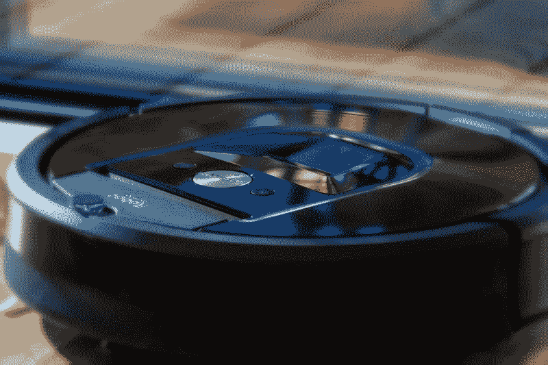
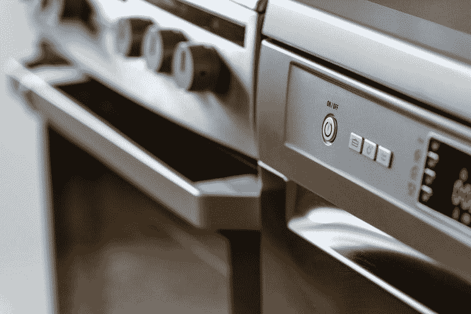

# 租赁中心赚钱吗？—市场疯人院

> 原文：<https://medium.datadriveninvestor.com/does-rent-a-center-make-money-market-mad-house-55968e3ea403?source=collection_archive---------5----------------------->

美国现场的观察者会问，租中心赚钱吗？这个问题之所以相关，是因为 **Rent-a-Center(纳斯达克股票代码:RCII)** 是一家底层零售商，严重暴露于收入不平等和工资停滞。

租赁中心通过分期付款的方式销售电子产品、家具和其他物品来产生现金流并赚钱。然而，租赁中心称其分期付款为“租金”，并按周收费。此外，租赁中心允许顾客随时归还物品。

这使得租赁中心可以以更高的价格向任何有意向的人出售更高质量的商品。此外，在现代美国，经济条件为这种商业模式创造了不断增长的客户基础。

# 租赁中心如何从美国运转不良的经济中获利

像租赁中心这样的零售商从越来越不正常的美国经济中获利，美国经济为普通美国人提供越来越少的钱。

例如，人均收入的中位数；美国人口普查局[估计，2013 年至 2017 年间，美国人平均年收入为 31177 美元。此外，同期家庭收入中位数为 57，652 美元。](https://marketmadhouse.com/can-basic-income-save-the-american-dream/)

最后，越来越少的美国人加入了劳动力大军。*交易经济学* [估算](https://tradingeconomics.com/united-states/labor-force-participation-rate)美国劳动力参与率 2010 年为 64.5%，2019 年 5 月为 62.8%。澄清一下，劳动力参与率是通过工作或寻找工作参与平民就业市场的美国人的数量。

相比之下，失业率是失业的美国人积极寻找工作的数量。*天平* [估计](https://www.thebalance.com/labor-force-participation-rate-formula-and-examples-3305805)美国劳动力参与率在 2000 年 1 月达到 67.3%的峰值。

# 租赁中心从“无工作经济”中获利

因此，数百万美国人破产，其中许多人不再工作。我认为租赁中心很适合在这些发展中获利。

解释一下，大量的美国人不能通过信用检查，因为他们破产了，没有工作。然而，租赁中心拒绝运行信用检查，所以它可以出售给这些人。

这些人中的许多人从政府福利中获得一些现金，如社会保障补充保障收入(SSI)、零工经济、自营职业和私下工作。

社会保障局估计，2019 年 5 月，有 1354.6 万美国人正在接受 SSI。解释一下，SSI 是美国政府针对 65 岁以下残疾人的基本收入计划。

同时，超过三分之一的人；或 5700 万美国人，在不稳定的低薪零工经济中工作，TJ 麦库埃[在*福布斯*估计](https://marketmadhouse.com/does-rent-a-center-make-money/#2d9203ef7118)。[零工经济](https://jobble.com/45-eye-popping-stats-about-the-gig-economy/)包括自由职业者、骑手驾驶(优步)、送货驾驶(Instacart 和 GrubHub)，以及像 UpWork 和亚马逊土耳其这样的在线平台。

然而，零工经济工人的钱很少。摩根大通研究所[估计【2018 年 3 月零工经济的平均月薪为 827 美元。](https://www.jpmorganchase.com/corporate/institute/report-ope-2018.htm)

# 租赁中心能赚钱吗？

这样的数字解释了为什么租赁中心可以在全美 50 个州、加拿大部分地区、波多黎各和哥伦比亚地区经营超过 3000 家商店。

然而，租赁中心并没有从所有这些租赁店赚到多少钱。例如，截至 2019 年 3 月 31 日，Rent-a-Center 报告的收入为 6.9669 亿美元，毛利为 4.2487 亿美元，营业收入为 1735 万美元，净收入为 732 万美元。

有趣的是，在截至 2019 年 3 月的季度中，Rent-A-Center 的收入增长率下降了-0.19%。此外，租赁中心的业务很少产生现金。

具体而言，截至 2019 年 3 月 31 日，Rent-A-Center 的运营现金流为 7578 万美元，投资现金流为 597 万美元，融资现金流为 41，000 美元，自由现金流为 8174 万美元。因此，租赁中心在 2019 年 3 月 31 日拥有 2.3774 亿美元的现金及等价物。

我认为租赁中心证明了公司不能从没有工作的经济中赚钱。美国可能需要重大的经济改革来为经济和企业增长提供资金。

# 租赁中心是一项价值投资吗？

总之，我认为**租赁中心(纳斯达克代码:RCII)** 是一只糟糕的股票。例如，自 2017 年 7 月以来，它一直没有支付股息。根据记录，租赁中心投资者于 2017 年 7 月 20 日收到了 8₵股息。

此外，我得出结论，市场先生在 2019 年 6 月 14 日将租赁中心的价格严重高估至 25.90 美元。因此，精明的投资者应该避开“租赁中心”股票。

*(免责声明:文章所表达的观点和看法仅属于作者，不一定反映 DDI 的立场。这篇文章无意成为投资建议。)*

*原载于 2019 年 6 月 14 日*[*【https://marketmadhouse.com】*](https://marketmadhouse.com/does-rent-a-center-make-money/)*。*