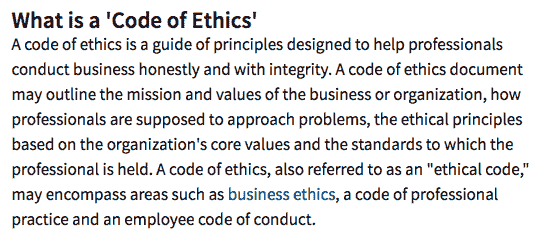
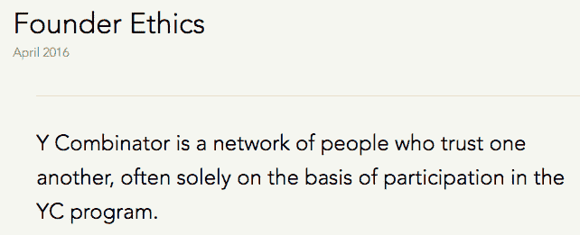
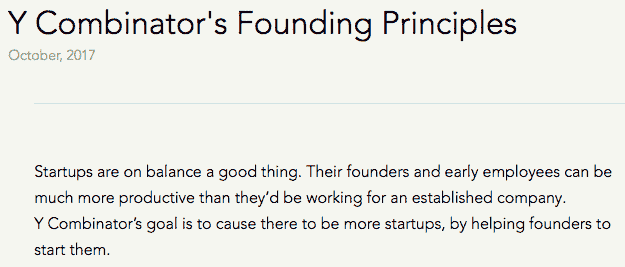
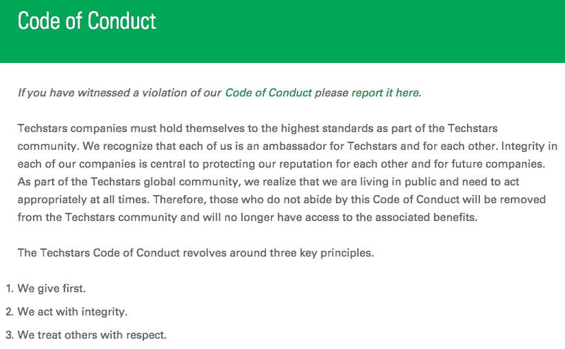
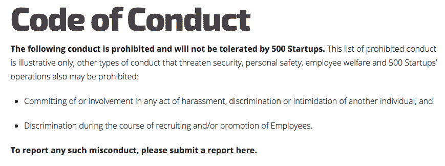

# 硅谷需要道德准则吗？

> 原文：<https://medium.datadriveninvestor.com/does-silicon-valley-need-a-code-of-ethics-1bb3b6a0ac00?source=collection_archive---------0----------------------->

想象一下，你是一名研究生，全身心地投入到一个可以帮助改变世界的想法中。你努力说服你的同事和你一起工作，成立一家公司。

你听说过这个伟大的孵化器，它会帮助你把你的想法推向市场，承诺给你导师和一点资本。他们只要求你提交一份推介材料并填写一份申请表，这样他们就能知道你是否适合他们的产品组合。

你努力收集材料并按下，提交…

现在你等着。

在后端，孵化器正在审查你的材料，他们看到了一个伟大的想法。这对于他们目前投资组合中的一家公司来说再好不过了，这家公司一直在努力让自己的技术起步。

现在孵化器有几条路可以走:

*   **好:**让你加入并帮助培育你的初创公司，这样他们就有可能在五到十年后实现稳定的投资回报。
*   **好:**帮助他们与目前的投资组合公司达成合作协议，这样你的团队可以获得一些早期现金注入，并获得你的第一个客户，从而帮助他们陷入困境的投资组合公司。
*   坏消息:与苦苦挣扎的投资组合公司分享你的想法，告诉你你的想法是垃圾，怀疑你的商业模式，让你失去信心。

你接到孵化器负责人的电话。他说基于你的商业计划，他不相信你的想法是可行的。

*你震惊了！你已经和斯坦福的其他聪明人讨论过了，他们都说你应该坚持下去。你不知道该相信谁。*

最终你需要得到报酬，所以你决定找一份正式的工作，因为你即将有一个新的宝宝。你被击垮了，但你最终相信了孵化器的负责人，因为他一定很聪明，因为他在运营它。

几个月过去了，突然，你的朋友告诉你一个消息，孵化器的一个投资组合公司转向了，现在正在做你的想法！

*这怎么可能？*

有人不道德。不幸的是，你没有太多的资源来对抗它。

如果这个故事激怒了你，你并不孤单。这实际上发生在 2014 年斯坦福大学的一个小组身上。很遗憾知道这不是一次性事件。事实上，我的一些朋友也遇到过这种情况，但当被问及为什么不公开提出时，他们倾向于认为他们的船已经航行了，他们试图抗争是没有希望的。

对于那些只想建造伟大的东西并与世界分享的人来说，这是多么的耻辱。

这就是为什么我认为创业者在进入孵化器和加速器的世界时需要保护。这就是为什么我呼吁由技术社区创建一个**通用道德准则**，并由该领域的所有创始人和机构公开签署。

# 何必呢？

每一家成功的创业公司，都有成千上万家失败。我过去认为，这是由自由市场力量造成的，这种力量是尽早将小麦从谷壳中分离出来所必需的。

但是，看了山谷里的香肠实际是怎么做出来的之后，就不是那么非黑即白了。

对于一个年轻的创始人来说，重要的是要活得足够长，以了解建立一家公司的过程，建立一个可供学习的高诚信个人的网络，并筹集足够的现金，根据你努力工作的优点开始赚钱(而不仅仅是筹集资金和称自己为企业)。

*孵化器帮助你做到了这一点。*

这就是为什么回到 2013 年，当我进入一个数字健康孵化器时，我很兴奋。谁会不为获得资源以增加我的成功概率并在此过程中回报他们的投资而兴奋呢？

我很天真地认为。

说到底，我们都只是有自己个人动机的人。投资者希望他们的投资有巨大的倍数，根据幂律，只有一个倍数会让他们微笑。

尽管孵化器想帮助每一家公司，但没有足够的资源来做到这一点。他们必须专注于投资组合中的“赢家”,以使孵化器获得最大的投资回报率。

但作为人类，这往往会导致不道德的做法。以下是我在一些创始人朋友身上看到和听到的一些情况:

*   分享从申请人到投资组合公司的推介资料。
*   要求初创公司透露客户和交易条款，因为投资者想知道，但实际上，这被用作其他投资组合公司的侦察或利用与企业的新合作协议。
*   将介绍电话从投资组合创业公司转移到有利于推动“赢家”创业公司的交易。
*   帮助“赢家”公司推销其他投资组合公司的想法和方法，以获取交易流。
*   这份清单还在继续…

我认为这些行为非常不道德。

更让我困扰的是一长串失败公司的名单，我知道这些公司的创始人有着帮助社会的良好意愿，但由于一些残忍的人通过推销他们并不拥有的技术窃取了他们的交易流，他们失去了这个机会。

看看 Theranos 给 digital health(以及整个硅谷)留下的污秽恶臭。或者脸书处理剑桥分析的方式如何？我有一种感觉，我们现在并没有得到世界其他地方的高度重视…

不如我们利用这段时间，通过摒弃坏习惯，用新的道德准则取而代之，为未来定下基调。

这就是为什么我支持硅谷社区产生的普遍道德准则。这个代码应该是公开的，由所有想玩硅谷游戏的人签名。我们还应该建立一个第三方[监察专员](https://en.wikipedia.org/wiki/Ombudsman)类型的项目，可以理清已经犯下的错误，并保持系统流动，让最有意图的人和技术上升到顶端(最好由多样化、经验丰富的创始人组成 OGs)。

# 形成我们的道德准则

*Image source:* [*Investopedia*](https://www.investopedia.com/terms/c/code-of-ethics.asp)

我不记得在孵化器的日子里听到或看到过任何关于伦理的事情。我尽力遵循父母和祖父母给我自己设定的内在指南针:遵循黄金法则，不要做鸡巴。

但是依靠我们自己的成长不是一个健全的道德训练策略。我去过 MBA 学校，旁听过他们的伦理课……为期两年的课程，总共 15 分钟，老师却不想教这个课程。其他弟子也好不到哪里去。

*伦理不是一个讨论的性感话题。*

当我去寻找孵化器的既定道德准则时，我找到了这个领域的前三名: [Y Combinator](https://www.ycombinator.com/) 、 [TechStars](https://www.techstars.com/) 和 [500 Startups](https://500.co/) 。

以下是我在谷歌上为三个孵化器分别搜索“道德准则”、“行为准则”和“原则”时的发现。

[*Image source: Y Combinator Founder Ethics*](http://www.ycombinator.com/ethics/)

[*Image source: Y Combinator Founding Principles*](https://www.ycombinator.com/principles/)

[*Image source: TechStars Code of Conduct*](https://www.techstars.com/code-of-conduct/)

[*Image source: 500 Startups Code of Conduct*](https://500.co/code-of-conduct/)

他们中的每一个都有自己的方法，但为什么不将这种方法全面标准化，并为在这一领域发挥作用的所有其他孵化器树立先例呢？

比如我喜欢 Y Combinator 对创始人的专注。它有助于为每个进来的人必须遵守的东西定下基调。在他们的创始原则中，他们概述了他们为什么开始以及他们将努力实现的目标，这是由创始团队公开承诺的。

TechStars 通过清晰的顶级原则加大赌注，随后通过详细的陈述来阐述观点。他们还让社区中的每个人公开签名以获得社会证明，并包括一个在发生侵权行为时可以联系的地方。

最后，500 家创业公司选择了“轻”选项，这给了他们更多的想象空间，但至少他们有一个提交违规的地方。

有没有我们可以找出的首要伦理原则，并制定一个我们都能公开认同的标准？由于不道德的技术公司造成的所有“负面新闻”，也许现在是我们表明立场的时候了，作为一个社区，我们应该团结起来，概述我们新的道德规范。

看看富国银行的新广告。他们在假账丑闻中犯了严重的错误，但他们没有隐瞒，而是在“重建”自己。也许这也是我们应该做的事情。

我设想将一份文件分成四个部分:

1.  **创始人伦理:**改变发生在个人层面。
2.  **孵化器伦理:**增加公平性、透明度和问责制的指导方针，为所有拥有伟大创意和技术的创业者提供公平的机会。
3.  **人性承诺:**改善人类健康寿命(增加寿命和功能)的承诺。
4.  **地球的承诺:**改善地球寿命的承诺(增加资源寿命和支持不同物种的承载能力)。

# 起点——希望你能帮忙让它变得更棒！

## 创始人伦理

**诚信**

*   **你就是你的名声。硅谷是个小地方，恶有恶报。**
*   遵守你的诺言。NDA 只是你的词的延伸。人们应该信任你，而不必签署一个。
*   **先对自己诚实。再多的成功也无法填补你内心的空虚。不要在那个过程中伤害别人。**

**感同身受**

*   你是 73 亿人中的 1 个。外面的人比你多得多。想想你的行为，因为你影响了他们中的每一个人。
*   **要谦虚。**你很幸运能来到这里，充分利用它，但记住它会消失。
*   当有人给你钱的时候，他们是在没收一切能用到钱的东西。想象一下，这是他们养活饥饿的孩子的最后一块钱。努力工作，以倍数回报。

**信任**

*   你是最容易被愚弄的人。相信你会被诱惑去做可疑的事情，有你自己的原则来帮助你选择正确的道路。

## 孵化器伦理

TechStars 用他们的孵化器行为准则真正地把它钉在了公园外面。我找不到太多可以改进的地方，所以我把它复制粘贴在这里，这样你就可以查看了。支持你的技术之星！

*原文可以在这里找到***。**

# *我们首先给予。*

***1。我们尽可能帮助别人。**我们都很忙，但当要求真诚而现实时，我们会回应并提供帮助。我们尊重彼此的时间，并且在我们的要求中是明确和集中的。*

***2。我们有意创造一个良性循环。**我们积极回馈生态系统，首先为社区中的其他人提供服务，不要求任何回报。*

***3。我们感谢他人的帮助。没有人单干——创业是一项团队活动。我们对帮助我们取得成功的客户、导师和其他人表示感谢。***

# *我们诚信行事。*

***4。我们诚实透明。如果我们公开或私下说某事，那么我们相信它是真的。我们不会为了欺骗他人而故意忽略重要和相关的事实信息。我们努力在沟通中保持清晰和透明。***

***5。我们保护敏感信息。当我们受托管理敏感、机密或个人信息时，我们会采取适当的措施来保护这些信息。我们尊重隐私和保密的要求。***

***6。我们与投资者沟通。**我们将至少每六个月发送一次业务更新，并回复他们的询问。*

***7。如果我们失败了，我们失败得很好。**如果我们停业，我们将通知我们的客户，并向他们提供至少 60 天的数据。我们将为我们的每一位投资者提供建议，并提供机会在现场对话中讨论哪里出了问题。如果我们知道公司将会失败，我们会尝试将尽可能多的资本返还给投资者。*

***8。我们会尽早披露已知的利益冲突。我们宁可透露太多。***

***9。我们不窃取资产或内容。我们鼓励并尊重独立、创新的思维。***

***10。我们不能在受影响的情况下行动。**在参与或参加任何 Techstars 计划或活动时，不允许分发、使用非法药物(由美国联邦法律定义)或受非法药物影响。虽然在各种 Techstars 社交活动中可能会提供酒精，但未成年人饮酒是被禁止的，我们希望每个人都能负责任地适量饮酒。*

# *我们尊重他人。*

*11。我们致力于营造非敌对、开放和友好的工作场所。我们致力于让员工、合作伙伴、客户和访客感到被接受，并能自由表达他们的意见、担忧和需求，同时期望他们能被倾听和尊重。我们始终以专业和恰当的方式进行沟通。*

***12。我们不容忍任何形式的非法歧视或骚扰。**我们将迅速解雇这样做的员工，并培训我们的员工识别和处理不良行为。我们将禁止或解雇导师、投资者、员工、承包商和其他歧视或骚扰他人的人。*

***13。我们鼓励多元化。**我们致力于寻求不同的观点，营造包容的工作环境，我们相信这将带来更好的公司。*

***14。我们支持他人。**当我们目睹违反本准则的行为并举报时，我们会进行适当的干预。*

*15。我们是可以联系到的，有求必应的。我们将启用标准的沟通方式，以便任何与我们有业务往来的人都能合理地期望得到及时的回应。*

***16。我们以尊重的态度参与线下和线上论坛。我们不引发也不参与线上的火拼。我们参与所有论坛中相互尊重的讨论。我们不匿名或用假身份发表评论。***

***17。我们尊重我们的法律协议。我们并不试图规避他们的意图。***

*18。我们信守承诺。如果我们承诺做某事，我们会尽力去做。如果我们因为某种原因不能信守承诺，那么我们会尽一切可能去弥补。*

***19。我们善待顾客。**我们努力提供让客户满意的产品，并寻求超越他们的期望。*

***二十。我们不会以电子方式攻击他人。我们不会使用脚本、机器人或类似技术恶意攻击他人。***

***21。我们不是垃圾邮件制造者。**我们不会发送大量未经请求的电子邮件，也不会收集联系人列表并滥用它们。我们不会骚扰那些明确对我们说不并选择退出沟通的潜在客户。*

*22。我们为公司的利益而工作。我们总是为了公司的利益而工作，而不是为了个人利益。*

*23。我们鼓励职业发展。作为创始人，我们竭尽全力确保员工的幸福和职业发展。*

***24。我们避免流言蜚语。我们不分享对他人的贬低性评论和谣言。我们的反馈是建设性的，并且总是直接提供给相关的个人或公司。***

# *人类的承诺*

*   *我承诺创造改善人类健康的技术和服务，而不仅仅是为了股东和个人利益。*

# *地球的承诺*

*   *我的行为会有后果。我承诺我将在旅途中足智多谋，尽我所能让这个世界比我离开时更美好； [**不只是为了下一代，而是为了至少七代人的未来。**](https://en.wikipedia.org/wiki/Seven_generation_sustainability)*

# *放到区块链上*

*从亚里斯多德到我们的硅谷播客朋友山姆·哈里斯，伦理已经并将永远被讨论。我无意强迫你以某种方式生活，相反，我只是想开始一场讨论。*

**希望我们能把这变成一场运动，帮助现在和未来的创业者实现他们的梦想，以及这些梦想将如何影响社会和地球。**

*如果你同意这一点，如果有人把它放在 github 上，那就太好了，这样人们就可以开始输入他们的想法和愿望。也许甚至 Y Combinator、TechStars、500 Startups 或其他孵化器都可以带头帮助实现这不仅仅是一个想法。*

*希望我们可以创建一个轻量级的通用道德准则，由每个创始人签署，每个孵化器使用。见鬼，也许不同的孵化器会根据自己的需要添加自己的特殊草药和香料。*

*前途无量。*

*既然道德不性感，就把它扔进区块链，让它不可改变。*

*伦理刚刚变得性感:)*

**