# 封面告诉你关于一本书的一些事情吗？使用人工智能进行流派分类

> 原文：<https://medium.datadriveninvestor.com/does-the-cover-tells-you-something-about-a-book-b6cb8d710d11?source=collection_archive---------9----------------------->

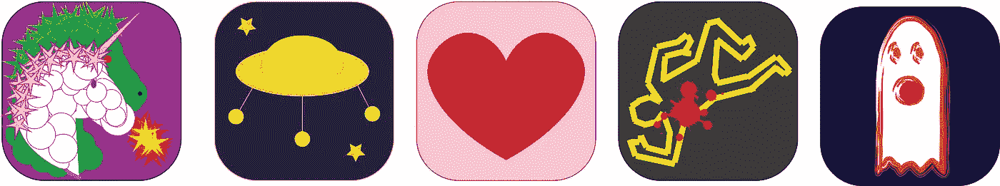

做这个项目我很开心！

发现了一篇关于电影海报上使用人工智能进行流派分类的有趣文章。主要想法是从电影海报中提取特征，并以此对类型进行分类。

作者使用 Keras，一个卷积神经网络和 IMDB 电影数据库来实现这个目标。

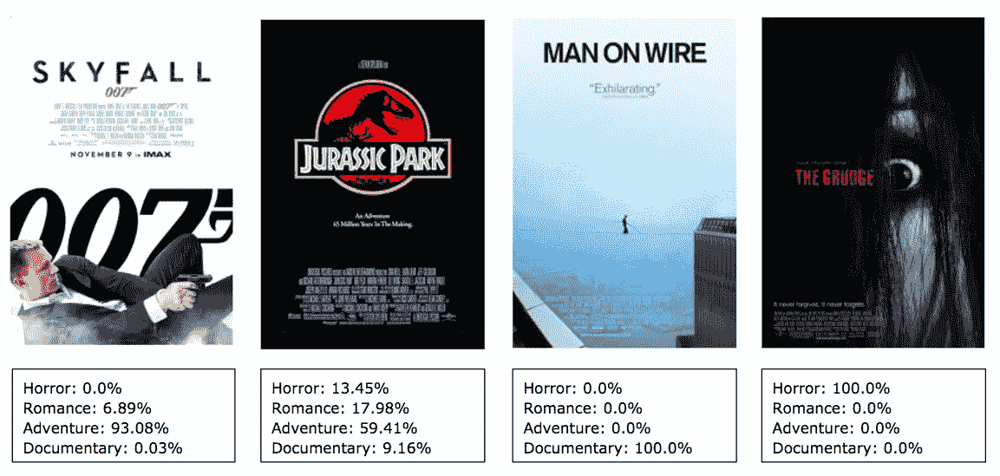

你可以在这里查看博客:

 [## 电影海报的类型分类

### 物体检测是目前深度学习中非常热门的话题。随着计算机的飞速发展…

www.linkedin.com](https://www.linkedin.com/pulse/genre-classification-movie-posters-jianda-zhou/) 

受这篇文章的启发，我决定做一些类似的东西，但是我没有用电影海报，而是用了书的封面和一个不同的框架: **PyTorch。**

# 让我们来分析不同流派的封面书籍

书籍封面让你对内容有所了解。颜色、物品甚至书名都告诉了你很多关于这本书的信息。在购买一本新书时，封面在你的购买中起着重要的作用和影响。

让我们来分析一下这些书的封面:

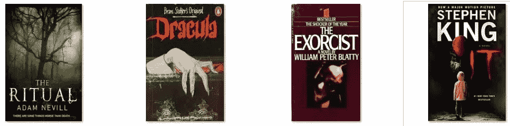

***书的颜色很说明问题***

我们可以靠颜色来猜测这本书是什么类型的。在阅读之前，颜色会让你对这本书有所了解。我们可以看到，在恐怖书籍封面中看到黑色和红色是非常常见的。为什么？它们代表激情、侵略和恐惧。黑色和红色代表了其中的黑暗和血腥！它也可以是任何一种深色。看上面的图片(**“德古拉”**和**“它”**在标题中使用红色，也使用黑色背景)。

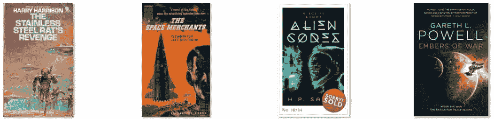

***书籍封面中的物体也能给你和想法！***

我可以在科幻书籍的封面上看到一种模式:它们总是展示未来的物体，如机器人、火箭、外星飞船和来自其他星系的行星。

另一方面，幻想书的封面总是展示剑、巫师、穿斗篷的人、龙、城堡和来自不同世界的生物。

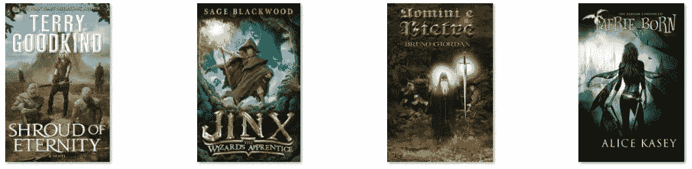

绿色也是奇幻书籍中的一个流行特征，它们代表了这一特定流派中涉及的自然(指环王就是一个很好的例子)。

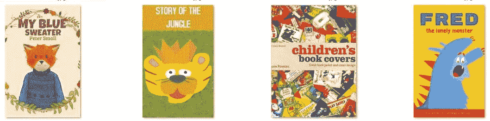

在儿童书籍中，你会发现彩色的封面，但比恐怖的封面要轻。我在这里看到一个图案，那就是黄色。它可能与一些积极的事情联系在一起。对象也不一样。大多数情况下，你可以在里面找到动物角色。

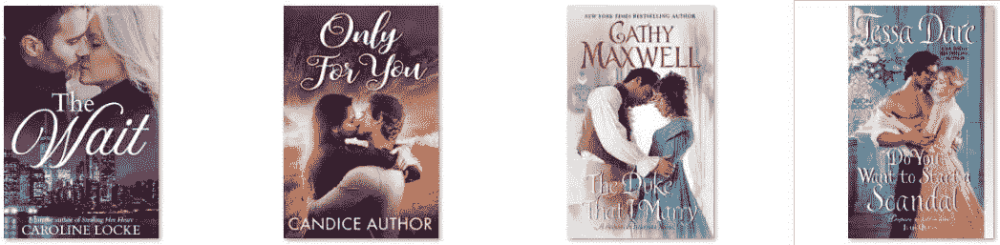

***头衔也很重要！***

在浪漫的书籍封面，你会发现情侣，紫色和粉色。但是，你也会看到草书字体的标题。只要记住过去人们写的浪漫的手写信件。

所以，考虑那些要素，只看封面就能搞清楚是什么样的书！

**计算机如何看待**

对我们来说，很容易看到这些模式，并猜测这是什么样的书，但计算机如何才能学会看到同样的东西？

计算机看不到颜色，它们看到的是数字。你可以从下图中看出我的意思:

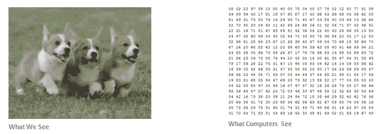

Computers just see a bunch of numbers!

计算机从图像中提取特征来检测模式，然后进行分类。

这是计算机看到的另一个例子:

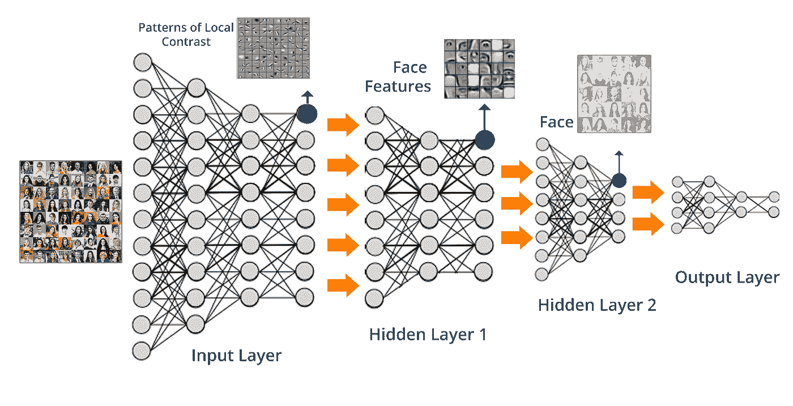

# PyTorch 通过封面帮助分类流派

我打算用人工智能根据封面给一本书分类。我还将使用一个预先训练好的模型来完成这个任务:Resnet-152。

为了进行这个实验，我收集了以下 5 类图像:

*   恐怖
*   浪漫性
*   小孩子
*   科幻小说
*   幻想

我将数据集分为训练集和有效集，分别为 80%和 20%。

# 结果

要有一个小的数据集，我觉得这些结果还可以。准确率达到了 60%。由于不同流派的书籍封面有一些相似之处，这个模型有时会变得混乱。让我们来看看预测:

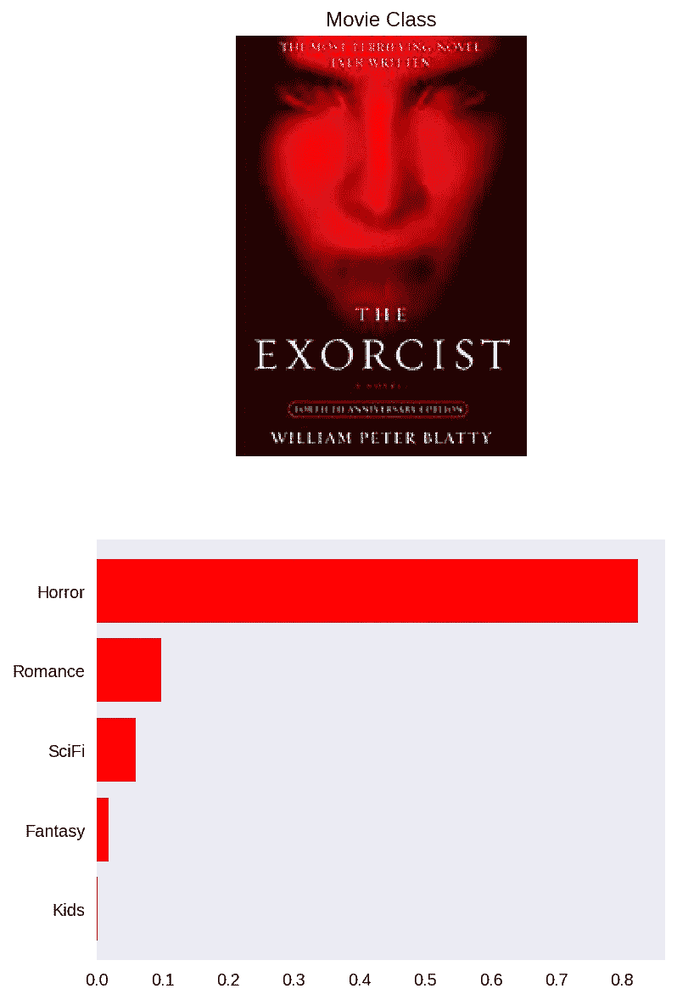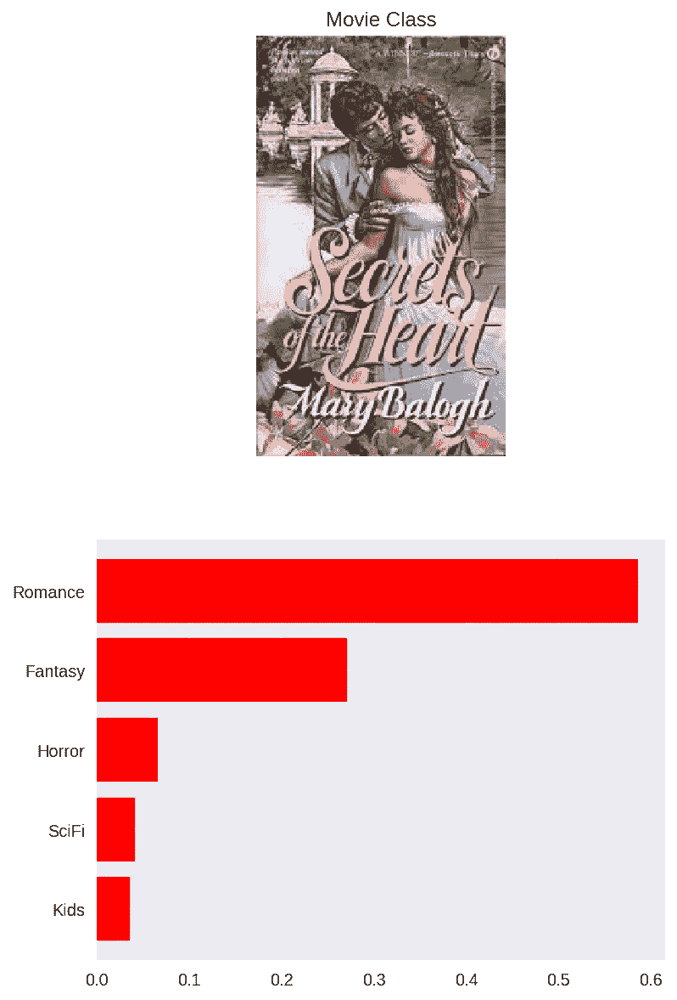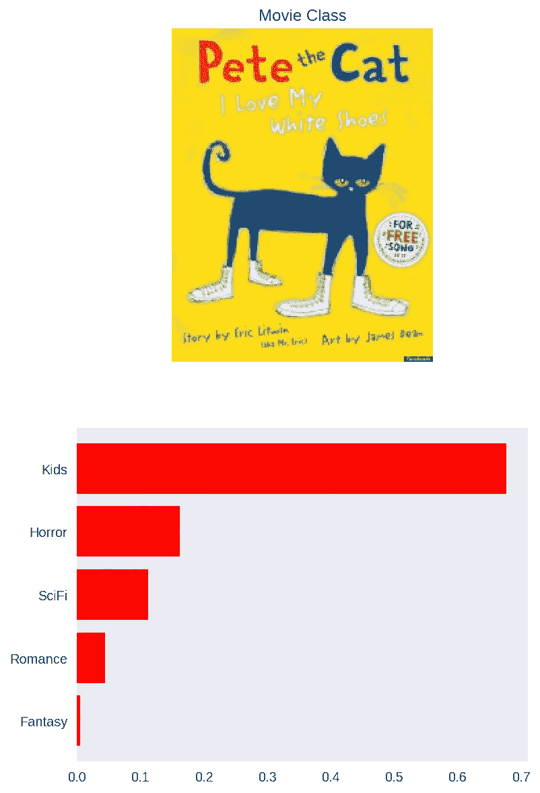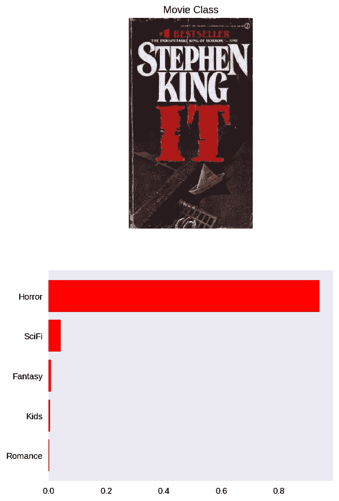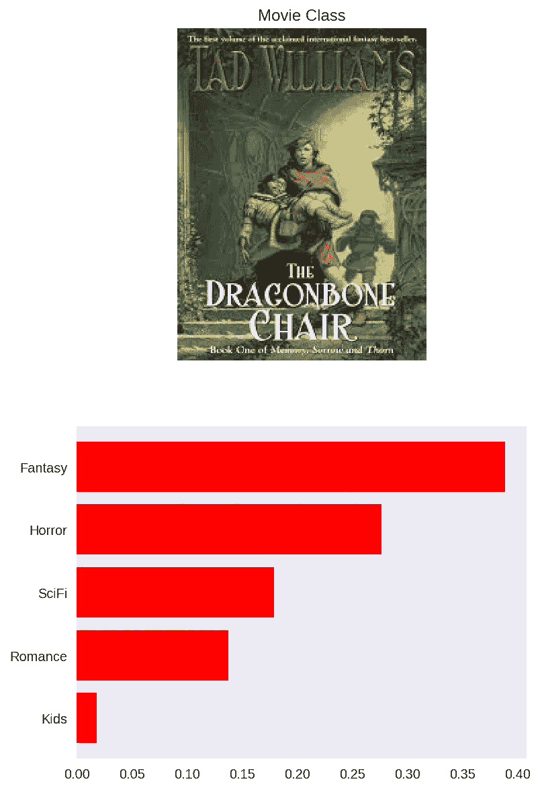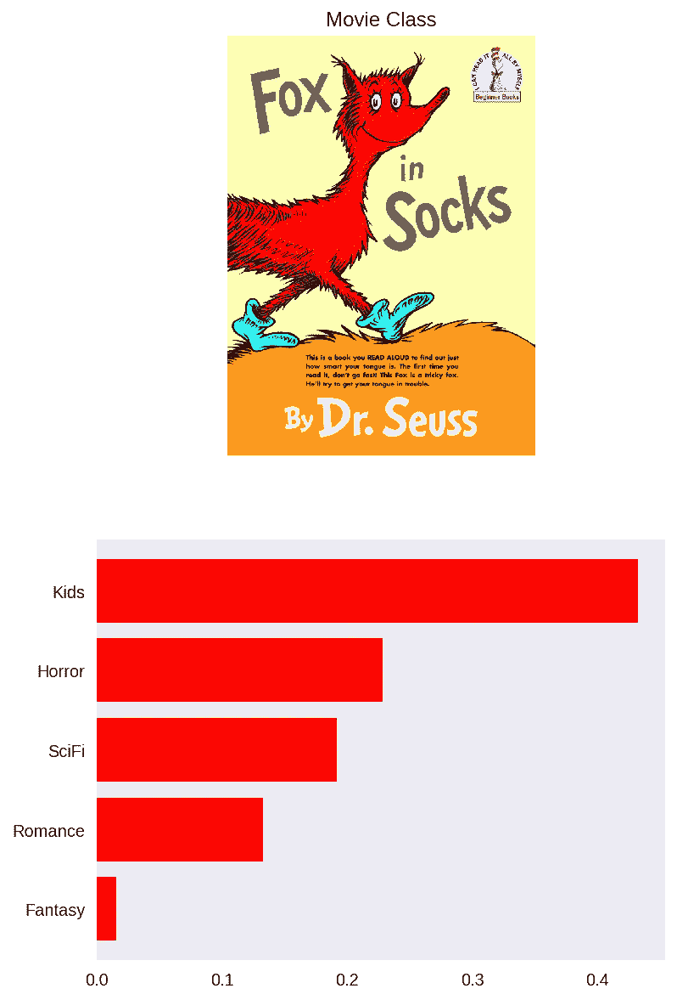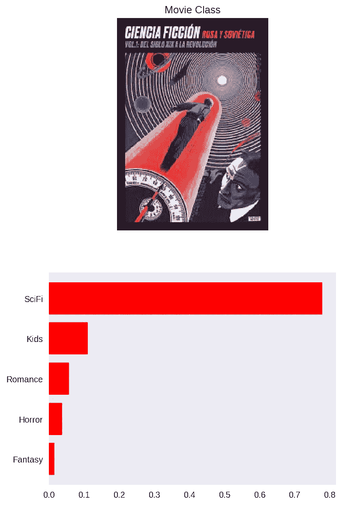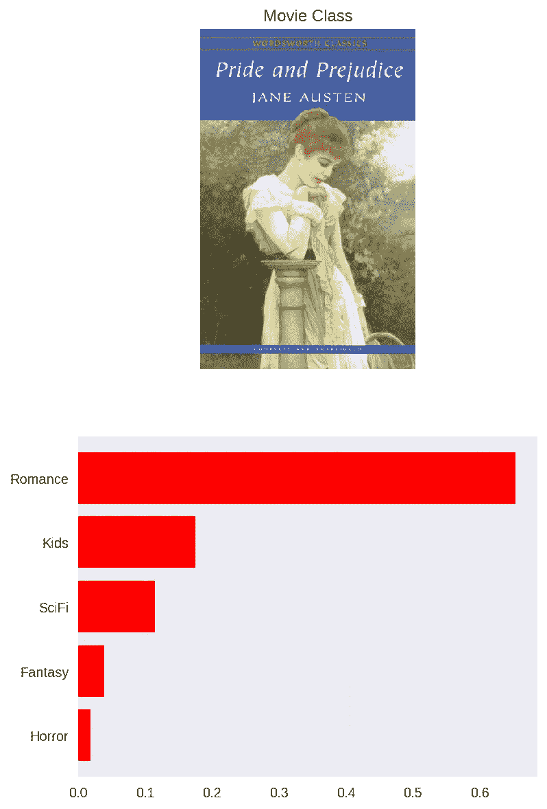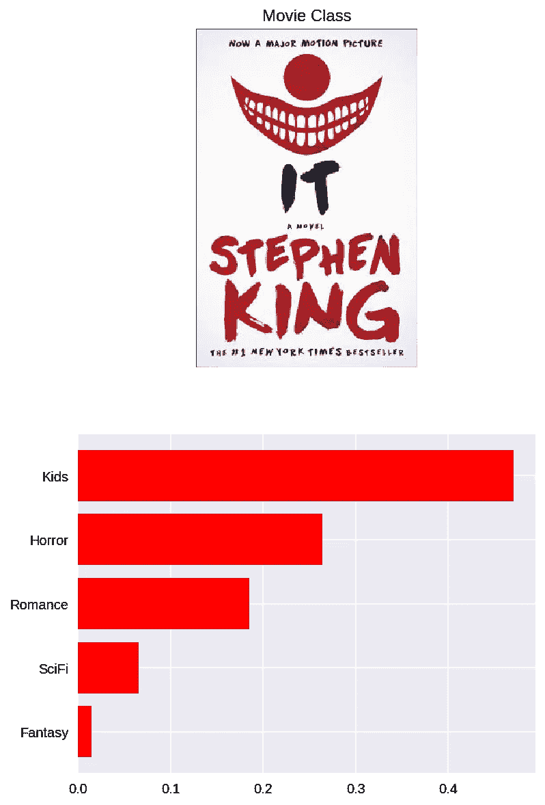

模特在这个分类中表现很差，告诉我这是一本儿童读物！但是，你可以看到第二个猜测是恐怖。我可以说它被颜色弄糊涂了，这不是典型的深色背景。我在一篇文章中读到，白色也与天真和纯洁联系在一起。我在想为什么它没有因为红色的字母(血，还记得吗？).

# 结论

*   有时候，该模型在对奇幻、科幻或奇幻书籍进行分类时做得不是很好。它们有相似之处，很难预测其中的任何一类
*   深色属于其他类别，很难猜测是恐怖还是其他类别
*   就像我常说的，数据越多，效果越好！
*   下次，我会尝试更多的类别
*   我正在考虑另一个使用类似模式的项目

# 用例

您可以在推荐系统中使用这种图像分类模型。这在网飞或亚马逊等平台上可能很有用。这可以成为向您推荐类似产品的另一种有力方式。只要把这看作是一种很酷的产品分类方式，而不是使用描述文本，这肯定是一种新颖的方法。

# 参考

 [## 色彩心理学和书籍封面——为什么你会选择下架的书——am reading

### 你漫步在你最喜欢的书店的书的过道里。你所能看到的是成千上万的脊椎…

www.amreading.com](http://www.amreading.com/2016/08/21/color-psychology-and-book-covers-why-you-choose-certain-books-off-the-shelf/) 

在 GitHub 上关注我:

 [## 维里塔罗梅罗—概述

### 软件工程师，对数据科学和机器学习充满热情。—维里塔罗梅罗

github.com](https://github.com/viritaromero)