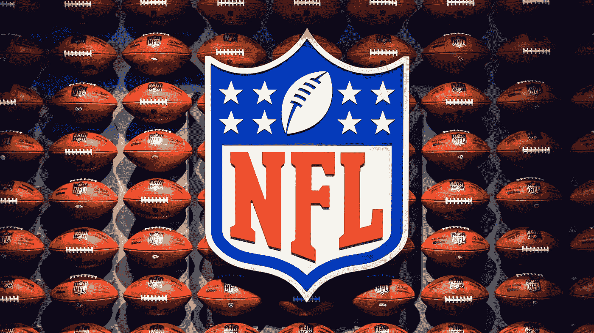
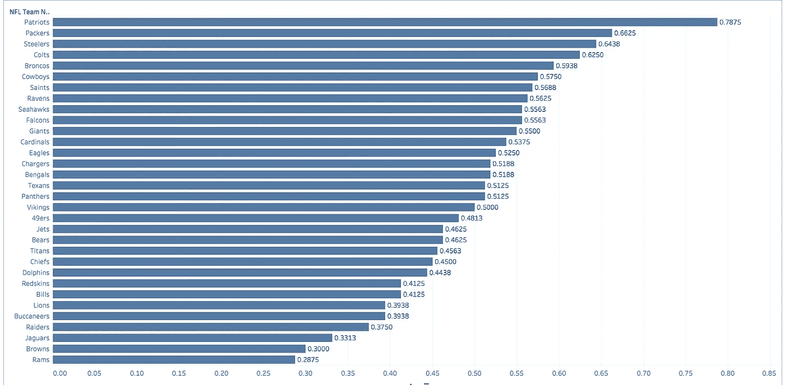
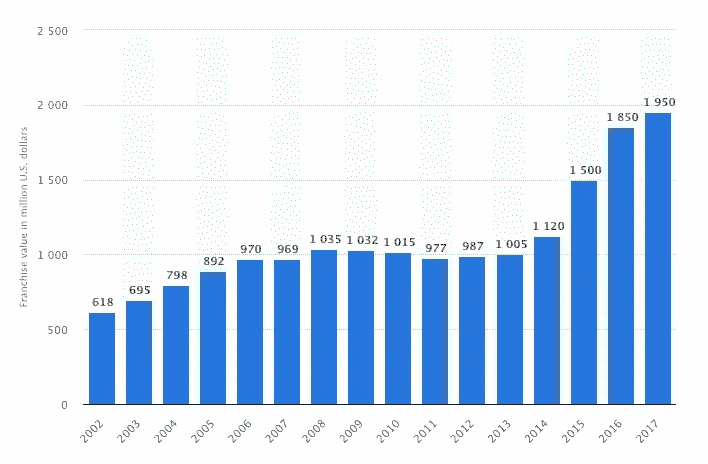
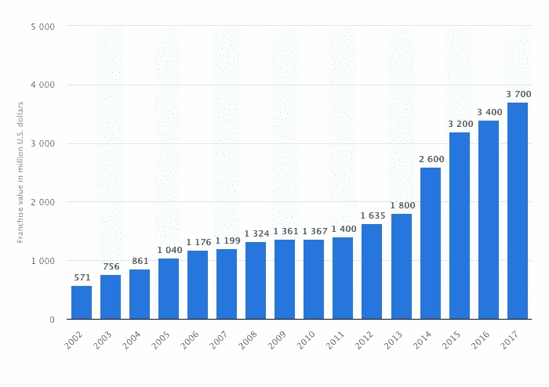

# 在 NFL 赢得比赛就等同于更高的特许权价值吗？

> 原文：<https://medium.datadriveninvestor.com/does-winning-games-in-the-nfl-equate-to-a-higher-franchise-value-946604e957b?source=collection_archive---------6----------------------->

via [unsplash.com](https://unsplash.com/photos/KgYazRO3l8A)

足球和金钱是相辅相成的。NFL 球队的平均价值在 2000 年翻了一倍多，从 4 亿多美元增加到 10 亿美元。另一方面，与 2017 年相比，本周末首映的收视率下降了 [4%，更不用说，袭击者队因为没有支付 Khalil Mack 而看起来像白痴，因为他们把钱花在了乔·格鲁登的 1 亿美元合同上，他在本周末看起来非常缺乏教练指导。](https://sports.yahoo.com/monday-night-football-ratings-2017-194229507.html)

*NFL 并不穷，远非如此。*

## 那么一个 NFL 球队能赚多少钱？

根据 ESPN 和包装工的财务报表，每个团队去年赚了 2 . 55 亿美元，比去年增长了 4.9%。32 支球队，每支球队有 52 名球员，80 亿美元在球员之间分配。

## 如果玩家目前的收入份额从 **47%** 上升到 **60%** ，他们能赚多少？

有了 47%的蛋糕，玩家就有了 37.6 亿美元的收入。有 1696 名 NFL 球员，所以他们每人将得到 220 万美元。

相比之下，60%的收入玩家拥有 48 亿美元的收入。NFL 球员的平均收入是每个赛季 280 万美元。

也就是说，我将永远站在 NFL 球员一边，让他们赚更多的钱，如果不是大部分的话。他们有一个有限的时间来赚钱，以支持他们的家人度过余生。更不用说长期虚弱受伤的风险了。

简而言之，没有球员就没有 NFL。

显而易见，胜率最高的 NFL 球队最有价值。赢得比赛增加门票销售，从而推动团队收入。

## 在过去的 10 年中，哪些 NFL 球队赢得最多或最少？

[interact with this chart live.](https://public.tableau.com/views/NFLTeams10YearWingPercentage_0/NFLTEAMWIN?:embed=y&:display_count=yes&publish=yes)

## 32.闸板([46–113–1](https://public.tableau.com/views/NFLTeams10YearWingPercentage_0/NFLTEAMWIN?:embed=y&:display_count=yes&publish=yes))

## 31.棕色([48–112](https://public.tableau.com/views/NFLTeams10YearWingPercentage_0/NFLTEAMWIN?:embed=y&:display_count=yes&publish=yes))

## 1.爱国者([126–34](https://public.tableau.com/views/NFLTeams10YearWingPercentage_0/NFLTEAMWIN?:embed=y&:display_count=yes&publish=yes))

公羊队以 [**28%**](https://public.tableau.com/profile/andres8015#!/vizhome/NFLTeamsWinPercentage2007-2017/NFLTEAMWIN?publish=yes) 的胜率排在最后，紧随其后的是布朗队 [**30%** ，](https://public.tableau.com/profile/andres8015#!/vizhome/NFLTeamsWinPercentage2007-2017/NFLTEAMWIN?publish=yes)，他们在 10 个赛季中的 8 个赛季只赢了 5 场或更少的比赛。作为海豚队的球迷，用一个****44%的胜率我能体会到他们的痛苦。****

*****我们将公羊队排除在下面的统计比较之外，因为他们搬迁到洛杉矶后，他们的* [*价值飙升至 37 亿美元*](https://www.statista.com/statistics/194504/los-angeles-rams-franchise-value/) *尽管他们的最后一名胜率很高。*****

## ****在过去的 10 年中，哪些团队的价值增长最快？****

# ****布朗的特许权价值****

********

****[via statista.com](https://www.statista.com/statistics/194456/franchise-value-of-the-cleveland-browns-since-2006/)****

****尽管自 2007 年以来，布朗队只赢了 48 场比赛，但他们的特许权价值已经从 2007 年的 9.69 亿美元上升到 2017 年的 19.5 亿美元。****

****在过去的 10 年里，最差的 NFL 球队的价值翻了一番。****

# ****爱国者特许权价值****

********

****[via statista.com](https://www.statista.com/statistics/194482/franchise-value-of-the-new-england-patriots-since-2006/)****

****在过去的 10 年里，高飞爱国者队赢得了 78 场比赛，是布朗队胜率的三倍。2007 年他们的特许权价值是**11.19 亿美元。5 袁绍奖杯后来爱国者的特许权价值是[**37 亿美元**](https://www.statista.com/statistics/194482/franchise-value-of-the-new-england-patriots-since-2006/)**2017 年。********

******在过去的十年中，赢得最多的特许经营权的价值增加了两倍多。******

# ******包裹******

******水涨船高。无论他们在球场上的成功率如何，所有的 NFL 球队在过去的十年里都见证了特许权价值的增长。这是因为他们的 32 支球队供应有限，电视合同收入不断增加，成为最后一个必须观看的电视直播赛事之一。******

*******原载于 2018 年 9 月 12 日*[*【www.aspmediagroup.com】*](https://www.aspmediagroup.com/single-post/2018/09/12/Does-Winning-Games-In-The-NFL-Equate-To-A-Higher-Franchise-Value)*。*******