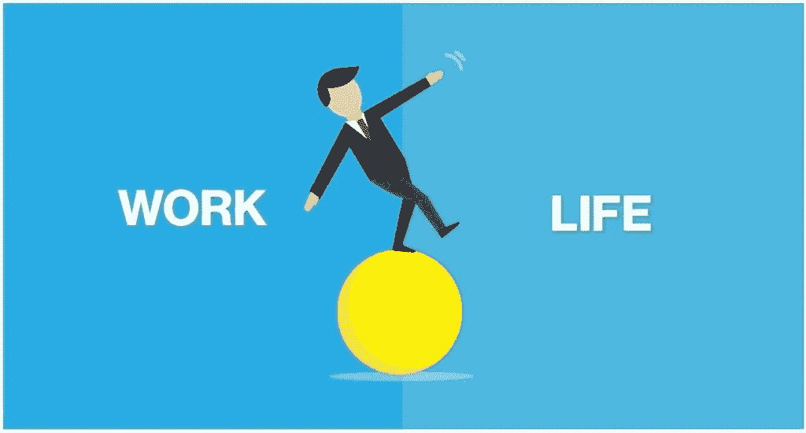

# 工作与生活的平衡真的存在吗？

> 原文：<https://medium.datadriveninvestor.com/does-work-life-balance-really-exist-cdebb40cd32?source=collection_archive---------5----------------------->

*(Image source:* [*https://www.zevohealth.com/wp-content/uploads/2018/05/Blog-6-Work-Life-Balance-page-001.jpg)*](https://www.zevohealth.com/wp-content/uploads/2018/05/Blog-6-Work-Life-Balance-page-001.jpg))

我经常质疑自己，是否真的有工作生活平衡这种东西。我记得我的第一份工作压力很大，我和我的同事每天至少工作 14 个小时，如果运气好的话，我们周末也可以工作。当我回到家，我几乎不能做任何事情，除了睡觉，因为我明天早上第一件事就是要去办公室。我试图找到一个答案，关于我如何能适当地平衡这一点，我真的不知道如何回答这个问题。

当我从另一家公司得到一个新的机会时，我仍然不知道如何平衡我的工作和生活，即使我在这家公司的工作量与前一家相比非常少。

 [## 幸福的算法？数据驱动的投资者

### 从一开始，我们就认为技术正在使我们的生活变得更好、更快、更容易和更实用。社交媒体…

www.datadriveninvestor.com](https://www.datadriveninvestor.com/2019/03/08/an-algorithm-for-happiness/) 

然后有一天，我突然意识到根本没有工作生活平衡这回事。但是有生活平衡这种东西。为什么把工作看成不是生活的一部分。当你看到它时，工作将永远是生活的一部分。我们真正应该做的是知道如何平衡我们生活的不同方面。这些是我认为我们应该在日常生活中解决的问题:

# 心态

你是你最大的敌人。你的心态会影响你的决策。你的心态可以成就你，也可以毁掉你。你的心态将为你的生活中你真正渴望的事情设定道路，无论这些事情是什么。

我相信我们心中设定的是我们的欲望。如果我们想要控制我们的生活，我们需要有一个燃烧的欲望，一个燃烧的心态。

# 时间

我把时间看得更深，而不仅仅是精确地看着太阳何时升起，何时落下，何时做事，何时离开办公室。我把时间定义为一个动词，一个动作动词当我们使用*【时间】*这个词时，我们总是说这些常见的短语，如*我现在没有时间】表示他们现在不能来或不能做某事或注意。此外，短语*“是时候了”*很可能表示某个特定的动作应该在此时此刻完成*

*如果你注意到了，时间是一种行动。时间是你的注意力。时间就是你现在正在做的事情。*

*人们，包括我在内，总是想要结果，却从来不花时间去努力实现结果。时间自由。时间是强大的，但永远不要忘记时间是有限的。时间让我们做我们想做的事情。例如，现在你正在读这篇文章。你在利用你的时间读这篇文章。我们应该注意如何度过时间。*

# *健康*

*健康就是财富。也许你已经有了心态，燃烧的欲望，但你需要让你的身体在身体和精神上强大起来，以处理当天需要完成的工作。工作意味着为了达到你的目标而需要做的活动。*

*我认为这是显而易见的，但是为了照顾好你自己，你需要注意你吃的东西，花时间锻炼，休假几天来放松，以及所有其他我们应该知道的显而易见的事情，以便我们有一个能干的身体来做我们需要的工作。*

# *职业/工作*

*重要的是我们要控制我们的职业，我们的工作。控制我们工作的一种方法是:*

***沟通**。怎么会？只是对某些情况说“不”或者只是说“现在不行”。我知道我们想成为办公室或行业中最好的，所以我们经常做的是对老板让我们做的每件事都说“是”,这样我们就没有时间去做除了职业生涯以外的其他重要事情。我们说“是”，因为我们想给别人留下一个印象，我们是可靠的，我们擅长我们所做的事情，这实际上是一种很好的态度。这也让我们觉得自己很重要。*

*但是，也要考虑到，如果我们实行**工作授权，您的组织可能会更有成效。我们不应该害怕说“不”,也不应该害怕将工作委派给其他同事。我们的同事也有能力做好工作，他们也应该有机会展示他们的技能和激情。实践工作授权不仅会让我们的工作更容易，还会教会我们如何领导他人，如何管理我们的工作。***

***计划**也很重要。为了实现你想要的，你必须想象通往你的目的地的道路。这是策划。我们正在计划采取什么步骤以及何时采取。实践计划会让你和你的组织更好地控制应该在一段时间内完成的工作。*

*练习**谈判**也很重要。一个非常常见的场景是在截止日期前工作。我们倾向于加班只是为了赶上最后期限。协商我们高质量完成工作所需的时间是一种好的做法。*

# *摘要*

*注意我们如何管理或心态、时间、健康和职业/工作将让我们更好地控制我们的生活。工作是我们生活中很大的一部分。它让我们取得惊人的成就。但是，我们的生活不应该只专注于工作。有些事情即使不比工作更重要，也是同样重要的，我们不应该忽视这些事情，或者我们应该寻找这些事情。*