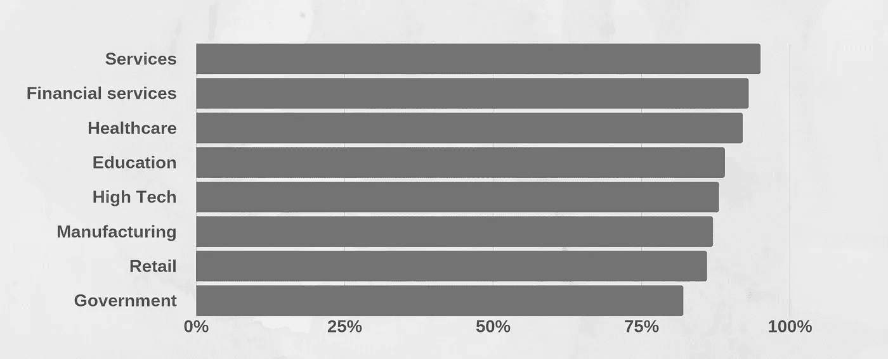

# 您的公司需要数字化转型吗？找出答案的 5 个技巧

> 原文：<https://medium.datadriveninvestor.com/does-your-company-need-a-digital-transformation-5-tips-to-find-out-33c95cd9d063?source=collection_archive---------14----------------------->

© Marvin Meyer

简化生活是人类的天性。几十年前，我们不得不去市场购买食品杂货。如今，你可以在智能手机上找到所有必要的商店，购买你需要的东西；它还可以用作照相机、电话、广播和电视、音乐和图书图书馆等等。这是一个企业无法承受难以接近或过时的时代。即使你可能认为自己不需要数字化转型，我也要挑战你，让你重新审视一下自己的业务。这篇文章可能会告诉你是否需要经历数字化转型。

# **数码比纸质更划算**

数字化转型是过去和未来之间的桥梁，从纸质到数字的过渡将为更光明的未来铺平道路。数字化转型可以用在每个领域，甚至是在似乎远离正常办公生活的情况下。让我们以在非洲监测大象为例来说明这一点。在过去，你会让人跟踪大象并做笔记。如今，由于使用了具有数字信号的跟踪项圈，技术已经节省了工时和旅行距离。所有的企业都会面临类似的情况；使手工工作更容易的过程。你的生意还在追逐大象吗？

 [## 数据科学和软件工程哪个更有前途？数据驱动的投资者

### 大约一个月前，当我坐在咖啡馆里为一个客户开发网站时，我发现了这个女人…

www.datadriveninvestor.com](https://www.datadriveninvestor.com/2019/01/23/which-is-more-promising-data-science-or-software-engineering/) 

> 所有的企业都会面临类似的情况；使手工工作更容易的过程。你的生意还在追逐大象吗？

数字化转型的定义经常变化，**但其主要目标是改变商业中的工作和思维方式**。电子商务就是一个典型的例子。购物过去需要你亲自去一家商店并支付现金。如今，你可以坐在家里，走到电脑或智能手机前，选择你想买的东西，下订单，付款，而不需要碰一张纸。

在 [Forbytes](https://forbytes.com/) 中，我们帮助许多企业实现系统现代化。一个很好的例子是与[stenstr ms](https://stenstroms.com/en)合作，这是一个著名的瑞典品牌，自 1899 年以来一直在制作高品质的衬衫。除了现成的高质量衬衫，他们还允许顾客定制衬衫。他们的零售商和店主网络收集顾客的尺寸和风格偏好。在传真给 sten strms 的制造部门之前，先将这些内容记在纸上。该过程涉及大量的手动检查和纠正，导致员工浪费不必要的时间，并给最终客户带来延误。

> 不再需要处理填写不正确的纸质表格，需要砍伐的树木也少了很多。

我们现在正在为公司创建一个新的程序来简化他们的流程；从而减少了不便，并且只需点击几下按钮就能快速纠正任何错误。

通过将流程从纸质解决方案转变为具有相关制衡机制的数字解决方案，Stenströ ms 改变了他们与专属客户合作并管理其需求的方式。尺寸和款式组合在商店中收集和验证，然后发送给他们技术高超的裁缝团队，他们会将愿望转化为时尚舒适的衬衫。不再需要处理填写不正确的纸质表格，需要砍伐的树木也少了很多。所有这一切都是通过从纸张到数字的简单转换实现的。

# **数字化转型是未来企业的重要组成部分**

那么在你的企业中，哪些*可以被数字化呢？简单的回答就是任何重复性的工作。任何你需要做不止一次的事情都是数字化转型的候选。只要想一想在你的公司中哪里有信息流，并考虑你是否有效地收集、存储和分析这些信息。根据 [2018 年数字业务转型状况](https://cdn2.hubspot.net/hubfs/1624046/Digital%20Business%20Executive%20Summary_FINAL.pdf?t=1533063737420)研究，89%的组织已经采用或计划采用数字优先战略。*

**各行业数字化转型的准备情况:**

[2018 State of Digital Business Transformation](https://cdn2.hubspot.net/hubfs/1624046/Digital%20Business%20Executive%20Summary_FINAL.pdf?t=1533063737420)

令人印象深刻的数字，不是吗？它们可以部分地解释为数字转型使人类能够更专注地思考他们的工作。技术让人们专注于完成有趣的任务，而不是一直做重复性的工作。它还有助于提高员工日常工作的效率。

# **确定数字化转型的需求**

归根结底，如果你想确保你的公司更可持续、更高效，你只需要经历一次数字化转型。你有五个基本类别要看。

## **1。财务**

数字化转型将如何改善您的企业财务状况？你将如何管理你的财务计划和控制？举一个很多人已经在做的简单例子:你是在纸上做预算，还是使用像 Excel 这样的应用程序？我肯定会选择 Excel。它很简单，但是数字化了。我可以和世界上任何人分享预算。这只是用 Excel。想象一下，在需要时，更高级的解决方案能为您做些什么。

## **2。核心服务**

数字化转型会提高核心服务的效率、质量或产出吗？

## **3。客户和供应商满意度**

所有可持续发展的企业都需要与客户和供应商保持良好的关系。数字解决方案将如何让您确保对您的服务的需求保持强劲？你的客户和供应商更愿意与你合作还是与竞争对手合作，你能做些什么来确保你是第一选择？您的组织为未来做好准备了吗？变化是唯一不变的因素，您能够满足未来的信息管理需求吗？

## **4。工作人员**

你的员工更愿意为一家促进重复枯燥工作的公司工作，还是为一家拥有工具和技术让他们的生活更轻松的公司工作？

## **5。分析**

将您的信息数字化有助于您轻松访问它。当您可以格式化数据以满足您的需求并快速更新时，信息流就更容易理解了。我们的信息流是数字化的，这意味着我们或我们的客户的任何公司变化都将在半小时内更新到我的记录中。

# **如果你还有疑问**

正如我上面提到的，简化生活是人类的天性。我们有一种与生俱来的能力去思考如何改善我们的日常生活。我相信，任何准备颠覆市场的新想法都将受益于数字化方法。

我们利用数字化转型来发展我们的业务，并确保业务的可持续性和安全性。虽然对一些人来说这可能是一个有争议的观点，但我认为任何想要长期生存的企业都需要数字化。不进行数字化可能会面临破产的风险，或者在竞争中失去客户、供应商和员工。

> ***需要一个可靠的软件伙伴？*** [***联系方式***](https://forbytes.com/contact/?source=post_page---------------------------)

# 阅读更多信息:

 [## 如何在软件团队中创造一种自我激励的文化

### 激励是每个公司成功的关键。在敏捷项目团队中建立激励和协作…

medium.com](https://medium.com/datadriveninvestor/how-to-create-a-culture-of-self-motivation-in-a-software-team-4165e2c18ea)  [## 确定产品分解结构的两个步骤

### 你是否曾经开始一个项目，对未来充满热情，并确信你有最好的产品或想法…

medium.com](https://medium.com/@donlowe/two-steps-to-nail-a-product-breakdown-structure-22dda3b3575e)  [## 软件外包的 4 大技巧

### 我相信有效的过程使聪明的开发人员能够交付适合目的的解决方案，而伟大的开发人员能够…

medium.com](https://medium.com/@donlowe/4-top-tips-on-software-outsourcing-77af7f9b3a01)