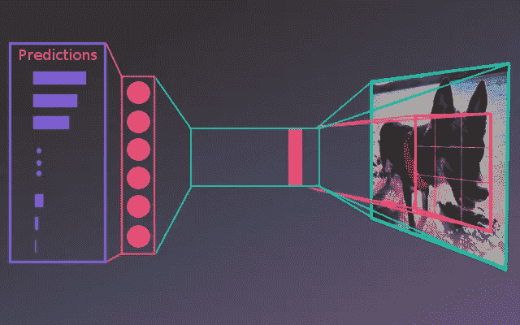
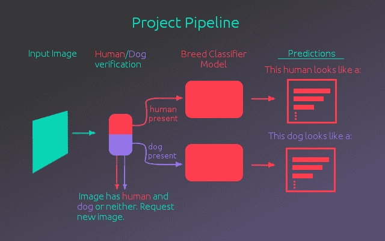
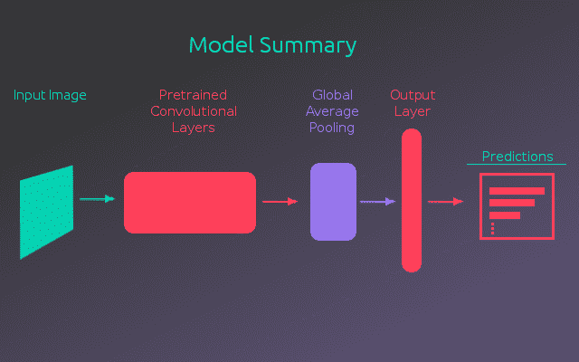
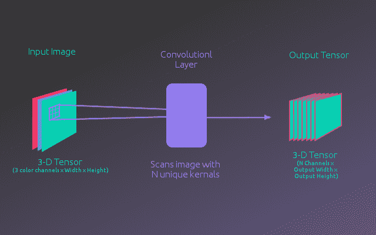
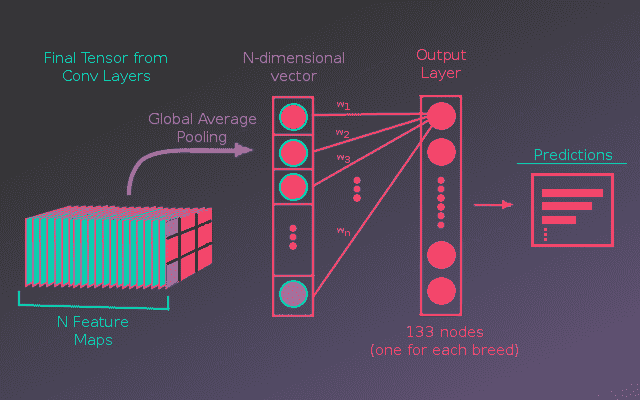
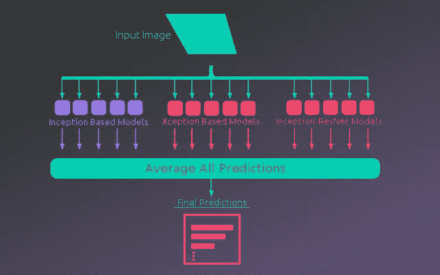

# 犬种分类器

> 原文：<https://medium.datadriveninvestor.com/dog-breed-classifier-32e21c134a7d?source=collection_archive---------3----------------------->

这篇文章概述了如何使用迁移学习来建立一个狗品种分类器。这个项目使用的代码可以看作是一个 Jupyter 笔记本。完整的项目提交可点击此处查看，或点击此处查看更深入地了解模特培训过程。如果你想访问实际的笔记本，可以在项目的 [GitHub 库](https://github.com/macbrennan90/udacity_AIND_P5)中找到。

# 项目概述

这个项目是 Udacity 人工智能纳米学位的一部分。该项目的目标是创建一个管道，拍摄图像并检测是否有人或狗在场，预测狗的品种或决定人看起来像什么狗。下图概述了这一过程。

如上所示，有一个经过人/狗验证过程的输入图像。这分为两个独立的步骤:

*   **人类验证** —为了确定图像中是否存在人类，使用了 OpenCV 库中预先训练的 haar cascade 人脸检测器。
*   **狗验证** —对于狗验证，使用完全预训练版本的 ResNet-50。该模型在 Keras 中可用，权重在 ImageNet 数据集上预先训练。ImageNet 数据集中的图像被分为 1000 个类别，其中几个类别是不同品种的狗。利用这一点，通过让模型预测图像的 ImageNet 类，该模型被用作狗检测器。如果这个类属于狗的品种类别之一，那么这只狗就是存在的。

一旦确认图像中存在人或狗，就将其传递给品种分类模型，以确定人或狗最相似的品种。预测结果将与探测到的是人还是狗一起打印出来。如果发现图像包含人和狗，或者都不包含，则请求新的图像。当在单个实体上分类时，品种分类模型是最准确的。

虽然预训练的 ImageNet 模型确实允许一些狗品种分类，但是这些模型并没有被特别调整来区分狗品种。一个更好的模型可以通过训练来完成。

# 品种分类模型

建立这个犬种分类模型是这个项目的主要焦点。即使预先训练的 ImageNet 模型并没有为这项任务进行优化，它们在建立犬种分类器时仍然非常有用。在 ImageNet 上训练的模型非常擅长从图像中提取特征。幸运的是，这个任务的图像与 ImageNet 的图像相似。这些模型使用卷积神经网络来提取图像特征，并且通过转移预训练模型已经学习的内容，它们可以用于这个新模型。下图显示了品种分类模型的基本总结。

该模型架构的基本思想是使用预训练模型的卷积层从输入图像中提取特征。使用全局平均池化层将这些特征提取到单个向量中。这个向量被传递到一个全连接的输出层，该层计算每种狗的概率。

下图说明了卷积层中发生的情况。该模型从输入图像开始，该图像被表示为 3d 张量(3 个颜色通道 X 宽度 X 高度)。卷积层用 N 个不同的核(权重矩阵)对图像张量进行卷积。这些内核在图像中寻找各种特征。最终，这会产生一个新的三维张量(N 个特征通道 x 输出宽度 x 输出高度)。这些层被链接在一起，一个卷积层馈送的输出作为下一个卷积层的输入。如果你不熟悉内核计算是如何工作的，[这篇博文](http://setosa.io/ev/image-kernels/)对正在发生的事情有一个非常好的直观解释。

在 ImageNet 上训练的模型的卷积层已经学习了它们使用的内核的有用权重，允许它们检测现实世界物体的区别特征。前几个卷积层能够以高分辨率拾取简单的对象(纹理、边缘、形状)，通过将这些层链接在一起，后面的层能够检测更高级别的对象(眼睛、鼻子、耳朵)。然而，这是以空间分辨率为代价的。图像通过卷积层后的效果是，表示图像的 3d 张量被变换成具有较小宽度和高度的 3d 张量，但是许多高级特征图显示图像的哪些区域具有某些特征。

对于该模型，预训练的卷积层输出具有 N 个特征图的最终张量。如果不清楚特征图实际上代表什么，一个例子将是:如果给定的特征检测器(内核)正在寻找眼睛，它将为眼睛可能出现的图像区域输出高值，而为眼睛不可能出现的区域输出低值。现在，预先训练的模型并没有被明确告知要有眼睛探测器，他们通过训练过程学会了什么样的探测器是有用的。总之，这些要素地图通过全局平均池层传递，该层将每个要素地图的值平均为一个值。这产生了 N 个条目长的向量，其中每个条目代表一个特征图的平均值。具有较高值的特征地图意味着图像更有可能具有这些特征(只有模型真正知道这些特征是什么)。

因此，这个特征值向量被传递到一个完全连接的层，其中每个节点代表图像包含某个犬种的概率。其计算方法是对每个节点的特征向量中的值进行加权求和，然后将这些值通过 softmax 函数，将节点的和限制为等于 1。这将节点值转换为每个品种的概率。该模型的训练过程是调整加权和中的权重，使得该模型学习在区分每个品种时什么特征是重要的。

这个过程如下图所示:

这个模型架构有几个好的效果。首先，它相对简单，因此模型不太可能过度拟合，并且占用较少的内存。相比之下，模型可能在卷积要素和输出层之间有几个完全连接的层。其次，因为与品种相关联的输出节点直接连接到特征地图，所以我们可以可视化模型“看到”什么。通过在原始图像上绘制所有特征图，并用来自预测品种的权重对每个图进行加权，可以产生显著性图。这显示了图像的哪些区域对最终预测贡献最大。下面我们有一张拉萨 Apso 狗的图像的显著性图，它被模型错误地预测为哈芬尼斯狗(尽管拉萨 Apso 是第二高的预测)。显著图显示耳朵似乎强烈影响模型的决策。

# 评估和绩效

使用上述模型架构，测试了几个不同的预训练卷积层。Keras 有几种不同的模型，可以加载预先训练的重量。测试的模型包括:

*   VGG16
*   VGG19
*   ResNet50
*   InceptionV3
*   例外
*   盗梦空间-ResNetV2

基于 Inception 的模型(InceptionV3、Xception 和 Inception-ResNetV2)产生了最好的性能，在测试数据上实现了接近 90%的准确性。这明显高于其他模型的 80%左右的准确率。使用这些模型建立了一个集合。对于每种类型的预训练模型，卷积层用于构建 5 个完整的模型。然后将这 15 个模型的预测值进行平均，得到最终预测值。这将准确率又提高了 3–4%，在最终测试集上达到 93.6%。下面是整体架构的示意图。

# 总结和进一步

最终的模型能够对 133 个品种产生 93.6%的分类准确率。与最先进的技术相比，Kaggle 最近在这个项目完成后进行了类似的竞争，顶级团队达到了 98%的准确率。然而，这是在一个不同的数据集上，对 120 多个品种进行了分类，并访问了大量数据。如果能获得更多的数据，这个模型很可能会得到改进。使用数据集，该模型只有每个品种约 70 张图片可供学习。

如果这个项目被扩展，有几个额外的途径来提高性能。在错误分类的品种中，有大量的预测品种和实际品种极难区分，即使是人也很难区分。有可能建立独立的模型来预测某一组狗。例如，模型的一个错误分类是混淆了卡迪根威尔士柯基犬和彭布罗克威尔士柯基犬。如果训练一个单独的模型来区分柯基犬，并在预测的品种属于柯基犬组的情况下使用，可能会有所改善。然而，这将给预测流水线增加相当多的时间和存储器使用。

另一个可能的途径是使用 R-CNN(区域卷积神经网络)。利用基于区域的网络，模型预测它应该查看图像的哪些部分。这将允许模型专注于特定的狗，从图像的背景中去除任何“噪声”信息。这还会有一个额外的好处，即它可以用作人/狗验证步骤。总的来说，对于给定的任务来说，模型的性能是相当令人印象深刻和足够的。如果你有兴趣看到模型的训练过程和代码，请查看文章开头链接的笔记本。

*原载于*[*macbrennan 90 . github . io*](https://macbrennan90.github.io/dog-breed-classifier.html)*。*