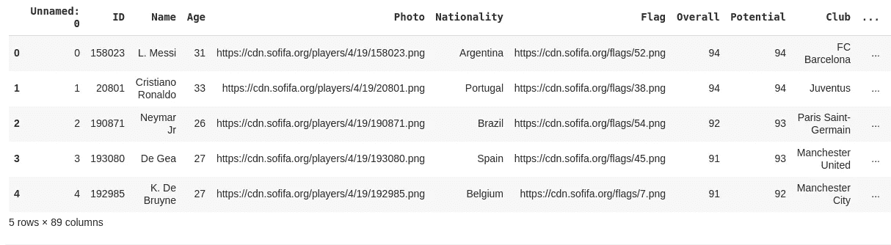
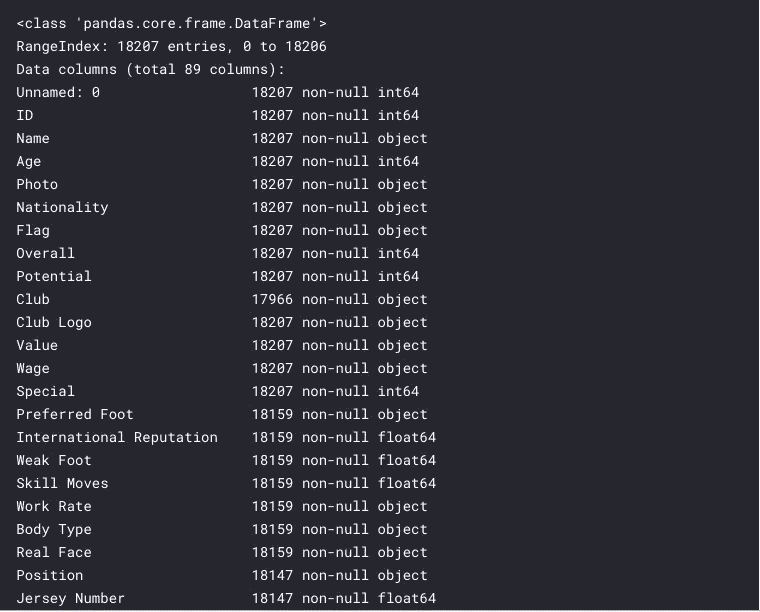
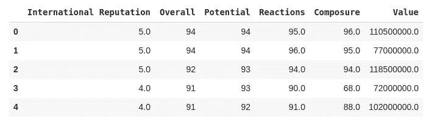
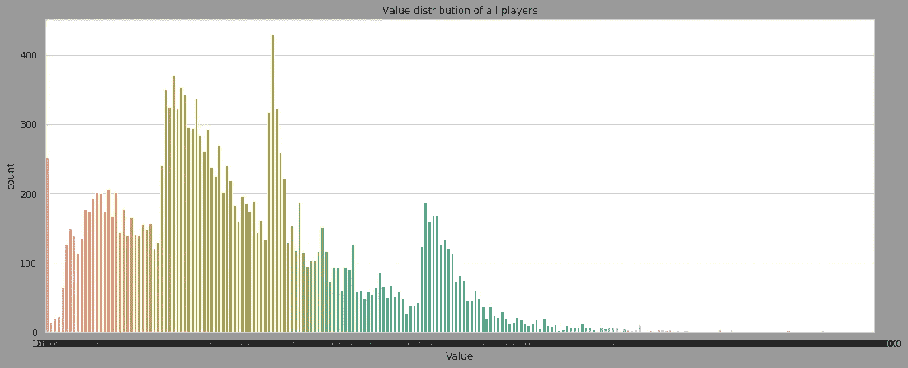
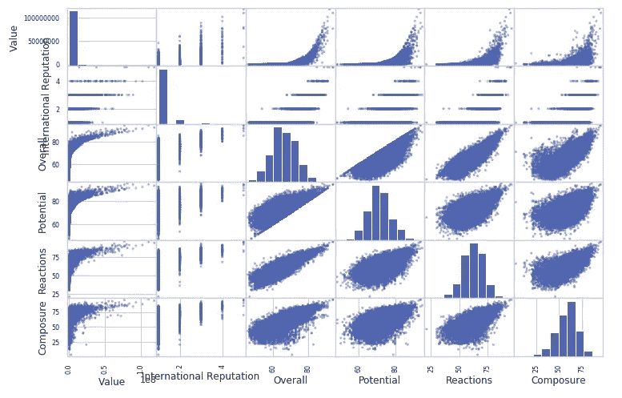
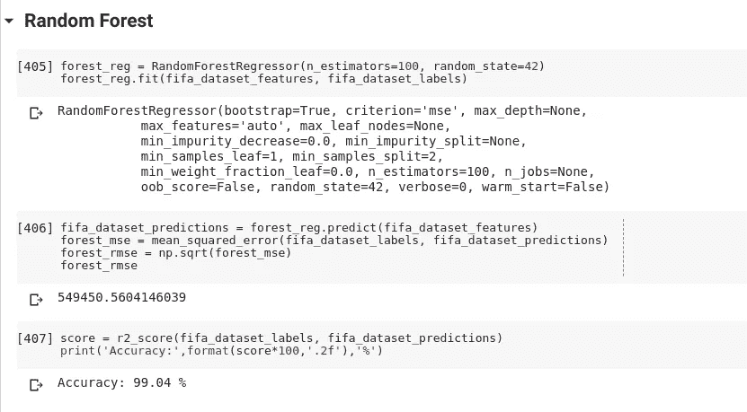
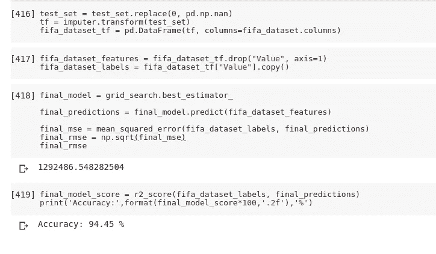

# 做 ML 第 1 部分:回归

> 原文：<https://medium.datadriveninvestor.com/doing-ml-part-1-regression-c6c24be75371?source=collection_archive---------4----------------------->

[](http://www.track.datadriveninvestor.com/1B9E)

机器学习及其相关领域有一个非常陡峭的学习曲线。人们经常会被外面的大量信息淹没，尤其是当你刚开始接触时。

即使你开始使用它，并且能够理解技术上的东西，当它真正付诸实践时，还是有很大的不同。
很有可能几个月内被理论概念淹没，而永远不会动手。

[](https://www.datadriveninvestor.com/2019/02/08/machine-learning-in-finance/) [## 金融中的机器学习——数据驱动的投资者

### 在我们讲述一些机器学习金融应用之前，我们先来了解一下什么是机器学习。机器…

www.datadriveninvestor.com](https://www.datadriveninvestor.com/2019/02/08/machine-learning-in-finance/) 

在网上学习课程和阅读书籍后，我意识到，最好和最有效的学习方法是边做边学。

*   做项目。
*   提出一个问题并尝试解决它。
*   找一个能激励你的话题，或者与你想工作的领域相关的话题。
*   使用真实世界的数据集，但也通过从其所在位置获取信息来从头构建它们。
*   创建自己的数据流。
*   学会清理和预处理任何种类的杂乱数据。
*   选择最合适的算法，比较模型，并优化其参数。
*   尝试自动化流程，考虑如何将笔记本带到生产环境中。

当你真正去做的时候，会有很多想法涌现出来。

**Fast.ai** 是我发现非常棒的地方之一。它确切地教你如何做机器学习。它把你从地面上拉起来，直到你可以制作自己的 ML/DL 模型。(自上而下的学习方法。)

***说够了，让我们让机器学习吧。***

作为一个在现实生活中玩着 FIFA 电脑游戏和足球长大的人，我选择 FIFA 数据集并不是不明显的。

***注:*** *选择一个激励你的问题和数据集。*

# 关于数据的一点

我使用的是来自 [Kaggle](https://www.kaggle.com/karangadiya/fifa19) 的 FIFA'19 数据集，其中包含了 FIFA 19 数据库最新版本中注册的每个球员的详细属性。

它包含:

*   球员个人属性(国籍，俱乐部，照片，年龄，价值等。)
*   球员表现属性(整体，潜力，侵略性，敏捷性等。)
*   玩家偏好的位置和所有位置的评级。

# 我们的目标

我们项目的目标是使用给定的特征/属性来预测玩家的市场价值。

所以，这将是一个***回归任务*** 因为我们预测的是一个连续值。

***注意:*** *当你在学习 ML 的时候，最好是用真实世界的数据进行实际实验，而不仅仅是人工数据集。*

在接触数据之前，一定要拿出 ML 项目清单。这可以指导你完成你的机器学习项目。

*1。把问题框起来，看大局。
2。获取数据。
3。探索数据以获得洞察力。
4。准备数据以更好地将底层数据模式暴露给机器学习算法。
5。探索许多不同的模型，并列出最佳模型。
6。微调您的模型，并将它们组合成一个伟大的解决方案。
7。提出你的解决方案。
8。启动、监控和维护您的系统。显然，你可以根据自己的需要随意修改这个清单。*

# 创建工作空间

在我们开始编码之前，我们需要设置工作环境。

我已经为这个项目使用谷歌 Colab。它很容易使用，还提供免费的 GPU。您也可以[在 PC 上设置 jupyter 笔记本](https://medium.com/codingthesmartway-com-blog/getting-started-with-jupyter-notebook-for-python-4e7082bd5d46)。

# M 市场价值预测

让我们开始这个项目吧。你可以在这里找到全部作品[。](https://github.com/ketanpandey01/FIFA-19_Regression)

## 导入依赖项

# 获取数据

```
fifa_raw_dataset = pd.read_csv(‘/content/drive/My Drive/FIFA_data.csv’)
```

数据以 CSV 格式[下载](https://www.kaggle.com/karangadiya/fifa19)，读取并保存为熊猫数据帧，这是一个 2D 标记的矩阵。



A pandas dataframe.

# 分析数据

```
fifa_raw_dataset.info()
```

Pandas dataframe info()方法列出了关于数据的细节。



大约有 18207 个数据点和 89 个特征可用。

所以，原始数据是矩阵(18207，89)的形状

# 选择所需的功能

我们的目标是预测球员的市场价值，因此使用所有可用的功能是不合适的。我们需要选择那些最能预测球员价值的特征。

基于我的直觉和足球知识，我选择了以下最适合这项预测任务的属性。

```
features = [‘International Reputation’, ‘Overall’, ‘Potential’, ‘Reactions’, ‘Composure’, ‘Value’]
```



我选择了 6 个属性，其中前 5 个是我们的输入特征，而“值”是输出标签。

```
fifa_dataset.shape
(18207, 6)
```

# 创建测试集

在进一步查看数据之前，我们需要创建一个测试集，将其放在一边，永远不要查看它。

我们将在最后使用测试集来评估我们的最佳模型的性能。

# 发现并可视化数据以获得洞察力



该图使用条形显示了每个分类箱中玩家市场价值的计数。

从剧情来看很明显，只有少数球员有很高的市场价值，事实上他们是世界上最顶尖的球员。

## 属性之间的相关性



这个散布矩阵显示了相互关系，它将每个数字属性与每个其他数字属性相对照。因为有 6 个数字属性，所以我们得到 6*6=36 个图。

# 准备数据

**数据预处理**对于一个好的模型来说是非常关键的一步。真实世界的数据通常不完整、不一致和/或缺少某些行为或趋势，并且可能包含许多错误。数据预处理是解决这类问题的一种行之有效的方法。

它包括像**数据清理、处理文本和分类属性、特征缩放、组合特定属性、**等步骤。

让我们检查一下我们的数据中是否有丢失的值。

我们的训练集中有 208 名球员，他们的市场价值为 0。并且有 3 个特征包含 NaN 值。

**用 NaN 代替 0，用每个特定特征的中值代替 NaN。**

首先，我用 NaN 替换了数据集中所有的 0。然后使用 SimpleImputer 类，它提供了输入缺失值的基本策略。所以，这里我用中间值代替了所有的 NaN。

数组显示了每个特征的中值。

# 分离要素和标注

现在，我们的数据是为机器学习算法准备的。

# 选择并训练一个模型

在测试集上直接训练之前，首先在训练集上进行训练和评估。此外，尝试不同的 ML 算法，选择最适合数据的算法。

我使用了三种 ML 算法:线性回归、决策树和随机森林。随机森林给出了最好的结果。

最初，Random Forest 过度拟合数据，给出了 99%的准确率。



在找到超参数的适当值后，最终模型在测试集上给出了 94 %的准确度。

# 微调模型

# 在测试集上评估模型



谢谢你的阅读。