# 做 ML 第 2 部分:分类

> 原文：<https://medium.datadriveninvestor.com/doing-ml-part-2-classification-c277b13cb80d?source=collection_archive---------5----------------------->

[](http://www.track.datadriveninvestor.com/1B9E)

这是我“做 ML”系列的第二篇博客，是关于学习 ML 的实践方面的。在 [*上一篇博客*](https://medium.com/datadriveninvestor/doing-ml-part-1-regression-c6c24be75371) *中，我们研究了一个回归问题，即我们模型的输出是一个连续值。因此，在这篇博客中，很明显，我们将解决一个分类问题，其输出将是一个类或一个分类值。*

*我们现在正在做的学习类型叫做* ***监督学习*** *。这意味着，我们正在处理的数据包含输入和相应的输出，即它是一个带标签的数据集。我们只需要使用统计工具找到数据中的模式，然后使用这些模式预测未来的结果。反之，没有标注输出的地方就有* ***无监督学习*** *。我们将在以后的博客中讨论它。*

[](https://www.datadriveninvestor.com/2019/02/13/ai-creativity-biggan-as-a-creative-engine/) [## 人工智能与创造力:作为创意引擎的比根——数据驱动的投资者

### 的确，2018 年可以被视为人工智能创造的创造力全盛时期的开始。当然可以…

www.datadriveninvestor.com](https://www.datadriveninvestor.com/2019/02/13/ai-creativity-biggan-as-a-creative-engine/) 

> 让我们分类。

首先，拿出 ML 项目清单。这是一个方便的指南，帮助我们的项目之旅。

*1。把问题框起来，看大局。
2。获取数据。
3。探索数据以获得洞察力。
4。准备数据以更好地将底层数据模式暴露给机器学习算法。
5。探索许多不同的模型，并列出最佳模型。
6。微调您的模型，并将它们组合成一个伟大的解决方案。
7。提出你的解决方案。
8。启动、监控和维护您的系统。* ***此工作流程指示了每个阶段如何跟随其他阶段的一般顺序。但是这并不一定是线性过程，这些步骤通常以非线性顺序重复和完成。***

还有，在开始之前设置好你的工作区，你可以很方便的使用 Google Colab 或者 Kaggle 内核。

# 泰坦尼克号生存预测

这是一个来自 Kaggle 的预测比赛，原名 [**《泰坦尼克号:灾难中的机器学习》**](https://www.kaggle.com/c/titanic/overview/description) **。**

## 描述

在这个挑战中，我们必须完成对什么样的人可能在泰坦尼克号灾难中幸存的分析。特别是，我们必须应用机器学习的工具来预测哪些乘客在悲剧中幸存下来。

## 我们的目标

我们的工作是预测泰坦尼克号沉没时是否有乘客幸存。
对于测试集中的每一个，你必须预测该变量的 0 或 1 值。

***让我们开始这个项目吧。你可以在这里找到整部作品***[](https://github.com/ketanpandey01/Titanic-Survival-Prediction)****。****

# *导入依赖项*

```
****# Data manipulation***
import numpy as np
import pandas as pd***# Data visualization***
import seaborn as sb
import matplotlib.pyplot as plt***# Regex***
import re as re***# Model Selection and Evaluation***
from sklearn.model_selection import StratifiedShuffleSplit
from sklearn.model_selection import cross_val_score***# Performance***
from sklearn.metrics import accuracy_score
from sklearn.metrics import f1_score***# Machine Learning Algorithms***
from sklearn.neighbors import KNeighborsClassifier
from sklearn.svm import SVC
from sklearn.tree import DecisionTreeClassifier
from sklearn.ensemble import RandomForestClassifier, AdaBoostClassifier, GradientBoostingClassifier
from sklearn.naive_bayes import GaussianNB
from sklearn.linear_model import LogisticRegression**# Preprocessing**
from sklearn.preprocessing import OneHotEncoder
from sklearn.impute import SimpleImputer
from sklearn.pipeline import Pipeline
from sklearn.compose import ColumnTransformer**# Base classes**
from sklearn.base import BaseEstimator, TransformerMixin*
```

# *获取数据*

*Kaggle 已经提供了[数据](https://www.kaggle.com/c/titanic/data)，该数据已经被分成训练集和测试集。*

```
*titanic_trainSet = pd.read_csv('/content/drive/My Drive/train.csv')
titanic_testSet = pd.read_csv('/content/drive/My Drive/test.csv')
full_data = [titanic_trainSet, titanic_testSet]*
```

*数据是 CSV 格式，读取并保存为熊猫数据帧，这是一个 2D 标记的矩阵。*

# *探索和可视化数据以获得洞察力*

```
*titanic_trainSet.head()*
```

**

*训练集中有 12 个可用的功能。*

***幸存**特征是我们的目标变量，其中 0 表示乘客没有幸存，1 表示他/她幸存。*

```
*titanic_testSet.head()*
```

*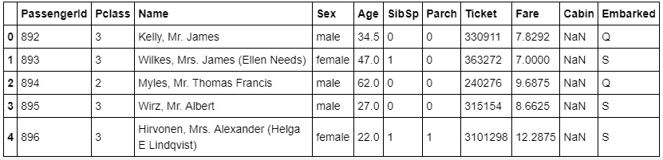*

*测试集也有相同的功能集，但没有输出标签。*

*为了知道我们的模型表现如何，我们需要将我们的模型预测提交给泰坦尼克号 Kaggle 比赛，并等待结果。但是我们可以使用交叉验证来了解我们的模型有多好。*

*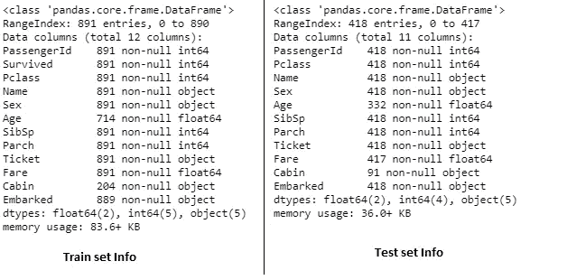*

*A concise summary of both datasets*

*数据集中有空值，即“年龄”和“客舱”属性。我们稍后会处理它们。*

*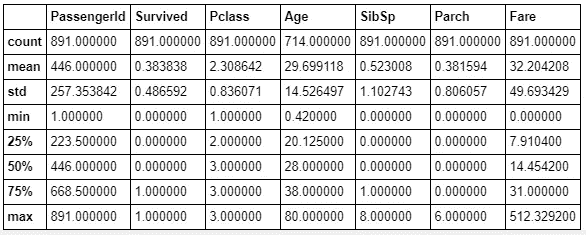*

*Statistical summary of the train set*

*从这个数据可以明显看出，只有 38%的人在事故中幸存。*

# *分析特征*

*在我们的数据集中有 3 个分类输入特征( **Pclass，Sex，abowed**)和 1 个分类标签(**幸存**)，因此有分类任务。*

**我们先来分析一下。**

## *幸存*

```
*print(titanic_trainSet["Survived"].value_counts(sort=False))
print('-'*50)
plt.figure(figsize=(10, 6))
sb.set(style="whitegrid")
sb.countplot( x= 'Survived', hue='Sex', data=titanic_trainSet)
plt.title('Survival Distribution')
plt.show()*
```

*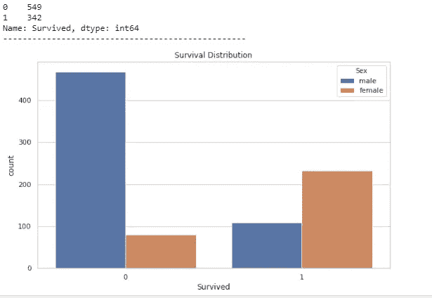*

*很明显，女性比男性更优先考虑生存，因为只有 18%的男性在事故中幸存。*

## *乘客等级*

```
*print(titanic_trainSet[['Pclass', 'Survived']].groupby(['Pclass'], as_index=False).mean())
plt.figure(figsize=(10, 6))
sb.countplot( x= 'Pclass', hue='Survived',data=titanic_trainSet)
plt.title('Survival rate of each class')
plt.show()*
```

*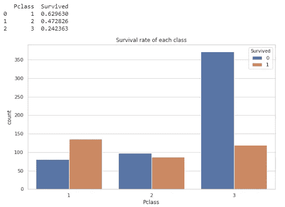*

*高阶层的人比低阶层的人更有可能在事故中幸存下来。*

## *从事*

*这个属性告诉我们乘客在哪里登上泰坦尼克号。*

****C =瑟堡，Q =皇后镇，S =南安普顿。****

```
*print(titanic_trainSet[['Embarked', 'Survived']].groupby(['Embarked'], as_index=False).mean())
plt.figure(figsize=(10, 6))
sb.countplot( x= 'Embarked', hue='Survived', data=titanic_trainSet)
plt.title('Survival rate based on boarding point')
plt.show()*
```

*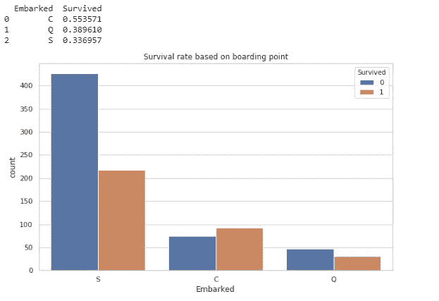*

# *特征工程*

## *船上的亲戚*

***“SibSp”:**告诉泰坦尼克号上乘客的配偶有多少兄弟姐妹&。**“Parch”:**告诉泰坦尼克号上乘客的父母有几个孩子&。*

*总的来说，这两个特征说明了船上乘客亲属的数量。因此，我们可以将这两个特征相加，形成一个特征，即**【相对主板】***

```
*for dataset in full_data:
    dataset['RelativesOnboard'] = dataset['SibSp'] + dataset['Parch']*
```

*我们正在将这个新特性添加到训练集和测试集中。*

```
*print(titanic_trainSet[['RelativesOnboard', 'Survived']].groupby(['RelativesOnboard'], as_index=**False**).mean())
plt.figure(figsize=(10, 6))
sb.countplot( x= 'RelativesOnboard', hue='Survived', data=titanic_trainSet)
plt.title('Survival rate based on no. of relatives')
plt.show()*
```

*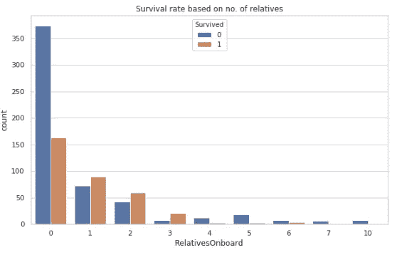*

*独自旅行的人比和他们的亲戚一起旅行的人更不可能存活。*

## *年龄*

*“年龄”是一个连续的属性。但是我们可以根据不同的年龄组将其转换为分类特征。然后我们可以找出每个年龄段的存活率。*

```
*for dataset in full_data:
    dataset['AgeGroup'] = dataset['Age'] // 15 * 15print(titanic_copy[['AgeGroup', 'Survived']].groupby(['AgeGroup'], as_index=False).mean())
plt.figure(figsize=(10, 6))
sb.countplot( x= 'AgeGroup', hue='Survived', data=titanic_copy)
plt.title('Survival rate based on Age')
plt.show()*
```

*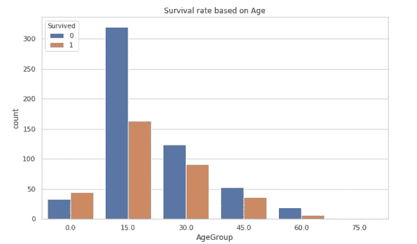*

*创建了 6 个年龄类别，如下所示:*

*   ***0** :年龄≤14 岁*
*   ***15**:15≤年龄≤29*
*   ***30**:30≤年龄≤44*
*   *45:45≤年龄≤59*
*   *60:60≤年龄≤74*
*   ***75**:75≤年龄*

*很明显，年龄在 15 到 35 岁之间的年轻人不太可能存活。*

## *名字*

*我们可以使用' *Name* '属性解析出每个人的' *Title* '，然后将其用作分类特征。*

```
*def parseTitle(name):
 title_search = re.search(' ([A-Za-z]+)\.', name)

 # If the title exists, extract and return it.
 if title_search:
  return title_search.group(1)
 return ""for dataset in full_data:
  dataset['Title'] = dataset['Name'].apply(parseTitle)for dataset in full_data:
    dataset['Title'] = dataset['Title'].replace(['Lady', 'Countess','Capt', 'Col',\
  'Don', 'Dr', 'Major', 'Rev', 'Sir', 'Jonkheer', 'Dona'], 'Rare')dataset['Title'] = dataset['Title'].replace('Mlle', 'Miss')
    dataset['Title'] = dataset['Title'].replace('Ms', 'Miss')
    dataset['Title'] = dataset['Title'].replace('Mme', 'Mrs')*
```

*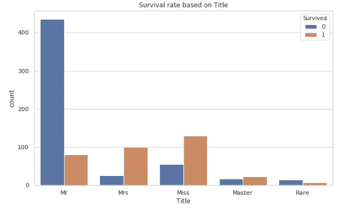*

*不管头衔如何，女性更有可能生存下来。但对男性来说，拥有高级头衔的人比中产阶级男性的存活率更高。只有 15%拥有“先生”头衔的中产阶级男性在事故中幸存。*

# *特征选择*

*因此，在分析和处理这些特征之后，我选择了以下特征来制作我们的模型。*

```
*features_testSet = ['Pclass', 'Sex', 'Embarked', 'Fare', 'Title', 'AgeGroup', 'RelativesOnboard']
features_trainSet = features_testSet + ['Survived']train_set = titanic_trainSet[[*features_trainSet]]
test_set = titanic_testSet[[*features_testSet]]train_set.head()*
```

*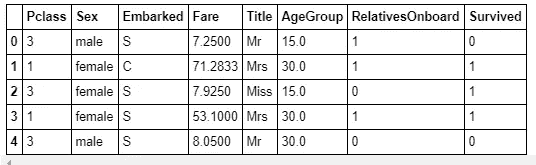*

# *数据预处理*

## *处理缺失值和分类值*

*我使用了 sk learn '[***Pipeline***](https://scikit-learn.org/stable/modules/generated/sklearn.pipeline.Pipeline.html)和'[***column transformer***](https://scikit-learn.org/stable/modules/generated/sklearn.compose.ColumnTransformer.html)'对数据进行预处理。*

*流水线用于应用变换列表和最终估计器。它集合了几个步骤，这些步骤可以在设置不同参数时进行交叉验证。*

*ColumnTransfromer 将转换器应用于数组或熊猫数据帧的列。*

```
*class CategoricalImputer(BaseEstimator, TransformerMixin):
    def fit(self, X, y=None):
        self.most_frequent_ = pd.Series([X[c].value_counts().index[0] for c in X],
                                        index=X.columns)
        return self
    def transform(self, X, y=None):
        return X.fillna(self.most_frequent_)num_pipeline = Pipeline([('imputer', SimpleImputer(strategy="median"))])cat_pipeline = Pipeline([("imputer", CategoricalImputer()), ("cat_encoder", OneHotEncoder(sparse=False))])num_attribs = ['Fare']
cat_attribs = ['Pclass', 'Sex', 'Embarked', 'Title', 'AgeGroup', 'RelativesOnboard']full_pipeline = ColumnTransformer([
        ("num", num_pipeline, num_attribs),
        ("cat", cat_pipeline, cat_attribs),
    ])*
```

**简单估算器*用于填补缺失值，它只负责数字特征。对于字符串分类列，我创建了一个“CategoricalImputer”类。*

*此外，我还使用了 *oneHotEncoder* 来处理文本和分类特性。*

# *功能和标签*

```
*X_train = full_pipeline.fit_transform(train_set)
y_train = train_set["Survived"]*
```

# *选择并训练一个模型*

*在测试集上直接训练之前，首先在训练集上进行训练和评估。此外，尝试不同的 ML 算法，选择最适合数据的算法。*

```
*classifiers = [
    KNeighborsClassifier(3),
    SVC(probability=True, gamma="auto"),
    DecisionTreeClassifier(),
    RandomForestClassifier(),
   AdaBoostClassifier(),
    GradientBoostingClassifier(),
    GaussianNB(),
    LogisticRegression()]classifiers_Kscores = []
classifiers_accuracy = []
for clf in classifiers:
  clf_scores = cross_val_score(clf, X_train, y_train, cv=10)
  classifiers_Kscores.append(clf_scores)
  model_name = type(clf).__name__
  classifiers_accuracy.append(model_name+': '+str(format(clf_scores.mean()*100,'.2f')))*
```

*我已经使用 *cross_val_score* 为每个模型计算了 10 个不同的分数，然后通过计算这 10 个分数的平均值来计算准确度分数。*

*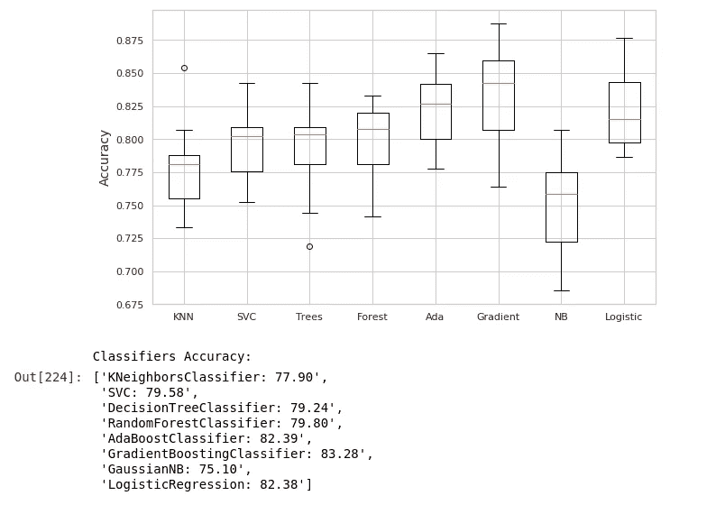*

*Box plot and accuracy score of each model*

*上图显示了每个模型的所有 10 个分数的箱线图，也显示了每个模型的准确性。*

> *准确度分数通常不是分类器的首选性能度量，尤其是当您处理倾斜数据集时(即，当一些类比其他类频繁得多时)。*

*我们还将计算每个分类器的 F1_score，它是精确度和召回率的加权平均值。*

*F1 = 2(精确召回)/(精确+召回)*

```
*splits = StratifiedShuffleSplit(n_splits=1, test_size=0.4, random_state=42)for train_index, test_index in splits.split(X_train, y_train):
  X_train1, X_test1 = X_train[train_index], X_train[test_index]
  y_train1, y_test1 = y_train[train_index], y_train[test_index]f1_scores = []
for clf in classifiers:
  clf.fit(X_train1, y_train1)
  pred = clf.predict(X_test1)
  model_name = type(clf).__name__
  f1_scores.append((model_name+': '+str(format(f1_score(y_test1, pred)*100,'.2f'))))*
```

*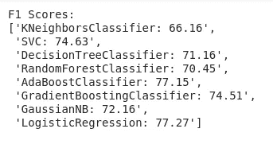*

*F1 scores of each model*

# *在测试集上评估模型*

*基于准确率和 F1 值，我选择了 AdaBoost 分类器。*

```
*X_test = full_pipeline.fit_transform(test_set)ada_clf = AdaBoostClassifier()
ada_clf.fit(X_train,y_train)
y_pred = ada_clf.predict(X_test)passengerID =np.array(titanic_testSet["PassengerId"]).astype(int)
titanicSurvival_predictions = pd.DataFrame(y_pred, passengerID, columns = ["Survived"])titanicSurvival_predictions.to_csv("/content/drive/My Drive/Titanic_Survival_Predictions_ada.csv", index_label = ["PassengerId"])*
```

# *泰坦尼克号灾难的结论*

*在分析了这么多数据，并对数据进行机器学习后，很明显，泰坦尼克号事故的幸存者大多是儿童和妇女。之后，上层阶级的男人优先，最后是中下层阶级的男人。*

*谢谢你的阅读。*