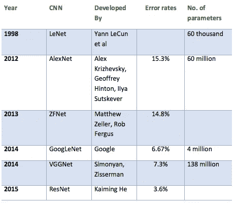
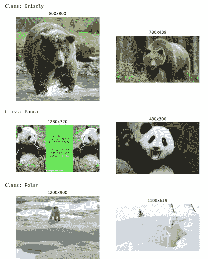
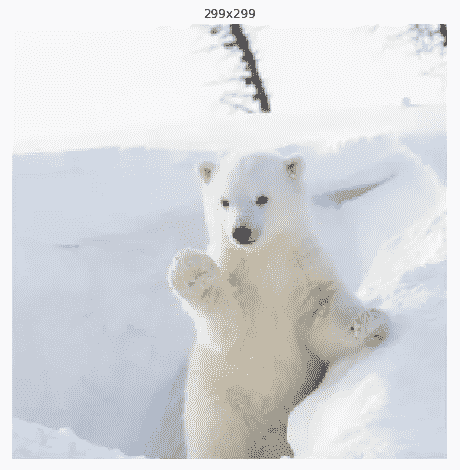
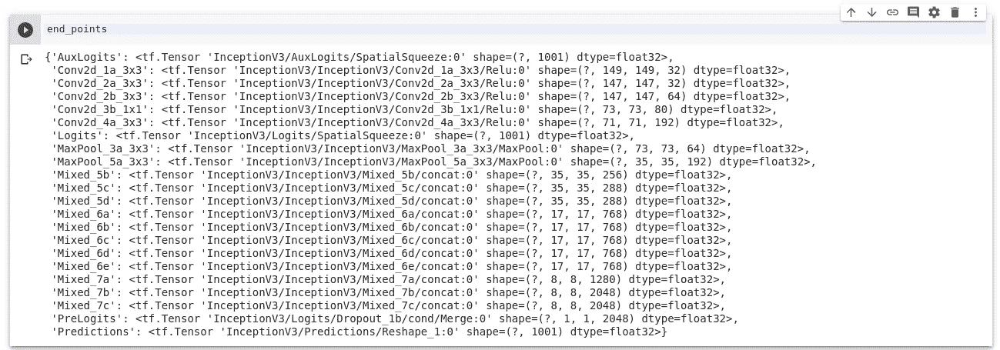
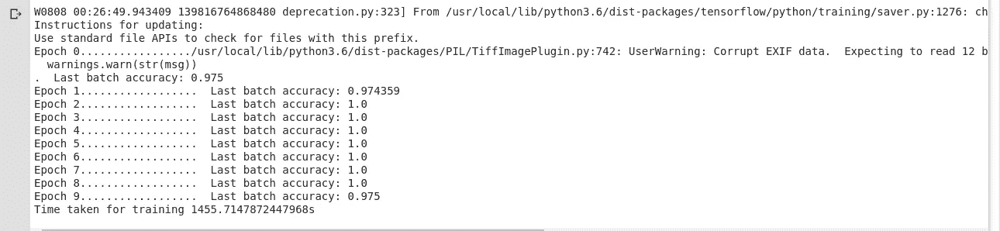

# 做 ML 第 3 部分:CNN

> 原文：<https://medium.datadriveninvestor.com/doing-ml-part-3-cnn-288a24797f76?source=collection_archive---------7----------------------->

[](http://www.track.datadriveninvestor.com/1B9E)

他的博客是我的“做 ML”系列的一部分，这是关于学习 ML 的实践方面。在 [*上一篇博客*](https://medium.com/datadriveninvestor/doing-ml-part-2-classification-c277b13cb80d) *中，我们使用流行的 ML 算法进行分类和回归的监督学习任务。但是有一个算法我们还没有谈到，就是神经网络。*

***神经网络被称为通用函数逼近器，即它们可以解决任何问题，如果该问题可以被公式化为具有一个或多个参数/输入的函数。***

[](https://www.datadriveninvestor.com/2019/01/23/deep-learning-explained-in-7-steps/) [## 深度学习用 7 个步骤解释-更新|数据驱动的投资者

### 在深度学习的帮助下，自动驾驶汽车、Alexa、医学成像-小工具正在我们周围变得超级智能…

www.datadriveninvestor.com](https://www.datadriveninvestor.com/2019/01/23/deep-learning-explained-in-7-steps/) 

*这项技术是我们今天使用的每件产品背后的技术，这些产品都声称“它是人工智能支持的”语音识别和翻译(Siri、谷歌助手、Alexa)、图像分类(人脸识别、物体检测)、推荐系统(亚马逊、网飞)、文本生成……不一而足。*

在这篇博客中，我们将更深入地学习(双关语)解决一个图像分类问题。如果你不知道神经网络是如何工作的，看看这个[神奇的资源](https://www.youtube.com/watch?v=aircAruvnKk&list=PLZHQObOWTQDNU6R1_67000Dx_ZCJB-3pi)。

# 深度学习

这是一种统计技术，涉及**多层神经网络或 DNN(深度神经网络)，因此得名**，通过每一层处理和提炼结果。

有不同的神经网络架构来解决特定的问题。它们不是为解决某个特定问题而设计的，但有些神经网络在某项任务上比其他网络表现得更好。像 **CNN** 在解决图像相关问题方面很流行:图像分类，物体检测等。RNN 在自然语言处理方面取得了巨大的成功，尤其是他们的变种 LSTM。用于无监督学习任务的自动编码器。

我将在以后的博客中谈论 RNN、LSTM 和无监督学习。在这一集里，我们将关注 CNN。

## 卷积神经网络

CNN 源于对大脑视觉皮层的研究，自 20 世纪 80 年代以来，它们就被用于图像识别。在过去的几年里，由于计算能力和可用训练数据量的增加，CNN 已经成功地在一些复杂的视觉任务上实现了超人的性能。


Basic Architecture of a CNN

典型的 CNN 架构堆叠了几个卷积层(每个卷积层之后通常是一个 ReLU 层)，然后是一个池层，然后是另外几个卷积层(+ReLU)，然后是另一个池层，依此类推。在堆栈的顶部，添加了一个常规的前馈神经网络，由几个完全连接的层(+ReLUs)组成，最后一层输出预测(例如，一个 softmax 层输出估计的类概率)。

多年来，这种基础架构的变体已经被开发出来，在该领域取得了惊人的进步。



Popular CNN architectures

# 设置工作区

我正在为这个项目使用谷歌 Colab，它允许你使用免费的特斯拉 K80 **GPU** 它也给你总共 12 GB 的内存，你**可以**连续使用它长达 12 个小时。你也可以使用 Kaggle 内核。

# 熊分类

目标是分类一张给定的图像是 T4 灰熊、熊猫还是北极熊。我发现当有我可以从中获得乐趣的数据时，学习会容易得多。我用这个 [python 包从网上搜集了数据。](https://github.com/hardikvasa/google-images-download)

有两种方法可以解决这个问题:

*   从头开始制作我们自己的 CNN 模型
*   还是做迁移学习

**迁移学习**是一种技术，在这种技术中，在一项任务中训练的模型被重新用于另一项相关任务。你拿一个在一个数据集上训练的 CNN，砍掉最后一层，在另一个数据集上重新训练模型的最后一层。直观地说，您是在重新训练模型来识别不同的高级功能。结果，训练时间被大大缩短了。因此，当你没有足够的数据或培训占用太多资源时，迁移学习是一个有用的工具。

> 迁移学习是一般智力的关键。Deepmind 联合创始人戴密斯·哈萨比斯


Traditional Learning vs Transfer Learning

对于这个项目，我使用 TensorFlow 进行深度学习，并使用预训练的 Inception v3 模型进行迁移学习。

## 盗梦空间 v3

Inception-v3 是一个卷积神经网络，它在 ImageNet 数据库中的超过一百万张图像上进行训练。该网络有 48 层，可以将图像分为 1000 个对象类别，如键盘、鼠标、铅笔和许多动物。因此，该网络已经学习了各种图像的丰富特征表示。网络的图像输入大小为 299 x 299。[关于盗梦空间的更多信息](https://medium.com/@sh.tsang/review-inception-v3-1st-runner-up-image-classification-in-ilsvrc-2015-17915421f77c)

> 所以，让我们分类。

你可以在这里找到完整的项目[。](https://github.com/ketanpandey01/Bears-Classification)

# 导入依赖项

```
**# Utilities**
import sys
import tarfile
from six.moves import urllib
import os
import time**# Data Visualization**
import matplotlib.image as mpimg
import matplotlib.pyplot as plt**# Tensorflow**
import tensorflow as tf
from tensorflow.contrib.slim.nets import inception
import tensorflow.contrib.slim as slim**# Data manipulation**
from random import sample
import numpy as np
from collections import defaultdict**# Image Processing**
from skimage.transform import resize
```

# 获取数据

我已经把所有的数据放在 google drive 上了，你可以从[这里](https://drive.google.com/file/d/1fGyktZ4mZhMOXvv4Tq5q-YI2QC73VE-n/view?usp=sharing)下载。

```
BEARS_IMAGES_ZIP = "/content/drive/My Drive/Datasets/bear_photos.tar.xz"
BEARS_IMAGES_PATH = os.path.join("/content/drive/My Drive/Colab Notebooks/","datasets", "bears")def fetch_bears(tgz_path=BEARS_IMAGES_ZIP, path=BEARS_IMAGES_PATH):
    if os.path.exists(BEARS_IMAGES_PATH):
      print("Data already loaded")
      return
    os.makedirs(path, exist_ok=True)
    bears_tgz = tarfile.open(tgz_path)
    bears_tgz.extractall(path=path)
    bears_tgz.close()
    #os.remove(tgz_path)fetch_bears()
```

该函数将从 zip 文件中提取数据，并将其放入 google drive 路径中。

# 数据预处理

我们需要获得每个类的所有图像文件路径的列表。

```
image_paths = defaultdict(list)for bear_class in bears_classes:
    image_dir = os.path.join(bears_root_path, bear_class)
    for filepath in os.listdir(image_dir):
        if filepath.endswith(".jpg"):
            image_paths[bear_class].append(os.path.join(image_dir, filepath))print("No. of images in each class:")
print("Grizzly {}".format(len(image_paths['Grizzly'])))
print("Panda {}".format(len(image_paths['Panda'])))
print("Polar {}".format(len(image_paths['Polar'])))
```

每类图像数量:
灰熊:338
熊猫:328
极地:253

## 从每个班级看几张图片

```
n_examples_per_class = 2for bear_class in bears_classes:
    print("Class:", bear_class)
    plt.figure(figsize=(10,5))
    for index, example_image_path in enumerate(image_paths[bear_class][:n_examples_per_class]):
        example_image = mpimg.imread(example_image_path)[:, :, :3]
        plt.subplot(100 + n_examples_per_class * 10 + index + 1)
        plt.title("{}x{}".format(example_image.shape[1], example_image.shape[0]))
        plt.imshow(example_image)
        plt.axis("off")
    plt.show()
```



Random Images

Inception 接受(299 x 299)的图像输入大小。因此，我们需要在将图像交给模型之前对其进行处理。

# 图像处理

```
def prepare_image(image, target_width = 299, target_height = 299, max_zoom = 0.2):
   ** """Zooms and crops the image randomly for data augmentation."""****# First, let's find the largest bounding box with the target size ratio that fits within the image**
    height = image.shape[0]
    width = image.shape[1]
    image_ratio = width / height
    target_image_ratio = target_width / target_height
    crop_vertically = image_ratio < target_image_ratio
    crop_width = width if crop_vertically else int(height * target_image_ratio)
    crop_height = int(width / target_image_ratio) if crop_vertically else height

 **# Now let's shrink this bounding box by a random factor (dividing the dimensions by a random number between 1.0 and 1.0 + `max_zoom`.**
    resize_factor = np.random.rand() * max_zoom + 1.0
    crop_width = int(crop_width / resize_factor)
    crop_height = int(crop_height / resize_factor)

 **# Next, we can select a random location on the image for this bounding box.**
    x0 = np.random.randint(0, width - crop_width)
    y0 = np.random.randint(0, height - crop_height)
    x1 = x0 + crop_width
    y1 = y0 + crop_height

    **# Let's crop the image using the random bounding box we built.**
    image = image[y0:y1, x0:x1]**# Let's also flip the image horizontally with 50% probability:**
    if np.random.rand() < 0.5:
        image = np.fliplr(image)**# Now, let's resize the image to the target dimensions.
# The resize function of scikit-image will automatically transform the image to floats ranging from 0.0 to 1.0**
    image = resize(image, (target_width, target_height))

**# Finally, let's ensure that the colors are represented as 32 bit floats:**
    return image.astype(np.float32)
```

这一步将调整图像的大小并将其裁剪为(299 x 299 ),增加数据的随机性。

**处理后的图像**

```
prepared_image = prepare_image(example_image)plt.figure(figsize=(8, 8))
plt.imshow(prepared_image)
plt.title("{}x{}".format(prepared_image.shape[1], prepared_image.shape[0]))
plt.axis("off")
plt.show()
```



Processed Image

# 将数据分为训练集和测试集

现在，类以字符串的形式出现，如“Grizzly”，“Panda”，“Polar”。我们需要将它们转换成整数，以便模型能够理解输出类。

```
bear_class_ids = {bear_class: index for index, bear_class in enumerate(bears_classes)}
```

{ '灰熊':0，'熊猫':1，'极地':2}

为了方便数据的混排，我们可以将它表示为一个(file_path，class)对的列表。

```
bear_paths_and_classes = []
for bear_class, paths in image_paths.items():
    for path in paths:
        bear_paths_and_classes.append((path, bear_class_ids[bear_class]))# Splitting the data into train and test set. Dividing in 80:20 ratio.
test_ratio = 0.2
train_size = int(len(bear_paths_and_classes) * (1 - test_ratio))np.random.shuffle(bear_paths_and_classes)bear_paths_and_classes_train = bear_paths_and_classes[:train_size]
bear_paths_and_classes_test = bear_paths_and_classes[train_size:]bear_paths_and_classes_train[:3]
```

**训练时，我们需要对图像进行预处理，并将数据批量输入到模型中。我们可以创建一个函数来做到这一点。**

```
def prepare_batch(bear_paths_and_classes, batch_size):
  batch_paths_and_classes = sample(bear_paths_and_classes, batch_size)

  X_batch = []
  y_batch = []
  corrupt_images = []
  prepared_images = []
  for path, labels in batch_paths_and_classes:
    image = mpimg.imread(path)
    if image.shape is ():
      corrupt_images.append(path)
    else:
      image = mpimg.imread(path)[:, :, :3]
      prepared_images.append(prepare_image(image))
      y_batch.append(labels)

  X_batch = 2 * np.stack(prepared_images) - 1
  y_batch = np.array(y_batch, dtype=np.int32)
  return X_batch, y_batch
```

# 加载预先训练的初始模型

我们将冻结所有层，直到瓶颈层(即输出层之前的最后一层)，并用新分类任务的适当数量的输出替换输出层(即熊数据集有 3 个互斥的类，因此输出层必须有三个神经元并使用 softmax 激活函数)。

```
TF_MODELS_URL = "[http://download.tensorflow.org/models](http://download.tensorflow.org/models)"
INCEPTION_V3_URL = TF_MODELS_URL + "/inception_v3_2016_08_28.tar.gz"
INCEPTION_PATH = os.path.join("/content/drive/My Drive/Colab Notebooks/","datasets","inception")
INCEPTION_V3_CHECKPOINT_PATH = os.path.join(INCEPTION_PATH, "inception_v3.ckpt")def download_progress(count, block_size, total_size):
    percent = count * block_size * 100 // total_size
    sys.stdout.write("\rDownloading: {}%".format(percent))
    sys.stdout.flush()def fetch_pretrained_inception_v3(url=INCEPTION_V3_URL, path=INCEPTION_PATH):
    if os.path.exists(INCEPTION_V3_CHECKPOINT_PATH):
        print("Model already downloaded")
        return
    os.makedirs(path, exist_ok=True)
    tgz_path = os.path.join(path, "inception_v3.tgz")
    urllib.request.urlretrieve(url, tgz_path, reporthook=download_progress)
    inception_tgz = tarfile.open(tgz_path)
    inception_tgz.extractall(path=path)
    inception_tgz.close()
    os.remove(tgz_path)fetch_pretrained_inception_v3()
```

所有经过训练的参数，如权重和偏差，都从检查点下载并存储在 google drive 路径中。我们将在训练模型时恢复它们。

## 获取 Inception v3 图

```
X = tf.placeholder(tf.float32, shape=[None, height, width, channels], name="X")
training = tf.placeholder_with_default(False, shape=[])
with slim.arg_scope(inception.inception_v3_arg_scope()):
    logits, end_points = inception.inception_v3(X, num_classes=1001, is_training=training)inception_saver = tf.train.Saver()
```

**我们需要找到输出图层之前的图层，这样我们就可以在该图层上进行构建。**



The “PreLogits” endpoint is precisely what we need

现在，我们可以在这一层上添加最终的全连接层。

```
prelogits = tf.squeeze(end_points["PreLogits"], axis=[1, 2])
n_outputs = len(bears_classes)with tf.name_scope("new_output_layer"):
    bear_logits = tf.layers.dense(prelogits, n_outputs, name="bear_logits")
    Y_proba = tf.nn.softmax(bear_logits, name="Y_proba")
```

最后，我们需要添加一些常用的零碎内容:

*   目标(`y`)的占位符，
*   损失函数是交叉熵，通常用于分类任务，
*   一个优化器，我们用它来创建一个训练操作来最小化成本函数，
*   测量模型准确性的几个操作，
*   最后是一个初始化器和一个保存器。

因为我们只想训练输出层(所有其他层必须冻结)，所以我们必须把要训练的变量列表传递给优化器的`minimize()`方法。

```
y = tf.placeholder(tf.int32, shape=[None])with tf.name_scope("train"):
    xentropy = tf.nn.sparse_softmax_cross_entropy_with_logits(logits=bear_logits, labels=y)
    loss = tf.reduce_mean(xentropy)
    optimizer = tf.train.AdamOptimizer()
    bear_vars = tf.get_collection(tf.GraphKeys.TRAINABLE_VARIABLES, scope="bear_logits")
    training_op = optimizer.minimize(loss, var_list=bear_vars)with tf.name_scope("eval"):
    correct = tf.nn.in_top_k(bear_logits, y, 1)
    accuracy = tf.reduce_mean(tf.cast(correct, tf.float32))with tf.name_scope("init_and_save"):
    init = tf.global_variables_initializer()
    saver = tf.train.Saver()
```

# 训练模型

我们准备好训练我们的网络(或者更准确地说，我们刚刚添加的输出层，因为所有其他层都被冻结了)。我们将使用“保护程序”来恢复我们之前下载的预训练模型检查点。

```
**# This is the path where our model parameters will be saved.**
BEARS_MODEL_CHECKPOINT_PATH = os.path.join(INCEPTION_PATH, "my_bears_model.ckpt")n_epochs = 10
batch_size = 40
n_iterations_per_epoch = len(bear_paths_and_classes_train) // batch_size
startTime = time.time()with tf.Session() as sess:
    init.run()
    inception_saver.restore(sess, INCEPTION_V3_CHECKPOINT_PATH)for epoch in range(n_epochs):
        print("Epoch", epoch, end="")
        for iteration in range(n_iterations_per_epoch):
            print(".", end="")
            X_batch, y_batch = prepare_batch(bear_paths_and_classes_train, batch_size)
            sess.run(training_op, feed_dict={X: X_batch, y: y_batch, training: True})acc_batch = accuracy.eval(feed_dict={X: X_batch, y: y_batch})
        print("  Last batch accuracy:", acc_batch)**#This is saving our model parameters.**
save_path = saver.save(sess, BEARS_MODEL_CHECKPOINT_PATH)endTime = time.time()
print("Time taken for training {}s".format(endTime-startTime))
```

培训可能需要很长时间。这将取决于您的硬件配置。由于我使用 Colab GPU 运行笔记本电脑，我花了大约 25 分钟进行训练。



# 测试模型

```
n_test_batches = 10
X_test_batches = np.array_split(X_test, n_test_batches)
y_test_batches = np.array_split(y_test, n_test_batches)saver = tf.train.Saver()with tf.Session() as sess:
    saver.restore(sess, BEARS_MODEL_CHECKPOINT_PATH)print("Computing final accuracy on the test set (this will take a while)...")
    acc_test = np.mean([
        accuracy.eval(feed_dict={X: X_test_batch, y: y_test_batch})
        for X_test_batch, y_test_batch in zip(X_test_batches, y_test_batches)])

    print('Test accuracy:',format(acc_test*100,'.2f'),'%')
```

在测试数据上对模型进行测试后，模型准确率 **98%** ，还不错。我们可以通过增加时期或解冻更多的层或使用更多的数据来改善它。如果您有一个高端 GPU，您可以再次尝试，让训练运行更长时间(例如，使用早期停止来决定何时停止)。您还可以改进图像预处理功能，对图像进行更多调整(例如，更改亮度和色调，稍微旋转图像)。

# 让我们对一些随机图像进行预测

```
bear_class_dict = {0:'Grizzly', 1:'Panda', 2:'Polar'}
bear_predictions = []for path, labels in sample(bear_paths_and_classes_test,6):
  image = mpimg.imread(path)[:, :, :3]
  prepared_image = prepare_image(image)
  show_image = prepared_image
  prepared_image = 2 * prepared_image - 1
  prepared_image = prepared_image.reshape(-1, height, width, channels)

  with tf.Session() as sess:
    saver.restore(sess, BEARS_MODEL_CHECKPOINT_PATH)
    predictions_val = Y_proba.eval(feed_dict={X: prepared_image})

  bear_predictions.append((show_image, np.argmax(predictions_val)))

rows, cols = 2, 3
count=0
plt.figure(figsize=(14, 8))
for row in range(rows):
    for col in range(cols):
        prepared_image = bear_predictions[count][0]
        plt.subplot(rows, cols, row * cols + col + 1)
        plt.title("{}".format(bear_class_dict[bear_predictions[count][1]]))
        plt.imshow(prepared_image)
        plt.axis("off")
        count+=1
plt.show()
```


Prediction on random images

它工作得很好。你现在可以带着你的熊，不用担心它在森林里迷路了。

谢谢你的阅读。