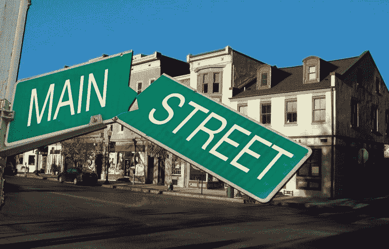
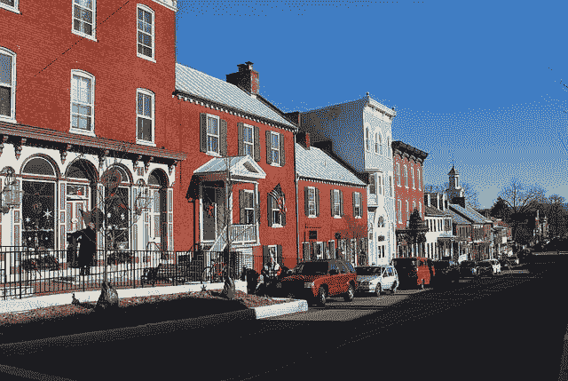
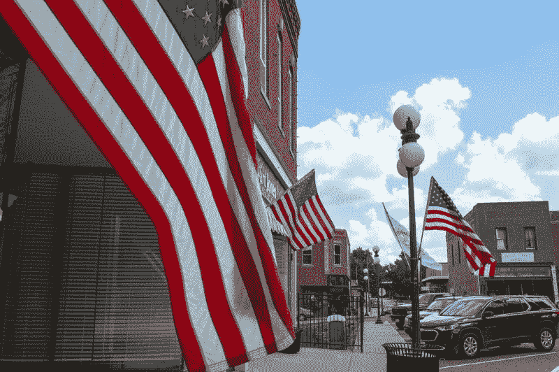
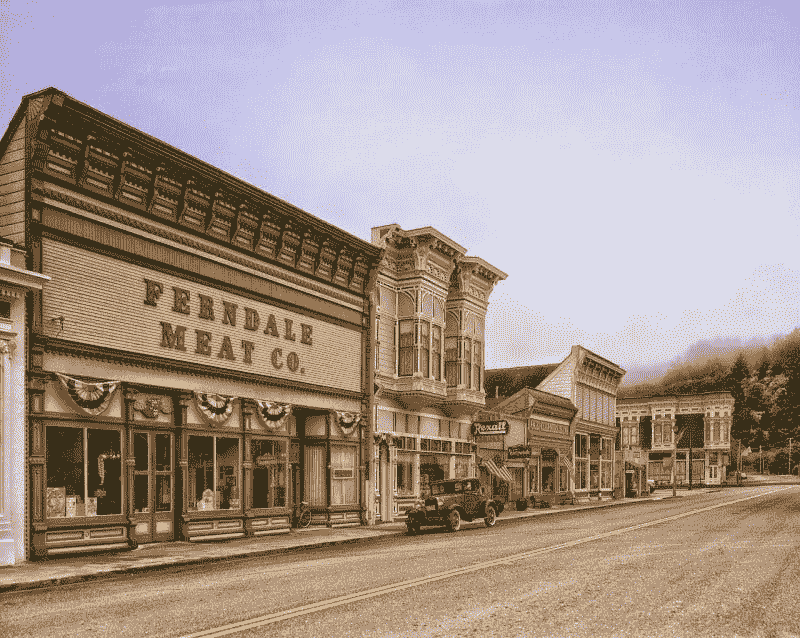
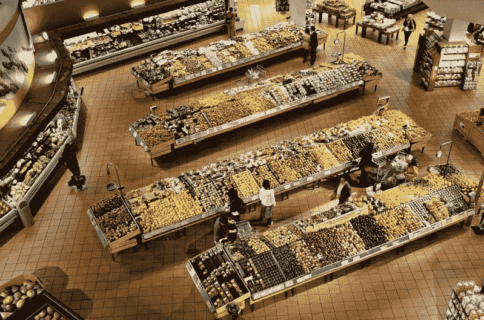
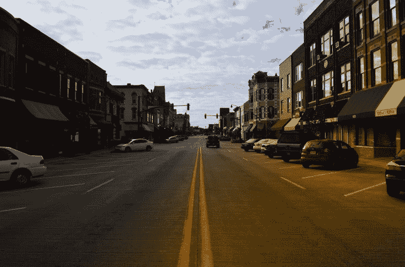
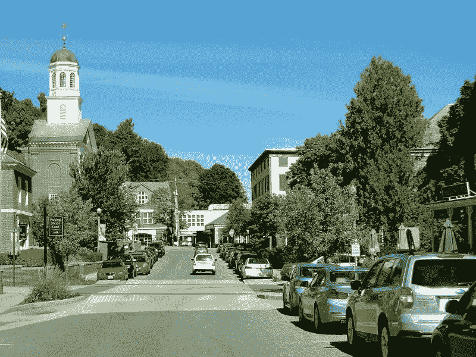
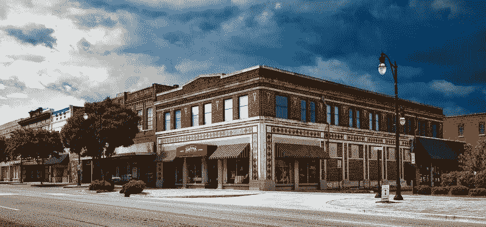

# 美元将军与美国农村经济学——市场疯人院

> 原文：<https://medium.datadriveninvestor.com/dollar-general-and-the-economics-of-rural-america-market-mad-house-5a71afe56e51?source=collection_archive---------5----------------------->

我认为投资者需要避开通用美元(纽约证券交易所代码:DG)T1，因为美国农村的经济糟糕透了。

解释一下，Dollar General 在其他零售商拒绝去的小镇上经营一元店。例如，在佛罗里达州的鲍德温，镇政府不得不用税收资助一家杂货店。

鲍德温又小又穷，没有杂货商愿意在那里经营。因此，镇政府经营着一家超市，他们称之为鲍德温市场，*食品&酒*T4 报道。据佛罗里达州联合时报报道，鲍德温镇使用了 15 万美元的政府资金重新开放了一个空的 IGA 市场。

镇领导开放市场是为了阻止人们远离食物沙漠。奇怪的是，鲍德温的困境显示了美元通用的问题。

# 美元将军能在大街上赚钱吗？

据 Statista [估计，Dollar General 在美国经营着 15370 家 Dollar 商店。许多这样的商店都在小城镇里；比如鲍德温，营利性零售商赚不到钱。](https://www.statista.com/statistics/253587/number-of-stores-of-dollar-general-in-the-united-states/)

Dollar General 凭借其简单、朴实的商业模式在这些地方生存了下来。然而，在这样的环境下赚钱很难。在农村地区，收入和利润都很低。

例如，据《世界人口评论》估计，佛罗里达州鲍德温的家庭年收入中值为 44271 美元。与此同时，Arcgis.com 估计，2017 年美国的平均家庭规模为 2.16 人。

 [## 经济就是包容人|数据驱动的投资者

### 建模，数据，最重要的是，人 Tayo Oyedeji 博士在他的食谱中混合了所有这些成分，为一个…

www.datadriveninvestor.com](https://www.datadriveninvestor.com/2019/03/06/economy-is-all-about-including-people/) 

如果你把 44，271 美元除以 2.16，你会得到 17，027.31 美元。因此，佛罗里达州鲍德温的个人年收入中值为 17，027.31 美元。因此，任何企业都很难在鲍德温赚钱。

美元将军的问题是美国到处都是鲍尔温；低收入和人口减少的城镇。Dollar General 在这些地方经营，因为它在那些主要街道上几乎没有竞争。然而，Dollar General 几乎没有竞争对手，因为没有人愿意在那里经营。

# 亚马逊如何威胁美元通用

美元通用的问题因其最大的直接竞争对手而加剧；**亚马逊(纳斯达克股票代码:AMZN)** 。

亚马逊将顾客想要的几乎所有东西直接送货上门，甚至在鲍德温这样的城镇也是如此。如果 **UPS(纽约证券交易所股票代码:UPS)** 、 **FedEx(纽约证券交易所股票代码:FDX)** ，亚马逊物流可以到达一个城镇，亚马逊就可以服务那里的顾客。此外，如果镇上有邮局，亚马逊可以运送到那里。

这对于 Dollar General 来说是个问题，因为亚马逊的资源无限大于 DG。例如，Dollar General 在 2019 年 10 月 31 日有 2.7608 亿美元的现金和短期投资。与此同时，亚马逊在同一天有 434.01 亿美元的现金和短期投资。

因此，亚马逊有无限量的现金来支付送货司机将货物运送到小城镇。此外，亚马逊有能力降低通用美元的价格，但仍能赚钱。例如，亚马逊 Prime 可以以普通美元的一半价格出售除臭剂或玉米片，希望顾客也会订购一个新电锯或一双靴子。

与此同时，如果销售不佳，Dollar General 将需要借钱来运营。值得注意的是，Dollar General 在 2019 年 12 月 31 日报告了 104.51 亿美元的长期债务。

# 亚马逊如何摧毁美元将军

对 Dollar General 来说，一个更大的危险是亚马逊会带走小城镇里所有有钱的顾客。解释一下，所有中上阶层的居民都会在 Amazon Prime 上购物。

因此，Dollar General 将只留给那些年老、贫穷和没有受过教育的顾客。从本质上讲，亚马逊可以把 Dollar General 留给那些只有很少或没有钱的顾客。

这种现象已经困扰着食品沙漠，如佛罗里达州的鲍德温。澄清一下，在这些城镇中，中上层阶级的人要么在网上订购一切，要么开车去**好市多(纳斯达克代码:COST)** 或**沃尔玛(纽约证券交易所代码:WMT)** 购物。

这使得主要街道的商人只剩下穷人和老人。因此，杂货商、药店和其他人离开城镇，因为他们在那里赚不到钱。美元通用；和它的竞争对手**美元树(纳斯达克:DLTR)，**留下来，因为他们的利润率低到足以在这样的环境中生存。

严重的危险是，一个小镇的经济活动量可能会下降到如此之低，甚至美元通用可能会亏损。放大全国范围的危机，我很容易想象美元全面崩溃。

# 为什么美元会迅速崩溃

我认为美元通用(纽约证券交易所代码:DG) 可能会很快崩溃，因为它几乎不赚钱。

例如，Dollar General 在截至 2019 年万圣节的季度中，其 15，370 家门店的毛利仅为 20.65 亿美元。相比之下，亚马逊在 2019 年 9 月 30 日报告的季度毛利为 286.79 亿美元。

此外，Dollar General 报告上一季度的营业收入为 4.9142 亿美元，净收入为 3.6555 亿美元。此外，Dollar General 报告 2019 年 10 月 31 日的运营现金流为 5.3059 亿美元，期末现金为 1，651 万美元。

# 美元将军会陷入死亡螺旋吗？

因此，Dollar General 几乎没有现金，所以它可能会很快耗尽资金。

此外，Dollar General 在 2019 年 10 月 31 日报告了 2.8953 亿美元的融资现金流。我认为融资现金流表明美元通用借钱来为其运营融资。

我认为，财务数据显示，美元通用可能接近零售死亡螺旋。当零售商没有产生足够的现金来偿还债务时，就会出现死亡螺旋。这种情况随时都可能在美元综合医院发生。

值得注意的是，Dollar General 在 2019 年 7 月 31 日报告了负的期末现金流-1154 万美元。这表明，通用美元公司消耗的现金超过了其销售收入。

因此，我认为，只要几个州出现几个月的经济衰退，美元就会跌入死亡漩涡。另一种情况是，亚马逊 Prime 几个月的大折扣可能会夺走 DG 的所有中产阶级客户，从而迫使 Dollar General 破产。

# 如果美元通用崩溃会怎样？

美元综合商店的倒闭可能会给主街带来灾难，因为数百万穷人现在把一元店当作他们的“杂货店”

解释一下，数百万美国人生活在食物沙漠中。食物沙漠是一个没有杂货店的城镇或社区。食物沙漠的一个很好的例子是离超市不远的城市社区。

在食物沙漠，没有汽车的人；或者亚马逊 Prime 或 Instatcart 的资金，依赖于 Aldi、**、CVS Health (NYSE: CVS)** 或 Dollar General 等零售商。如果 CVS 或者美元将军，关闭这些人可能会失去食物。值得注意的是，药店经营者 CVS Health 现在是美国最大的杂货商之一，*Market Mad House*[claims](https://marketmadhouse.com/cvs-health-is-one-of-americas-biggest-grocers/)。

# 美国食物沙漠

因此，像 Dollar General 这样的零售商的倒闭可能会导致美国一些地区的饥饿或食品骚乱。在这种情况下，许多地方政府可以效仿鲍德温，开设自己的杂货店。

令人震惊的是，美国最大的药店运营商和城市杂货商 [**【沃尔格林】**](https://marketmadhouse.com/is-walgreens-doomed/) **(纳斯达克股票代码:WBA)** 的情况如此糟糕，其管理层正在考虑将公司私有化。因此，美国可能很快就会看到大型药店或一元店经营者的倒闭。

我不得不怀疑联邦政府是否会有压力介入救助像沃尔格林或家庭美元这样的零售商。值得注意的是，*《华盛顿邮报》* [将佛罗里达州的](https://www.washingtonpost.com/nation/2019/11/22/baldwin-florida-food-desert-city-owned-grocery-store/)鲍德温描述为一个“深红色的城镇”，唐纳德·j·特朗普总统(佛罗里达州共和党)在那里很受欢迎。然而，鲍德温的领导人不得不求助于社会主义来维持居民餐桌上的食品杂货。

# 基本收入是答案吗？

美国需要解决主街上日益增长的零售灾难，以免让家庭无法获得食物。我认为解决零售业末日的一个方法是解决收入不平等和贫困问题。

我认为解决收入不平等的最好方法是基本收入计划，比如总统候选人杨安泽的自由红利计划。在《自由红利》中，杨提议用增值税来支付所有美国人每月 1000 美元的基本收入。

收入不平等的其他潜在解决方案包括增加社会保障金，工作保障和更高的最低工资。一个糟糕的解决方案可能是禁止或关闭 Amazon Prime。然而，我认为对于食物沙漠危机以及导致这一危机的收入不平等，没有好的资本主义解决方案。

# 为什么投资者需要远离美元

我认为投资者需要远离 **Dollar General (NYSE: DG)** 尽管它将于 2019 年 1 月 6 日支付 32₵季度股息。

投资者需要远离 DG，因为它可能会迅速崩溃，使股票一文不值。因此，市场先生在 2019 年 12 月 20 日将美元价格高估至 156.65 美元。与此同时，濒临倒闭的零售商的股票；J.C. Penney 公司(纽约证券交易所代码:JCP)在同一天的交易价格是 1.09 美元。

然而，你可以从 Dollar General 赚钱，因为它将于 2020 年 1 月 6 日支付 32₵股息。2019 年 12 月 17 日，Dividend.com 向 Dollar General 提供了 0.84%的股息收益率，年化支付额为 1.28 美元，支付率为 19.26%。

相反，我认为美元通用的风险超过了潜在回报。投资者和投机者需要密切关注 Dollar General，因为这家零售商可能会倒闭。

*原载于 2019 年 12 月 20 日*[*【https://marketmadhouse.com】*](https://marketmadhouse.com/dollar-general-and-the-economics-of-rural-america/)*。*