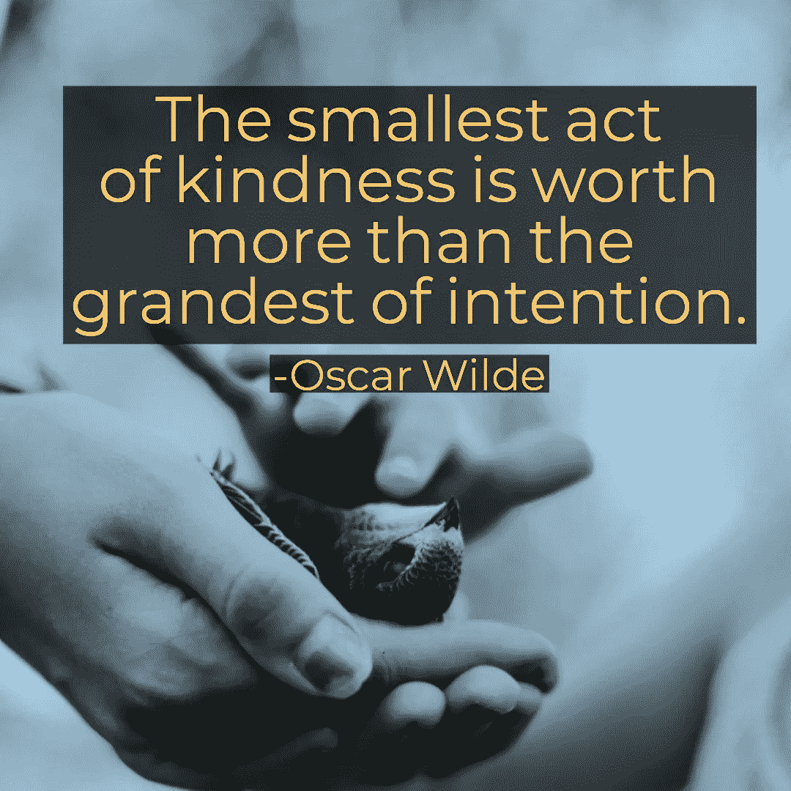
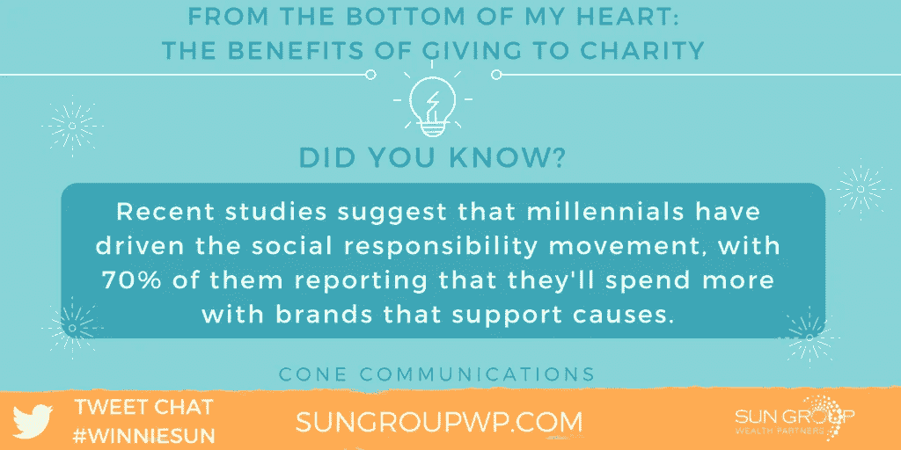
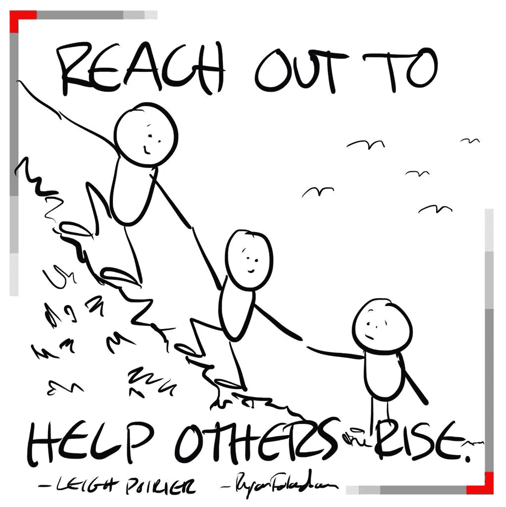
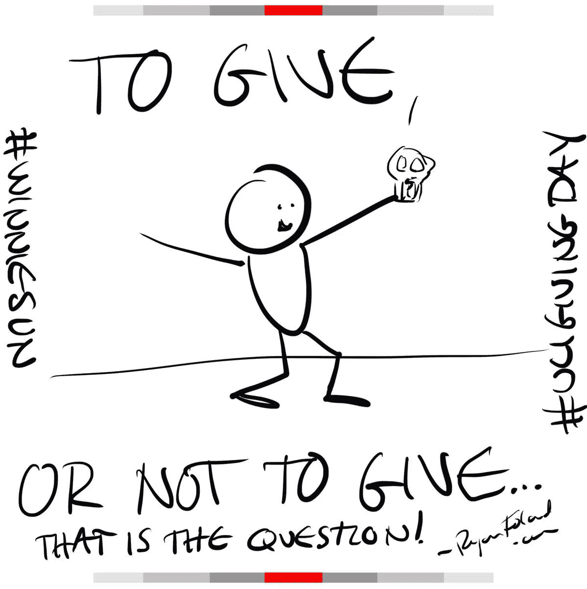
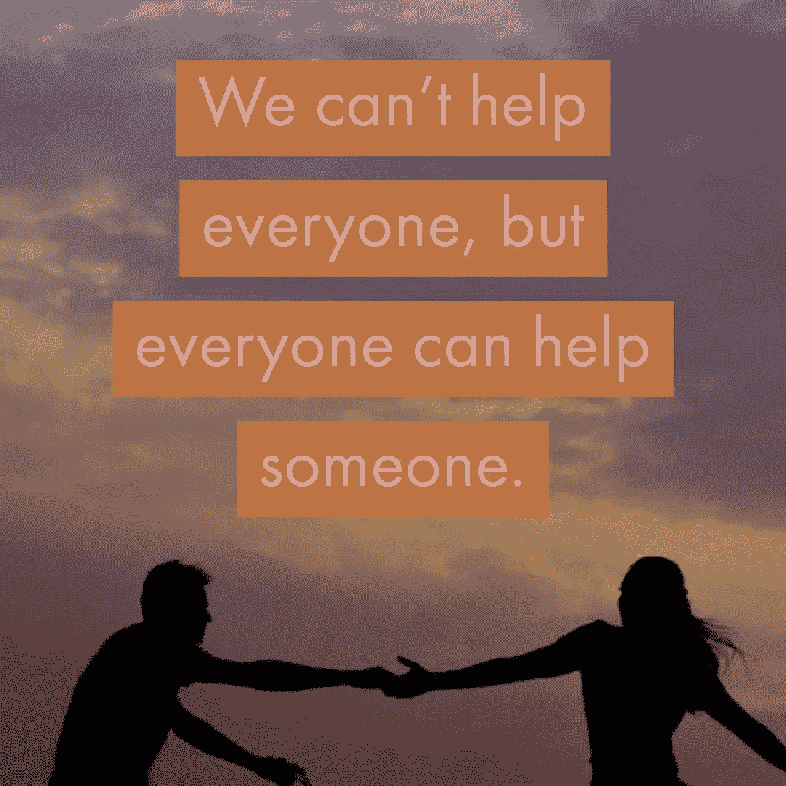

# 正确的捐赠可以帮助接受者和给予者

> 原文：<https://medium.datadriveninvestor.com/donations-done-right-help-recipients-and-givers-2ada76c63bd6?source=collection_archive---------3----------------------->

## 个人和企业都可以为有需要的人服务

向慈善机构捐款对那些接受帮助的人和捐款的人都有好处。贡献可以是金钱或时间的形式。

[瑞安·佛兰德](https://twitter.com/ryanfoland/)、[迈克尔·丹宁](https://twitter.com/DenninMichael)和[温妮·孙](http://winniesun.com/about/)讲述了为什么捐赠很重要，以及人们和企业如何参与其中。

佛兰德是一名沟通策略师，他“喜欢帮助人们更有效地传达他们的企业和个人品牌。”

丹宁是加州大学欧文分校负责教学的副教务长。

孙是业内最受欢迎的金融专业人士之一。

时间是对慈善事业更有价值的贡献。钱只会呆在那里，直到人们花时间去利用它。

 [## 慷慨的礼物不断给予

### 注意并尊重彼此的贡献

medium.com](https://medium.com/datadriveninvestor/generositys-gift-keeps-giving-155adfc5dd54) 

“在大多数情况下，金钱可能更容易给予，但我们的时间更有价值，”孙说。“这是个人的，对慈善机构来说是特殊的。比如，我喜欢把这两样都给学校，但时间越来越少了。”

丹宁同意了。

“时间是关键，”他说。“每个人都可以通过帮助和支持来追求自己的激情。

“时间通常更有价值，但在有些地方，金钱在为人们赢得时间去做他们原本无法做的事情方面发挥着重要作用，”丹宁说。"注意什么时候金钱实际上是时间真的有帮助."

佛兰德说，不管用什么方式，帮助都是巨大的。

“你能给出哪个才是真正的问题，”他说。“给不了时间，就给钱。如果你能给时间，就给时间。如果你能两者兼得，那就去做吧。”

# 尽职调查

捐赠前，确保你捐赠的慈善机构声誉良好。这包括几个因素。

“这些年来，我对捐赠给哪些慈善机构已经非常小心了，”孙说。“我们有一个委员会来过滤未来几年的申请。一切都计划好了。这也让我们的预算有了着落。”

丹宁靠的是口碑。

“我倾向于依靠信任的朋友的经验，”他说。“没有什么比个人推荐更好的了。

“最终，目标是有效的结果，”丹宁说。“有些人担心有多少钱‘直接用于慈善事业’这可能会产生误导，因为目标并不总是用金额来衡量。这是那些美元的影响。"

 [## 你发自内心的感激表明你真的在乎

### 给予感激必须是每天的事情

medium.com](https://medium.com/an-idea/your-heartfelt-gratitude-shows-you-really-do-care-eeed3dbd56fe) 

佛兰德倾向于通过互联网搜索来验证。

“在网上很容易发现人和组织，”他说。“我会检查他们的社交活动，看看有什么对话。或者如果他们像加州大学尔湾分校一样已经很好地建立了，那就很容易了。

“有时慈善机构是新的，像抗癌挑战、佛兰德援助。“这是他们的第二年。我了解组织者，这足以赢得我的信任。”

# 给予的感觉

向慈善机构捐款时，你会有一种为他人做了好事的感觉。

"我喜欢给一个慈善机构捐款的感觉，这个慈善机构经营得很好，就像一个企业，"孙说。“这让我觉得我在为一项重视我的捐赠并希望自给自足的事业做贡献。非常清爽。

她说:“我也喜欢慈善机构，它们重视捐赠者，而不仅仅是通常的感谢邮件或收据。”“这些慈善机构希望帮助你在商业和社交方面取得成功。这使它成为一条双向道路，这是如此出人意料和令人赞赏。”

 [## 在非盈利的基础上盈利

### 成功的捐赠活动全年持续进行

medium.com](https://medium.com/datadriveninvestor/engage-profitably-on-a-nonprofit-basis-26465bc2b4cd) 

丹宁看到了给予的广泛好处。

“我可以利用其他人的激情和技能，这样我对世界的影响会更大，”他说。“我可以做我自己永远无法完成的事情，以许多令人兴奋的方式积极影响世界。

"你听说过[本科生研究机会项目](http://www.urop.uci.edu/)吗？"丹宁说。"给他们机会让学生做真正的研究."

佛兰德说少量的帮助很大。

“帮助别人的时候，我总是感觉很好，”他说。“当我知道很多人都捐了一点时，感觉就像你是一个共同支持的社区的一部分。

“我想成为一个回馈社会的人，”福兰德说。“这是我的重要组成部分，因此也是我品牌的重要组成部分。”

# 坚持预算

捐赠的一个重要因素是不要打破你的预算。

“未雨绸缪，”孙说。“这就是我们所做的。没有什么留给冲动给予。这给了你一个机会来回顾慈善机构，计划你的礼物或时间，并确保它符合你的预算。

“送钱很容易，但你也需要确保自己能退休，”她说。

丹宁建议小口小口地吃。

“如果可以的话，小额定期捐赠通常比单笔大额捐赠更容易，”他说。"这有助于每年在这个固定的数额上增加一点点。"

 [## 更好的预算来建造更大的

### 在分配资金时，总有改进的余地

medium.com](https://medium.com/datadriveninvestor/budget-better-to-build-bigger-1e26e7fdf60e) 

养成捐赠习惯也有帮助。

“我喜欢每个月留出一些资金，让它成为我预算的一部分，”Foland 说。“每个月我不捐款的时候，它就会滚过去。那我会捐更多给另一个慈善机构。

“如果你没有预算，你仍然可以通过在社交媒体上分享捐助机会来支持，”他说。“这是最纯粹的给予。是分享。这不会超出预算。”

专家们有他们特别喜欢的慈善机构。

“我们喜欢有利于儿童、学校、教育的慈善机构，并以这种方式提前规划，”孙说。

# 特殊考虑

丹宁有情感联系。

“我哥哥有唐氏综合征，”他说。“特奥会对我来说一直有着特殊的地位。

“任何与教育有关的东西，”丹宁说。“这是社会变革最有力的工具。我所做的任何增加教育可及性的事情都具有无可匹敌的倍增效应。”

佛兰德转向帮助青少年的团体。

“儿童事业真的触动了我的心弦，”他说。“我也热衷于捐赠影响我生活的事业。我们被我的爸爸和老年痴呆症吓坏了。我捐赠给 [UCI 头脑](https://twitter.com/ucimind/)去进一步研究”

如果他们可以开办自己的慈善机构，专家们有不同的想法。

“如果我要创建一个慈善机构，我会教其他慈善机构金融商业知识，以及如何更有效地运营，更像一个企业，”孙说。

“有太多现存的慈善机构因为金钱或关系而没有太大的影响力，”她说。“当慈善机构运作得更有效率时，它们就能与捐赠者和董事会建立更好、更长久、更牢固的关系。”

丹宁再次转向教学。

他说:“我肯定想找一个地方，在那里我提供真正的教育，而这正是我所缺乏的。”

“创办慈善机构的关键是找到一些非常聪明、非常有激情的年轻人，并支持他们的热情，”丹宁说。“那就给他们让开。”

Foland 将支持那些创业的人。

“我热衷于支持企业家，”他说。“我可以考虑成立一个基金，教他们一些软技能，比如公开演讲和社交。这些对成功至关重要。这就是为什么我要给 [UCI 创业中心](https://twitter.com/uciantrepreneur/)捐款。

“我一直热衷于帮助受欺负的孩子的事业，或者致力于打击欺凌的项目，”佛兰德说。"我从高中开始讲述我被欺负的经历."

# 给予的生意

慈善工作透明的企业往往比竞争对手表现更好。

“人们喜欢与关心、人性化、相信让世界变得更美好的品牌结盟，”孙说。

丹宁说，衡量结果取决于“跑赢大盘”的定义。

“企业可能不会表现出同样的短期利润，但他们的长期成功肯定会因其社会影响的声誉而得到加强，”他说。

佛兰德更依赖慈善事业。

“无论透明与否，慈善企业的表现都优于竞争对手，”他说。“回馈是一种公司文化，会吸引更优秀的人才。

“吸引千禧一代人才的最佳方式是拥有一家愿景包括回报的公司，”福兰德说。“这最终会成为一种竞争优势。”

Help others while helping yourself. Everyone can benefit when you reach out.

社交媒体改变了慈善机构宣传其事业的方式，也影响了他们的在线推广。

“信息传递可以很快，但高质量的信息仍然需要战胜噪音，”孙说。“社交媒体允许慈善机构快速、自由地分享他们的信息，但这也意味着噪音的淹没。

她说:“有了共同基础的团体，有着共同关切或事业的人们可以很容易地走到一起，支持他人。”

对于丹宁来说，社交媒体提供了更大的希望。

“当然有机会接触到更多的人，并与他们的激情联系起来，”他说。“社交媒体为许多人提供了推动和分享当今事业的机会。”

福兰德指出，互联网世界已经有了很大的不同。

“社交媒体完全改变了捐赠游戏，”他说。“像冰桶挑战这样的创意活动真正发挥了社交媒体的病毒性质，它利用了人们想要分享的想法。这筹集了数百万美元。”

# 文化变迁

与此同时，向慈善机构捐款可以改变商业和工作文化。

“我们都喜欢帮助别人，”孙说。“一个共同奉献的公司会走到一起。物以类聚。我希望我们能够继续给予这种方式。”

 [## 企业志愿者封闭个人关系

### 公司和社区都从志愿服务中受益

medium.com](https://medium.com/datadriveninvestor/corporate-volunteers-seal-personal-connections-7e730c4553f7) 

给予公司的应该是开放的机会。

丹宁说:“我听说有些企业允许员工在工作时间参与社区拓展活动。”。“员工带回工作场所的兴奋和活力对士气和生产力有积极的反馈。

丹宁说:“与慈善机构合作并向其捐款，可以创造一种超越公司、面向更大社区的共同使命感。”。“这有助于公司里的人觉得自己更有价值。”

佛兰德希望每个人都记住给予的人性一面。

“员工也是人，”他说。“他们有家庭，他们生病，他们的孩子有障碍。当公司将奉献融入他们的文化时，它改变了动力，让员工找到了更多的目标。”

如果钱是一个对象，还是有办法捐给慈善机构的。

“帮助在社交媒体上分享与你产生共鸣的信息，”孙说。“伸出你的声音和你的手。它是免费的，但非常有意义。”

丹宁说人们可以传播消息。

“提高对慈善机构所做的好事及其影响的认识真的是一件好事，”他说。“时间总是一种宝贵的商品。在慈善机构做志愿者会产生重大影响。”

人际关系网也能带来捐赠。

“你可以和你的关系网分享这个机会，”佛兰德说。“如果你没有钱，也许你有时间。当我志愿服务时，有时感觉比捐钱更好。”

虽然慈善机构可以改善他们的运作，但许多慈善机构都做得很好，为他人树立了榜样。

“更多的慈善机构应该花时间思考如何培养他们现有的捐赠者和倡导者，”孙说。

“最好的慈善机构正在创造活动和捐赠体验，邀请他们愿意捐赠——并且慷慨捐赠，”她说。"培养帮助他人的能力需要金钱。"

# 合作而非竞争

丹宁说，人多力量大，而不是互相对抗。

“当慈善机构一起工作时，它会有所帮助，提供不同方法的清晰度以及为什么需要它们，”他说。“当我们明白这不是一场竞争时，我们都会受益。

“我们都有自己的激情，”丹宁说。“如果我们每个人都专注于真正支持这些慈善机构，而不担心其他慈善机构是否会参与竞争，每个人都会做得更好。”

讲故事也促进了对慈善机构的捐赠。

“他们应该更多地分享真实人物的真实故事，”福兰德说。“视频是传达信息的绝佳方式。

他说:“慈善机构应该更关注参与度，而不是金额。”。“在帮助自己的同时帮助别人。当你伸出手时，每个人都可以受益。”

It’s not always about the amount you give, but more about the act of giving itself.

慈善捐赠面临的挑战之一是让同行参与支持一项事业。

“我相信我的社区会支持他们个人关心的事业，”孙说。“我不会把一个想法强加给他们。我不想被这样对待。

“我的同龄人都是聪明、体贴和善良的人，他们会决定给谁，不给谁，”她说。

丹宁敦促人们分享他们的感受。

“分享你的激情，”他说。“让别人知道为什么一项事业对你很重要。分享你认为你的事业所带来的影响和成功。人们喜欢支持成功。”

潜在的捐助者也喜欢看到成功的例子。

“让同龄人参与进来的真正方法是表现出不告诉，”佛兰德说。“没有人希望被告知要捐款。但当我看到我的同龄人捐赠和分享时，我就想加入进来。

“以强调结果的方式分享机会比只是说‘给、给、给’要好。”人们想知道他们是在给予帮助，他说。分享这个帮助我想要捐赠。"

**关于作者**

吉姆·卡扎曼是拉戈金融服务公司的经理，曾在空军和联邦政府的公共事务部门工作。你可以在[推特](https://twitter.com/JKatzaman)、[脸书](https://www.facebook.com/jim.katzaman)和[领英](https://www.linkedin.com/in/jim-katzaman-33641b21/)上和他联系。