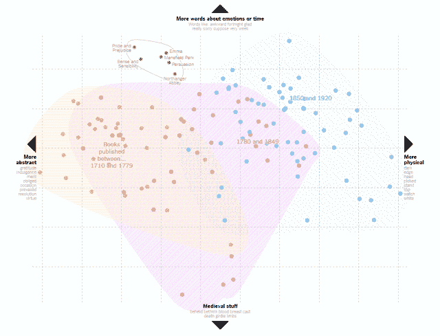

# 不要建数据百货。

> 原文：<https://medium.datadriveninvestor.com/dont-build-a-data-department-store-240ccce4d204?source=collection_archive---------28----------------------->

套用雷蒙德·钱德勒的话来说，太多的项目提供百货公司的数据:什么都是最好的，但什么都没有。

企业人工智能和分析开发人员必须避免因过度设计解决方案而服务不足的错误。设计师和决策者需要简单明了的工具来使他们做得更好，以节省时间和促进他们的最佳工作。他们不关心最新的仪表盘或算法，除非他们创造价值。哦，他们也不想听人工智能会如何抢走他们的工作。

# "简单地说，更先进的技术给了你更多上吊的绳索."-#ODSC

**没有模特丢人现眼！**在商业环境中，复杂的工具可能会分散注意力，拖慢工作进度，同时错失目标。数据科学社区(#ODSC)在[中给出了一个精彩的例子:保存神经网络，使用线性模型](https://medium.com/predict/save-a-neural-net-use-a-linear-model-a87b896245d2)。“追逐黄金和使用神经网络等最先进技术的诱惑在机器学习新手中一直存在，这也是经理和更有经验的数据科学家经常感到恐慌的原因。”

不管你读到什么，值得尊敬的专业人士经常创建线性模型而不会感到尴尬。为了保持您的分析或数据科学团队的资金，明智的做法是提供对决策者有用的足够好的工具。

这四个例子说明了有趣和有用的技术——如果我们能够抑制产生最多数据而不是最好数据的冲动。

**例#1:主成分分析 vs .写作天赋。**
精密的 AI 可以驾驶汽车，可以识别人脸，但它无法取代创造天赋。然而,[纽约时报书评](https://www.nytimes.com/2017/07/06/upshot/the-word-choices-that-explain-why-jane-austen-endures.html)展示了对简·奥斯汀小说的严谨分析，探索文学天才是否可以被描绘出来。显然，奥斯汀在早期使用了更多的抽象词汇，在 1780 年后使用了更多的物理描述。她比大多数英国小说更频繁地提到女性。但是我们不知道吗？

图表很美，但它(如标题所称)真的“解释了为什么简·奥斯汀的作品幸存并繁荣发展”吗？一位[投稿人说](https://www.nytimes.com/2017/07/15/insider/charting-literary-greatness-with-jane-austen.html)“将单词简化为数据点并不是要削弱选择正确单词并将其按正确顺序排列的能力…但是，像统计学这样的学科可以提供一种新的、有趣的——甚至是有益的——看待像小说一样直观和艺术的东西。”

**有趣的数据救不了你的工作。**你的业务部门领导希望看到比漂亮的图表更有实际意义的东西。[书评](https://www.nytimes.com/2017/07/06/upshot/the-word-choices-that-explain-why-jane-austen-endures.html)承认了弗吉尼亚·伍尔夫的观察，即“在所有伟大的作家中，[奥斯汀]是最难被发现伟大的。”阿门。

# "每块石头里面都有一座雕像，雕塑家的任务就是去发现它。"米开朗基罗

例 2:特效与结构化的剧本创作。
电影剧本相当公式化，被像[诺拉·依弗朗](https://www.avclub.com/after-when-harry-met-sally-almost-every-rom-com-tried-1823690771)和[威廉姆·高德曼](https://www.nytimes.com/2018/11/16/obituaries/william-goldman-dead.html)这样的编剧运用的效果巨大。如果复杂的人工智能制作了一部电影，你可能会得到一些公式化的东西，如变形金刚:安全的故事，闪亮的特效，几乎没有情感共鸣。但是一个有才华的作家可以遵循一个结构，塑造一个观点，产生[大黄蜂](https://www.nytimes.com/2018/12/18/movies/bumblebee-review.html)。如果他们真的很棒，他们会创造出经典，比如《公主新娘》或《惊爆银河系》。

**例 3:测试假设与形成假设。**
可靠的好 Cassie Kozyrkov (@quaesita)写了一篇关于决策和[假设检验](https://towardsdatascience.com/hypothesis-testing-decoded-for-movers-and-shakers-bfc2bc34da41)的启发性帖子。要点:“统计课教你测试假设，而不是形成假设。它们往往是为你在这些考试中预先准备好的。”这是容易的部分。学习何时以及如何形成好的假设要困难得多，而且自动化的可能性也小得多。

例 4:报告与分析。
有时，人工智能工具会编写新闻条目，如小联盟棒球比赛摘要，遵循一种可重复的结构来报告统计数据——而不是生成分析。与此同时，几家出版商开发了人工智能，为他们的投稿人产生故事创意，包括相关的标题和图像。福布斯提供伯蒂，向记者建议草稿。这太棒了，因为 Bertie 并不想取代人类，它只是向人类推荐片段。

*Tracy Allison Altman 领衔* [*决出项目*](https://decidingproject.com/) *。(想象人& AI，一起决定。现在把艺术和喜剧结合起来:会出什么问题？)*