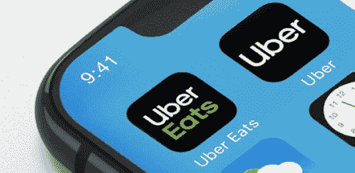

# 不要混淆数字化转型、数字化颠覆和数字化

> 原文：<https://medium.datadriveninvestor.com/dont-confuse-digital-transformation-digital-disruption-with-digitization-data-driven-investor-d38bb93c81b1?source=collection_archive---------18----------------------->

## 数字意味着变化、选择、创新、速度和以人为本

我们目前生活在数字化、数字化转型和数字化颠覆的时代。所有这些都是我们使用了很多年的三个术语，但是经常在错误的意义上使用。不要混淆它们。一周前，我听朋友说他想把他的企业数字化。他将使一切自动化，用机器人代替人类。他想把迄今为止未知的一切与物联网联系起来。不幸的是，他混淆了数字化和数字化转型。那么，什么是数字化？

# 什么是数字化？

> 数字化—使用数字数据实现业务流程和工作流的自动化

数字化有多种含义，但对我们来说，它有两种密切相关的含义。

首先，对于 starter 来说，数字化正在从纸张、缩微胶片图像、声音等一些物理产品转变为数字产品。此外，我们还可以通过在许多物理产品(如电子烟)中放置传感器，将物理产品转化为数字产品。

其次，对于这位教授来说，数字化是通过利用数字技术和数据环境来实现、改善和转变业务运营和业务模式，并转化为令人惊叹的业务成果。第二层含义是帮助您创建自动化流程和工作流，以削减成本并实现卓越运营。

# 什么是数字化转型？

> 如果你专注于竞争对手，你必须等到有竞争对手在做什么。以客户为中心让你更有开拓精神。—杰夫·贝索斯

第二个术语是数字化转型。数字化转型不仅仅关乎技术，还关乎战略和新的思维方式。面向数字时代的转型要求您的业务具有速度和敏捷性。你需要升级的不仅仅是你的基础设施，还有心态。当今企业的数字化转型有五个领域，它们是客户、竞争、数据、创新和价值 1(参见-参见-div)。

*   从大众市场到动态网络的顾客。
*   从限定区域内的竞争到跨流动区域的竞争。
*   从在公司中生成数据成本高昂，到随时随地不断生成数据。
*   从关注成品到关注最低价值产品的创新。
*   价值从由行业定义到由不断变化的客户需求定义。

在这五个领域中的每一个领域进行变革，都有助于企业在数字时代成功适应和发展。

# 什么是数字颠覆？

> T2:我们所创造的世界是我们思考的过程。如果不改变我们的思维，这是无法改变的。—阿尔伯特·爱因斯坦

最后一个术语是数字颠覆。它是以一种新产品或服务的方式向客户提供异常高的价值，这是现有公司无法直接竞争的。

*   零售:亚马逊、淘宝
*   媒体:YouTube，脸书
*   搜索:谷歌，必应
*   酒店:猫途鹰 Airbnb
*   交通:优步，Grab
*   …

当公司采用颠覆性数字技术时；他们用新的方式做旧的事情。Airbnb 不是由一家酒店公司设计的。优步不是由运输公司设计的。亚马逊不是由零售公司建立的。但它们都主导着市场。

最后，这三个术语你理解清楚了吗？请分享你的想法。

*原载于 2019 年 9 月 20 日*[*【www.datadriveninvestor.com】*](https://www.datadriveninvestor.com/2019/09/20/dont-confuse-digital-transformation-digital-disruption-with-digitization/)*。*