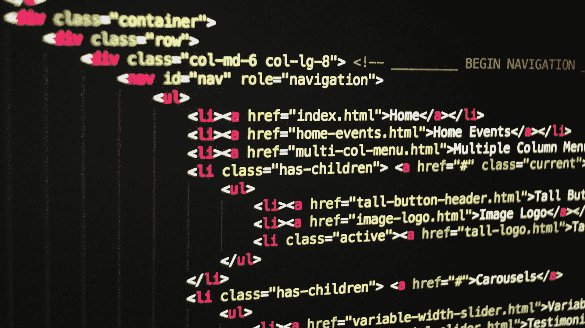

# 不要为了规模而设计

> 原文：<https://medium.datadriveninvestor.com/dont-engineer-for-scale-d8f544d4a3f5?source=collection_archive---------32----------------------->

创始人经常被抓去决定他们应该在他们的 MVP 中设计多大的规模。通常情况下，尤其是技术创始人，目标是在进入市场之前创建强大的功能。

不幸的是，许多人甚至不知道自己是否有真正的生意就这么做了。风险游戏是一种去风险游戏。公司在早期往往面临的最大风险是财务风险。这通常需要有限的时间来解决复杂的产品和业务挑战。然而，通常情况下，产品挑战可以通过资金(通过工程资源)直接解决，而商业模式和产品市场适应性挑战可以通过非线性思维、创造力和销售来解决。

如果你知道你有有限的时间来解决一些与风险相关的挑战，那么证明你的产品的市场需求是有意义的，而不是建立先进的能力。用一个不完美的产品吸引投资者，比用一个可靠的产品和有限的商业化吸引他们要好得多。

提供客户的积极反馈和逐月增长比提供令人印象深刻的产品规格表和如何将其推向市场的理论重要得多。

尤其是对于种子资金，手动且不可扩展地执行你的产品有朝一日可能实现的功能，然后向投资者寻求设计产品所需的资金，会更有影响力。

在帕克代尔，我们经常把风险投资描述为引擎。通过把你的精力集中在让你的不可扩展的 MVP 进入市场上，你证明了用燃料(钱)你的引擎可以工作。相反，通过设计产品的规模和高级功能，投资者仍然面临资本能否产生回报的风险。

一些很好的例子是来自 League 的 Amanda Bradford，他在早期手动执行约会应用程序的后端功能，以及来自 DoorDash 的团队，他们推出了一个基本的网站并自己送货。

**底线:**证明市场需求是你最有先见之明的早期挑战。确保你投入足够的时间和精力对成功至关重要。

欲了解更多信息，请访问我们的网站