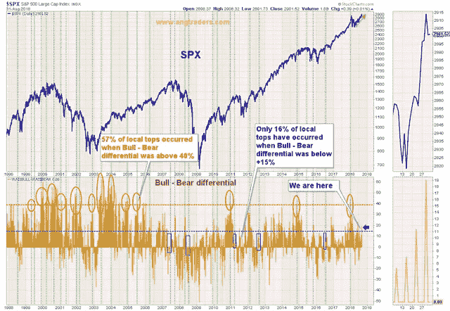
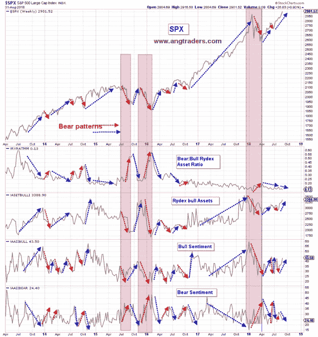
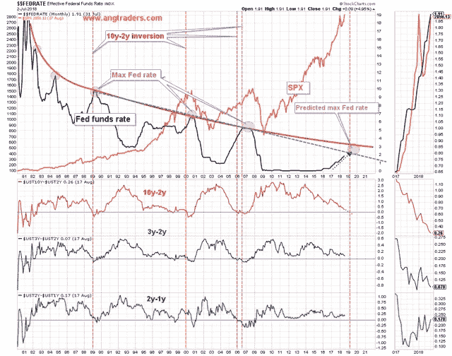
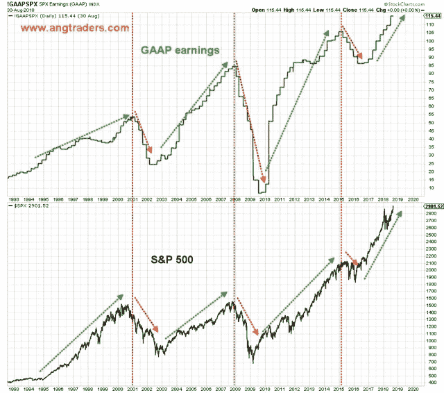
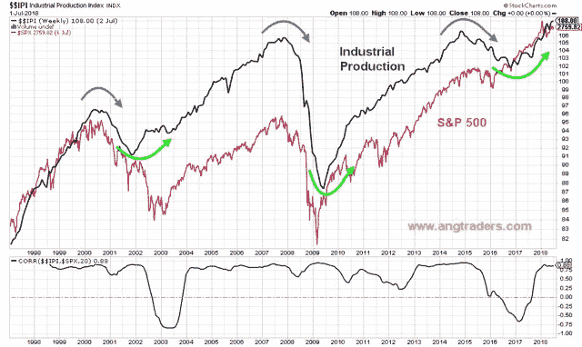

# 不要只玩市场。读一下。

> 原文：<https://medium.datadriveninvestor.com/dont-just-play-the-market-read-it-e0cd7f215f65?source=collection_archive---------13----------------------->

没有人能接触到未来。商业节目中的“会说话的人”可能会试图让你相信他们知道未来；我们知道没人能知道。然而，作为人类，我们计划、做决定、采取行动，其成功将取决于未来实现的类型。如果我们对将要发生的事情毫无头绪，我们该如何做呢？当这么多人都挤在防御位置时，我们怎么知道要保持投资呢？

答案是，模式。

以前执教篮球的时候，我们打的是“自由进攻”。许多玩过这个游戏的人会听到这个术语，并认为这是懒惰教练的快速出路。你只要把球滚到球场上，让球员去打。但实际上，在实施进攻的过程中需要大量的指导。

这是一次对方球队很难防守的进攻。似乎没有一个固定的模式，防守可以崩溃，然后反击。我们在进攻方面取得了巨大的成功，但要实现它，我们必须将比赛的进攻一面分解成常规篮球比赛中经常发生的情况。我们必须教玩家识别游戏中经常出现的某些情况。这些**模式成为玩家行动**的线索。

一旦我们的玩家通过重复熟悉了游戏的模式，他们就会对这些模式做出反应。他们开始**阅读游戏**，而不是**玩游戏**，结果，我们开始赢得越来越多。更重要的是，我们的球员越来越自信，他们可以适应或正确应对任何防守，因为他们以前见过这种模式。

所有的市场参与者都在玩这个游戏，但是很少有人知道如何读懂这个游戏。大多数人认为，推动市场的是新闻，包括金融和地缘政治新闻。从表面上看，这种联系似乎很明显；每天都有消息，市场每天都在动。但是，如果你努力阅读市场，你会发现新闻和市场走势之间真的没有一致或重复的相关性。换句话说，关系中没有模式。市场对好消息或坏消息的反应不一致。

为了在市场中获胜，玩家必须“认识到某些经常发生的情况”。这些反复出现的情况，这些模式，是市场中唯一不变的东西:人类情感的结果。特别是进化适应的恐惧情绪。它是历史上持续推动市场走势的东西。在 ANG Traders，我们寻找、解读这些模式并采取行动。

我们已经完成了练习，让我们开始阅读游戏中的一些模式。

# 感情

《AAII 周刊》的调查产生了一种模式，当多头和空头的情绪差异大于+40%时，SPX 会形成顶部(或者是主要顶部的小顶部),大约 60%的时间在+15%到+40%之间，25%的时间在+15%以下，大约 16%的时间在+15%以下。差价为+19%，这意味着只有 25%的机会形成顶部(见下图)。

Rydex 系列基金的资产配置数据可以说是比 AAII 指标更客观的情绪指标，因为它不是基于自我报告的调查。这是对投资者投资方向的直接统计。

Rydex 基金家族的熊市-牛市资产配置比率与 SPX 指数有很强的负相关性；Rydex 比率的 36 周 MA 下降对 SPX 有利。比率的下降，对应于市场的顶部。过去，我们已经指出了当前牛市的交易模式与 2000 年科技股牛市的相似之处。在科技股上涨的后期，Rydex 比率(名义)在 2000 年初出现下降，但 36 周 MA 继续走低，而 SPX 在达到高点之前又上涨了 6 个月，Rydex 比率出现了第二次(也是最后一次)下降。看起来这种模式又开始形成了。

SPX 继续创出新高，Rydex 熊牛比的 36 个月 MA 继续走低(如下图)。这仍然是一个看涨的模式。

下图整合了几个情绪指标；赖德克斯熊:牛资产比率、赖德克斯牛资产(本身)、AAII 牛情绪和 AAII 熊情绪。所有这些指标都显示出看涨形态。市场的潜在情绪状态继续表现出健康的恐惧水平。

# 基本的

利率与牛市密切相关。然而，与普遍看法相反，利率上升*不会*导致熊市。利率上升*过高*导致熊市。在过去的 35 年里，市场认为过高的价格一直在稳步下降。如果利率上升继续遵循当前的斜率，那么最高联邦基金利率可能会达到 2.5%-3.00%的水平。

这一最大化的时间对应于 10 年期减 2 年期国债收益率差(垂直红色虚线)反转后的 6-12 个月，这本身预计将在 2019 年初发生。**这意味着牛市最早也要到 2019 年年中才可能结束。**

公认会计原则(GAAP)收益与标准普尔 500 紧密相关；当收益上升时，熊市不会发生。此时出现熊市的可能性极小。

工业生产与标准普尔 500 直接相关。工业产出继续上升，而熊市开始的可能性尽管在上升，却微乎其微。

总之，我们已经展示了一些在游戏中“频繁出现”的模式，这些模式要求至少在接下来的 6 个月中采取进攻行动。

愤怒的商人

加入我们在[www.angtraders.com](http://www.angtraders.com)的团队，从我们 40 年的经验中获益。

原文来源:[https://seeking alpha . com/article/4203919-just-play-game-read](https://seekingalpha.com/article/4203919-just-play-game-read)