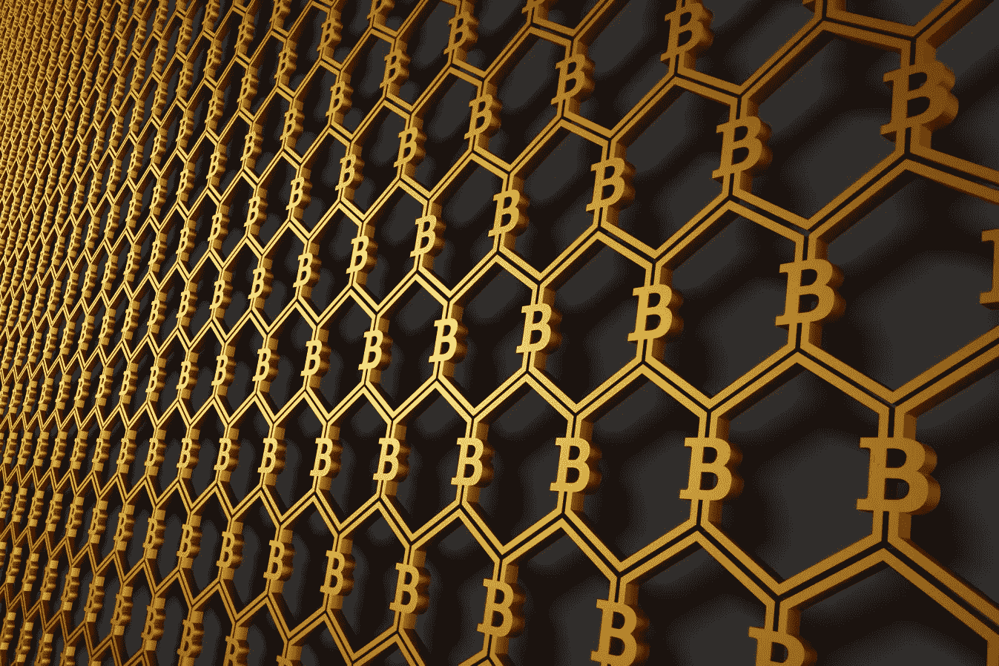
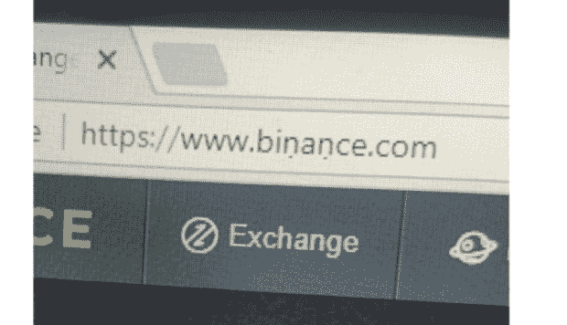
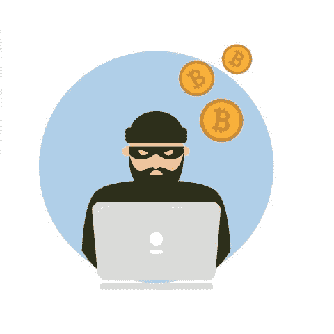

# 不要把你的蜂蜜留在壶里:购买后保护你的加密资产

> 原文：<https://medium.datadriveninvestor.com/dont-leave-your-honey-in-the-pot-protecting-your-crypto-assets-after-purchase-20f9560803a?source=collection_archive---------2----------------------->

对于一个新的加密货币投资者来说，最初最难把握的事情之一是，你在多大程度上是你新资产的唯一托管人。这与在银行有资金完全不同，例如，在银行你是一个有权利和保护的客户。你需要学习的第一课是:不要把你的硬币留在你购买它们的交易所里！

您不想这样做的原因有很多:

# 首先，交易所可能会遭到黑客攻击。

加密货币正在蓬勃发展，这是个大新闻。它们也是伪匿名的，很容易在一瞬间移动到世界各地——难怪它们对黑客有吸引力。对于一个黑客来说，什么是最有吸引力的呢？他们知道一个交易所装满了大量的钱。因此，他们在一种对抗持续渗透企图的公开战争状态下运作，这是一场持续的军备竞赛，有时黑客会领先——资金被盗。

当然，一些交易所提供各种保险和担保，但最终如果你的硬币被拿走，你很大程度上只能靠自己。此外，正如 2014 年从芒特戈克斯交易所丢失的价值 4.5 亿美元的比特币的所有者所发现的那样，不太可能存在任何资产来取代被拿走的东西，无论它们消失的原因是什么。

# 其次，你可能会被钓鱼。

即使交易本身从未受到损害，欺诈者也知道人们一直在登录和退出它们，并会变得越来越微妙和复杂，试图让你登录到其他地方。你会发现这个吗，用一个 *ṇ* 代替一个 *n* ？当然，在手机浏览器或电子邮件中带下划线的链接中，你根本看不到它:

(图片来源: [Reddit](https://www.reddit.com/r/CryptoCurrency/comments/7ykzar/be_careful_of_spoof_exchanges_would_you_have/) )

创建一个看起来足够像真实的(而且绝对真实和安全的)币安交易所的网站，是完成这一幻觉并收集人们密码所需要的全部工作。

您可以在某种程度上保护自己，方法是在所有 exchange 帐户登录时启用[双因素认证](https://howtobuybitcoin.io/best-wallets/)，并在所有加密货币交易中使用匿名专用电子邮件帐户。但是交易所涉及的金额实在是太诱人了，所以抢劫的努力永远不会停止。

# 那么，你能做什么？

# 让您的资产保持温暖或寒冷

这归结为通常的技术权衡:便利性和可用性与安全性。

交易所的基金很容易获得和交易，这就是交易所的目的。日内交易者需要能够和市场一样快速的移动，并且必须把他们的硬币放在那里，准备好一旦信号正确就买卖。但是我们中的大多数人交易的频率要低得多，并且可以容忍稍微不太方便地访问我们的加密硬币，以更好地保护它们。

下一步是将你的硬币转移到基于浏览器的“热门”钱包，这比交易所更安全，但仍易于在线操作。其中一些直接连接到交易所，如 [Shapeshift](https://shapeshift.io/) ，所以你可以很容易地进行一些快速交易，同时知道你的硬币不在交易所本身。你可以通过使用一个专用机器来使一个热钱包更安全一点，这个机器从来不用于日常浏览。

也有像 [Exodus](https://www.exodus.io/) 这样的桌面钱包，它们在你的本地机器上运行——但是当然必须连接到互联网才能交易。不过，它们更安全一步，因为你的私钥存储在你自己的设备上，而不是在交易所的服务器上。当然，你需要让你的机器远离恶意软件等，但它可能不会像交易所那样吸引一流黑客的尝试。

但要真正保护你的加密货币免受在线攻击，你需要让它离线——进入一个冷藏钱包。在你的私人密钥和互联网之间设置一个文字间隙，一个[‘空气间隙](https://en.wikipedia.org/wiki/Air_gap_(networking))’。如果你把一个热钱包想象成你口袋里的钱包——方便、易取，但永远不要携带超出你实际承受损失的东西——那么冷藏就类似于一个保险箱。

有许多专用设备可以用来存储加密货币，包括 [Trezor](https://trezor.io/) 、 [Ledger Nano](https://www.ledgerwallet.com/) 和 Keepkey。这些设备都支持不同的硬币，各有利弊，和以往一样，你需要做自己的研究，但它们本质上是 USB keys，除了 pin 和密码之外，还有一个“种子”短语(通常是 12 或 24 个单词)。确保[种子短语](https://en.bitcoin.it/wiki/Mnemonic_phrase)的安全至关重要，根据要保护的资产的大小，您可能希望在单独的位置保存一份副本。

当然，你是在信任设备本身的制造商，不言而喻，你绝不能使用二手存储设备。

所有选择中最冷和最难实现的是生成一个纸质钱包，为此使用一个专业的在线工具，但在你对你的电脑运行所有的病毒和恶意软件检查之前，不要访问这个网站。在你到达那里后，仔细遵循指示，包括下载网站供离线使用，并确保你的电脑**和**打印机完全离线，然后最终打印出你的加密货币钱包。

这是分享或赠送加密货币的一种很好的方式，但作为一种长期存储选择，它确实需要被认为是脆弱的，因为任何一张纸都是脆弱的——如果私钥被水、火、褪色或其他任何东西损坏，它就永远消失了。

这是一个很好的回答，对于那些说他们不相信任何他们看不到或拿在手里的货币的人来说！给他们价值 10 美元的莱特币或其他东西，放在一个纸质钱包里，开始吧——谁知道他们会在加密货币的冒险中掉进兔子洞多远？

但是一定要把这篇文章也发给他们，这样他们就可以继续保护他们的加密资产。期待更多来自数据驱动投资者团队的更新和建议。

# 评论

评论

*原载于 2018 年 2 月 27 日*[*www.datadriveninvestor.com*](http://www.datadriveninvestor.com/2018/02/27/dont-leave-your-honey-in-the-pot-protecting-your-crypto-assets-after-purchase/)*。*