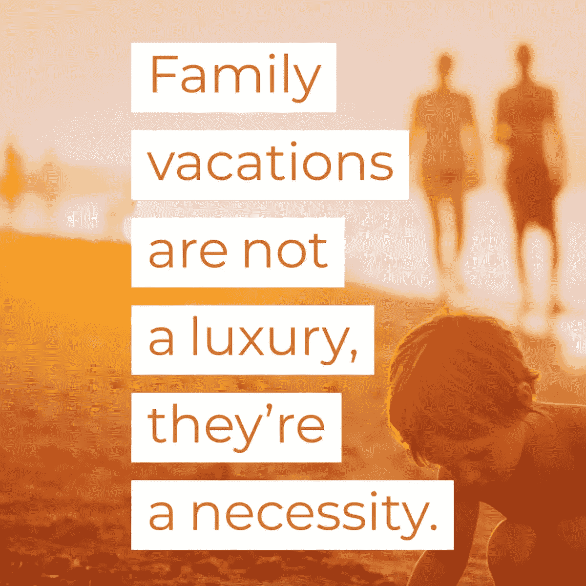
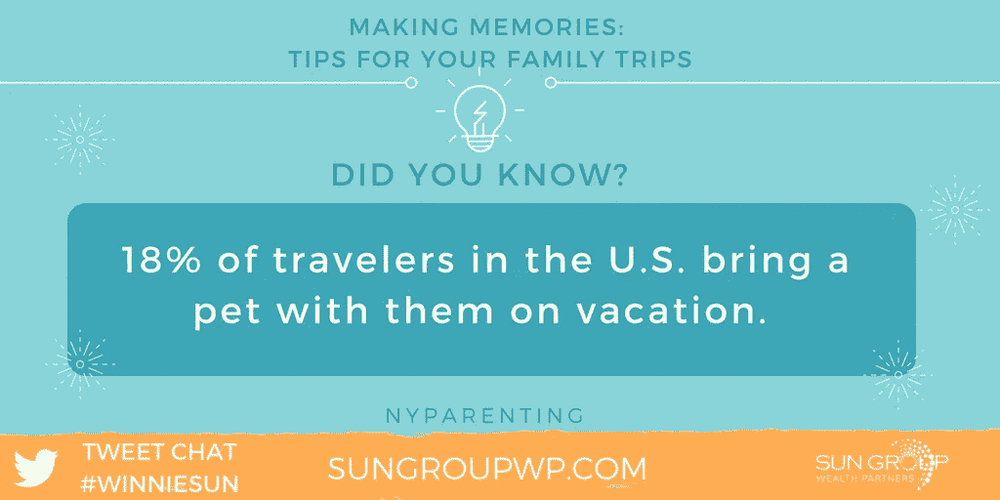
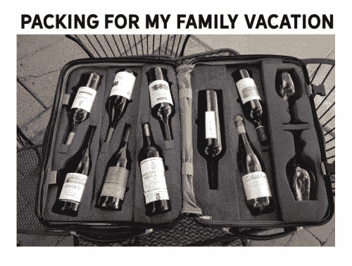

# 别让逃跑的人跑了

> 原文：<https://medium.datadriveninvestor.com/dont-let-the-getaway-get-away-6c83a6399c50?source=collection_archive---------9----------------------->

## 来自经验丰富的企业家和度假者的家庭旅行建议

无论是暑假、秋叶之旅、拜访朋友或家人，旅行时光都会创造一生的回忆。

作为拥有活跃家庭的企业家，珍·摩尔、[苏珊娜·布朗](https://twitter.com/mompowerment)和[温妮·孙](http://winniesun.com/about/)对如何在与家庭成员的长途和短途旅行中节省一点钱——并帮助保持理智——有不同的看法和建议。

摩尔在“现代妈妈”工作，这是一个为“妈妈背后的女人”提供资源和在线社区布朗是主题演讲人、战略家和《Mompowerment 》的作者孙是金融行业最受欢迎的专业人士之一。

 [## 旅行在即，现在就制定计划吧

### 向前看，以避免金融陷阱，并有一个良好的旅行

medium.datadriveninvestor.com](/with-travel-on-the-horizon-make-plans-now-83e97b0fb269) 

这些年来，旅游资源发生了变化。在基本要素中，谷歌地图和 GPS 已经取代了纸质地图。

“商务旅行时，我喜欢带着目的旅行——上车，下车，”孙说。“和家人在一起时，我喜欢给我的孩子带来许多新的体验，让旅行慢下来。

“我们没有过多的计划，所以我们可以真正看到并度过假期，”她说。

摩尔反对技术退出——或者说缺乏技术。

“放下我们的手机，”她说。“这对青少年来说并不容易，但如果你看着手机，你就不会感受到周围的一切。”

# 并不总是令人兴奋

与此同时，无聊会导致漫长的一天。

布朗说:“当我们作为一个家庭旅行时，我们确保我们所有人都有事情可做，并且特别为孩子们准备了一些事情。”“这样更容易。

“我们肯定不得不放慢脚步，限制我们期望看到和做的事情，”她说。“谢天谢地，我们的男孩喜欢冒险旅行，但这需要更长的时间。随着年龄的增长，我们会看到这种情况会发生怎样的变化。”

为了制定旅行预算，提前几个月开始为旅行存钱。像对待应急基金一样对待它。除非你假期需要它，否则不要碰它。

“我们有一个很棒的免费旅行预算指南，”孙说。“我还建议给一个账户贴上‘度假基金’的标签，这样你就可以看到自己的进步，并让整个家庭都参与进来。”

 [## 让你的品牌始终如一

### 旅行有助于创造伟大的内容

medium.datadriveninvestor.com](/make-your-brands-consistently-you-9abe44b6e75f) 

布朗利用每年的意外之财。

“我们通常会将部分退税用于国际旅行，”她说。

随着孩子的到来和长大，旅行的选择和目的地也会改变。当他们小的时候，游乐园是首选。当他们长到十几岁时，就不愿意放弃电子产品了。

“对孩子来说，一切都要保持简单，”孙说。“直飞、巡航、安全的位置和简单的快乐。你不必过度计划。挑一个家里每个人都会喜欢的地方。少即是多。”

# 吸引人的目的地

布朗试图让每个人都开心。

“目的地必须有我们和我们的小男孩感兴趣的东西，”她说。“旅行方便——只需一站——而且我们会避开特定的机场。”

摩尔发现最好不要冒险走远。

“和孩子一起旅行时，离家近的短途旅行可能是最容易的，”她说。“和孩子一起度假并不总是感觉像是父母的假期。

“计划去异国目的地的长途旅行可能不是最明智的选择，”摩尔说。

许多最好的旅游交易来自于询问。不要羞于寻求 AAA、军事或老年人折扣，因为许多折扣没有在前台做广告或自愿提供。如果你太骄傲而不敢问，那就想想存点钱吧。

孙是一个寻找便宜货的应用程序的粉丝: [Travelzoo](https://twitter.com/Travelzoo/) 、[、](https://twitter.com/TripAdvisor/)、【Expedia】和 [Travelocity](https://twitter.com/travelocity) 。

“我在脸书看到了惊人的交易，我们利用了这一点，”布朗说。"我也喜欢名为探索的 KAYAK 功能."

 [## “我现在能看清楚了”

### 几年后，我看到了我第一次去公园时错过的东西

jkatzaman.medium.com](https://jkatzaman.medium.com/i-can-see-clearly-now-531634bd7b97) 

每个人都有不同的旅行预订公式。几年前的一个建议是在周三凌晨 2 点预订机票。这不是辉煌就是都市传奇。

“我知道与[迪士尼邮轮线](https://twitter.com/DisneyCruise/)，越早越好，”孙说。"我仍然不知道什么时候预订机票和酒店最好。"

摩尔还想要一个神奇的预订公式，他更喜欢设置谷歌提醒来捕捉价格波动。

# 折扣和赠品

许多政府博物馆——最著名的是史密森尼博物馆——都是免费的。国家公园也很实惠。

“我和我的孩子都很单纯，”孙说。“我们喜欢去任何地方看望朋友和家人。我们喜欢去德克萨斯州圣安东尼奥看望我们的姻亲，吃便宜、简单的德州-墨西哥食物。”

布朗也受益于童年的满足感。

“我们的男孩对他们喜欢的东西很简单，”她说。“一个简单的操场是完美的。他们和一个在巴黎广场玩泡泡的家伙玩了将近一个小时。

“他们也喜欢博物馆——我们试图让它们变得有趣——这些博物馆在国外通常是免费的，”她说。

 [## 平衡工作和生活，打造“黄金时间”

### 保持工作效率，同时不要失去保持活力的动力

medium.datadriveninvestor.com](/balance-work-and-life-for-a-golden-hour-75aa0fbc8bbc) 

海洋也是低成本的。

“海滩旅行对孩子们来说总是很有趣，因为他们可以在水里玩几个小时，”摩尔说。

企业家们对遗愿清单有不同的看法——如果他们有的话。

“我们的孩子还小，”孙说。“现在一切都是为了方便。我们想尽可能多地乘坐迪斯尼游轮。太好玩太轻松了。”

# 好的运动

摩尔希望去欧洲，但需要攒钱，并在所有儿童运动的间隙找到时间。

“我们没有旅行遗愿清单，”布朗说。“我们的计划是不断发现新事物。

“我们从我们的男孩那里获得关于地点类型的信息——海滩或有雪的地方——当我们想去旅行时，看看有什么特价商品，我们就让它发生，”她说。

 [## 体育和社交媒体摇摆不定

### 越来越多的球队上网与他们的球迷联系

arvrjourney.com](https://arvrjourney.com/sports-and-social-media-swing-for-the-fences-221721ab6abc) 

游戏和视频有助于让孩子们有事可做。社交媒体的应用对不开车的成年人有好处。

“平板电脑是长途飞行的一切，”孙说。“它们让孩子们开心和放松，但一旦飞行结束，一定要把它们收起来。此外，它们还是很棒的儿童相机。”

布朗还赋予手机双重功能。

“我们给男孩们吃药，”她说。“他们可以在飞机上想看多少电视就看多少。我们的手机就是我们旅行时的地图。”

# 应用和积分

为了节省旅行费用，让 Gas Buddy 应用程序找到最便宜的汽油，特别是在你刚刚经过的地区。

“我喜欢用信用卡在日常消费中赚取旅游积分，”孙说。“我用信用卡支付一切，每个月自动还款。这包括我的业务支出。”

摩尔对塑料有自己的喜好。

“迈尔斯！”她说。“我使用信用卡获取里程，可以在任何航班或酒店使用。他们有很大的灵活性。如果你能买到更便宜的航班，你使用的里程就会更少。”

 [## 管理良好的信用卡可能是好东西

### 考虑现金和信用卡的利弊

medium.datadriveninvestor.com](/credit-cards-managed-well-can-be-good-things-654506b8daeb) 

布朗在淡季旅行时最省钱，用里数买机票，住在 Airbnb，在房间里用杂货店的食物做饭。也有家庭野餐。

如果路线经过施工区和新开发区，旅行时要小心。你可能在一条路上或一座桥上，但 GPS 显示你在田野里或在一条河里耕作。当有疑问时，相信你自己说谎的眼睛。

“我已经学会了保持简单和有限的旅行路线，”孙说。“在你去过的新地方，有很多东西可以看。如果你坚持太多的时间表，你会错过很多乐趣和经历。

她说:“我还学会了在去任何一家餐馆之前，都要先和迈克·陈、、YouTube 或核实一下。“一个吃货必须！”

摩尔发现了过度包装的惨痛教训。

她说:“带着小孩带着太多东西到处走是一场噩梦——尤其是当飞机晚点或者酒店比你想象的要远的时候。”

布朗试图防止旅行变得很不舒服。

“当我们的时区发生重大变化时，我们会在第一天去逛逛，以了解这个城市的情况，”她说。“我们总是带着美国的儿童药品旅行。”

**关于作者**

吉姆·卡扎曼是拉戈金融服务公司的经理，曾在空军和联邦政府的公共事务部门工作。你可以在[推特](https://twitter.com/JKatzaman)、[脸书](https://www.facebook.com/jim.katzaman)和 [LinkedIn](https://www.linkedin.com/in/jim-katzaman-33641b21/) 上和他联系。