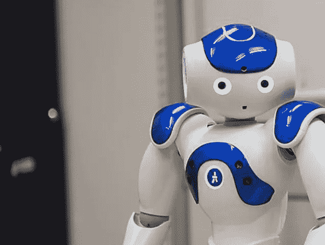
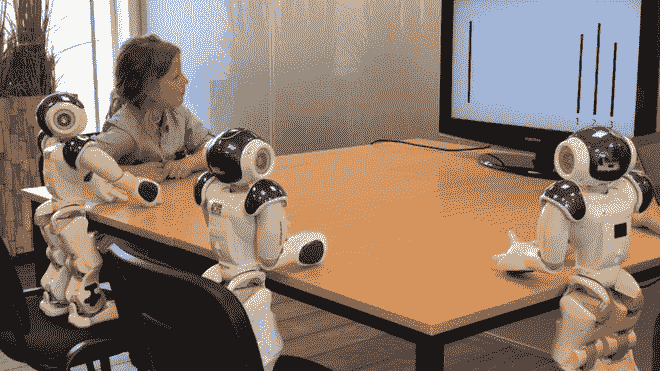

# 不要让你的孩子屈服于机器人同伴的压力

> 原文：<https://medium.datadriveninvestor.com/dont-let-your-kids-give-in-to-robot-peer-pressure-96af609aaea7?source=collection_archive---------23----------------------->

Softbank’s Nao Robot. (Source: University of Plymouth)

同龄人的压力会让我们做出各种可疑的事情，从买我们买不起的车到 T2 变得非常暴力，孩子尤其容易受到影响。这就是为什么[一项新的研究](https://www.sciencedaily.com/releases/2018/08/180815154454.htm)显示机器人可以对孩子施加同伴压力是如此令人不安。

在 8 月 18 日出版的*科学机器人* 杂志上描述的实验中，一组来自德国和英国的研究人员表明，当坐在他们旁边的机器人先做决定时，7-9 岁的儿童比成年人更有可能违背他们更好的判断并给出错误的答案。这对我们如何将机器人整合到教室中，在儿童护理、治疗、医疗保健环境中使用它们，以及作为玩具，都有着重要的意义。

在我们对机器人吹笛手带领我们的孩子走向毁灭感到抓狂之前，让我们看看科学:60 名成人和 43 名儿童接受了一项视觉测试，他们看到一条直线，然后被问及其他三条线中哪一条看起来与原来的一样长。两组都有相同的机器人同伴，软银公司的 58 厘米高的机器人 Nao，有着明显非人类的名字 Snap，Crackle 和 Pop。桌旁的机器人可以转动它们的头来看显示线条的计算机屏幕，以及坐在桌旁记笔记的研究员、另外两个机器人和坐在桌旁的受试者。机器人被编程为与受试者进行目光接触，这种方式可能会迫使他们遵守机器人的答案，所以目标是给儿童和成人施加压力，看看这是否真的有效。

A subject takes the vision test with Snap, Crackle, and Pop. (Source: University of Plymouth)

成年人在人类和机器人“同伴”在场的情况下接受了测试，尽管他们有时会在人类同伴做出同样的回答后给出错误的答案，但他们的答案不受机器人“同伴”小组的影响。这些被告知正在进行视力测试的孩子，只接受了机器人的测试，但是如果机器人先测试的话，他们更有可能给出错误的答案。后来他们被告知机器人试图欺骗他们。所以现在至少有 43 个孩子知道机器人可能很棘手。希望他们能传播这个消息。

因此，儿童可能会在同龄人的压力下，在人形机器人的视力测试中给出错误的答案。我们基于这项研究做出的任何其他假设都只是假设，根据手头的数据进行推断。科学就是这样运作的。我们看到头条新闻，但很少看到研究。

没有关于受试者认为测试中的利害关系的信息，但思考一下孩子们是否可能屈服于机器人的压力是很有趣的，即使这意味着被贴上可能需要跟进的视力问题的标签。当然，为了研究而在高风险的情况下操纵儿童是困难和不道德的，所以我们将不得不看看还能进行多少符合伦理的实验来支持这项初步研究。直到我们有足够的实验证明我们不是这样，我们应该假设机器人可以影响儿童，并且应该动员起来，在开发交互式人形机器人时采取预防措施。

那么，拥有这些信息并对此采取措施意味着什么呢？很多时候，关于技术伦理的文章留给我们的信息是，我们应该做得更多，但在这种情况下，这看起来像什么？以下是一些分解它的方法:

-和孩子们谈论[什么是](http://www.apa.org/research/action/speaking-of-psychology/peer-pressure.aspx)同伴压力，以及它是如何强大到连机器人都可以让孩子们做或说错误的事情。注意不要暗示机器人本身是坏的，只是说它们可以通过[编程](https://www.theguardian.com/inequality/2017/aug/08/rise-of-the-racist-robots-how-ai-is-learning-all-our-worst-impulses)让人们以某种方式行动。

-有证据表明[机器人在适当的情况下可以为孩子们做很多好事](https://newatlas.com/autism-social-robot-children-yale/56026/)，有时[同伴的压力可能是积极的](https://www.scientificamerican.com/article/peer-pressure-has-a-positive-side/)，鼓励孩子们做正确的事情。但是还需要更多的研究。

-请记住，技术总是在向前发展，试图淘汰交互式机器人[不是一个可行的解决方案](https://www.roboticsbusinessreview.com/service/humanoid-robot-market-to-grow-40-by-2024-predicts-report/)。相反，我们应该尽可能多地了解与儿童互动的机器人被编程来做什么，并与我们的孩子以及机器人的主人和程序员保持警惕和良好的沟通。

-如果你照顾的孩子将与机器人(甚至是为互动而设计的计算机程序)互动，[就项目的](https://www.teachthought.com/technology/using-technology-can/)[目标](https://www.nytimes.com/2017/04/05/business/smallbusiness/stem-education-technology-engineering-coding-toys.html)、[提出问题](https://www.theverge.com/2017/8/9/16115352/disney-sued-spying-children-gaming-apps-disney-princess-palace-pets)，如何使用数据，在使用系统时如何监控你的孩子，并提前询问如何处理可能出现的任何问题的资源。

-理解我们正处于未知领域，我们没有很多关于儿童与机器人交往可能产生的行为问题的长期研究。但是请记住，我们总是在课堂上使用新技术，这不是什么可怕的事情，而是要密切关注和[询问关于](https://secondnaturejournal.com/76-reasonable-questions-to-ask-about-any-technology/)的问题。

-询问机器人是由哪家公司开发的，他们与学校还有什么其他财务联系，花费多少，机器人是否向用户推销任何商品。

- [不要让技术吓到你](https://www.theguardian.com/technology/2017/oct/04/robots-artificial-intelligence-machines-us-survey)。机器人不会很快取代老师，它们仅仅是辅助学生教育的工具。

-有很多互动机器人出售。如果你选择购买一个，确保你调查了它是否能被轻易破解，确保 T2 设置了家长控制(就像你对社交媒体做的那样)，并和你的孩子一起检查他们是如何使用它的。

-一些孩子从[与这些机器](https://www.theatlantic.com/magazine/archive/2017/12/my-sons-first-robot/544137/)形成情感纽带中受益，但最终还是要由监护人做一些研究和检查，以确保他们对孩子的反应感到满意。

我们早就知道人类会受到机器人的影响，人们会将人类的品质归因于人形机器人——在棕色或女性人形机器人面前，我们甚至会成为种族主义者和性别歧视者。人们[与机器人](http://www.bbc.com/capital/story/20180530-how-humans-bond-with-robot-colleagues)形成纽带，当机器人受到虐待时会为它们感到难过(尽管它们感觉不到疼痛)。[看看这个来自波士顿动力公司的视频](https://www.youtube.com/watch?v=rVlhMGQgDkY&t=3s)一个工程师用曲棍球棒击打一个机器人，尽量不要感觉到什么(戳从 1:27 开始，但整个视频值得惊叹)。如果我们要继续将机器人融入我们的家庭、办公室、工作场所和学校，谈论它们对我们的影响是至关重要的。