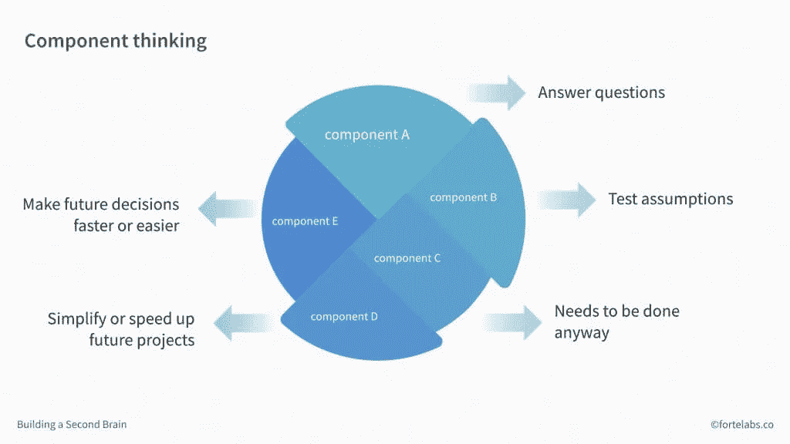

# 不要制定新年计划——创建可重复使用的组件

> 原文：<https://medium.datadriveninvestor.com/dont-set-new-year-s-resolutions-create-reusable-components-fdb6bdf24649?source=collection_archive---------39----------------------->

[2018 年 12 月 20 日](https://www.fogbugz.com/blog/dont-set-new-years-resolutions-create-reusable-components/) / [TIAGO FORTE](https://www.fogbugz.com/blog/author/tiago-forte/)

随着新的一年即将来临，我们进入了新年决心的季节。准备好迎接拥挤的健身房和标有#bigdreams 的励志 Instagram 语录吧。

如果这不太符合你的风格，我想给你介绍一种非常不同的实现目标的方式:**组件思维。**

组件思维让你将精力集中在短期内创建小的、可重用的组件上，而不是专注于遥远的、大胆的领域，因为你知道将来你能够将它们组装成更大的东西。

# 数字作品是由组件组成的

每个工作产品都是由更小的部分组成的，我称之为“组件”对于实物产品来说确实如此，但要把它们拆开并以不同的形式组装起来并不容易。但是对于数码产品来说，重复使用很容易。

任何文本片段都可以复制并粘贴到任何其他地方。任何图像或视频都可以编辑并上传到不同的地方。当然，一段代码可以在软件程序的不同部分重用，甚至可以在不同的程序中重用。

以下是一些如何创建可重用组件的简单示例:

*   如果你制作了很多商业计划书，制作一个可以反复使用的计划书模板
*   如果你经常设计网站，开始在 notes 应用程序中收集你喜欢的网站的剪报
*   不要每隔几年就更新你的简历，开始收集你可以在文件夹中展示的工作成果
*   如果您发现自己正在撰写相同的入职电子邮件多项内容，请将其制作成一篇知识库文章，只需一个链接即可引用
*   如果有一个常见的客户服务问题，你必须处理，记录一个 2 分钟的屏幕截图，你可以上传到你的网站

这些行为不仅对一次性使用有价值，而且对未来许多可能的需求也有价值。商业计划书的模板本身就很有价值，独立于任何具体的计划书。一个装满模型网站的笔记本在任何一种网页设计项目中都是有用的。不管你是在申请工作还是筹集资金，拥有一个投资组合总是一件好事。

准备好这些组件并等待会给您带来一些强大的好处:

*   每一个都给你**选择的机会**，增加你可以考虑的选择的数量
*   每一个都帮助你更快地采取行动，因为你可以重复使用过去的工作，而不是从头开始
*   每个人都可以通过测试假设来消除不确定性，降低未来项目的风险
*   您可以随着时间的推移逐步改进组件**，通过每次使用时调整和调整它们，而不是试图一次完成所有的改进**

# 数字作品的模块化

数字工作的无常常常让人感觉像是一种诅咒。似乎没有什么事情是完不成的。我们很少有机会庆祝一个明确的完成。但是我们可以把这个诅咒变成祝福——如果没有什么是最终的，那么等待开始就没有意义了！

不要等到所有的部分都准备好了，启动一个基本版本，然后慢慢升级:

*   启动你的应用程序的测试版，知道它的任何组件都可以在以后通过软件更新来添加
*   发出你的博客文章的草稿，知道你可以随时更新文本
*   在 Kindle 平台上自助出版一本电子书，知道对手稿的任何更新都会自动无线同步到任何购买了这本书的人
*   发布一个包含照片和简历的简单的单页网站，并且每隔几个月当你有多余的时间时添加一个新的页面

数字工作自然是*模块化*——组成产品的各种组件可以在不同的时间创建，以不同的速度发展，并且可以换进换出。我们可以利用这种模块化的优势，以小块的方式来实现我们的目标，而不是一个巨大的飞跃。

# 通过制作东西来解决问题

大多数人通过*分析*来解决问题，也就是把问题“分割”成更小的部分。制造者解决问题的方式是通过综合——制造东西并测试它们。没有什么比把一个有形的东西放在一个真实的人面前更能给一个项目带来一剂强有力的现实了。

最好的组件是那些:

*   回答问题或测试假设
*   简化或加快未来项目
*   让未来的决策更快或更容易
*   无论如何都需要完成

人们通常害怕开始一个项目，直到他们知道他们会成功。但这就像等着穿过城镇，直到所有的交通灯同时变绿。这永远不会发生。无论何时何地，我们都必须取得进步。

通过将我们的努力集中在创建多用途的、可重用的组件上，我们正在为当机会出现时我们能够迅速采取行动做准备。我们不是等待条件刚刚好，而是主动揭示假设，学习新技能，准备我们需要的资源。

在新的一年里，不要设置华而不实的解决方案，而是尝试创建一个可重用的组件。

蒂亚戈·福特
福特实验室的创始人

在他的在线课程 [*构建第二个大脑*](https://www.buildingasecondbrain.com/) *中，蒂亚戈·福特教授人们如何捕捉他们的知识，组织他们的数字生活，并创造可重复使用的组件。使用代码*[*FOGBUGZ*](http://www.fogbugz.com/)*参加课程可节省 100 美元(仅限前 25 名)。*

*最初发布:*[https://www . fogbugz . com/blog/dont-set-new-years-resolutions-create-reusable-components/](https://www.fogbugz.com/blog/dont-set-new-years-resolutions-create-reusable-components/)