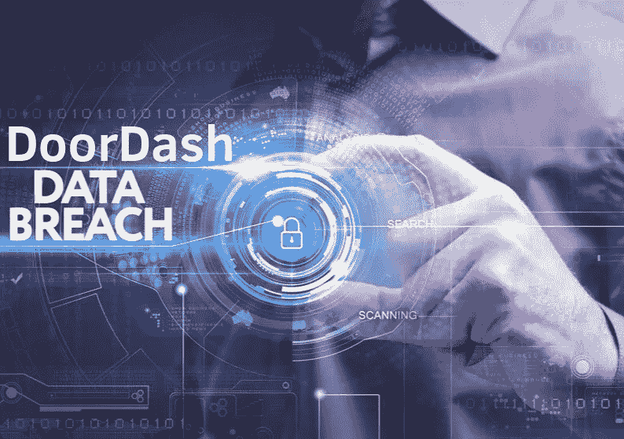

# DoorDash 数据泄露影响了 490 万用户—了解更多信息！

> 原文：<https://medium.datadriveninvestor.com/doordash-data-breach-in-may-affected-4-9-million-users-know-more-about-it-eb4e9e98437a?source=collection_archive---------2----------------------->

作为一家总部位于旧金山的按需送餐公司，DoorDash 证实，数据泄露发生在 5 月 4 日，即发生五个月后。一个未经授权的第三方试图黑掉 DoorDash 并成功做到了。当用户开始抱怨他们的帐户被黑客攻击时，这条新闻就出现了。

DoorDash 表示，它在 9 月初注意到了不寻常的活动，经过调查，它发现一个未经授权的第三方访问了他们公司的数据。此外，DoorDash 声明，2018 年 4 月 5 日或之前加入 DoorDash 的人受到此次数据泄露的影响，但之后加入的人不受影响。

 [## 网络安全非营利组织帮助中小企业打击网络犯罪|数据驱动的投资者

### 一个名为全球网络联盟(GCA)的非营利组织发誓要改善…

www.datadriveninvestor.com](https://www.datadriveninvestor.com/2019/02/22/cybersecurity-non-profit-to-help-smes-fight-against-cybercrime/) 

# **DoorDash 泄露数据**

这次数据泄露泄露了大约 490 万人的数据，其中包括客户、商家和老板。根据 DoorDash 的说法，数据泄露获取了用户的个人和财务信息，包括姓名、电子邮件地址、联系电话、送货地址、订单历史、加密密码(散列或加盐)以及支付卡的最后四位数字。不仅如此，黑客还获得了商家和工人银行账号的后四位数字，并锁定了 10 万个属于送货工人的驾照号码。

DoorDash 表示，它将通知其客户发生的违规事件。此外，它声称将在系统中添加严格的安全层，以避免未来发生此类数据泄露事件。改进的安全协议将用于受控和授权的数据访问。

# **如何让自己保持安全？**

DoorDash 鼓励人们修改密码，即使他们没有受到数据泄露的影响。这将确保他们的帐户安全作为辅助安全。对于 DoorDash 的工作人员，建议首先确定行驶证号码被盗，然后向当地警察局或州机动车辆部门报告。以下是在线公司客户可以采取的一些主动措施，以保护他们的个人信息安全:

*   请确保您使用强而唯一的密码，任何人都很难轻易解密并访问用户的个人信息
*   在线平台应在其系统中嵌入高级别的安全性，以避免身份盗窃和数据泄露事件的发生。为此，他们可以使用防盗软件，帮助他们监控流量并根据支持证据验证每个实体。这样，未经授权的实体很难进入在线平台并在那里执行恶意活动
*   [应该进行在线身份验证](https://shuftipro.com/identity-verification/)，以便只允许经过身份验证的身份作为您系统的一部分。因为没有人知道数据泄露可能是由于你在线平台的身份造成的
*   使用严格的安全措施、强大的加密技术、防火墙安装和类似步骤来保护系统免受可能的网络攻击
*   对于网上客户来说，有必要警惕[数字诈骗](https://shuftipro.com/blogs/gdpr-phishing-scams-a-novel-trap-to-scoop-up-information/)，它们可以通过显示合法网站来欺骗他们，但实际上是诈骗者的陷阱。这些被称为网络钓鱼诈骗。避免点击看似可疑的链接，因为它们会将你重定向到一些欺诈网站，并窃取你的所有在线凭据
*   在线平台在接受第三方服务提供商的服务之前，应该对其进行核实。确保您的系统与可信工具集成在一起，因为在大多数情况下，第三方服务会被规避，公司的敏感数据也会受到影响

应该认真采取这些步骤，以防止自己被[身份盗窃](https://shuftipro.com/blogs/identity-theft-frauds-how-can-you-stay-a-step-ahead/)和数据泄露，因为这可能会损害公司和个人。欺诈者利用窃取的身份从事洗钱和恐怖融资等恶意活动。在这种情况下，在线系统有责任尊重客户数据并防止其受到可能的攻击。否则，根据当地的监管制度和法律，该公司可能会受到高额罚款和损失，具体取决于数据泄露的严重程度。不仅如此，不可避免的声誉损失是一件很难重新获得合法客户信任的事情。