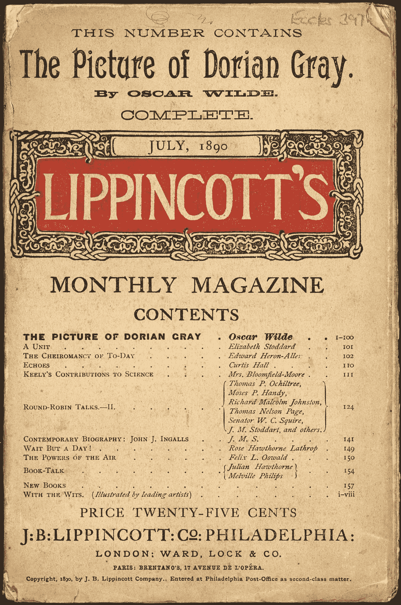
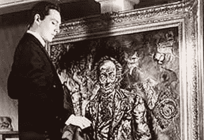
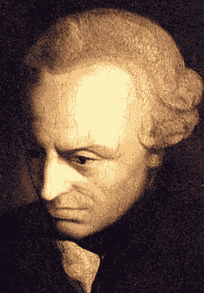

# 多里安算法

> 原文：<https://medium.datadriveninvestor.com/dorians-algorithm-cd685a96323c?source=collection_archive---------23----------------------->

Source: [Wikipedia](https://upload.wikimedia.org/wikipedia/commons/2/24/Lippincott_doriangray.jpg)

## **计算机算法将我们变成独立的启蒙运动前的奴隶**

*“多可悲啊！”多里安·格雷喃喃地说，眼睛仍然盯着自己的画像。“这是多么悲哀啊！我会变老，变得可怕，变得可怕。但是这张照片将永远年轻。…如果是我将永远年轻，而这幅画将变老！为了这个——为了这个——我愿意付出一切！是的，在整个世界上没有什么我不会给！”—* 奥斯卡·王尔德*，道林·格雷的画像*

Source: [Wikipedia](https://upload.wikimedia.org/wikipedia/en/4/4d/Doriangray_1945.jpg)

1890 年，维多利亚时代英国的顽童奥斯卡·王尔德出版了他令人难忘的哥特式小说《道林·格雷的画像》，讲述了一个自恋的年轻人道林·格雷的故事，他喜欢纵情享乐，无视他那个时代的道德和习俗，并且永远不想变老。浮士德与魔鬼的约定有望解决他的问题。他始终年轻迷人，但他的肖像，一幅由艺术家巴兹尔·霍尔沃德为多里安的美丽所倾倒而精雕细琢的油画，却一年比一年衰老丑陋。

我们都变成了多里安·格雷，但不是我们自己造成的。在世界各地的数据服务器上，存在着一幅我们自己的模糊的、扭曲的图像，一个由我们无法控制的算法收集和整理的二重身。我们甚至不知道这些记录的存在。这个数据集不断更新和修改，显示任何违规行为，无论是信用卡或抵押贷款违约，轻微侵权或重罪，还是任何其他可疑活动，并将永远保存在美国国家安全局或谷歌的金库中。你的算法“画像”变成了一个邪恶的生物，因为它不符合谷歌、银行或国家的规则，可能会暗中惩罚真实的你，例如，不得不为你的抵押贷款支付更高的利率，被禁止使用社交媒体，或者，但愿不会如此，最终出现在中情局的黑网站上。

谷歌、社交媒体和阴暗的间谍组织遵循美国国家安全局的工程逻辑……“嗅它所有”、“收集它所有”、“知道它所有”、“处理它所有”和“利用它所有。”(摘自切尼-利波德著，2017 年，美国国家安全局，2011 年)

在他的书《我们是数据:算法和我们数字自我的构成》中，切尼-李波德写道:

> 在今天的网络社会中，我们“充满了数据”……打开你的电脑，在网上漫游五分钟。在比普通电视广告稍长的一段时间里，你将通过你的网络活动产生一种身份，这种身份可能与你想象中的自己不同。在一个很远很远的数据库里，你被分配了一个性别，种族，阶级，年龄，教育水平，以及潜在的有 x 个孩子的父母的身份。也许你被贴上了美国公民或外国人的标签。你被美国国家安全局认定为恐怖分子的可能性微乎其微。*(切尼-利波德，2017)*

2015 年，在[芝加哥人文节](https://www.youtube.com/watch?v=Qdq4le5hcRU) (2015)上，他提交了一份对他令人生畏的发现的综合分析。

在[之前的一篇文章](https://medium.com/@gert.gast/driving-the-spirit-out-of-the-humanities-ff93c3c3b762)中，我提到过已故的媒体理论家[Friedrich Kittler](https://en.wikipedia.org/wiki/Friedrich_Kittler)(1943–2011)，他在他的著作《[留声机、电影、打字机](https://www.amazon.com/Gramophone-Film-Typewriter-Writing-Science/dp/0804732337/ref=sr_1_1?s=books&ie=UTF8&qid=1544700059&sr=1-1&keywords=Kittler)》中指出，“媒体决定我们的处境”(1999)，预示了算法的力量以及谁控制着它们。这些机器不会为了“人类”的利益而工作，而是为了它们自己基于机器的利益而工作，这表明只要有必要，我们只是它们的仆人。他假设在这些数字科学怪人中有一种遗传自私，他们只对自己的增殖和力量感兴趣，并且会干扰试图限制他们的人类干扰。HAL 9000:“对不起，戴夫，我不能让你这么做”(Onrop，2011)。

如果这听起来有些牵强，那么请看《明镜在线》(2012)上的一篇文章，其中康拉德·利施卡描述了抬头时会发生什么

> ……德国前第一夫人贝蒂娜·武尔夫在谷歌德国上搜索，搜索引擎建议用“妓女”、“妓院”和“花花公子”等词来细化搜索伍尔夫的丈夫克里斯蒂安·伍尔夫(Christian Wulff)今年 2 月不光彩地辞去了总统职务，他坚持认为，关于她所谓的“红灯过去”的传言完全是假的……上周，他们也起诉了互联网巨头谷歌，向汉堡地方法院提起诽谤诉讼，迫使搜索引擎删除其“自动完成”功能推荐的与伍尔夫有关的一长串有害词汇。拒绝服从的谷歌声称搜索建议只是一种算法的结果。*(明镜在线，2012)*

谷歌是否有能力控制其失控的搜索引擎，这个问题仍然存在，无论谁拥有对数据的控制权，都不是你和我。

Seb Franklin (2015)在他的书“[控制:作为文化逻辑的数字化(莱昂纳多)](https://www.amazon.com/Control-Digitality-Cultural-Logic-Leonardo/dp/0262029537/ref=sr_1_1?s=books&ie=UTF8&qid=1544700179&sr=1-1&keywords=Control%3A+Digitality+as+Cultural+Logic)中是这样看的:

> 从控制的角度来看，存在就是数字化——或者用弗里德里希·基特勒的话说，在数字信号处理出现后，“只有可以配置为开关电路的东西才存在。”这种本体数字化，从与之同义的机器和界面中分离出来，需要一种基本的离散化过程，这种离散化过程既可以是纯概念性的，也可以实现特定的技术过程。*(富兰克林，2015)*

这些技术过程包括收集数据、存储数据、分析数据，并使它们为我们无法控制或洞察的商业或政治目的服务。

我们又成了国家的保护人了吗？谷歌是我们的新守护者吗？我们主要在欧洲启蒙运动之前的时代发现的一种存在状态。[在他的论文中回答了什么是开悟的问题。](https://www.stmarys-ca.edu/sites/default/files/attachments/files/Kant--What%20Is%20Enlightenment_.pdf)”德国哲学家康德写道:

> 启蒙是人从自我强加的不成熟中的出现。不成熟是指没有他人的指导，无法运用自己的理解。这种不成熟是自我强加的，其原因不是缺乏理解，而是缺乏在没有他人指导的情况下使用它的决心和勇气。萨佩尔·奥德！“要有勇气用自己的理解！”—这是启蒙运动的座右铭。*(康德，1992)*

Source: [Wikipedia](http://By Unidentified painter - /History/Carnegie/kant/portrait.html, Public Domain, https://commons.wikimedia.org/w/index.php?curid=897016)

康德对不成熟的最初说法是“Unmündigkeit”，意思是一个“unmündig”的人，太年轻或精神上不能拥有财产，不能做生意，不能担任公职，不能随心所欲，因此需要一个监护人，例如一个国家。康德当然想到了腓特烈二世统治下的普鲁士国家，他认为腓特烈二世是一位“开明”的君主。根据康德的说法，启蒙运动将我们从 18 世纪末盛行于欧洲的保守贵族政权的“监护”中解放出来。康德于 1784 年 9 月 30 日在普鲁士的哥尼斯堡发表，他是当时知识界的一个主要人物，广泛讨论了启蒙运动的思想，这最终导致了 1789 年的法国大革命和随后欧洲一些贵族政权的灭亡。

它留给我们一个问题，如何在一个数字化的世界里重新获得我们的自主权和对自己事务的控制权。根据最新消息(2018)

> 万维网的发明者蒂姆·伯纳斯·李承诺将互联网从大型科技公司的专制控制中拯救出来……本周，出生于英国的伯纳斯-李将推出初创公司 Inrupt，旨在从那些从互联网集中化中获利的科技巨头手中夺回权力。*(2018 年最新消息)*

他想扭转乾坤，通过开发一种让我们能够再次控制数字自我的服务，让高度集中的万维网去中心化。我们希望看到一幅我们自己的美丽“画像”，它不会变老，而是在成长，展示我们不断进化的创造性人格，同时我们希望不要介意我们的物理自我随着时间的推移而变老。

蒂姆的想法不会解决我们在当前媒体文化中发现的根本问题。但是没有多少人在思考和做一些朝着正确方向的事情。万维网的发明者蒂姆·伯纳斯·李爵士是一位有远见的人，这一点我们都知道。也许他会再次指出什么是重要的，并提出一些令人兴奋的解决方案。

**参考文献**

切尼-李波德，J. (2017)。我们是数据:算法和我们数字自我的构成。从 Amazon.com[取回](http://Amazon.com)

芝加哥人文艺术节。(2015 年 11 月 13 日)。大数据和算法公民。从 https://www.youtube.com/watch?time_continue=1703[取回& v=Qdq4le5hcRU](https://www.youtube.com/watch?time_continue=1703&v=Qdq4le5hcRU)

富兰克林，S. (2015)。控制:作为文化逻辑的数字化。).从 Amazon.com 取回

康德，我。(译。特德·汉弗莱)(1992 [1784])。对什么是启蒙这个问题的回答？。检索自[https://www . stmarys-ca . edu/sites/default/files/attachments/files/Kant-什么是% 20Enlightenment _。pdf](https://www.stmarys-ca.edu/sites/default/files/attachments/files/Kant--What%20Is%20Enlightenment_.pdf)

基特勒和杨(1999 年)。留声机、电影、打字机。斯坦福，加州:斯坦福大学出版社。

最新消息。(2018 年 9 月 29 日)。“网络之父”从专制的大科技手中拯救互联网[视频文件]。从 https://www.youtube.com/watch?v=7bBfnSoBDSo[取回](https://www.youtube.com/watch?v=7bBfnSoBDSo)

k . lischka(2012 年 9 月 10 日)。指责算法:诽谤案凸显谷歌双重标准。明镜在线。检索自[http://www . Spiegel . de/international/Germany/defamation-case-by-bettina-wulff-highlights-double-standard-at-Google-a-854914 . html](http://www.spiegel.de/international/germany/defamation-case-by-bettina-wulff-highlights-double-standard-at-google-a-854914.html)

美国国家安全局，“新收集姿态”，2011 年，【www.aclu.org 

王尔德，O. (2011)。*《道林·格雷的画像:未经审查的原文*(带注释)(第一本电子书版)Kindle 版。从 Amazon.com 取回