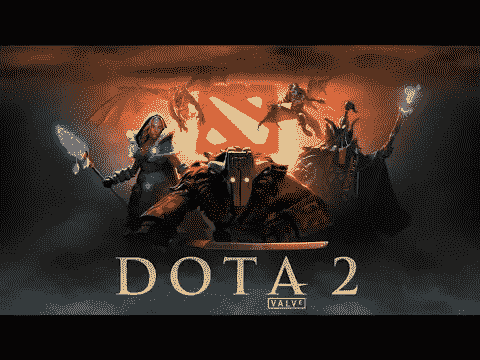
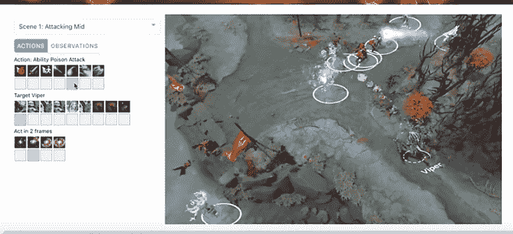
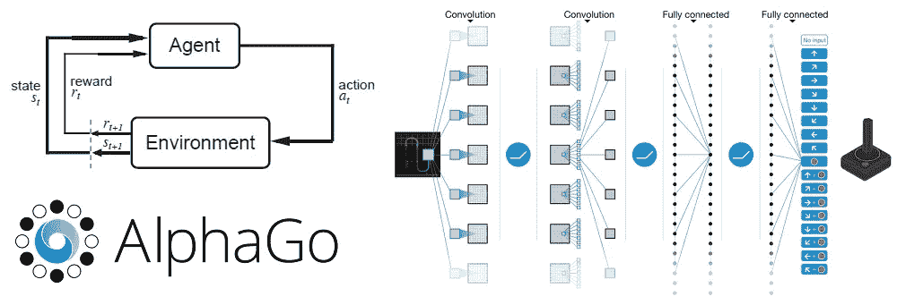
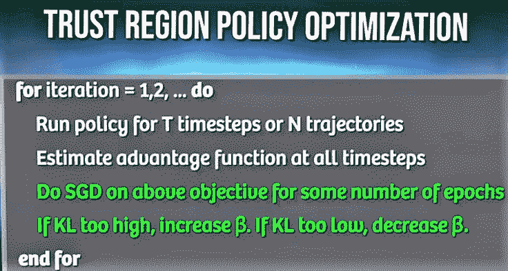

# DOTA 2 vs OpenAi 5

> 原文：<https://medium.datadriveninvestor.com/dota-2-vs-openai-5-c529cc7fb856?source=collection_archive---------27----------------------->

这是一件大事。整个人工智能社区对它的成果感到兴奋…

OpenAI 将其网络称为 *OpenAI 5，因为它有 5 个神经网络架构，协同工作以击败对手团队。*

令人着迷的是，人工智能可以学习如何在不可预测的环境中行为和制定策略，因此我们可以将它在现实生活中学习的所有技能转化为现实生活中的问题，如药物发现、气候变化等。类似的情况在 Deepmind 的 AlphaGo 和 IBM 的 DeepBlue 分别击败各自的世界冠军时也发生过。

对于非玩家来说，DOTA 2(古代防御 2)是一款实时战略游戏，两支队伍在 3D 视角的单一地图中对抗以摧毁他们的结构(古代)，同时捍卫自己的结构。DOTA 2 是 EA 因其全球比赛而赚得最多的体育游戏(约 1 亿美元)。

DOTA 2 有**5 RNN(LSTM)网络**，用于文本、音频、语音等序列数据。[你可以在这里找到更多关于 LSTM 的信息。](https://www.youtube.com/watch?v=cdLUzrjnlr4) LSTM 氏取输入数据并输出下一个字。于是，DOTA 2 的每个 RNN 取输入状态(从 **valve API 软件**中提取)并预测下一个状态。每个 lstm 从它周围所有可能的状态中选择特定的步骤&执行它。

整个关键在于强化学习。与监督/非监督不同，我们这里没有数据集。相反，我们有被称为**奖励的延时信号。**

OpenAi 开发了一个由击杀、助攻等综合矩阵构成的奖励。其可以是正或负的，取决于代理采取的步骤。在 Dota 2 中，代理是一个 lstm 网络，它可以按照我们想要的方式通过**马尔可夫决策过程**来制定决策。*它声明在一个状态中采取的动作的输出仅取决于该状态，而不取决于任何先前的状态。* [点击此处了解更多关于马尔科夫的信息](https://www.theschool.ai/courses/move-37-course/lessons/markovdecisionprocesses/)

**在强化学习中，主体的目标是遵循一个策略使其报酬最大化**。为此存在许多政策(一种称为[政策梯度](https://medium.freecodecamp.org/an-introduction-to-policy-gradients-with-cartpole-and-doom-495b5ef2207f))

但是，政策梯度有一个缺点，当步长很小时，进展就很小，而步长很大时，进展就很大。这可能会让我们的特工陷入困境。

这可以通过将政策分为两部分来解决——*旧(前)&新(后)和优势*这意味着该政策比其他旧政策好多少，并使用 **TRPO** (下图)。OpenAi 引入了 **PPO** (不太复杂)，使用 TRPO 方法的相同碱基。[你可以在这里查看 PPO](https://blog.openai.com/openai-baselines-ppo/)

所以， *OpenAi 在 Google cloud* 的 256 个 GPU 上使用 PPO 训练了 5 个 LSTM。该团队每天都在训练模型，以提高代理的技能…

*有用链接*:

[https://dota2api.readthedocs.io/en/latest/](https://dota2api.readthedocs.io/en/latest/)

[https://blog.openai.com/openai-five/](https://blog.openai.com/openai-five/)

[https://www . the verge . com/2018/8/28/17787610/open ai-dota-2-bots-ai-lost-international-reinforcement-learning](https://www.theverge.com/2018/8/28/17787610/openai-dota-2-bots-ai-lost-international-reinforcement-learning)

*原载于 2018 年 9 月 23 日 blog.lipishala.com**T21*[。](https://blog.lipishala.com/2018/09/23/dota-2-vs-openai-5-explained/)