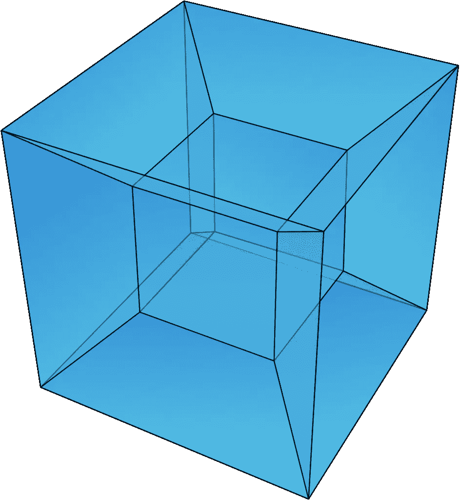
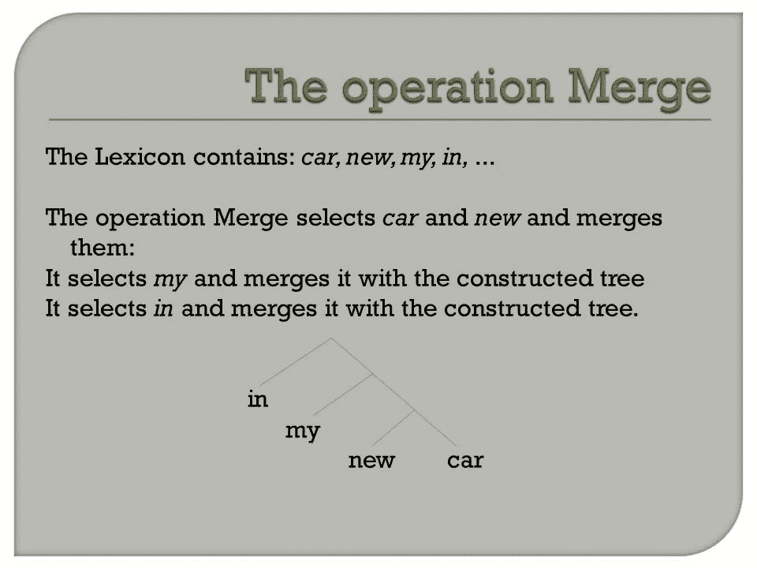
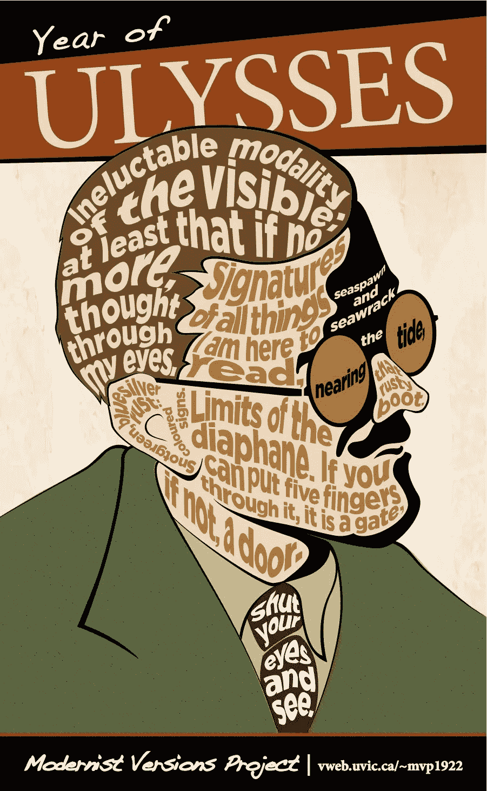
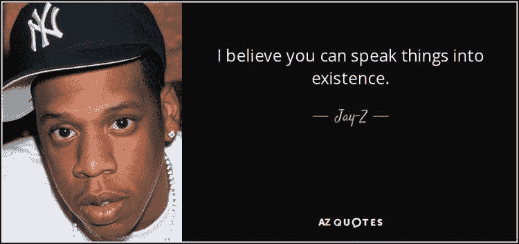

# 道格拉斯·霍夫斯塔德是一个奇怪的循环

> 原文：<https://medium.datadriveninvestor.com/douglas-hofstadter-is-a-strange-loop-121d5462dde4?source=collection_archive---------23----------------------->

## 叙事是意识的影子。

意识逃避理解有合理的原因吗？我最近建议我们进化出无法理解它的能力，这样我们就可以通过谈论它来实现群体凝聚力。我是在开玩笑。

道格拉斯·霍夫施塔特写了很多关于意识的长篇有趣的书。我喜欢阅读它们，但我注意到他最引人注目的“心灵描述”是以回忆录的形式出现的，其中穿插着与冷静的意识相关的概念，而不是对问题的回答。当我放下 20 美元时，我希望听到类似这样的话:“如果一个事物表现出以下外部属性，它就是有意识的:(终极问题的答案在这里。)"

Hopefully consciousness is more than an illusion.

读完《我是一个奇怪的循环》后，我突然想到:“如果一个理解意识的实体写了一本关于心灵的书，它会比这本书短得多！”信息需要大量的存储空间，但思想具有用一句话表达的特性。当我发现自己以轶事或列表的形式为某事辩护时，我把这当作一个警告，我不知道我在说什么。当我知道我在说什么的时候，我总是以我的想法开头，解释我的意思，然后提供证据。

**思想:*意识是由句子层次的“思想”组合而成的，就像人类语言能力合并单词层次的“概念”来造句一样。因此意识是不可言喻的。***

Hyper-Dimensional explains why you can turn your mind inside-out.

为什么以叙事的形式来描述或解释意识如此诱人，尽管事实上叙事的解释根本不是解释？或许是因为意识本身就是一种叙事？我们将意识体验为一连串的想法，每一个想法都可能被表述为一个句子。也许是一种自我指涉的思想流，属于一种更高层次的概念，这种概念不能用句子来表达，因此人类的头脑无法理解。**叙事是意识的一个低维截面，用一系列句子表达。它应该被看作是一个更高维度概念的一个更低维度的“影子”。**反正说我。

我相信缺乏维度是我们最好的解释失败的原因。这就是为什么当我们检查意识时，感觉好像我们在很深的东西的表面上滑行。乔姆斯基的“合并行动”是思维跳跃的最佳先例，它开启了一个无论其复杂程度如何都无法理解的概念范畴。意识的简单化的不可理解性暗示了另一个层次的融合。

Operation Merge is a “thing!”

考虑一下一只狗的立场与句子“我喜欢熏肉”的关系。我觉得狗是意识到自己的存在的，从而理解了“我”的概念。此外，狗知道什么是"*喜欢"*某物，并能把"培根"与其他物质形态区分开来。狗*做*“像腊肉”。如果它们拥有将单词合并成句子的认知硬件，大多数狗会同意并欣然说出“我喜欢培根”这句话。不幸的是，狗的大脑只能在单词的层面上解析概念，而不能像人类一样用牙齿撕碎沙发垫。

Proof that Wonder Dogs are a “thing.”

狗能识别和表达多少概念尚有争议，但**最显著的区别是种类而不是质量。想象一只理论上的*神奇狗*宾果，它能识别并表达宇宙中每一个物体的独特名称。当你带它穿过公园时，它会对遇到的每一个物体叫“树”、“灌木”、“松鼠”等等。只要付出足够的努力，宾果就能大声说出整个公园的完美描述。然而，尽管宾果拥有令人惊叹的犬类能力，它还是会永远被“我喜欢培根”难倒。Bingo 缺乏理解这个概念的生物硬件。**难道“喜欢”和“培根”不是“我喜欢培根”的低维横截面吗同样，一系列同心圆是球体的低维截面？****

也许有一种逻辑运算将句子层次的概念组合成一个更高维度的整体，类似于人的大脑将单词计算成句子的方式。如果是这样的话，意识只是一类不可理解的概念中最容易看到的成员，而人类的专注是我们的大脑无法执行完全构想它所需的操作类型的结果。

Maybe there’s a level on which this crap could make sense.

这假设了一个超级聪明的炫耀者，他可以将莫莉·布鲁姆令人困惑的独白中的所有句子思想合并成一个女人做爱时大脑的连贯形式，这样做很容易，我将简单的词合并成“我喜欢培根”对于这个理论上的超级智能，我串句子写文章的习惯就好比一只神奇的狗在叫“好培根！不好火！”在流利的超然爆发。

可以说，我真正是我内在状态的总和。如果存在一种语言，可以使用乔姆斯基风格的生成语法的强化版本将句子融入格式塔，那么使用这种语言顺序的超级智能可能会简单地“说出我的存在”。虽然我对自己可能成为超级奇闻轶事的身份感到不安，但我从下面这句话中得到安慰:

> **“话一出口就说不出口。”**

Proof that speaking into existence is a “thing.”

Shadows from higher dimension are inherently fascinating.