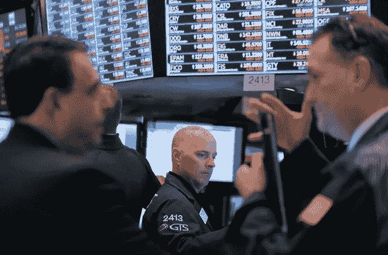

# 道琼斯指数下跌后，繁忙的一天，华尔街未能恢复

> 原文：<https://medium.datadriveninvestor.com/dow-falls-after-a-hectic-day-wall-street-fails-to-recover-e6dd766b3c09?source=collection_archive---------55----------------------->

根据美国消费者新闻与商业频道的说法，周二股市在不可预测的交易中下跌。遭受巨大损失后未能恢复稳定。

道琼斯工业平均指数下跌 0.4%，至 25286.49 点，标准普尔 500 指数下跌 0.2%，至 2722.18 点，连续第四个交易日下跌。纳斯达克收盘持平于 7，200.87 点。在当天的高点，道琼斯和标准普尔 500 分别上涨了 100 多点和 1%，纳斯达克涨幅高达 1.6%。在白宫经济顾问拉里·库德洛(Larry Kudlow)证实美中重启贸易谈判的报道后，股指达到最高点。

标准普尔 500 科技股周二收盘上涨 0.1%，盘中一度上涨逾 1%。Nvidia 和 Advanced Micro Devices 是表现最好的科技股，分别上涨 5.2%和 3.1%。油价周二暴跌逾 7%，连续 12 个交易日下跌。

