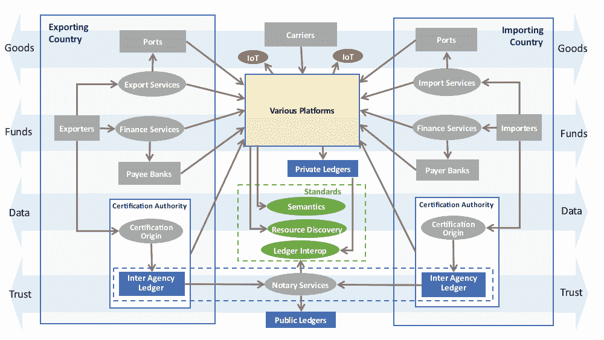

# 基于 IOT 和新兴技术的供应链区块链概念模型

> 原文：<https://medium.datadriveninvestor.com/draft-conceptual-model-for-supply-chain-with-blockchain-iot-and-emerging-technologies-5c1f76ddd5a7?source=collection_archive---------3----------------------->

新技术为供应链的改进提供了机会。区块链、物联网和新兴技术有潜力实现重大改进和自动化。区块链应用正在提供以安全方式交换数据的新方式。在供应链中使用区块链有可能提高供应链的透明度和可追溯性，并降低管理成本

密码学是区块链技术的核心，是在第三方存在的情况下安全通信的实践和研究。本质上具有加密功能的区块链允许交易中的各方共享信任，因为分类账不容易被伪造(即，一旦数据被写入，就不能被更改)。这种可信度是由多种因素组合而成的，包括区块链使用的加密技术、其共识/验证机制以及其分布式特性。

**贸易融资的区块链概念验证**

在第一篇文章中有一个关于[密码学、加密、哈希函数和数字签名的概述。](https://medium.com/@ealtili/cryptography-encryption-hash-functions-and-digital-signature-101-298a03eb9462)

在第二篇文章中，有一个关于[区块链如何工作、区块链的组件、使用案例、区块链决策算法的概述，以帮助确定使用区块链是否有意义。还有一个贸易融资的 PoC。](https://medium.com/@ealtili/all-you-need-to-know-about-blockchain-101-2a3219babc24)我们将在本次概念验证中对此进行详细阐述。

*   **第一步:**进口商创建 LC 申请，供进口商银行审核，并存储在区块链上。
*   **步骤 2** :进口商银行收到审查信用证的通知，然后可以根据提供的数据批准或拒绝信用证。一旦检查和批准，然后自动向出口商银行提供访问以供批准。
*   **第三步**:出口银行批准或拒绝信用证。一旦获得批准，出口商就可以查看信用证要求，并被提示查看整个申请。
*   **步骤 4:** 出口商完成装运，在装运时添加 gps 传感器。添加发票和出口申请数据，并附上任何其他所需文件的照片图像。一旦通过验证，这些文档就会存储在区块链上。
*   **步骤 5:** 出口银行批准或拒绝申请和文件。
*   **步骤 6:** 进口商银行根据信用证要求审查数据和图像，标记任何不符之处供进口商审查。批准后，信用证直接进入完成状态或发送给进口商进行结算。
*   **步骤 7:** 如果由于不符点而需要，进口商可以审查出口文件并批准或拒绝它们。

3 个流程描述了供应链的独特性质:

1.  **货物**:货物从出口商流向进口商，以换取资金。
2.  **资金**:资金反向流动。
3.  **数据:**货物和资金的流动受到双向数据流的支持，如发票、装运通知、提单、原产地证书和提交给监管机构的进出口申报单。

这三种流动都有一层信任作为补充。信任，或者说缺乏信任，是国际贸易中几乎所有行为和数据交换的基础。信任:

*   货物的来源和真实性；
*   为了保险、关税和付款的目的而规定的货物价值；承诺付款；
*   运输过程中对货物的保护(即包装、车辆和集装箱状况等的完整性)。);
*   监管机构用于风险评估的信息的完整性，风险评估决定检查和批准；
*   贸易交易中涉及的贸易商和服务提供商。

信任层得到的技术支持相对较少，仍然受到纸质文档、人工签名、保险费、托管和其他可信第三方服务的大力支持。

分布式账本技术(DLT)和区块链有可能在这一信任层实现重大改进和自动化。

虽然主要焦点是在区块链，但重要的是要注意，区块链并不是唯一一个有潜力对供应链产生破坏性影响的国家。电子商务平台、API 和云托管解决方案的兴起正在改变组织开展业务的方式。物联网承诺通过运输工具、港口和仓库跟踪托运货物、集装箱的更丰富的粒度数据流。其他技术，如人工智能和行星间文件系统(IPFS ),以及正在开发的技术，如语义 web，提供了理解和访问数据的强大新方法。因此，将区块链置于其他新技术的大背景下，这些新技术具有提高供应链效率和完整性的巨大潜力。

在这一概念模型中，区块链科技通过利用 as 来支持贸易便利化和供应链自动化

*   智能合约平台，利用其不变的一次性写入特性；
*   电子公证人，保证电子记录数据的内容和(可选)发布时间；
*   分散式流程协调器，利用属性组合，包括寻址技术(公钥/私钥)、智能契约和不变性。

已经有大量项目专注于使用区块链技术来克服供应链中的挑战。这些平台包括由承运商运营的航运信息平台、由港务局运营的集装箱物流平台、货物来源(可追溯性)平台以及许多其他平台。大多数是许可的分类帐实现。技术限制以及商业和政治压力将确保永远不会只有一个区块链支持整个国际供应链。即使是一批货物，在从出口商到进口商的过程中，也有可能触及多个分类账。因此，重点支持系统间的互操作性和支持分类帐间的互操作性是关键。在上一篇文章中，这里有一个[关于在区块链实现交易以及与链外数据交互的概述。](https://medium.com/@ealtili/interledger-implementing-transactions-across-blockchains-46558a013148)

区块链、物联网、云、API 和平台等技术都可以独立地为提高供应链效率做出贡献。同时，当在一个基于标准的框架内一起工作时，总和可能比部分大得多。在这种情况下，国际供应链的概念模型显示了每种技术在更广泛的利益相关者、服务和标准地图中的作用。这种模式同样适用于国内供应链，而国内供应链只是国际供应链的一个简单子集。

这是一个国际供应链的概念模型草案和相关技术。进口商和出口商通常通过使用各种服务提供商和第三方来促进货物、资金和数据的流动以及相关的信任。在模型上叠加区块链和其他新兴技术可以显示与规范的关系。

与此图相关的观察结果如下:

*   本例中的所有各方都使用一个或多个平台来开展业务。这可能是一个单一的组织级内部平台，例如企业资源规划(ERP)系统，但越来越多地将成为大多数参与者的云托管网络平台。
*   平台可以使用物联网数据源和 API 来改善信息流。
*   平台可以通过记录不可变的和可审计的交易来使用私有区块链分类账来提高信任度。
*   分类帐间框架可以提供平台间的信任。
*   资源发现框架可以使用可信执行环境，可以提供基于资源的标识符来定位资源的权威数据源的手段。
*   CCL 等贸易数据工作提供了语义锚来促进数据交换

图中方框/椭圆之间的箭头表示依赖关系，因此应理解为“使用”或“依赖于”。它们不代表不同平台和分类账之间的信息流。

存在多个平台来满足贸易和运输领域的不同需求，并将通过物联网、人工智能和其他新兴技术的创新继续发展。

国家监管机构在网络中发挥着特殊的作用，因为它们为每个管辖区的数据提供了一个独特的汇聚点。

数据通常是来自多个来源的集成数据，从传统的基于文档的数据源到更详细的数字数据条目，数据量可能更大，并且可以实时交付。海运、空运和陆港等主要交通枢纽也是如此。

当局不太可能通过在其管辖范围之外的共享平台上开展监管业务来放弃对其信息和流程的控制。毫无疑问，他们将保持独立的系统，但找到新的方法来验证和适当地与其他国家分享数据。

**智能合约的作用**

所有这些都强调了交易者和当局在近期和长期需要处理的系统和数据的日益增加的复杂性和倍增性。

基于标准的语义模型可以促进这种围绕贸易交易的不断扩大的数据交换网络，并支持交易者寻求跨各种平台(包括各种基于区块链的应用程序)的灵活集成。

**互操作性和分类账间交易的作用**

代理人之间的重大经济承诺可能与资源生命周期中的特定事件相关联。可能的例子包括:

*   从“已收到”到“已批准”的发票转换可能会触发针对小供应商的低成本贸易融资的释放。
*   从“已卸货”到“已清关”的托运转换表示监管机构放行货物。
*   根据提单密封和装载集装箱时，发运资源从代理 X 所有转移到代理 Y 所有。
*   如果这些事件可以在可信的区块链账本中被公证为智能合同，那么就有一个独特的机会来改善和自动化供应链中的这种信任。但前提是对每个状态转换的含义(包括触发条件)有明确的共同理解。

**资源发现的作用**

随着越来越多的应用程序将其事务锚定到各种私有和公共区块链分类帐中，越来越需要一种方法来发现和集成整个区块链的事务。

链上的每个事务只包含实际数据的散列和最少量的关于文档或转换状态的元数据。有了元数据中的清晰语义，各方可以通过观察链接数据锚并遍历它们以获得适当的访问来发现其他分类帐中感兴趣的数据。区块链上的每个节点都有一份完整的分类帐副本。特定的分类账(以及核实交易的节点)通常存在于特定的地理或行业领域。但是，如果特定的国际托运涉及十几个不同的分类账，对于希望验证交易的一方来说，托管十几个不同的节点是不切实际的。普通的分类帐间公证协议将允许授权方验证交易，而不管它们是在哪个分类帐上创建的。因此，分类帐间互操作性规范的可能框架将定义:链上和链外元数据的标准；分类账间公证标准。

**语义的作用**

资源，如发票、货物、原产地证书、集装箱等。，将越来越多地托管在网络平台上。这意味着供应链实体的真实来源将是在线的和可发现的，极大地增加了供应链的透明度。同时，即使对于单一的国际托运，这些真相(信息资源)也会存在于许多不同的平台上。期望每一个授权方都是持有一些相关数据的每一个平台的注册会员或客户是不切实际的。然而，在给定资源标识符的情况下，有可能开发出一致的方法来发现它被托管在哪里并被授权访问适当的数据。利用可信执行环境可能有助于克服这一挑战。因此，可能需要一个规范来连接独立的平台，以发现资源数据，而不管它存储在哪里。规范的基本要求包括以下能力:

*   使用所有管辖区和部门的身份提供者，解析参与贸易相关活动的各方、平台和其他代理的身份。
*   访问有关参与者公钥的最新权威信息，以实现安全的直接交互和通信。
*   支持多种实体类型(如业务、管辖区、平台、集装箱)，包括高容量实体类型(如托运)。
*   本规范应建立在(而不是重复)现有规范的现有相关技术元素之上。

**假想真实工作实例**

供应链中的组织仍然必须能够理解由各种平台、分类帐甚至网络连接传感器发现/交换的数据。格局正在从以 EDI 中心为中心的模式向对等交换转变，在对等交换中，平台是天然的聚合者。传统的以文档为中心的交易被供应链中所有资源的快速移动的事件流所补充/丰富。感兴趣的社区(例如，一个国家的快速移动消费品)可以用行业/地理特定的框架覆盖核心语义，该框架有效地。平台运营商可以发布语义框架，将他们的接口映射到国际标准。

大多数数据不会保存在区块链上，而是会与用于数据验证的哈希以及时间戳一起被引用(指向)。可能还需要描述各种密码原语，以便从业务文档中引用它们。例如散列算法、密钥分发、加密签名、加密方案和使用可信执行环境。

从出口商到进口商的货物托运的一个假设的端到端故事。

*   商品/产品生产商是在位置 A 注册的企业，其企业编号来自位置 A。
*   商品/产品生产商生产 x 数量的单位。每个装置都有一个独特的序列号，通过 QR 码/智能标签生产商的系统在每个装置上签名的 QR 码/智能标签来识别。
*   二维码/智能标签生产商将这批二维码写入他们代表商品/产品生产商运行的区块链锚定商品来源系统。
*   出口商与在地点 B 注册的进口商协商出口交易，进口商的商业编号来自地点 B。
*   进口商向出口商订购 x 数量单位的货物/产品。使用资源发现框架，出口商平台查找进口商平台和电子发票互联网地址，并根据商定的或国际语义标准将商业发票直接发送到目标平台。
*   因为出口商和进口商在不同的平台上，并且因为商业发票是信任的基础之一，所以发票也使用分类账间公证框架在公共区块链上公证/登记。进口商表示接受发票(也经过公证)。
*   *进口商创建信用证申请，供进口商银行审核，并存储在区块链上。*
*   *进口商银行收到审查信用证的通知，然后根据提供的数据批准或拒绝信用证。一旦检查和批准，然后自动向出口商银行提供访问以供批准。*
*   出口商向出口商银行授予访问公证发票的许可，出口商银行在交易公证时提供较低成本的贸易融资。
*   出口银行批准或拒绝信用证。一旦获得批准，出口商就可以查看信用证要求，并被提示查看整个申请。
*   运输条件要求产品/货物在运输过程中保持在一定的温度之下和一定的温度之上，因此出口商雇佣托运人进行货运代理。托运人的集装箱配备了物联网温度传感器和全球定位系统(GPS)跟踪。
*   托运人使用基于公共区块链的智能提单解决方案。取代纸质提单文件，推动提单处理的快速、安全、可靠和经济高效。Shippers 使用物联网、全球定位系统、银行和金融解决方案，通过智能信用证提供增值服务，如货物跟踪(位置、移动、温度、原产地/生产商)、保险、质量控制和银行托管服务。托运人稳定的加密货币，以促进链上货物支付和结算。
*   基于区块链的提单以极低的成本为用户带来了卓越的服务。智能提单的用户可以安全透明地转让货物所有权，只需几秒钟，而不是几周。
*   托运人向出口商提供集装箱 ID，出口商使用资源发现框架来查找集装箱网络互联网地址并订阅集装箱数据馈送。
*   托运人提供签名和公证的发票和智能标签区块链参考到商会的位置，商会验证数据并签发自动签名的原产地证书，该证书在区块链上注册。
*   托运人使用其物流平台创建托运参考，并通过由单一窗口 API 建立的认证会话向 A 海关提供托运 ID。位置 A 海关使用资源发现框架来定位托运数据，并订阅关于托运的数据馈送。
*   托运数据包括对公证发票、集装箱 ID、承运人 ID 和原产地证书 ID 的引用。因此，海关可以发现每个实体的完整数据，验证完整性，并创建一个批准的出口申报。出口申报(带有支持数据的链接)被记录为组织间分类帐中的智能合同。
*   进口商点击一个按钮来审查和批准所有的出口和运输文件，并提交进口申报。
*   进口商所在地 B 海关当局观察一份新的进口申报单。进口商所在地 B 海关核实贸易文件，并确认出口商和进口商有足够的高度诚信的贸易历史。货物由进口商所在地 B 海关预清关。
*   在抵达进口商港口时，集装箱数据输入表明货物已经卸下并拆箱。温度记录是经过公证的，并确认在旅行期间，温度保持在低于一定温度和高于一定摄氏度的 LC 条件下。
*   当产品/货物的托盘被扫描到进口商仓库时，寄售资源物联网设备发出“已接收”事件。连同其他公证交易，这些信息足以让出口商银行以非常合理的条件发放发票融资付款。
*   进口商将产品/货物发放给 b 区的多家零售店。一名客户购买了一瓶酒，并扫描了瓶上的二维码。智能标签平台确认产品/商品的真实性，并根据特定产品/商品单元序列号记录扫描事件。

这个例子是虚构的，但却是完全可行的。这种未来状态愿景和当前状态现实之间的关键区别在于，每个授权方可以直接访问关于每个实体(当事人、发票、托运、集装箱等)的单一真实来源。)并且所有关键数据都在旨在获得高度信任的区块链账本中进行了公证，因此是可独立验证的。

资料来源:联合国贸易便利化和电子商务中心

非常感谢您的反馈

 [## 公众评论:区块链白皮书

### 下载该项目的所有文件供公众审查

uncefact.unece.org](https://uncefact.unece.org/display/uncefactpublicreview/Public+Review%3A+Blockchain+Whitepaper) 

*原载于 2018 年 6 月 20 日*[*【https://www.linkedin.com】*](https://www.linkedin.com/pulse/conceptual-model-supply-chain-blockchain-iot-emerging-eray-altili/)*。*

 [## 包含区块链、IOT 和新兴技术的供应链概念模型

### 新技术为供应链的改进提供了机会。区块链、物联网和新兴……

www.linkedin.com](https://www.linkedin.com/pulse/conceptual-model-supply-chain-blockchain-iot-emerging-eray-altili/)