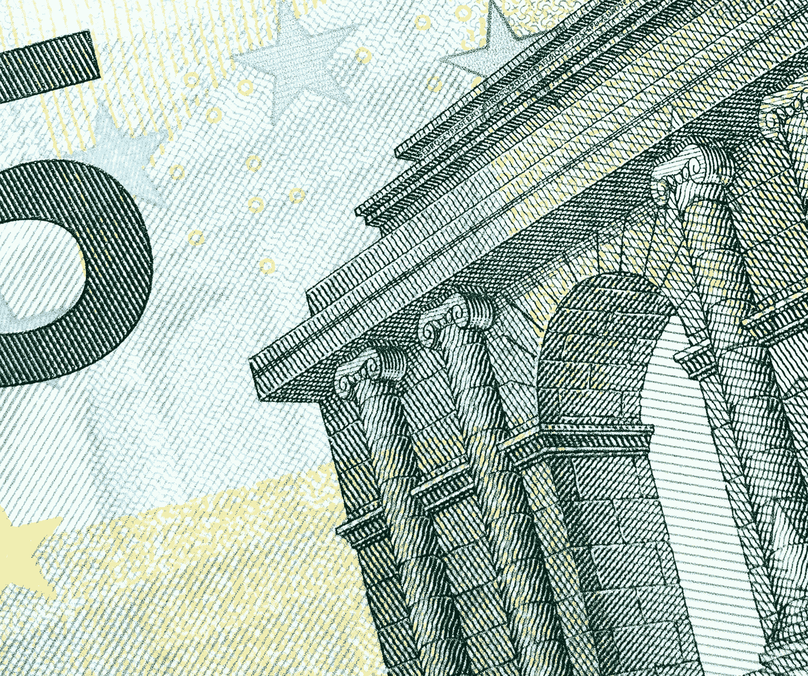

# 德拉吉:这不是许多市场参与者(尤其是欧元多头)想听到的，但是…

> 原文：<https://medium.datadriveninvestor.com/draghi-not-what-many-market-participants-particularly-euro-bulls-wanted-to-hear-but-95a59f926368?source=collection_archive---------24----------------------->

Photo by [Didier Weemaels](https://unsplash.com/@didwee?utm_source=medium&utm_medium=referral) on [Unsplash](https://unsplash.com?utm_source=medium&utm_medium=referral)

在撰写本文时，欧洲央行行长马里奥·德拉吉(Mario Draghi)仍在处理他的新闻发布会上的问答问题，欧元遭到抛售，欧元区主权债券全面反弹，股票表现平平。我并不看好欧元的短期走势，尽管我确实认为，从长期来看，欧元作为储备货币的地位将会提高，而且我仍然对黄金相对于美元来说更稳定感到印象深刻(甚至感到惊讶的是，通常情况下，共同货币和黄色金属往往会同步交易，这一定会告诉我们一些事情*)。*

*最近几个月，欧洲经济肯定已经疲软，被指责为国际货币基金组织最近下调 2019 年全球 GDP 增长预期的主要原因。商业信心是倒下的第一张多米诺骨牌，因为德国企业高管开始担心美国政府主导的全球贸易争端的影响。*

*尽管(尤其是在德国)消费依然强劲，建筑业蓬勃发展，就业市场可以说是*过热，尤其是在一些主要的大都市地区，这种不安情绪仍在蔓延。**

*尽管如此，德拉吉的新闻发布会绝对有鸽派的口吻。欧元区货币政策将保持应急式的宽松。由于全球经济(更不用说欧洲经济)的下行风险一直在上升，似乎不应该在政策收紧方面采取任何有意义的举措。*

*当然，这在一定程度上并不支持欧元。另一方面，疲软的欧元将对欧洲经济产生刺激作用。对欧元区主权债务证券的需求依然强劲，为较长期利率设定了硬性上限。正如我在以前的文章中所言，意大利应该认为自己非常幸运，拥有共同货币的保护伞来保护其庞大的主权债务。*

*如今，这个地中海国家用欧元为其 10 年期债务支付的利息再次低于美国用本币为其债务支付的利息。诚然，意大利还没有完全的经济主权，更不用说货币主权了。尽管如此，作为欧元区国家特权俱乐部的一员，这个拉丁国家仍然可以看到其净债务占 GDP 的比例逐渐下降，即使 2019 年的财政赤字超过 GDP 的 2%，因为其经济在名义上增长更多，并且其巨额主权债务的*实际*(经通胀调整)利率低于 1%，即使是十年后到期的债务！*