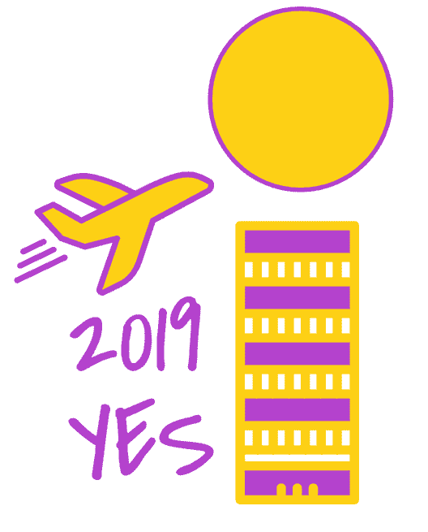

# 画出你的新年活动海报

> 原文：<https://medium.datadriveninvestor.com/draw-your-campaign-poster-for-the-new-year-bcb5358a48ea?source=collection_archive---------52----------------------->

当我们进入新的一年时，我和其他人一样，一直在思考我想完成什么。我查阅了一些资源、计划者、梦想家和目标设定者，虽然他们很棒，但我想要一些不那么复杂的东西。所以我决定画一张竞选海报。

由于我不擅长画画，所以我用了谷歌的 [AutoDraw](https://www.autodraw.com/) 。它已经存在了几年，但今年似乎很合适，因为它使用人工智能来帮助你绘画。

今年我听到的好像都是 AI。谷歌趋势显示，2018 年 1 月，人们对人工智能的搜索比以往任何时候都多。在今年我自己关于大脑的阅读中，我看到人工智能比以往任何时候都更多地被用来帮助科学家更好地理解这个器官，它是如何组织的，以及我们是如何思考的。

# 如何画一张好的竞选海报

Autodraw 是绘制活动海报的完美工具。为了使用它，你开始涂鸦你想画的东西，计算机使用一种算法来学习你可能正在画的东西。屏幕上方会弹出一些建议。所以，如果你想画一栋房子，会出现一栋完工的房子，或者几种不同类型的房子，或者其他类型的建筑。你点击你想要的建筑，它会取代你的涂鸦。你可以改变颜色，添加文字和保存图片。

它很适合做竞选海报，因为你没有太多的选择，而且图画和颜色都很简单。竞选海报应该用几句话和一些图片来表达自己的观点。以下是制作一张好的竞选海报的其他一些指导原则:

*   简单消息
*   粗体、原色或互补色，以及受限制的调色板
*   图像支持文字
*   使用符号

为了帮助自己制作海报，我问了自己以下几个问题。我的回答跟在问题后面。我做了 2018 年的年度回顾海报和 2019 年的活动海报，所以我有两组问题和答案:

*   **如果 2018 年是一种颜色，它会是什么颜色？**绿色

2018 Waiting Year in Review Poster House with Scooter and Octagonal Window on Door

*   **如果 2018 年是一个形状，它会是什么形状？**八边形
*   **如果 2018 是一个词，会是什么词？**等待
*   **如果 2018 年是一座建筑，会是什么类型的建筑？**房子
*   **如果 2018 是来自大自然的东西，会是什么？**树
*   **如果 2018 是一辆车，会是什么？**滑板车。
*   **如果 2019 是一种颜色，会是什么颜色？**金色
*   **如果 2019 是一个形状，会是什么形状？**圆圈
*   **如果 2019 是一个词，会是什么词？是的**

2019 Yes Campaign Poster, Plane flying over skyscraper toward sun

*   **如果 2019 年是一座建筑，会是什么类型的建筑？**摩天大楼
*   **如果 2019 是来自大自然的东西，会是什么？**彩虹
*   **从 2018 年到 2019 年，你会走哪种道路？**道路
*   **如果 2019 年是一辆车，它会是什么？**一架飞机。

我拿了所有的资料，画了 2018 年的回顾海报和 2019 年的竞选海报。你会发现并不是所有的答案都构成了这幅画。当我看到照片的样子时，有些不适合，有些更有意义。

使用 Autodraw 很有趣，因为当我画的时候会弹出一些对象。它给了我新的想法，让我知道应该包括哪些原本不在我的清单上的项目。这几乎就像要求魔术 8 球为我画我的海报。

# 如果你想试试自动绘图

在你访问了 [Autodraw 网站](http://www.autodraw.com/)之后，Autodraw 工具本身就是从上面数第二个。一旦你开始绘画，建议将出现在屏幕的顶部。您可以使用拾色器更改颜色。要为中的项目着色，请选择填充工具，然后选择拾色器。玩得开心！

另一个有趣的尝试是用文字写下一些东西。对于你画的每一个字母，Autodraw 都会给你一张图片。选择那些和你说话的，然后把它们画出来。这只在你画单词时有效，而不是使用文字工具。

*原载于 2018 年 12 月 20 日*[*catherinelanser.com*](https://catherinelanser.com/2018/12/20/draw-your-campaign-poster-for-the-new-year/)*。*