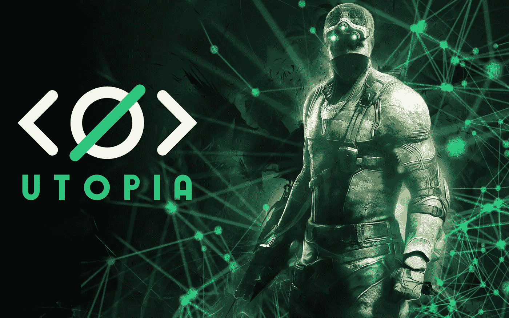

# 零审查和完全隐私的梦想平台开始测试

> 原文：<https://medium.datadriveninvestor.com/dream-platform-with-zero-censorship-and-complete-privacy-launched-for-beta-testing-c1fe1840c20f?source=collection_archive---------12----------------------->

*(免责声明:文章所表达的信息和观点仅属于作者，不一定反映 DDI 的立场。这篇文章无意成为任何形式的投资建议。我们建议你进行自己的独立研究。)*

在一个全面监控的世界里，一个提供完全隐私、安全、没有审查的平台是一个梦想。这个梦想可能会在 Utopia——一个功能丰富的生态系统平台——的帮助下实现。T2 乌托邦 T3 背后的网络技术爱好者团队(自称“1984 团队”，并隐藏了自己的身份)努力开发一种可以绕过网络审查和防火墙的产品。这个软件现在是可操作的，处于测试模式。

 [## 十大区块链课程|数据驱动的投资者

### 渴望在区块链发展吗？你想知道区块链是如何工作的，但不知道在哪里？或者就是太多了…

www.datadriveninvestor.com](https://www.datadriveninvestor.com/2019/03/08/top-10-blockchain-courses/) 

该小组花了 5 年多的时间开发了这款被吹捧为完全免费的产品，致力于自由表达自我和隐私。这一产品背后的策划者包括来自几乎每个 IT 领域的顶尖专业人士，如加密、软件、网络工程师等。早期采用者可以通过识别 bug、在全球范围内推广它、提出关于预期功能的建议以及帮助确定项目的未来方向来帮助平台。测试版测试人员、贡献者和推广者将因他们的热情、承诺和奉献而获得奖励，奖励基于一个有利可图的[奖励系统](http://bit.ly/Utopiareward)，其中 1 点等于 1 美元，支付将在 BTC 进行。在 3 个月的测试期后，Utopia 的官方发布日期据说是 2019 年 10 月 3 日。

它是如何工作的？

这个平台不会透露用户的物理位置。通信和数据不易被截获。用户可以随时与任何人自由交流。它将用户从审查的束缚中解放出来。乌托邦式的生态系统保障言论自由。用户自己设备上的加密文件存储所有帐户数据。中央服务器不参与数据传输或存储；它是一个分散的对等网络。对于认为隐私至上的用户来说，这是一个梦想的平台。

一旦用户登录到 Utopia 平台，他们就可以发送和接收即时消息和语音记录。这种通信由 Curve25519 高速椭圆曲线加密保护。本地存储由 256 位 AES 加密。数据的解密只能由接收者完成。

**uMail(乌托邦邮件)**

生态系统以 uMail 的形式提供了电子邮件的安全替代方案。这种电子邮件服务具有收件箱、垃圾文件夹、过滤器和搜索功能，类似于主流电子邮件提供商提供的功能。在其上传输或存储邮件不需要服务器。默认情况下，uMail 帐户是在用户首次加入 Utopia 网络时创建的。不能阻止或扣押用户的 uMail 帐户。用户可以将任何类型的文件传送给联系人。内置的浏览器允许访问图像。附件的当前限制是 100 MB，但将来可能会增加。内置的文件管理器允许用户访问所有发送和接收的文件。

**uMaps(乌托邦地图)**

Utopia 使创建群聊和频道、新闻提要以及进行私人讨论成为可能。集成的 uMaps 允许对频道进行地理标记，从而简化了 Utopia 频道搜索并增加了额外的安全层。不需要使用收集用户数据的公共地图服务。Utopia 为用户提供了一个全面的 API 来集成他们自己的项目。

**uWallet(乌托邦钱包)**

Utopia 的内置 uWallet 提供所有类型的金融功能，如使用其本地加密货币 Crypton 进行和接受支付(可能不会泄露用户的公钥)，为其他 Utopia 用户提供的服务计费，在他们的网站上提供新的支付方法，通过加密卡支付而不会泄露身份。对于 Crypton，重点是加密安全，以确保组织或政府无法操纵它。这意味着使用起来既快又方便。最低的交易费用和在世界任何地方完成交易的自由是它的一些优势。所有网络强制收费都可以在线查看，费用结构变化在网络上实时更新。它使我们能够及时了解当前的费用结构。收取的费用据称将用于维护网络，据说是控制流通中密码总量的一种方式。强制收费是一种补偿采矿排放的方式，通过从流通中提取碳来实现。

通过 uWallet 的支付是即时的，不可撤销。uWallet 的余额不能被没收。Crypton (CRP)是证据，可以通过基于 GUI 的 Utopia 应用程序或基于终端的挖掘机器人进行挖掘。通过采矿来支持生态系统的用户通过新的 Crypton 的排放得到回报。开采密码是环保的，不会让你的电脑变慢。Utopia 背后的团队计划实现他们自己的内置交易所，将 Crypton 列入外部加密交易所的决定将由其他交易所自行决定。

**UNS(乌托邦名称系统)**

Utopia 网络中包含一个分散的名称注册中心，任何第三方都无法没收、冻结或破坏该注册中心，称为 Utopia 名称系统(UNS)。这独立于传统的域名系统。它可以在生态系统中的用户之间传输任何类型的数据，并在 Utopia network 中托管网站，这些网站可以通过内置的 Idyll 浏览器访问。没有与 UNS 相关的到期日、暂停、续费和撤销。在 UNS 注册不是免费的，必须用 Crypton 支付。可以注册多个 UNS 注册名称。UNS 的用户以先到先得的方式获得服务。

**遗言**

像象棋这样的应用内多人游戏是由 Utopia 支持的。用户可以注册成为 Beta 测试者、贡献者或推广者，享受这个拥有各种奖励的生态系统。关于平台的信息和 Utopia 团队取得的进展可以在 Reddit 上的一个社区中找到，这个社区是由 Beta 测试人员在 [r/Utopia1984](https://www.reddit.com/r/Utopia1984/) 运行的。

Utopia 的建立是为了保持通信保密和数据安全，这样你就可以确信老大哥不再监视你的一举一动。在一个出售用户身份和隐私以获取利润的时代，Utopia 生态系统可以证明是安全通信领域的游戏规则改变者！

**新闻来源** : [公开](https://www.thecoinrepublic.com/dream-platform-with-zero-censorship-and-complete-privacy-launched-for-beta-testing/)